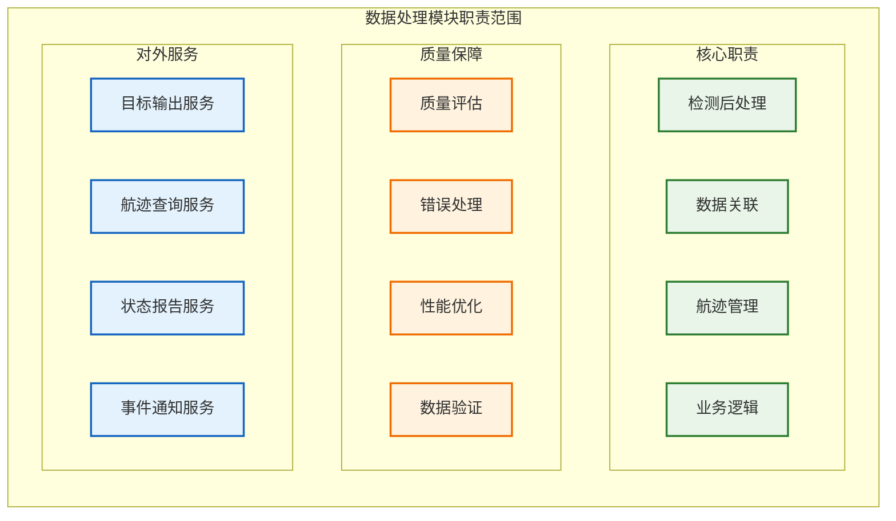
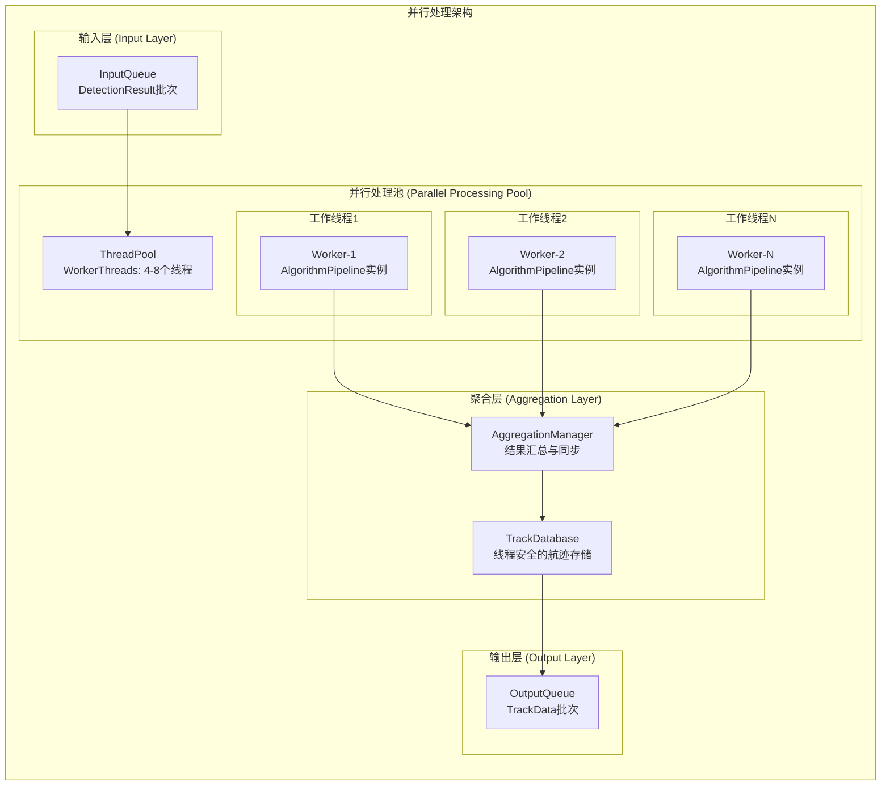
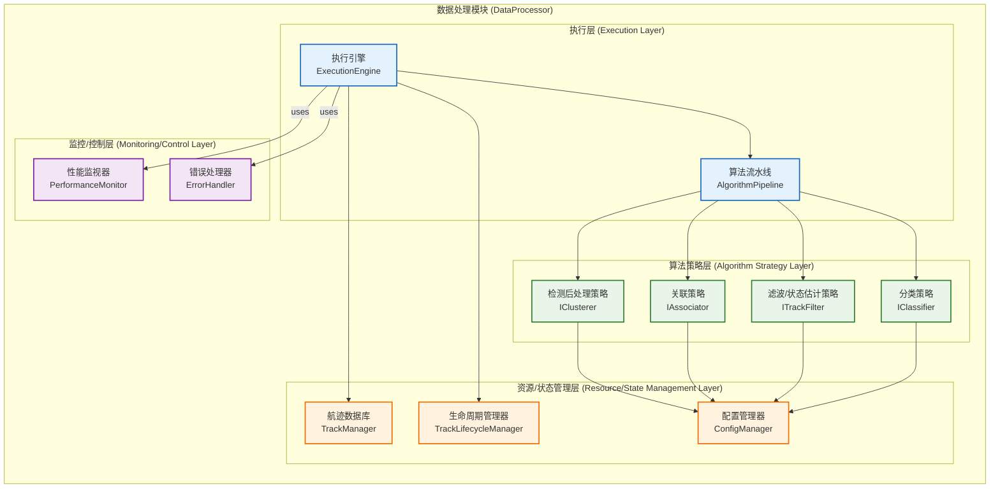
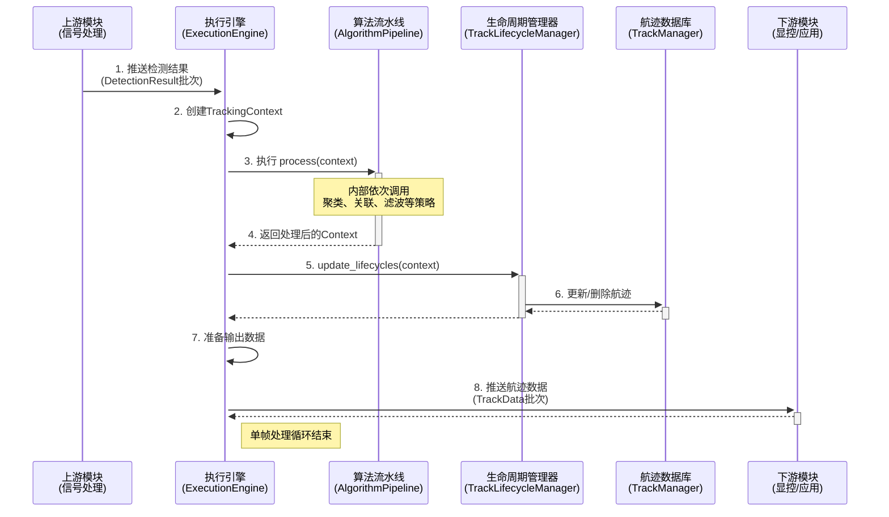
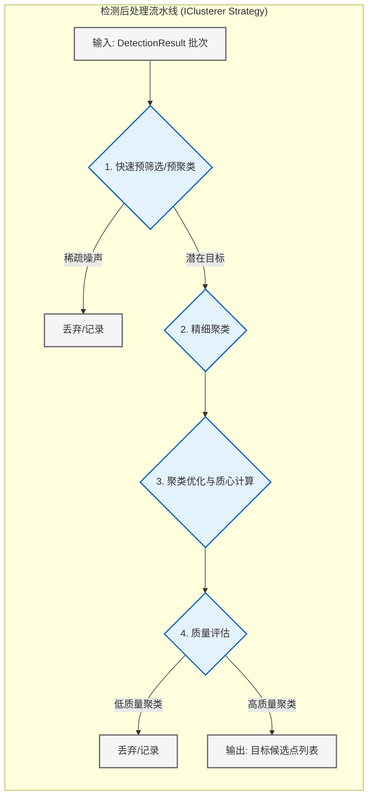
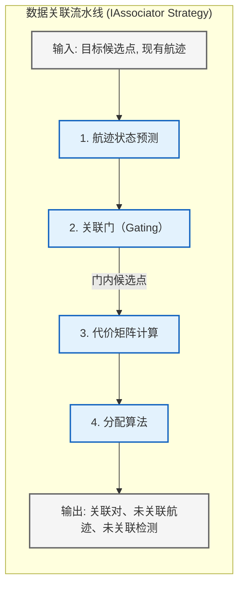
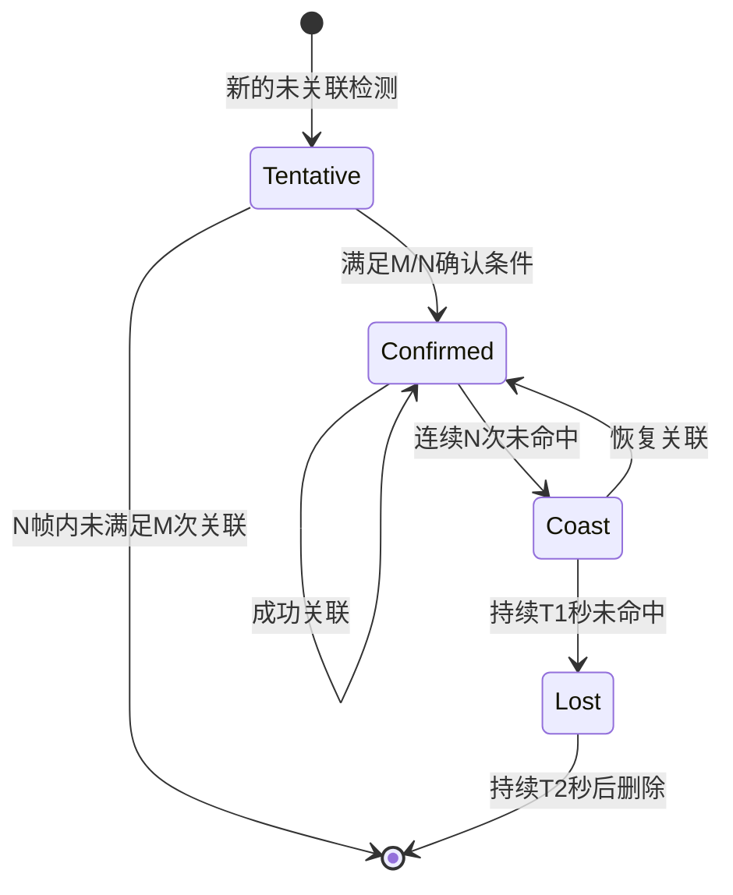
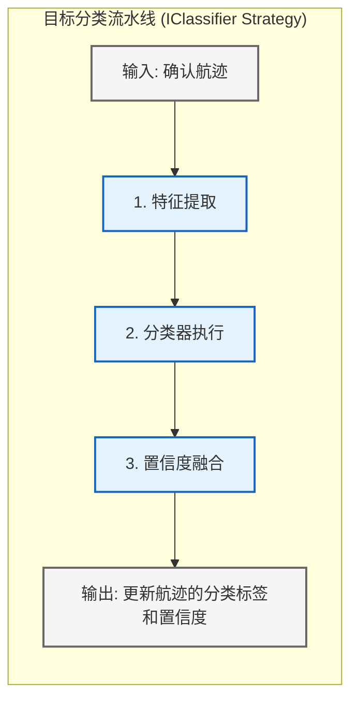

# 数据处理模块设计

**文档版本**: v1.2.0
**最后更新**: 2025-09-24
**负责人**: Klein

---

## 1 文档职责

### 1.1 文档范围
本文件定义雷达数据处理系统中**数据处理模块**的设计蓝图，覆盖：
1) 检测后处理与目标聚合算法设计
2) 数据关联与跟踪算法架构
3) 目标分类识别与特征提取
4) 航迹管理与轨迹融合机制
5) 业务逻辑处理和决策支持
6) 模块内部组件协作和状态管理

### 1.2 目录
- [数据处理模块设计](#数据处理模块设计)
  - [1 文档职责](#1-文档职责)
    - [1.1 文档范围](#11-文档范围)
    - [1.2 目录](#12-目录)
  - [2 模块总体设计](#2-模块总体设计)
    - [2.1 模块职责定义](#21-模块职责定义)
    - [2.2 模块边界和约束](#22-模块边界和约束)
    - [2.3 职责原则](#23-职责原则)
  - [3 内部架构设计](#3-内部架构设计)
    - [3.1 逻辑架构](#31-逻辑架构)
      - [3.1.1 并行处理策略](#311-并行处理策略)
    - [3.2 核心组件职责](#32-核心组件职责)
    - [3.3 核心数据流与协作](#33-核心数据流与协作)
  - [4 检测后处理架构](#4-检测后处理架构)
    - [4.1 架构概述](#41-架构概述)
    - [4.2 核心策略与性能考量](#42-核心策略与性能考量)
    - [4.3 算法演进](#43-算法演进)
  - [5 数据关联与航迹初始化](#5-数据关联与航迹初始化)
    - [5.1 关联算法架构](#51-关联算法架构)
    - [5.2 航迹初始化策略](#52-航迹初始化策略)
  - [6 状态估计与航迹管理](#6-状态估计与航迹管理)
    - [6.1 状态估计架构](#61-状态估计架构)
    - [6.2 航迹生命周期管理](#62-航迹生命周期管理)
  - [7 业务处理设计](#7-业务处理设计)
    - [7.1 目标分类架构](#71-目标分类架构)
    - [7.2 事件处理与系统交互](#72-事件处理与系统交互)
  - [8 算法演进规划](#8-算法演进规划)
  - [9 模块约束说明](#9-模块约束说明)
  - [10 相关文档](#10-相关文档)
  - [11 变更历史](#11-变更历史)

---

## 2 模块总体设计

### 2.1 模块职责定义

数据处理模块作为系统的业务核心，承担从信号特征到目标轨迹的高级数据处理职责：



### 2.2 模块边界和约束

**输入边界**：
- **检测结果**: 从`信号处理模块`的输出队列中获取。数据以`std::unique_ptr<std::vector<DetectionResult>>`的形式传递，以实现零拷贝。每个`DetectionResult`结构体必须包含`trace_id`以保证端到端的可观测性。
- **控制指令**: 从`任务调度器`接收处理任务和优先级指令。
- **配置参数**: 从`配置管理器`加载算法参数、流水线配置和业务规则。

**输出边界**：
- **航迹数据**: 将处理后的航迹信息（`TrackData`）以`std::unique_ptr<std::vector<TrackData>>`的形式推送到下游**数据网关模块 (`DisplayController`)** 的输入队列。
- **系统事件**: 通过系统事件总线发布关键业务事件（如新航迹确认、目标丢失）和告警信息。
- **状态与指标**: 向`任务调度器`和`监控模块`报告处理统计和质量指标。

**性能约束**：
- **处理延迟**: 单帧数据（一个批次）的处理延迟应 **< 10ms**。
- **处理规模**: 最大支持同时跟踪 **1000** 个目标。
- **关联准确率**: > 95% (可配置基准)。
- **航迹连续性**: > 90% (可配置基准)。

**并发与技术约束**：
- **并发模型**: **必须采用分阶段并行策略**。在保证数据一致性的前提下，最大化利用多核CPU资源。例如，代价矩阵计算、独立航迹的滤波更新等阶段应并行处理。**严禁采用全局串行处理模型**。
- **算法实现**: 所有核心算法必须基于策略模式实现，支持运行时通过配置切换。
- **资源管理**: 内存使用应有明确上限（例如，2GB），并使用智能指针和内存池等技术进行高效管理。
- **可观测性**: 必须支持`Trace ID`的全程传递，所有日志和关键数据结构都应包含`Trace ID`。

### 2.3 职责原则
作为**“执行者”**角色，数据处理模块的核心职责是完成高层数据处理任务，它**不参与系统级的决策**。

- **执行**:
  - 从上游模块获取目标检测数据（`DetectionResult`）。
  - 执行数据关联、航迹起始、滤波更新等算法。
  - 生成并维护航迹数据（`TrackData`）。
  - 按需将航迹信息提供给下游模块（如显控接口）。
- **报告**:
  - **状态报告**: 定期向`任务调度器`报告自身运行状态和关键性能指标（如当前航迹数量）。
  - **事件上报**: 当发生关键的内部状态变化或错误时，将事件上报给`任务调度器`。

---

## 3 内部架构设计

### 3.1 逻辑架构

为遵循项目统一的设计原则并与 `数据接收`、`信号处理` 等模块保持架构一致性，数据处理模块的内部逻辑架构将从原有的五层模型重构为职责更清晰的三层模型：**执行层**、**算法策略层** 和 **资源/状态管理层**。

#### 3.1.1 并行处理策略

**设计目标**: 在满足 `<10ms` 延迟要求的前提下，通过合理的并行化设计充分利用多核CPU资源，提升整体吞吐能力。

**核心策略**: 采用**数据并行与流水线并行结合**的混合模式。



**并行化关键设计**:

1. **数据分片策略**:
   - **空间分片**: 将检测结果按空间区域(Range-Azimuth)划分，不同线程处理不同空间区域
   - **时间分片**: 对于连续帧，采用流水线并行，帧N在处理的同时帧N+1开始预处理
   - **负载均衡**: 动态监控各线程负载，实现任务重新分配

2. **线程池配置**:
   ```cpp
   // 推荐配置参数
   ThreadPoolConfig {
       worker_count: std::min(8, std::thread::hardware_concurrency()),
       queue_size: 64,  // 避免内存堆积
       affinity_policy: PREFER_PHYSICAL_CORES,  // 避免超线程竞争
       priority: REALTIME_PRIORITY  // 确保调度优先级
   };
   ```

3. **同步机制设计**:
   - **无锁队列**: 使用MPSC（Multi-Producer Single-Consumer）队列减少锁竞争
   - **局部状态**: 每个工作线程维护独立的AlgorithmPipeline实例，避免共享状态
   - **批量聚合**: 定期（如每5ms）进行结果聚合，减少频繁同步开销



- **执行层**: 模块的核心驱动力。`ExecutionEngine` 负责编排整个处理流程，从上游获取数据，驱动算法流水线，并与资源层交互。
- **算法策略层**: **完全基于策略模式**。所有核心算法（聚类、关联、滤波、分类等）都被抽象为标准接口（如 `IAssociator`, `ITrackFilter`），具体的实现（如 `NearestNeighborAssociator`, `KalmanFilter`）作为可替换、可配置的插件。
- **资源/状态管理层**: 负责数据的存储和状态的管理。`TrackManager` 作为航迹数据库，`TrackLifecycleManager` 负责航迹的生命周期逻辑。
- **监控/控制层**: 提供性能监控、错误处理和日志记录等横切关注点功能，与项目中其他模块保持一致。

### 3.2 核心组件职责

| 组件名称                                       | 主要职责                   | 关键设计点                                                                                                                                                                                                                                                  | 对应问题 |
| :--------------------------------------------- | :------------------------- | :---------------------------------------------------------------------------------------------------------------------------------------------------------------------------------------------------------------------------------------------------------- | :------- |
| **执行引擎 (ExecutionEngine)**                 | 模块主循环，编排数据流     | 1. 从上游队列获取`DetectionResult`批次<br>2. 创建并管理`TrackingContext`<br>3. 驱动`AlgorithmPipeline`执行<br>4. 调用`TrackLifecycleManager`更新航迹生命周期<br>5. 将结果`TrackData`输出到下游                                                              | #10      |
| **算法流水线 (AlgorithmPipeline)**             | 可配置的算法流水线         | 1. 在初始化时根据配置动态构建算法链<br>2. 依次执行各算法策略的`process()`方法<br>3. 在`TrackingContext`中传递中间结果                                                                                                                                       | #1       |
| **算法工厂 (AlgorithmFactory)**                | 算法实例工厂               | 根据配置字符串（如 "JPDA"）创建具体的算法策略实例                                                                                                                                                                                                           | #1       |
| **追踪上下文 (TrackingContext)**               | 帧级数据上下文             | 1. 携带单帧处理所需的所有数据（检测、航迹、配置、Trace ID）<br>2. 在流水线各阶段间传递，避免全局状态和重复参数<br>3. **示例结构**: `struct { const std::vector<DetectionResult>* detections; TrackManager* track_db; AssociationMatrix assoc_matrix; ... }` | #1, #9   |
| **算法策略接口 (IAssociator/IFilter...)**      | 算法策略接口               | 定义了各类算法（关联、滤波、分类等）的统一接口，如 `process(context)`                                                                                                                                                                                       | #1       |
| **航迹管理器 (TrackManager)**                  | **航迹数据库**             | 1. 核心职责是高效地存储、索引和查询`TrackData`<br>2. 提供`add/remove/get_track`等原子操作接口<br>3. **不包含**任何生命周期判断逻辑                                                                                                                          | #6       |
| **航迹生命周期管理器 (TrackLifecycleManager)** | **航迹生命周期策略**       | 1. 包含航迹`Tentative`->`Confirmed`->`Coast`->`Lost`的状态机逻辑<br>2. 根据关联结果和配置参数，判断航迹状态变更<br>3. 调用`TrackManager`执行最终的删除或状态更新操作                                                                                        | #6       |
| **(已移除)**                                   | `事件处理器`, `报告生成器` | 这部分功能已从本模块移除，遵循单一职责原则。事件发布通过标准事件总线完成，报告生成由需要的下游模块自行负责。                                                                                                                                                | #8       |

### 3.3 核心数据流与协作

重构后的核心数据流更加线性化和清晰，由`ExecutionEngine`统一驱动。


**流程说明**:
1.  `ExecutionEngine` 从上游模块（如`信号处理模块`）的输出队列中获取一批`DetectionResult`。
2.  引擎创建一个`TrackingContext`对象，用于封装该处理周期内的所有数据。
3.  引擎调用`AlgorithmPipeline`的`process`方法，将`context`传入。流水线内部会根据配置，依次执行聚类、关联、滤波、分类等一系列算法策略。
4.  算法处理完成后，`ExecutionEngine`调用`TrackLifecycleManager`。
5.  `TrackLifecycleManager`根据`context`中的关联结果和航迹现有状态，判断并执行生命周期状态转换，并调用`TrackManager`更新航迹数据库。
6.  最后，`ExecutionEngine`从`TrackManager`中提取需要输出的航迹信息，推送到下游模块。

---

## 4 检测后处理架构

### 4.1 架构概述

检测后处理是`数据处理模块`算法流水线的第一个关键阶段。其核心职责是将来自`信号处理模块`的原始、密集的`DetectionResult`批次，转换为稀疏、高质量、可用于跟踪的目标候选点（或称为“聚类中心”）。

该阶段的设计必须兼顾**实时性能**和**处理精度**，尤其是在高杂波环境下。



### 4.2 核心策略与性能考量

- **问题**: 直接对大规模检测点（可能数千个）运行如DBSCAN等O(N^2)复杂度的聚类算法，会造成严重的性能瓶颈，无法满足`<10ms`的延迟要求。
- **解决方案**: 采用**分阶段、性能感知的处理策略**。

1.  **快速预筛选/预聚类 (性能关键)**
    - **目的**: 快速剔除绝大部分孤立的噪声点，将计算量减少1-2个数量级。
    - **策略**: 采用**基于空间哈希或固定网格 (Grid-based)** 的方法。
        - 将整个监控空间划分为网格。
        - 将所有检测点分配到各自的网格单元中，这是一个O(N)的操作。
        - 快速识别出那些包含检测点数量超过阈值的“热点网格”。
    - **并行化**: 网格分配和计数的- 过程可以高效地并行化。

2.  **精细聚类**
    - **目的**: 对“热点网格”及其邻近区域内的点云进行精确的聚类。
    - **策略**:
        - **DBSCAN**: 适用于形状不规则的稠密点云。
        - **HDBSCAN**: DBSCAN的改进版，对参数更不敏感。
        - **算法选择应是可配置的**，作为`IClusterer`策略接口的不同实现。
    - **并行化**: 可以对分离的“热点区域”并行执行聚类算法。

3.  **聚类优化与质心计算**
    - **目的**: 对聚类结果进行修正，并计算其代表性的中心点。
    - **策略**:
        - **聚类合并/分割**: 处理距离过近或形态异常的聚类。
        - **质心计算**: 根据聚类内点的信噪比（SNR）进行加权平均，得到更精确的质心位置。

4.  **质量评估**
    - **目的**: 为每个生成的目标候选点赋予一个质量分数，供后续的航迹初始化和关联使用。
    - **评估维度**: 聚类内点的数量、信噪比分布、形状、尺寸等。

### 4.3 算法演进

该阶段的算法应被设计为可演进的。
- **MVP阶段**: 可以只实现一个简单的基于网格的计数器作为聚类算法。
- **V2.0阶段**: 引入DBSCAN作为精细聚类策略。
- **未来**: 可以引入基于机器学习的分割或聚类算法，以应对更复杂的场景。

---

## 5 数据关联与航迹初始化

### 5.1 关联算法架构

数据关联是跟踪系统的核心，负责将新的检测（目标候选点）与已有的航迹进行匹配。



**核心策略与性能考量**:

1.  **航迹状态预测**: 使用航迹的运动模型（如CV, CA, CTRA）将其状态预测到当前检测时间。
2.  **关联门 (Gating)**:
    - **目的**: 快速排除绝大部分不可能的“检测-航迹”配对，是降低后续计算量的关键。
    - **策略**: 为每个预测的航迹位置周围创建一个“门”（如矩形门、椭圆门）。只考虑落入此门内的检测点作为候选。
3.  **代价矩阵计算**:
    - **目的**: 为所有通过门测试的“检测-航迹”对计算一个代价值（如归一化距离）。
    - **并行化**: 这是**极佳的并行计算点**。可以启动并行任务，同时计算矩阵中不同元素的值。
4.  **分配算法**:
    - **目的**: 在代价矩阵上寻找一个全局最优或次优的分配方案。
    - **策略 (可配置)**:
        - **最近邻 (NN)**: 最简单，贪心算法，适用于稀疏场景。
        - **全局最近邻 (GNN) / 匈牙利算法**: 寻找全局最优解，计算量稍大。
        - **联合概率数据关联 (JPDA)**: 适用于密集目标场景，一个检测可以概率性地关联到多个航迹。
        - **多假设跟踪 (MHT)**: 最复杂但最强大，维护多个关联假设树。

### 5.2 航迹初始化策略

对于未成功关联的检测点，需要判断它们是否是新目标。

- **策略**: 采用 **M/N 逻辑**。
    - 一个检测点首次出现时，创建一个`Tentative`（试探性）的临时航迹。
    - 如果在后续的N帧内，有M次观测可以与该临时航迹关联上，则将其确认为`Confirmed`（已确认）航迹。
    - **竞争处理**: 若一个检测点可用于初始化多个临时航迹，应采用“最优匹配”或“先到先得”策略，避免一个检测点被重复使用。
    - 否则，删除该临时航迹。
- **可配置性**: M和N的值必须是**可配置的**（见问题#5）。

---

## 6 状态估计与航迹管理

### 6.1 状态估计架构

对于成功关联的航迹，需要使用新的检测信息来更新其状态（位置、速度等）。

- **策略**: 状态估计本身是一个**策略接口 `ITrackFilter`**。
    - **卡尔曼滤波器 (Kalman Filter, KF)**: 适用于线性模型。
    - **扩展卡尔曼滤波器 (Extended Kalman Filter, EKF)**: 适用于非线性模型（通过线性化）。
    - **无迹卡尔曼滤波器 (Unscented Kalman Filter, UKF)**: 同样适用于非线性模型，精度通常比EKF高。
    - **交互式多模型 (Interacting Multiple Model, IMM)**: 结合多种运动模型（如匀速、转弯），以适应高机动目标。
- **并行化**: 对于**相互独立**的航迹（即它们没有共享关联的检测点），它们的滤波更新过程可以**并行执行**。

### 6.2 航迹生命周期管理

航迹生命周期管理由独立的`TrackLifecycleManager`组件负责，其逻辑基于一个明确定义的状态机。



**核心参数 (必须可配置)**:
- **确认条件**: `confirmation_m`, `confirmation_n`
- **转入惯性条件**: `coast_after_misses` (连续未命中次数)
- **转入丢失条件**: `lost_after_seconds` (在Coast状态的持续时间)
- **删除条件**: `delete_after_seconds` (在Lost状态的持续时间)

这些参数由`TrackLifecycleManager`在初始化时从`ConfigManager`加载，确保了航迹管理行为的灵活性和可调优性。

---

## 7 业务处理设计

### 7.1 目标分类架构

目标分类是算法流水线中的一个可选阶段，其职责是为已确认的航迹赋予语义标签（如“飞机”、“车辆”等）。该功能同样遵循**策略模式**。



- **特征提取**: 从航迹数据中提取用于分类的特征，如：
    - **运动学特征**: 速度、加速度、转弯率等。
    - **几何特征**: 目标的雷达散射截面（RCS）大小、形状等。
- **分类器执行**:
    - 这是一个`IClassifier`策略接口。
    - **MVP实现**: 可以是简单的基于规则的分类器（如，速度 > 200 m/s -> "快速目标"）。
    - **未来实现**: 可以是更复杂的机器学习模型，如决策树、支持向量机（SVM）或神经网络。
- **置信度融合**: 如果使用了多个分类器或特征，需要一个机制来融合它们的结果，并给出一个最终的分类置信度。

### 7.2 事件处理与系统交互

根据单一职责原则，`数据处理模块`**不直接处理业务逻辑**（如“目标进入禁区”），也不生成特定格式的报告。它的职责是**发布**关于其内部状态和处理结果的**事件**。

- **事件发布**:
    - **机制**: 使用项目统一的**系统事件总线 (Event Bus)**。
    - **发布内容**:
        - `TRACK_CREATED`: 当一个航迹从`Tentative`变为`Confirmed`时发布。
        - `TRACK_LOST`: 当一个航迹进入`Lost`状态时发布。
        - `TRACK_DELETED`: 当一个航迹被删除时发布。
        - `TRACK_ATTRIBUTE_CHANGED`: 当航迹的关键属性（如分类）发生变化时发布。
    - **事件消费者**:
        - **高层业务逻辑模块**: 订阅这些事件，并根据自身的业务规则进行判断（如判断`TRACK_CREATED`事件中的目标位置是否在禁区内）。
        - **显控接口模块**: 订阅事件以更新UI显示。
        - **监控服务**: 订阅事件用于系统状态监控和告警。

- **与任务调度器的交互**:
    - **错误上报**: 当发生严重、无法在模块内部恢复的错误时（如`FILTER_DIVERGENCE`, `TRACK_DB_CORRUPTED`），`数据处理模块`会进入`Degraded`状态，并立即通过事件总线向`任务调度器`发送一个高优先级的`MODULE_FATAL_ERROR`事件。
    - **协同恢复**: `任务调度器`接收到错误事件后，根据预设策略执行恢复操作，如命令模块重置航迹数据库、切换到一种更鲁棒的算法，或重启整个模块。

这种设计将`数据处理模块`的职责严格限定在数据处理本身，而将业务决策和系统级错误恢复的职责交给了更高层次的模块，实现了清晰的架构分层和职责分离。

---

## 8 算法演进规划

数据处理模块的算法演进路线图，从MVP验证到生产就绪：

| 阶段         | 版本 | 主要算法                              | 实现特征           | 适用场景           |
| ------------ | ---- | ------------------------------------- | ------------------ | ------------------ |
| **MVP验证**  | v1.0 | NMS后处理、最近邻关联、线性卡尔曼滤波 | 基础实现、功能验证 | 系统验证、概念证明 |
| **基础功能** | v2.0 | 自适应后处理、匈牙利算法、扩展卡尔曼  | 标准算法、性能优化 | 基本业务需求       |
| **增强处理** | v3.0 | 智能聚类、JPDA关联、IMM滤波           | 鲁棒算法、复杂场景 | 复杂环境、多目标   |
| **智能处理** | v4.0 | 机器学习后处理、深度关联、智能分类    | AI增强、自适应学习 | 智能化应用         |
| **完整系统** | v5.0 | 端到端深度学习、强化学习优化          | 全栈AI、生产级性能 | 生产部署、商业应用 |

**算法演进策略**：
- **接口兼容**：新版本算法保持接口向后兼容
- **渐进替换**：支持新旧算法并存和逐步切换
- **性能对比**：建立算法性能基准和对比机制
- **A/B测试**：支持不同算法的并行测试和评估

---

## 9 模块约束说明

本章节主要关注**实现阶段**的具体限制和约束。关于模块的设计目标和性能指标，请参考 `2.2 模块边界和约束`。

**功能约束**：
- 航迹历史数据保留时间限制为1小时。
- 目标分类限制为基本类型（飞机、船舶、车辆等）。

**性能约束**：
- 内存使用不超过2GB。

**算法约束 (MVP阶段)**：
- **后处理**: 限制为NMS和简单聚类算法。
- **关联**: 限制为最近邻（NN）和匈牙利（GNN）算法。
- **滤波**: 限制为线性和扩展卡尔曼滤波（LKF, EKF）。
- **分类**: 限制为基于规则的简单分类器。

**扩展约束**：
- 算法接口必须遵循策略模式，支持运行时替换。
- 必须支持多种运动模型的灵活配置。
- 必须预留机器学习算法的集成接口。
- 架构设计应为未来的分布式处理扩展提供可能性。

---

## 10 相关文档

- [数据接收模块设计](01_数据接收模块设计.md)
- [信号处理模块设计](02_信号处理模块设计.md)
- [04_数据网关模块设计](04_数据网关模块设计.md)
- [任务调度器设计](05_任务调度器设计.md)
- [日志服务设计](07_日志服务设计.md)
- [监控服务设计](08_监控服务设计.md)
- [数据流设计](../04_数据架构/01_数据流设计.md)

---

## 11 变更历史

| 版本   | 日期       | 作者  | 变更描述                                                                                                                                                                                                                                                                                                                                                                                                                                                                                                                                                                                                                                                                                             |
| ------ | ---------- | ----- | ---------------------------------------------------------------------------------------------------------------------------------------------------------------------------------------------------------------------------------------------------------------------------------------------------------------------------------------------------------------------------------------------------------------------------------------------------------------------------------------------------------------------------------------------------------------------------------------------------------------------------------------------------------------------------------------------------- |
| v1.2.0 | 2025-09-24 | Klein | **架构重构**: 根据问题汇总文档进行全面重构，与已修复的模块（数据接收、信号处理）保持架构一致性。主要变更：<br>1. **引入三层逻辑架构** (执行层, 算法策略层, 资源管理层)，取代原有的五层模型。<br>2. **强制策略模式**: 所有核心算法（聚类、关联、滤波、分类）重构为可配置的策略接口。<br>3. **明确并发模型**: 废除全局串行假设，明确要求采用分阶段并行策略。<br>4. **职责分离**: 将`TrackManager`职责限定为数据库，引入`TrackLifecycleManager`处理生命周期逻辑。<br>5. **接口明确化**: 定义了基于智能指针的零拷贝输入/输出接口。<br>6. **生命周期参数化**: 明确要求所有生命周期参数必须可通过配置管理。<br>7. **移除业务逻辑**: 移除了`事件处理器`和`报告生成器`，相关功能通过事件总线和下游模块实现。 |
| v1.1.1 | 2025-09-23 | Klein | 3.1 图添加功能分组视图说明与注释，统一图表语义（不表示调用/数据流）。                                                                                                                                                                                                                                                                                                                                                                                                                                                                                                                                                                                                                                |
| v1.1.0 | 2025-09-23 | Klein | 优化算法架构图表：采用任务调度器的分组表示法重构组件组织结构图，移除箭头关系，增强架构清晰度和可读性                                                                                                                                                                                                                                                                                                                                                                                                                                                                                                                                                                                                 |
| v1.0.2 | 2025-09-23 | Klein | 修正模块职责架构图表：将不合理的组件箭头关系改为功能分组说明，确保图表正确表达分层设计而非直接依赖关系。                                                                                                                                                                                                                                                                                                                                                                                                                                                                                                                                                                                             |
| v1.0.1 | 2025-09-23 | Klein | 修正模块职责边界：将CFAR实现从数据处理移除并作为信号处理输入；更新检测后处理说明、目录锚点与图示说明；调整算法演进版本编号并修正文档内部引用一致性。                                                                                                                                                                                                                                                                                                                                                                                                                                                                                                                                                 |
| v1.0.0 | 2025-09-23 | Klein | 基于MVP设计文档创建数据处理模块设计，包含完整的目标检测、关联跟踪和业务处理架构                                                                                                                                                                                                                                                                                                                                                                                                                                                                                                                                                                                                                      |

---

*本数据处理模块设计为雷达数据处理系统的业务核心提供详细的架构指导，确保从`DetectionResult`到目标轨迹的高效转换和业务价值实现。*
