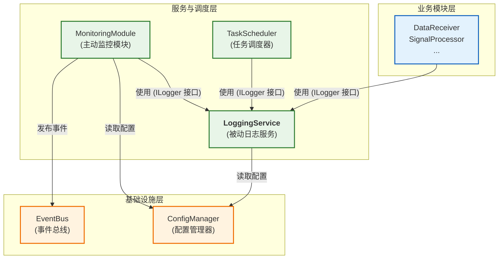
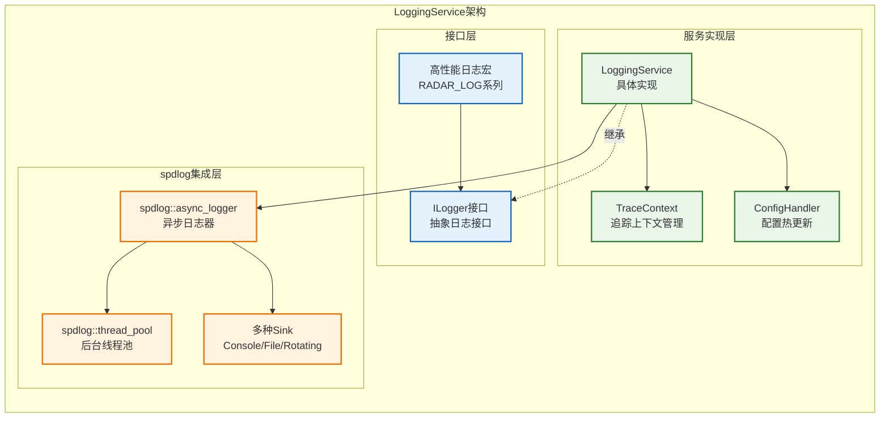
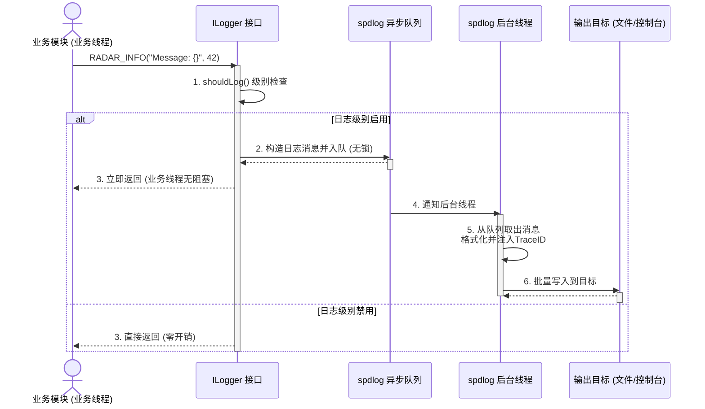
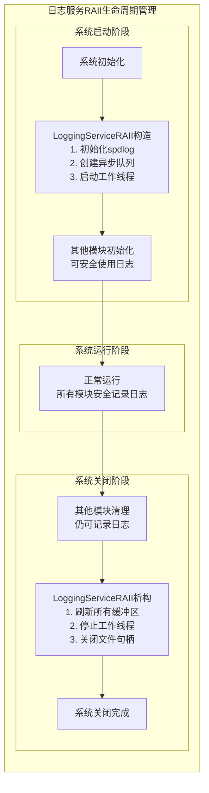
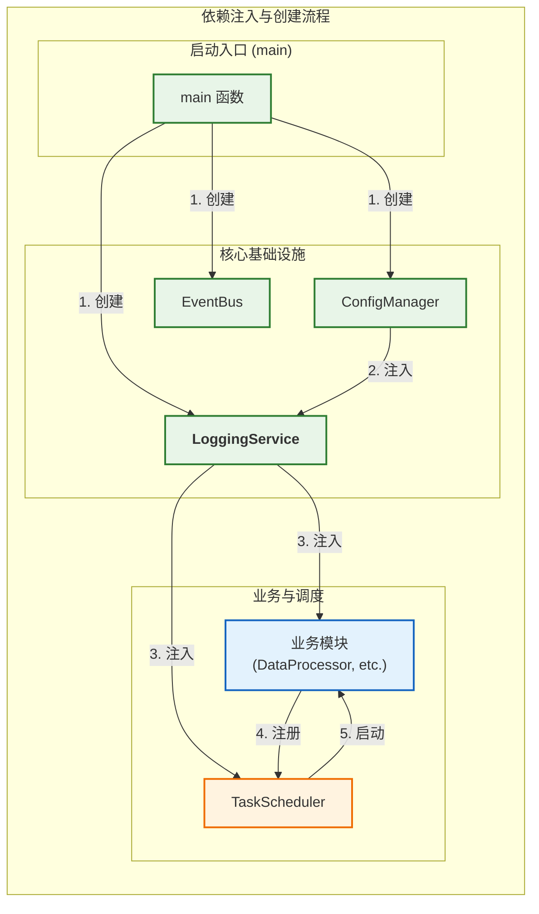

# 日志服务设计

**文档版本**: v2.1.0
**最后更新**: 2025-09-25
**负责人**: Klein
**适用阶段**: MVP及向 V2.0 性能优化过渡阶段

---

## 1 文档职责

本文件设计`LoggingService`，一个高性能、可扩展的日志服务。其核心职责是提供统一的日志记录、追踪和管理能力，并遵循项目架构原则。

**核心设计目标**：
1) **高性能**: 提供异步、零开销的日志宏，对业务线程影响降到最低。
2) **依赖注入**: 作为服务通过`ILogger`接口注入，移除全局单例。
3) **全链路追踪**: 集成`TraceContext`，自动记录追踪ID。
4) **配置驱动**: 通过`ConfigManager`管理日志级别、输出格式等，并支持热更新。

### 1.1 目录

- [日志服务设计](#日志服务设计)
  - [1 文档职责](#1-文档职责)
    - [1.1 目录](#11-目录)
  - [2 架构总览与职责分离](#2-架构总览与职责分离)
    - [2.1 架构边界](#21-架构边界)
    - [2.2 职责定义](#22-职责定义)
    - [2.3 集成模式](#23-集成模式)
  - [3 LoggingService设计](#3-loggingservice设计)
    - [3.1 服务架构与接口](#31-服务架构与接口)
    - [3.2 高性能日志宏](#32-高性能日志宏)
    - [3.3 异步日志机制](#33-异步日志机制)
    - [3.4 TraceContext与追踪](#34-tracecontext与追踪)
  - [4 配置管理集成](#4-配置管理集成)
    - [4.1 ConfigManager集成](#41-configmanager集成)
    - [4.2 配置热更新支持](#42-配置热更新支持)
  - [5 依赖注入与生命周期](#5-依赖注入与生命周期)
    - [5.1 依赖关系设计](#51-依赖关系设计)
    - [5.2 初始化与启动序列](#52-初始化与启动序列)
  - [6 性能优化策略](#6-性能优化策略)
  - [7 实现约束与限制](#7-实现约束与限制)
    - [7.1 技术约束](#71-技术约束)
    - [7.2 架构约束](#72-架构约束)
    - [7.3 性能约束](#73-性能约束)
    - [7.4 MVP功能范围](#74-mvp功能范围)
  - [8 相关文档](#8-相关文档)
  - [9 变更历史](#9-变更历史)

---

## 2 架构总览与职责分离

### 2.1 架构边界

`LoggingService` 是一个**被动的基础服务**，其核心职责是响应其他模块的日志记录请求。它不包含主动的业务逻辑，也不依赖于其他业务模块。




### 2.2 职责定义

**`LoggingService` 的核心职责**:
- **日志记录**: 提供统一的 `ILogger` 接口和高性能宏，用于记录结构化日志。
- **异步处理**: 将日志消息放入异步队列，由后台线程处理I/O，避免阻塞业务线程。
- **格式化与输出**: 根据配置将日志格式化并输出到控制台、文件等多种目标（Sinks）。
- **追踪支持**: 自动在日志中附加当前线程的 `Trace ID`，实现端到端追踪。
- **配置管理**: 从 `ConfigManager` 获取配置，并支持日志级别等参数的热更新。

**`LoggingService` 不负责**:
- **监控**: 不主动收集系统指标（如CPU、内存占用）。这是 `MonitoringModule` 的职责。
- **告警**: 不分析日志内容以触发告警。告警由 `MonitoringModule` 基于指标或由其他业务模块基于特定逻辑通过 `EventBus` 发布。
- **业务逻辑**: 不包含任何特定于雷达数据处理的业务逻辑。

### 2.3 集成模式

- **依赖注入**: 系统中的任何组件（模块或服务）通过构造函数注入 `std::shared_ptr<ILogger>` 来获取日志记录能力。
- **生命周期**: `LoggingService` 在应用程序启动的最早期被创建，在最晚期被销毁，以确保在整个系统生命周期内都能提供服务。
- **配置协同**: `LoggingService` 订阅 `logging.*` 配置项的变更，实现动态调整。

---

## 3 LoggingService设计

### 3.1 服务架构与接口

基于依赖注入的日志服务架构，提供高性能异步日志记录：



**核心接口定义**：
```cpp
namespace radar::logging {

/**
 * @brief 日志记录接口
 * @details 所有模块通过此接口进行日志记录，支持依赖注入
 */
class ILogger {
public:
    virtual ~ILogger() = default;

    /**
     * @brief 检查指定级别是否启用
     * @param level 日志级别
     * @return true如果该级别启用
     */
    virtual bool shouldLog(LogLevel level) const = 0;

    /**
     * @brief 记录日志消息
     * @tparam Args 可变参数类型
     * @param level 日志级别
     * @param format 格式字符串
     * @param args 格式参数
     */
    template<typename... Args>
    void log(LogLevel level, const std::string& format, Args&&... args);

    /**
     * @brief 立即刷新日志缓冲区
     */
    virtual void flush() = 0;

    /**
     * @brief 动态设置日志级别
     * @param level 新的日志级别
     */
    virtual void setLevel(LogLevel level) = 0;
};

/**
 * @brief LoggingService具体实现
 * @details 基于spdlog的高性能异步日志服务
 */
class LoggingService : public ILogger {
public:
    /**
     * @brief 构造函数
     * @param config_manager 配置管理器，用于获取日志配置
     */
    explicit LoggingService(std::shared_ptr<IConfigManager> config_manager);

    /**
     * @brief 初始化日志服务
     * @return ErrorCode 初始化结果
     */
    ErrorCode initialize();

    /**
     * @brief 清理资源
     */
    void cleanup();

    // ILogger接口实现
    bool shouldLog(LogLevel level) const override;
    void flush() override;
    void setLevel(LogLevel level) override;

private:
    std::shared_ptr<IConfigManager> config_manager_;
    std::shared_ptr<spdlog::async_logger> logger_;
    std::atomic<spdlog::level::level_enum> current_level_;

    void onConfigChanged(const std::string& key, const YAML::Node& value);
};

} // namespace radar::logging
```

### 3.2 高性能日志宏

采用零开销的高性能日志宏设计，避免不必要的函数调用和参数求值：

**高性能宏定义**：
```cpp
namespace radar::logging {

/**
 * @brief 日志级别枚举
 */
enum class LogLevel {
    TRACE = 0,  ///< 详细跟踪信息
    DEBUG = 1,  ///< 调试信息
    INFO  = 2,  ///< 一般信息
    WARN  = 3,  ///< 警告信息
    ERROR = 4   ///< 错误信息
};

/**
 * @brief 高性能日志宏 - 级别检查优先
 * @details 在参数求值前先检查日志级别，实现真正的零开销
 */
#define RADAR_TRACE(logger, ...) \
    do { \
        if ((logger) && (logger)->shouldLog(radar::logging::LogLevel::TRACE)) { \
            (logger)->log(radar::logging::LogLevel::TRACE, __VA_ARGS__); \
        } \
    } while(0)

#define RADAR_DEBUG(logger, ...) \
    do { \
        if ((logger) && (logger)->shouldLog(radar::logging::LogLevel::DEBUG)) { \
            (logger)->log(radar::logging::LogLevel::DEBUG, __VA_ARGS__); \
        } \
    } while(0)

#define RADAR_INFO(logger, ...) \
    do { \
        if ((logger) && (logger)->shouldLog(radar::logging::LogLevel::INFO)) { \
            (logger)->log(radar::logging::LogLevel::INFO, __VA_ARGS__); \
        } \
    } while(0)

#define RADAR_WARN(logger, ...) \
    do { \
        if ((logger) && (logger)->shouldLog(radar::logging::LogLevel::WARN)) { \
            (logger)->log(radar::logging::LogLevel::WARN, __VA_ARGS__); \
        } \
    } while(0)

#define RADAR_ERROR(logger, ...) \
    do { \
        if ((logger) && (logger)->shouldLog(radar::logging::LogLevel::ERROR)) { \
            (logger)->log(radar::logging::LogLevel::ERROR, __VA_ARGS__); \
        } \
    } while(0)

} // namespace radar::logging
```

**使用示例**：
```cpp
// 在模块构造函数中注入logger
class DataProcessor : public IModule {
public:
    DataProcessor(std::shared_ptr<ILogger> logger) : logger_(logger) {}

    void processData(const DataObject& data) {
        // 高性能日志记录 - 当DEBUG级别禁用时完全零开销
        RADAR_DEBUG(logger_, "Processing data with trace_id: {}", data.trace_id);

        // 耗时操作的日志记录 - 只有在级别启用时才会执行toString()
        RADAR_TRACE(logger_, "Data details: {}", data.toString());

        // 结构化日志记录
        RADAR_INFO(logger_, "Processing completed - {duration_ms={}, size={}}",
                   duration, data.size());
    }

private:
    std::shared_ptr<ILogger> logger_;
};
```

**日志格式规范**：
```
[2025-09-25T10:30:05.123456Z] [INFO] [DataProc] [a1b2c3d4] [14073] Processing completed - {duration_ms=12.5, size=4096}
[2025-09-25T10:30:05.125000Z] [WARN] [Monitor] [N/A] [14071] CPU usage high: 89%
[2025-09-25T10:30:05.126000Z] [ERROR] [DataProc] [a1b2c3d4] [14074] Processing failed: timeout
```

**格式组成**：`[时间戳] [级别] [模块] [TraceID] [线程] 消息 - {结构化数据}`

- **时间戳**: 高精度UTC时间，格式`YYYY-MM-DDTHH:MM:SS.ffffffZ`
- **级别**: `TRACE`, `DEBUG`, `INFO`, `WARN`, `ERROR`
- **模块**: 记录日志的模块名称（如`DataProc`, `Monitor`）
- **TraceID**: 全链路追踪ID，无追踪时显示`N/A`
- **线程**: 线程ID，用于多线程调试
- **消息**: 日志主要内容
- **结构化数据**: 可选的`key=value`格式元数据

### 3.3 异步日志机制

基于spdlog的高性能异步日志实现，支持配置热更新：



#### 3.2.1 RAII生命周期管理包装器

**问题识别**: 日志服务作为系统基础服务，其初始化和清理时机对系统稳定性至关重要。不当的清理顺序可能导致其他模块析构时无法正常记录日志。

**解决方案**: 引入**LoggingServiceRAII包装器**，确保日志服务在整个系统生命周期内正确初始化和清理。



**RAII包装器实现**:
```cpp
namespace radar::logging {

/**
 * @brief 日志服务RAII生命周期管理器
 * @details 确保日志服务在系统生命周期内的正确初始化和清理顺序
 */
class LoggingServiceRAII {
public:
    /**
     * @brief 构造函数 - 系统启动时调用
     * @param config_manager 配置管理器
     * @throws std::runtime_error 如果初始化失败
     */
    explicit LoggingServiceRAII(std::shared_ptr<IConfigManager> config_manager)
        : config_manager_(std::move(config_manager)) {

        try {
            // 1. 初始化spdlog基础设施
            initializeSpdlog();

            // 2. 创建日志服务实例
            logging_service_ = std::make_shared<LoggingService>(config_manager_);

            // 3. 设置全局实例（供宏使用）
            GlobalLogger::setInstance(logging_service_);

            RADAR_INFO("Logging service initialized successfully");

        } catch (const std::exception& e) {
            // 关键失败，使用stderr输出
            std::cerr << "FATAL: Failed to initialize logging service: "
                      << e.what() << std::endl;
            throw;
        }
    }

    /**
     * @brief 析构函数 - 系统关闭时调用
     * @details 确保所有日志都被刷新到磁盘，工作线程正确关闭
     */
    ~LoggingServiceRAII() {
        try {
            if (logging_service_) {
                RADAR_INFO("Shutting down logging service");

                // 1. 刷新所有待写入的日志
                logging_service_->flush();

                // 2. 等待异步队列清空（最多等待5秒）
                auto shutdown_timeout = std::chrono::seconds(5);
                if (!waitForQueueEmpty(shutdown_timeout)) {
                    std::cerr << "WARNING: Logging queue not empty after timeout" << std::endl;
                }

                // 3. 清理全局实例
                GlobalLogger::setInstance(nullptr);

                // 4. 释放服务实例
                logging_service_.reset();
            }

            // 5. 关闭spdlog基础设施
            shutdownSpdlog();

        } catch (const std::exception& e) {
            // 析构中不抛出异常，但要记录错误
            std::cerr << "ERROR during logging service shutdown: "
                      << e.what() << std::endl;
        }
    }

    // 禁用拷贝和移动
    LoggingServiceRAII(const LoggingServiceRAII&) = delete;
    LoggingServiceRAII& operator=(const LoggingServiceRAII&) = delete;
    LoggingServiceRAII(LoggingServiceRAII&&) = delete;
    LoggingServiceRAII& operator=(LoggingServiceRAII&&) = delete;

    /**
     * @brief 获取日志服务实例
     * @return 日志服务共享指针
     */
    std::shared_ptr<ILogger> getLogger() const {
        return logging_service_;
    }

private:
    std::shared_ptr<IConfigManager> config_manager_;
    std::shared_ptr<LoggingService> logging_service_;

    void initializeSpdlog();
    void shutdownSpdlog();
    bool waitForQueueEmpty(std::chrono::seconds timeout);
};

} // namespace radar::logging
```

**LoggingService完整实现**：
```cpp
namespace radar::logging {

/**
 * @brief LoggingService实现类
 * @details 基于依赖注入的高性能异步日志服务
 */
class LoggingService : public ILogger {
public:
    /**
     * @brief 构造函数
     * @param config_manager 配置管理器，用于获取配置和监听热更新
     */
    explicit LoggingService(std::shared_ptr<IConfigManager> config_manager);

    /**
     * @brief 初始化日志服务
     * @return ErrorCode 初始化结果
     */
    ErrorCode initialize();

    /**
     * @brief 清理资源
     */
    void cleanup();

    // ILogger接口实现
    bool shouldLog(LogLevel level) const override {
        return level >= static_cast<LogLevel>(current_level_.load());
    }

    template<typename... Args>
    void log(LogLevel level, const std::string& format, Args&&... args) {
        if (!shouldLog(level)) return;

        // 获取当前线程的Trace ID
        auto trace_id = TraceContext::getCurrentTraceId();

        // 构造格式化的消息（包含Trace ID）
        auto formatted_msg = fmt::format("[{}] {}", trace_id,
                                         fmt::format(format, std::forward<Args>(args)...));

        // 异步记录到spdlog
        logger_->log(toSpdlogLevel(level), formatted_msg);
    }

    void flush() override {
        if (logger_) {
            logger_->flush();
        }
    }

    void setLevel(LogLevel level) override {
        current_level_.store(static_cast<int>(level));
        if (logger_) {
            logger_->set_level(toSpdlogLevel(level));
        }
    }

private:
    std::shared_ptr<IConfigManager> config_manager_;
    std::shared_ptr<spdlog::async_logger> logger_;
    std::atomic<int> current_level_{static_cast<int>(LogLevel::INFO)};

    // 配置热更新处理
    void onConfigChanged(const std::string& key, const YAML::Node& value);

    // 创建spdlog sinks
    std::vector<spdlog::sink_ptr> createSinks(const YAML::Node& config);

    // 级别转换
    spdlog::level::level_enum toSpdlogLevel(LogLevel level) const;
};

} // namespace radar::logging
```

**性能特性**：
- **零开销级别检查**: 禁用级别的日志调用编译器优化为空操作
- **无锁队列**: spdlog内部使用无锁队列，避免线程竞争
- **批量I/O**: 后台线程批量刷新，减少系统调用开销
- **内存池**: 预分配消息缓冲区，避免频繁内存分配
- **格式化延迟**: 消息格式化在后台线程执行，不阻塞业务线程

### 3.4 TraceContext与追踪

基于线程局部存储(TLS)的全链路追踪机制，支持端到端的请求追踪：

**TraceContext设计**：
```cpp
namespace radar::common {

/**
 * @brief 追踪ID类型定义
 */
using TraceId = std::string;

/**
 * @brief 全链路追踪上下文管理
 * @details 基于thread_local存储，提供线程安全的Trace ID管理
 */
class TraceContext {
public:
    /**
     * @brief 设置当前线程的Trace ID
     * @param trace_id 追踪ID
     */
    static void setCurrentTraceId(const TraceId& trace_id);

    /**
     * @brief 获取当前线程的Trace ID
     * @return 当前追踪ID，无追踪时返回"N/A"
     */
    static TraceId getCurrentTraceId();

    /**
     * @brief 生成新的Trace ID
     * @return 唯一的追踪ID字符串（格式：时间戳+随机数）
     */
    static TraceId generateTraceId();

    /**
     * @brief 清除当前线程的Trace ID
     */
    static void clearCurrentTraceId();

private:
    static thread_local TraceId current_trace_id_;
};

/**
 * @brief RAII风格的追踪上下文管理器
 * @details 自动管理Trace ID的设置和恢复，防止上下文污染
 */
class TraceContextGuard {
public:
    explicit TraceContextGuard(const TraceId& trace_id)
        : previous_trace_id_(TraceContext::getCurrentTraceId()) {
        TraceContext::setCurrentTraceId(trace_id);
    }

    ~TraceContextGuard() {
        TraceContext::setCurrentTraceId(previous_trace_id_);
    }

    // 禁止复制和移动
    TraceContextGuard(const TraceContextGuard&) = delete;
    TraceContextGuard& operator=(const TraceContextGuard&) = delete;

private:
    TraceId previous_trace_id_;
};

} // namespace radar::common
```

**使用模式**：

1. **数据流追踪**：
```cpp
// 数据接收模块 - 追踪起点
void DataReceiver::onPacketReceived(const RawPacket& packet) {
    // 为新数据生成Trace ID
    auto trace_id = TraceContext::generateTraceId();
    TraceContextGuard guard(trace_id);

    RADAR_INFO(logger_, "Packet received: size={}", packet.size);

    // 创建DataObject，将trace_id作为元数据
    auto data_obj = createDataObject(packet, trace_id);
    sendToNextModule(data_obj);
}

// 信号处理模块 - 追踪传递
void SignalProcessor::processData(const DataObject& data) {
    // 从DataObject恢复Trace ID上下文
    TraceContextGuard guard(data.trace_id);

    RADAR_DEBUG(logger_, "Starting FFT processing");
    // ... 处理逻辑
    RADAR_INFO(logger_, "FFT completed: points={}", fft_points);

    // 传递trace_id到下一个模块
    auto result = createProcessedData(processed_data, data.trace_id);
    sendToNextModule(result);
}
```

2. **事件流追踪**：
```cpp
// 事件处理 - 追踪起点
void TaskScheduler::handleConfigChangeRequest(const ConfigChangeEvent& event) {
    // 为配置变更流程生成追踪
    auto trace_id = TraceContext::generateTraceId();
    TraceContextGuard guard(trace_id);

    RADAR_INFO(logger_, "Config change requested: key={}", event.key);

    // 后续所有相关日志都会自动带上这个trace_id
    validateConfigChange(event);
    applyConfigChange(event);
}
```

3. **跨线程追踪**：
```cpp
// 主线程
void dispatchTask(const Task& task) {
    auto trace_id = TraceContext::getCurrentTraceId();

    // 提交到线程池时传递trace_id
    thread_pool_.submit([trace_id, task, this]() {
        TraceContextGuard guard(trace_id); // 在工作线程中恢复上下文
        executeTask(task);
    });
}
```

**追踪机制优势**：
- **线程安全**: `thread_local`确保多线程环境下的追踪隔离
- **零侵入**: 日志记录代码无需显式传递`trace_id`参数
- **RAII管理**: 自动处理上下文设置和恢复，防止污染
- **跨模块**: 支持数据在不同模块间流转时的完整追踪链

---

## 4 配置管理集成

### 4.1 ConfigManager集成

LoggingService通过`ConfigManager`获取配置，支持热更新：

**配置结构设计**：
```yaml
# configs/config.yaml - 统一配置文件
logging:
  level: "INFO"                    # 日志级别
  async_mode: true                 # 异步模式
  queue_size: 8192                 # 队列大小
  thread_count: 1                  # 后台线程数

  console:
    enabled: true                  # 控制台输出
    pattern: "[%Y-%m-%d %H:%M:%S.%e] [%l] [%n] [%t] %v"

  file:
    enabled: true                  # 文件输出
    path: "logs/radar.log"
    max_size: "100MB"
    max_files: 5
    pattern: "[%Y-%m-%d %H:%M:%S.%e] [%l] [%n] [%t] %v"
```

### 4.2 配置热更新支持

LoggingService支持配置的实时热更新：

```cpp
namespace radar::logging {

/**
 * @brief LoggingService配置热更新
 */
class LoggingService : public ILogger {
public:
    ErrorCode initialize() override {
        // 获取初始配置
        auto config = config_manager_->getSection("logging");
        applyConfig(config);

        // 订阅配置变更事件
        config_manager_->subscribeToChanges("logging",
            [this](const std::string& key, const YAML::Node& value) {
                this->onConfigChanged(key, value);
            });

        return SystemErrors::SUCCESS;
    }

private:
    void onConfigChanged(const std::string& key, const YAML::Node& value) {
        TraceContextGuard guard(TraceContext::generateTraceId());

        RADAR_INFO(logger_, "Logging configuration changed: {}", key);

        if (key == "logging.level") {
            auto new_level = value.as<std::string>();
            setLevel(parseLogLevel(new_level));
        }
        else if (key == "logging.file.max_size") {
            // 动态调整文件大小限制
            auto new_size = value.as<std::string>();
            updateFileSizeLimit(new_size);
        }
        // ... 其他配置项的热更新处理
    }
};

} // namespace radar::logging
```

---

## 5 依赖注入与生命周期

### 5.1 依赖关系设计

基于依赖注入的清晰依赖关系图：



### 5.2 初始化与启动序列

清晰的组件创建和启动顺序：

```cpp
// main.cpp - 系统入口点
int main(int argc, char* argv[]) {
    try {
        // 第1步：创建核心基础设施
        auto config_manager = std::make_shared<ConfigManager>();
        config_manager->initialize("configs/config.yaml");

        auto event_bus = std::make_shared<EventBus>();
        event_bus->initialize();

        // 第2步：创建日志服务（最早创建，最晚销毁）
        auto logging_service = std::make_shared<LoggingService>(config_manager);
        logging_service->initialize();

        // 第3步：创建任务调度器
        auto task_scheduler = std::make_shared<TaskScheduler>(
            config_manager, event_bus, logging_service);
        task_scheduler->initialize();

        // 第4步：创建业务模块（注入日志服务）
        auto data_receiver = std::make_shared<DataReceiver>(
            config_manager, event_bus, logging_service);

        auto signal_processor = std::make_shared<SignalProcessor>(
            config_manager, event_bus, logging_service);

        auto data_processor = std::make_shared<DataProcessor>(
            config_manager, event_bus, logging_service);

        // 第5步：创建监控模块（依赖日志服务）
        auto monitoring_module = std::make_shared<MonitoringModule>(
            config_manager, event_bus, logging_service);

        // 第6步：注册所有模块到任务调度器
        task_scheduler->registerModule(data_receiver);
        task_scheduler->registerModule(signal_processor);
        task_scheduler->registerModule(data_processor);
        task_scheduler->registerModule(monitoring_module);

        // 第7步：启动系统
        task_scheduler->start();

        // 第8步：等待系统运行
        waitForShutdownSignal();

        // 第9步：优雅关闭（顺序与创建相反）
        task_scheduler->stop();
        task_scheduler->cleanup();

        monitoring_module->cleanup();
        data_processor->cleanup();
        signal_processor->cleanup();
        data_receiver->cleanup();

        event_bus->cleanup();
        logging_service->cleanup(); // 最后清理日志服务
        config_manager->cleanup();

        return 0;
    }
    catch (const std::exception& e) {
        std::cerr << "System initialization failed: " << e.what() << std::endl;
        return 1;
    }
}
```

**生命周期管理原则**：
1. **日志服务最早创建，最晚销毁**：确保所有组件都能记录日志
2. **配置管理器紧随其后**：为所有组件提供配置支持
3. **事件总线早期创建**：支持模块间通信
4. **业务模块按依赖顺序创建**：避免初始化时的依赖问题
5. **任务调度器统一管理模块生命周期**：标准化启动/停止流程

---

## 6 性能优化策略

**关键性能优化技术**：

| 优化技术       | 实现方式         | 性能提升       | 适用场景      |
| -------------- | ---------------- | -------------- | ------------- |
| **零开销日志** | 宏级别检查       | 禁用时零开销   | 调试/跟踪日志 |
| **异步写入**   | spdlog异步队列   | 延迟降低90%    | 高频日志记录  |
| **批量I/O**    | 后台线程批量刷新 | 减少系统调用   | 日志文件写入  |
| **内存池**     | 预分配缓冲区     | 减少动态分配   | 频繁对象创建  |
| **格式化延迟** | 后台线程处理     | 不阻塞业务线程 | 复杂格式化    |

**具体优化实现**：
```cpp
// 1. 零开销日志宏
#define RADAR_DEBUG(logger, ...) \
    do { \
        if (LIKELY((logger) && (logger)->shouldLog(LogLevel::DEBUG))) { \
            (logger)->log(LogLevel::DEBUG, __VA_ARGS__); \
        } \
    } while(0)

// 2. 预分配内存池
class LogMessagePool {
    static constexpr size_t POOL_SIZE = 1000;
    std::array<LogMessage, POOL_SIZE> message_pool_;
    std::atomic<size_t> next_index_{0};

public:
    LogMessage* acquireMessage() {
        size_t index = next_index_.fetch_add(1) % POOL_SIZE;
        return &message_pool_[index];
    }
};
```

**性能目标**：
- **日志写入延迟**: < 10ns (级别检查) + < 100ns (消息入队)
- **内存占用**: LoggingService < 10MB
- **CPU开销**: < 0.1% (异步模式下)

---

## 7 实现约束与限制

### 7.1 技术约束

**依赖库版本**：
- `spdlog`: >= 1.9.0 (支持异步日志和自定义格式)
- `yaml-cpp`: >= 0.7.0 (ConfigManager依赖)
- `fmt`: >= 8.0.0 (现代C++格式化支持)

**编译器要求**：
- C++17标准 (thread_local, structured binding等特性)
- GCC >= 9.0 或 MSVC >= 19.20
- 支持原子操作和线程安全特性

**平台支持**：
- Linux: 完全支持，包括系统资源监控
- Windows: 完全支持，包括Performance Counter集成
- 其他平台: 日志功能全支持

### 7.2 架构约束

**接口一致性**：
- `LoggingService`必须实现`ILogger`接口
- 所有策略类必须实现对应的策略接口

**依赖关系**：
- 严禁全局单例和静态依赖
- 所有依赖必须通过构造函数注入
- 模块间通信只能通过事件总线

**生命周期管理**：
- `LoggingService`生命周期由`main`函数管理
- 组件销毁顺序必须与创建顺序相反

### 7.3 性能约束

**实时性要求**：
- 日志记录不得阻塞业务线程超过1ms
- 告警事件发布必须异步进行

**资源使用限制**：
- 日志服务总内存占用 < 50MB
- 事件队列长度 < 10000个事件

**可扩展性要求**：
- 支持运行时添加新的监控指标
- 支持热插拔告警策略
- 预留外部监控系统集成接口

### 7.4 MVP功能范围

**包含功能**：
- 基础的5级日志记录
- Trace ID全链路追踪
- 配置热更新
- 异步日志写入

**暂不包含**：
- 分布式日志聚合
- 日志内容分析和统计
- 外部日志系统集成

---

## 8 相关文档

- [数据接收模块设计](01_数据接收模块设计.md)
- [信号处理模块设计](02_信号处理模块设计.md)
- [数据处理模块设计](03_数据处理模块设计.md)
- [04_数据网关模块设计](04_数据网关模块设计.md)
- [任务调度器设计](05_任务调度器设计.md)
- [配置管理模块设计](06_配置管理模块设计.md)
- [监控服务设计](08_监控服务设计.md)
- [MVP系统设计文档](../MVP系统设计文档.md)

---

## 9 变更历史

| 版本   | 日期       | 作者  | 变更描述                                                                                                                               |
| ------ | ---------- | ----- | -------------------------------------------------------------------------------------------------------------------------------------- |
| v2.1.0 | 2025-09-25 | Klein | **文档拆分**：将原日志监控模块设计文档拆分为独立的日志服务设计和监控服务设计文档，优化职责定义和架构描述。                             |
| v2.0.0 | 2025-09-25 | Klein | **重大重构**：基于问题汇总全面重构。拆分日志/监控职责，移除全局单例，采用依赖注入，集成ConfigManager，实现事件驱动告警，完善追踪机制。 |
| v1.0.1 | 2025-09-23 | Klein | 去掉了接口设计部分的内容，简化了文档结构。                                                                                             |
| v1.0.0 | 2025-09-23 | Klein | 基于MVP设计文档创建日志监控模块设计，采用spdlog实现简化的异步日志和基础监控告警功能。                                                  |

---

*本设计完全符合项目架构原则，提供高性能的日志记录服务，支持完整的可观测性和端到端追踪能力。*
