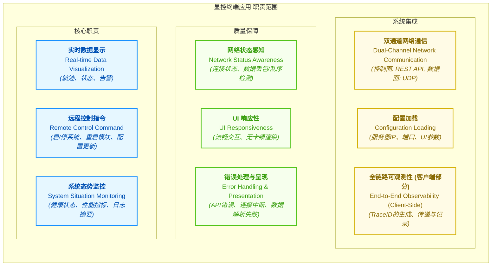
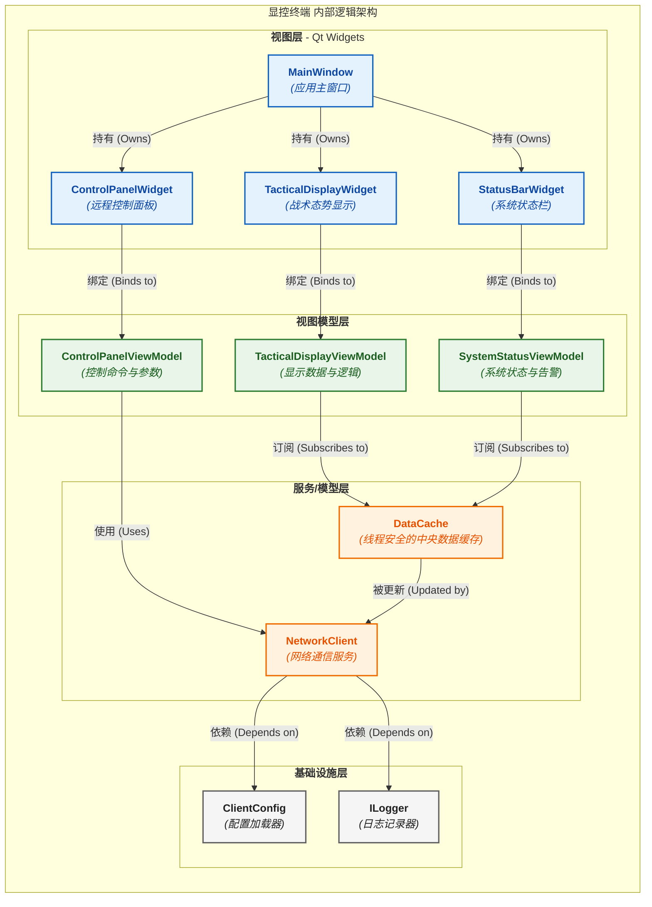
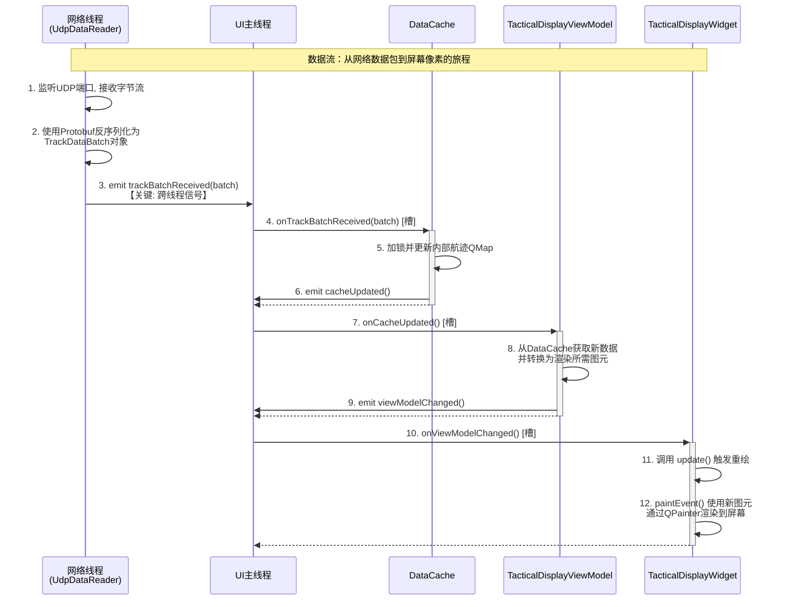
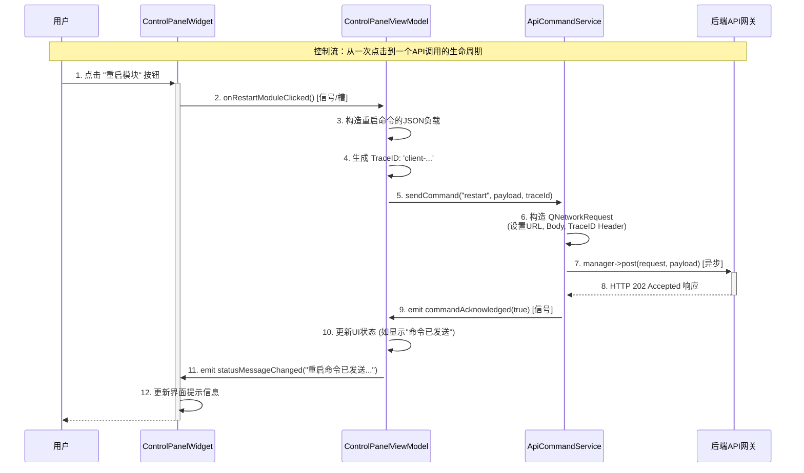
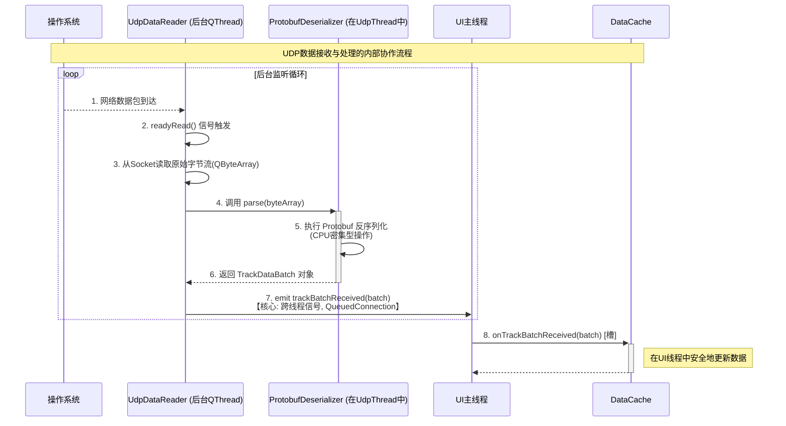
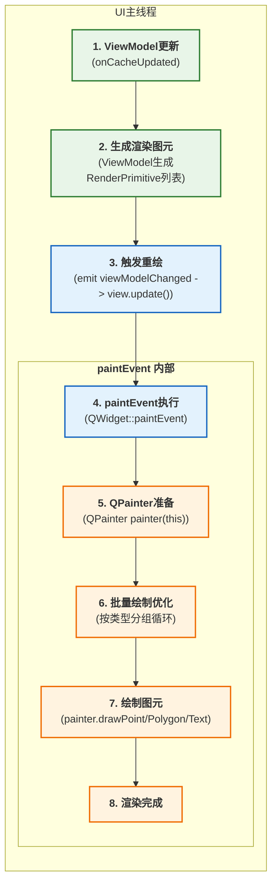
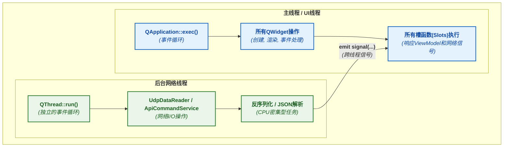
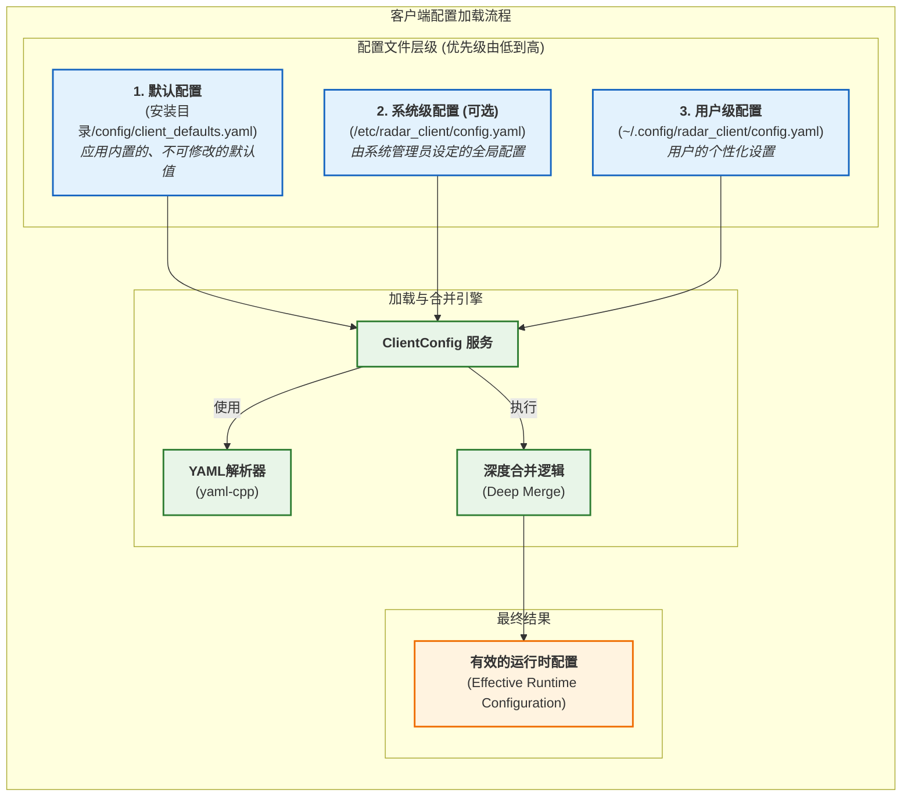

# 显控终端应用设计

- **当前版本**: v1.0.0
- **最后更新**: 2025-09-28
- **负责人**: Klein

-----

## 概述

本显控终端应用是雷达数据处理系统在演进为**分布式架构**后的关键人机交互界面(HMI)。它是一个**独立的桌面应用程序**，通过网络与后端的核心处理服务器进行通信。其核心职责是作为操作员的“眼睛”和“手”，提供强大的**实时数据显示**能力（数据面）和对后端服务器的**远程控制**能力（控制面）。

本应用严格遵循“瘦客户端”设计哲学，将所有计算密集型任务（如信号处理、数据融合）完全解耦至后端服务器。它通过“双通道”网络模型与服务器交互：经由高效的 **UDP 协议**接收高速航迹数据流，并通过可靠的 **RESTful API** 发送控制指令、查询系统状态。应用的设计目标是实现卓越的用户体验，包括高刷新率、低延迟的态势显示和即时响应的用户操作。

-----

## 目录

- [显控终端应用设计](#显控终端应用设计)
  - [概述](#概述)
  - [目录](#目录)
  - [1 文档职责](#1-文档职责)
    - [1.1 文档目标与范围](#11-文档目标与范围)
    - [1.2 核心原则对齐](#12-核心原则对齐)
  - [2 应用总体设计](#2-应用总体设计)
    - [2.1 应用职责定义](#21-应用职责定义)
    - [2.2 应用边界与接口](#22-应用边界与接口)
    - [2.3 关键性能指标 (KPIs)](#23-关键性能指标-kpis)
  - [3 内部架构设计](#3-内部架构设计)
    - [3.1 逻辑架构与组件划分](#31-逻辑架构与组件划分)
    - [3.2 核心组件职责](#32-核心组件职责)
    - [3.3 核心数据流与协作](#33-核心数据流与协作)
      - [3.3.1 实时数据流 (UDP数据 -\> 屏幕渲染)](#331-实时数据流-udp数据---屏幕渲染)
      - [3.3.2 远程控制流 (用户点击 -\> API请求)](#332-远程控制流-用户点击---api请求)
  - [4 核心机制深度设计](#4-核心机制深度设计)
    - [4.1 网络通信机制](#41-网络通信机制)
      - [4.1.1 数据通道: UDP监听与异步反序列化](#411-数据通道-udp监听与异步反序列化)
      - [4.1.2. 控制通道: 异步RESTful API客户端](#412-控制通道-异步restful-api客户端)
    - [4.2 数据可视化机制](#42-数据可视化机制)
      - [4.2.1 高性能渲染流水线](#421-高性能渲染流水线)
      - [4.2.2 渲染性能优化策略](#422-渲染性能优化策略)
    - [4.3 状态管理与同步](#43-状态管理与同步)
      - [4.3.1 "握手"与状态同步流程](#431-握手与状态同步流程)
      - [4.3.2 智能重连机制](#432-智能重连机制)
  - [5 关键横切关注点](#5-关键横切关注点)
    - [5.1 并发与线程模型](#51-并发与线程模型)
    - [5.2 错误处理与恢复策略](#52-错误处理与恢复策略)
  - [6 应用配置](#6-应用配置)
    - [6.1 配置文件格式与加载机制](#61-配置文件格式与加载机制)
    - [6.2 核心配置项定义](#62-核心配置项定义)
    - [6.3 配置热更新 (未来演进)](#63-配置热更新-未来演进)
  - [7 术语表](#7-术语表)
  - [8 变更历史](#8-变更历史)

-----

## 1 文档职责

### 1.1 文档目标与范围

  * **概要**: 本文件旨在为雷达数据处理系统设计一个独立的、通过网络与核心服务器通信的**桌面显控终端应用程序**。在系统演进为分布式架构后，本应用的核心职责是作为人机交互的**前端**，为操作员提供强大的**数据可视化**能力和对后端服务器的**远程控制**能力。

本文档的核心目标是：

  * **定义角色**: 明确本应用作为分布式架构中的“客户端”，是系统对外展示信息和接收指令的唯一官方图形界面。这种物理和逻辑上的分离，使得前后端可以独立开发、测试、部署和扩展，例如，后端服务器可以部署在高性能计算中心，而客户端则运行在标准的操作员工作站上。

  * **规范交互**: 详细定义客户端与后端服务器之间“双通道”网络通信的技术细节，包括控制流和服务流。这是确保两个独立进程间能够进行可靠、高效通信的基石。

  * **设计实现**: 提供一个健壮、高性能、响应迅速的客户端内部架构蓝图，确保卓越的用户体验。设计必须考虑到实时数据处理的特殊要求，以及在复杂态势下的信息清晰呈现。

  * **阐明边界**: 清晰界定本应用的职责范围——它专注于\*\*“显示”**与**“交互”\*\*，而将所有计算密集型任务（如信号处理、数据融合、航迹滤波）完全交由后端服务器处理。这种边界划分是实现瘦客户端、简化维护的关键。

### 1.2 核心原则对齐

  * **概要**: 本应用的设计是系统**数据与控制分离**原则在客户端的延伸和体现。它通过两个独立的网络通道与后端进行交互，严格遵循后端定义的接口契约，构成了分布式系统完整、解耦的闭环。

| 核心原则 | 在本规范中的具体体现 |
| :--- | :--- |
| **数据与控制分离**<br>*(Data/Control Plane Separation)* | **严格遵循“双通道”通信模型**。应用通过**RESTful API (控制面)**，利用TCP的可靠性，向API网关发送控制命令、查询状态和告警；同时通过**UDP监听器 (数据面)**，利用UDP的高效性，接收来自数据网关的高速航迹数据流。这种分离不仅是技术选择，更是架构鲁棒性的保证：即使数据面因网络波动出现瞬时拥塞或少量丢包，控制面依然能保持稳定连接，确保操作员的关键指令（如系统停止）能够可靠送达。 |
| **全链路可观测性**<br>*(End-to-End Observability)* | **`TraceID`在客户端的延续**。应用在接收到UDP数据包并反序列化后，必须提取其中的`TraceID`，并在相关的日志和内部事件中继续传递。当用户通过UI发起一个控制操作（例如点击“重启模块”按钮）时，客户端也应生成一个新的、带有`client-`前缀的`TraceID`并通过API请求头发送给后端。这使得开发和运维人员能够将一次前端的用户操作，与其在后端所有微服务中引发的连锁反应完整地关联起来，极大地简化了分布式系统的调试与故障排查。例如，当操作员报告某个目标在屏幕上消失时，可以通过客户端日志中的`TraceID`，反向追溯其在服务器数据处理流水线中的每一步，快速定位问题根源。 |
| **接口驱动开发** | **作为接口的纯粹消费者**。本应用完全依赖于[`02_外部接口设计.md`](../05_接口设计/02_外部接口设计.md)中定义的RESTful API和[`04_数据网关模块设计.md`](04_数据网关模块设计.md)中定义的UDP数据协议。它不关心后端的内部实现细节。这种严格的契约精神意味着后端可以在不破坏API兼容性的前提下进行任意重构或技术栈升级，而客户端代码无需任何修改，保证了系统的长期可维护性。同时，这也使得前后端开发可以并行进行，客户端团队可以基于API文档和模拟（Mock）服务器进行开发和测试，显著缩短了开发周期。 |

-----

## 2 应用总体设计

  - **概要**: 本章从最高层次描绘显控终端应用的蓝图，定义其在**分布式系统**中的角色、输入输出边界，以及必须达成的关键性能目标。作为操作员与后端核心处理服务器交互的**唯一图形化界面 (HMI)**，本应用的设计直接决定了整个系统的可用性、可控性和可观测性。它是一个专注于“显示”与“交互”的**瘦客户端**，将所有计算密集型任务完全解耦至后端。

### 2.1 应用职责定义

  - **概要**: 显控终端的核心职责可以概括为“**数据显示**”、“**远程控制**”和“**态势感知**”。它扮演着后端复杂数据处理结果的“最终呈现者”和操作员控制指令的“始发站”角色。



  * **实时数据显示**: 作为**数据面**的消费者，应用的核心任务是将从后端`数据网关模块`接收到的高速航迹数据流（`TrackData`），以图形化方式实时、精确地渲染到屏幕上。
  * **远程控制指令**: 作为**控制面**的发起者，应用为操作员提供与后端服务器交互的接口，将用户的操作（如点击按钮、修改参数）转换为标准化的RESTful API请求，发送给后端的`API网关`。
  * **系统态势监控**: 聚合并展示从后端获取的系统状态、模块健康度和关键性能指标，为操作员提供全局的态势感知能力。
  * **质量与集成**: 应用必须具备健壮的网络处理能力，能感知并适应网络波动。同时，它必须遵循系统统一的`TraceID`规范，在发起控制请求时生成新的`TraceID`，并在接收到数据时继续传递`TraceID`，确保全链路可观测性在客户端得以延续。

### 2.2 应用边界与接口

  - **概要**: 本节严格遵循**接口驱动开发**原则，明确定义本应用作为纯粹的“客户端”与后端服务器交互的契约。所有交互都必须通过[`02_外部接口设计.md`](../05_接口设计/02_外部接口设计.md)和[`04_数据网关模块设计.md`](04_数据网关模块设计.md)中定义的标准化接口进行。

| 边界类型 | 交互对象 | 交互接口 / 数据格式 | 核心契约与说明 |
| :--- | :--- | :--- | :--- |
| **输入 (Inputs)** | **数据网关模块**<br>(`DisplayController`) | UDP Unicast Packets / **Protobuf** | **数据面**: 接收由服务器发送的UDP数据包。数据内容为 Protobuf 序列化的 `TrackDataBatch` 消息。应用**必须**：<br>1.  解析 `batch_sequence_id` 以检测网络丢包。<br>2.  提取并记录每个航迹中的 `trace_id`，用于日志关联和问题追溯。 |
| | **RESTful API 网关** | HTTP/1.1 Responses / **JSON** | **控制面**: 接收对各类API请求的响应。包括：<br>- `GET /api/v1/system/status`: 获取系统和各模块的当前状态。<br>- `GET /api/v1/system/alerts`: **轮询获取**当前活跃的告警列表。<br>- `POST /api/v1/system/control`: 获取控制命令（如启动/停止）的执行回执。 |
| **输出 (Outputs)**| **RESTful API 网关** | HTTP/1.1 Requests / **JSON** | **控制面**: 向服务器发送控制指令和查询请求。应用**必须**：<br>1.  在发起任何会触发后端状态变更的请求时（如`POST`），在HTTP头中**生成并附加一个新的、唯一的 `TraceID`** (例如 `client-uuid-v4`)。<br>2.  严格遵循API文档定义的端点、方法和负载结构。 |

### 2.3 关键性能指标 (KPIs)

  - **概要**: 为确保显控终端在复杂电磁环境下依然能为操作员提供流畅、可靠的服务，我们定义以下可量化的关键性能指标。所有指标均基于标准操作员工作站（如 Intel Core i7, 16GB RAM, Windows 10）进行衡量。

| KPI 指标 | 目标值(示例) | 测量方法 | 重要性与说明 |
| :--- | :--- | :--- | :--- |
| **UI 刷新率** | **稳定 \> 30 FPS**<br>(在1000个活动目标下) | 使用内置或第三方帧率计数器，在满负载场景下持续测量。 | **极高**<br>保障流畅的视觉体验，是应用可用性的基础。低于此值会严重影响操作员的态势判断。 |
| **数据展示延迟**<br>(Glass-to-Glass) | **P99 \< 33ms** | 测量从操作系统Socket接收到UDP数据包，到该包内航迹信息被完全渲染到屏幕上的总耗时。 | **高**<br>确保操作员看到的态势具有足够的实时性。这是衡量从数据到信息转换效率的关键指标。 |
| **控制命令响应延迟** | **P99 \< 200ms** | 测量从用户在UI上完成一个控制操作（如点击按钮），到收到后端API返回`202 Accepted`确认的总耗时。 | **高**<br>确保操作的即时反馈，直接关系到系统的可控性。 |
| **网络丢包容忍度** | **可处理 5% 的连续丢包** | 在测试环境中模拟UDP丢包。应用应能检测到丢包（通过`batch_sequence_id`），在UI上给出提示，并保持稳定运行不崩溃。 | **中**<br>UDP是不可靠协议，应用必须具备在不完美网络环境下的鲁棒性。 |
| **CPU / 内存占用** | **CPU \< 15% (单核)**<br>**内存 \< 512 MB** | 在满负载场景下，使用操作系统自带的性能监控工具进行测量。 | **中**<br>作为瘦客户端，必须控制自身资源消耗，不能对操作员工作站造成过大负担。 |

-----

## 3 内部架构设计

  - **概要**: 本章深入显控终端应用的内部，展示其核心组件的划分、职责以及它们之间的协作方式。为满足高刷新率、低延迟和高响应性的严苛KPI要求，并充分利用Qt框架的强大功能，本应用采用一种**以视图模型 (ViewModel) 为中心的、事件驱动的多线程架构**。此架构并非简单的MVP模式，而是针对实时数据显示和复杂用户交互场景进行深度优化的现代C++客户端设计典范。

### 3.1 逻辑架构与组件划分

  - **概要**: 模块内部逻辑架构遵循关注点分离 (Separation of Concerns) 原则，划分为清晰的四层：**视图层**、**视图模型层**、**服务/模型层** 和 **基础设施层**。这种分层确保了UI逻辑、业务逻辑和数据处理的完全解耦，极大地提升了应用的可测试性、可维护性和可扩展性。



  * **视图层**: 完全由Qt Widgets构成，是**纯粹的UI渲染和用户输入捕捉器**。它不包含任何业务逻辑，其所有显示的数据都来自于视图模型层，所有的用户操作都转发给视图模型层处理。
  * **视图模型层**: **应用的核心协调者**。它从服务/模型层获取原始数据，并将其转换为适合视图层展示的格式和状态。它通过Qt的**信号与槽机制**向视图层通知变更，并通过暴露**命令 (Commands)** 来响应视图层的用户操作。
  * **服务/模型层**: 负责应用的“脏活累活”。它封装了所有非UI的逻辑，包括网络通信、数据反序列化和线程安全的数据存储。
  * **基础设施层**: 提供应用范围内的基础服务，如配置加载和日志记录。

### 3.2 核心组件职责

  - **概要**: 下表详细说明了`3.1`图中每个核心组件的具体职责、关键实现技术和设计决策，为开发人员提供清晰的实现指南。

| 组件名称 | 主要职责 | 关键设计点与实现策略 | 接口/交互 (Qt) |
| :--- | :--- | :--- | :--- |
| **`NetworkClient`**<br>(网络客户端) | **双通道网络通信** | 1.  内部包含两个关键子组件：<br>    - `UdpDataReader`: 在一个**专用后台线程** (`QThread`) 中运行，负责监听UDP端口，接收`TrackDataBatch`数据包，使用Protobuf反序列化，并通过**信号 (Signal)** 将结果安全地发射到主线程。<br>    - `ApiCommandService`: 使用`QNetworkAccessManager`实现**异步的RESTful API**调用，负责发送控制命令和轮询系统状态/告警。 | `signals:`<br>`   void trackBatchReceived(TrackDataBatch batch); `<br>`   void systemStatusUpdated(SystemStatus status); ` |
| **`DataCache`**<br>(数据缓存) | **中央数据仓库** | 1.  作为应用的**单一事实来源 (Single Source of Truth)**。<br>2.  内部使用`QReadWriteLock`或`QMutex`保护数据结构，确保**线程安全**。<br>3.  持有最新的航迹列表 (`QMap<uint64_t, TrackData>`)、系统状态、告警列表等。<br>4.  当数据更新时，发射精细化的信号（如`trackAdded`, `trackUpdated`, `alertTriggered`），供视图模型层订阅。 | `signals:`<br>`   void cacheUpdated(); ` |
| **`...ViewModel`**<br>(视图模型) | **UI状态与逻辑** | 1.  继承自`QObject`以利用信号与槽。<br>2.  **数据绑定**: 将`DataCache`中的原始数据转换为UI友好的格式（如将坐标转换为屏幕像素），并通过`Q_PROPERTY`暴露给视图层。<br>3.  **命令处理**: 提供公共槽 (`public slots:`) 作为命令接口，供视图层调用以响应用户操作（如`onRestartModuleClicked()`）。 | `Q_PROPERTY(...)`<br>`public slots:`<br>`   void handleUserAction(...); ` |
| **`TacticalDisplayWidget`**<br>(战术显示控件) | **高性能态势渲染** | 1.  继承自`QWidget`，重写`paintEvent(QPaintEvent *)`方法。<br>2.  使用`QPainter`进行高效的2D图形绘制。<br>3.  **性能优化**: 实现视口剔除、细节层次（LOD，如远处目标只画点，近处画符号和ID）和批量绘制（将同类型的目标一次性绘制）策略，确保在千批目标下依然流畅。 | `slots:`<br>`   void onViewModelUpdated(); ` |

### 3.3 核心数据流与协作

  - **概要**: 下面的序列图详细展示了两个最关键的端到端场景：**数据流**（从网络到屏幕）和**控制流**（从用户点击到API发送），揭示了多线程架构下各组件如何通过Qt的信号与槽机制进行安全、解耦的协作。

#### 3.3.1 实时数据流 (UDP数据 -\> 屏幕渲染)



**流程详解**:

1.  **后台接收与反序列化**: `UdpDataReader`在其独立的`QThread`中循环等待UDP数据。收到数据后，立即使用Protobuf库将其反序列化为C++对象。
2.  **跨线程信号**: 反序列化完成后，它通过Qt的信号`trackBatchReceived`将数据**安全地**传递给UI主线程。这是Qt多线程编程的最佳实践，避免了手动加锁和复杂的线程同步。
3.  **数据缓存**: `DataCache`在UI主线程中响应此信号，加锁后更新其内部的数据结构，并立即发射`cacheUpdated`信号，通知其他组件数据已变更。
4.  **视图模型处理**: `TacticalDisplayViewModel`订阅`cacheUpdated`信号。它从`DataCache`拉取最新的航迹数据，并进行必要的计算（如坐标系转换、筛选、样式选择），将结果存为内部的渲染图元列表，然后发射`viewModelChanged`信号。
5.  **视图渲染**: `TacticalDisplayWidget`订阅`viewModelChanged`信号，收到后简单地调用`update()`来请求一次重绘。在随后的`paintEvent`中，它从`TacticalDisplayViewModel`获取最新的图元列表并使用`QPainter`高效地将其绘制出来。

#### 3.3.2 远程控制流 (用户点击 -\> API请求)



**流程详解**:

1.  **用户输入**: 用户在`ControlPanelWidget`上进行操作。
2.  **视图转发**: `ControlPanelWidget`捕捉到点击事件后，不进行任何处理，直接调用`ControlPanelViewModel`对应的槽函数。
3.  **视图模型决策**: `ControlPanelViewModel`是控制逻辑的中心。它根据用户意图，构造符合API规范的JSON负载，并\*\*生成一个全新的`TraceID`\*\*来标识这次操作。
4.  **服务调用**: `ControlPanelViewModel`调用`ApiCommandService`的接口，请求发送命令。
5.  **异步API请求**: `ApiCommandService`利用`QNetworkAccessManager`异步地发送HTTP POST请求。**`TraceID`被放入HTTP请求头中**，以实现全链路追踪。
6.  **响应处理与UI反馈**: 当`ApiCommandService`收到服务器的响应后，它会发射信号（如`commandAcknowledged`）。`ControlPanelViewModel`响应该信号，更新自身的属性（例如，一个表示当前系统消息的字符串），并通过信号通知`ControlPanelWidget`更新界面，为用户提供即时反馈。

-----

## 4 核心机制深度设计

  - **概要**: 本章是文档的**技术实现核心**，将深入剖析应用中最为关键、最具挑战性的三大机制：**网络通信**、**数据可视化**和**状态管理**。这些机制的设计直接决定了显控终端能否在高保真、高对抗的环境下，达成其严苛的性能指标（KPIs），并为操作员提供稳定、可靠、直观的人机交互体验。

### 4.1 网络通信机制

  - **概要**: 这是应用连接后端服务器的生命线。本节将详细定义“双通道”网络通信模型的具体实现，确保控制流的可靠性与数据流的高效性，并使其在真实网络环境中具备高度的鲁棒性。

#### 4.1.1 数据通道: UDP监听与异步反序列化

  - **概要**: 为处理服务器高速推送的`TrackDataBatch`数据流，`UdpDataReader`组件在一个专用的后台线程 (`QThread`) 中运行，将网络I/O和CPU密集型的反序列化任务与UI主线程完全隔离，从根源上杜绝UI卡顿。




**实现策略**:

1.  **线程隔离**: `UdpDataReader`继承自`QObject`，并在应用启动时通过`moveToThread()`方法被移入一个新建的`QThread`。其内部的`QUdpSocket`的`readyRead()`信号会连接到它自身的读取槽函数，确保所有Socket操作都在该后台线程的事件循环中执行。
2.  **异步反序列化**: 在后台线程中，接收到的`QByteArray`被立即传递给一个专用的`ProtobufDeserializer`类进行解析。这个过程可能会消耗大量CPU周期，但因为它发生在后台线程，所以完全不会阻塞UI主线程的事件循环和渲染。
3.  **安全的跨线程通信**: 反序列化成功后，`UdpDataReader`通过**发射信号 (emit)** `trackBatchReceived(TrackDataBatch)` 将完整的业务数据对象传递出去。由于信号的发射者和接收者（`DataCache`）位于不同线程，Qt的元对象系统会自动使用**队列连接 (Queued Connection)**。这意味着`DataCache`的响应槽函数`onTrackBatchReceived`将被放入UI主线程的事件队列中，在后续的事件循环中被安全地执行，完美地解决了跨线程数据同步问题。
4.  **数据流健康监测**: `UdpDataReader`内部会维护一个`QTimer`，该定时器定期检查最后一个数据包的接收时间戳。如果超过预设的阈值（例如，在`client_config.yaml`中配置的`udp_timeout_seconds: 5`），它将发射`dataStreamUnhealthy()`信号，通知`SystemStatusViewModel`更新UI状态，向操作员告警数据链路可能存在问题。

#### 4.1.2. 控制通道: 异步RESTful API客户端

  - **概要**: `ApiCommandService`组件负责所有与后端控制面的HTTP通信。它完全基于`QNetworkAccessManager`的异步机制，确保API请求的发送和响应的处理不会阻塞UI，为用户提供即时的操作反馈。
  - **实现策略**:
    1.  **异步请求/响应**: 所有API调用（`GET`, `POST`等）都返回一个`QNetworkReply*`对象。我们不阻塞等待其完成，而是连接其`finished()`信号到一个处理槽函数。
    2  **TraceID管理**: 在发起任何会改变后端状态的`POST`请求前，`ApiCommandService`会生成一个`client-`前缀的UUID作为`TraceID`，并通过`QNetworkRequest::setRawHeader()`方法将其添加到HTTP请求头中，确保全链路可观测性。
    3.  **JSON处理**: 在`finished()`信号对应的槽函数中，我们从`QNetworkReply`中读取响应数据，并使用`QJsonDocument::fromJson()`将其解析为`QJsonObject`或`QJsonArray`，然后转换为内部的业务模型对象。
    4.  **统一错误处理**: 响应处理逻辑会全面检查各种错误情况：
          * **网络层错误**: 检查`QNetworkReply::error()`，处理连接超时、DNS查找失败等问题。
          * **HTTP状态码错误**: 检查HTTP状态码，对非2xx的响应（如400, 404, 500）进行特定处理，并将错误信息传递给上层ViewModel。
          * **JSON解析错误**: 验证JSON解析是否成功，处理格式错误的响应。
            所有错误最终都会通过信号（如`commandFailed(QString errorMsg)`）向上层报告。

### 4.2 数据可视化机制

  - **概要**: 这是应用的“面子工程”，核心在于`TacticalDisplayWidget`。它必须在每秒30次以上的刷新率下，将数千个动态目标清晰、无歧义地呈现在操作员面前。这要求一个高度优化的渲染流水线。

#### 4.2.1 高性能渲染流水线



**流水线详解**:

1.  **数据准备 (ViewModel)**: `TacticalDisplayViewModel`监听`DataCache`的更新信号。一旦触发，它会从缓存中拉取最新的航迹数据，并将其**转换**为一个**渲染图元列表**（`QList<RenderPrimitive>`）。这个 `RenderPrimitive` 是一个轻量级 `struct`，包含了绘制所需的所有信息（屏幕坐标、颜色、大小、类型、文本标签等）。这种转换只在数据变化时发生，而非每一帧都计算。
2.  **触发重绘**: 转换完成后，ViewModel发射`viewModelChanged()`信号。视图控件 (`TacticalDisplayWidget`) 的槽函数响应该信号，简单地调用`update()`方法，这会向Qt的窗口系统调度一次重绘请求。
3.  **绘制执行 (paintEvent)**: 当窗口系统准备好时，`TacticalDisplayWidget`的`paintEvent`被调用。在此方法中：
      * 它从ViewModel获取预先计算好的`RenderPrimitive`列表。
      * **执行批量绘制优化**：它会遍历图元列表，但不是逐个绘制，而是按图元类型（如“我方航迹”、“敌方航迹”、“未知点迹”）进行分组。在绘制每组前，它会设置好`QPainter`的状态（如`setPen`, `setBrush`），然后一口气画完该组所有的图元，这大大减少了昂贵的渲染状态切换次数。
      * 所有图元绘制完毕后，`paintEvent`结束。

#### 4.2.2 渲染性能优化策略

  - **概要**: 为在满负载下达成 \>30 FPS 的目标，必须采用以下组合优化策略。

| 策略名称 | 实现方式与原理 | 预期收益 |
| :--- | :--- | :--- |
| **视口剔除**<br>(View Frustum Culling) | 在ViewModel生成渲染图元列表时，首先检查每个航迹的坐标是否落在当前`TacticalDisplayWidget`的可见矩形区域 (`visibleRegion()`) 内。只为可见区域内的航迹创建图元。 | **极高**<br>当视图缩放或平移时，可将需要处理和绘制的目标数量减少几个数量级。 |
| **细节层次 (LOD)**<br>(Level of Detail) | ViewModel在生成图元时，根据当前视图的缩放比例 (scale factor) 决定图元的复杂度。例如：<br>- 缩放比例小时，目标在屏幕上小于2像素，则图元为单个`QPointF`。<br>- 中等缩放时，图元为带颜色的`QPolygonF`（如菱形）。<br>- 完全放大时，图元包含`QPolygonF`、ID文本 (`QString`) 和航迹线 (`QPainterPath`)。 | **高**<br>在宏观态势下，极大减少了需要绘制的顶点和文本数量，显著提升渲染速度。 |
| **渲染数据缓存**<br>(Render Data Caching) | ViewModel将生成的渲染图元列表作为其内部成员缓存起来。`paintEvent`直接使用这个缓存列表。只有当`DataCache`的数据发生变化时，ViewModel才会重新计算这个列表。 | **高**<br>避免了在每次`paintEvent`（每秒可能调用60次）中都进行昂贵的数据转换和计算，将CPU开销从 O(Frames) 降至 O(DataChanges)。 |
| **绘图后端选择**<br>(Paint Engine Selection) | 对于极端性能要求，可以将`TacticalDisplayWidget`的基类从`QWidget`更换为`QOpenGLWidget`。这使得`QPainter`的绘制命令可以被硬件加速。 | **中等**<br>在大多数情况下，现代CPU的2D渲染能力足够。但在CPU成为瓶颈或需要复杂视觉效果（如透明度混合）时，此方案能提供显著提升。 |

### 4.3 状态管理与同步

  - **概要**: 作为一个需要与远程服务器持续交互的客户端，应用必须能清晰地认知并向用户展示其与服务器的连接状态，并能在网络中断后智能地尝试恢复。

#### 4.3.1 "握手"与状态同步流程

  - **概要**: 应用启动后，它不知道后端服务器是否已就绪。因此，它必须执行一个“握手”流程来同步初始状态。
    1.  **启动**: 应用启动，UI显示为“正在连接...”状态。
    2.  **状态轮询**: `SystemStatusViewModel`立即通过`ApiCommandService`发起对`GET /api/v1/system/status`的**首次**API调用。
    3.  **成功响应**: 如果收到`200 OK`响应，ViewModel解析返回的系统和模块状态，更新UI（如状态栏显示为“已连接”，并点亮各模块的状态指示灯），并启动一个**周期性**的`QTimer`，此后每隔（例如`status_poll_interval_seconds: 2`）秒再次调用该API，以保持状态的持续同步。
    4.  **失败响应**: 如果首次调用失败（网络错误或非200响应），应用进入下面的**重连机制**。

#### 4.3.2 智能重连机制

  - **概要**: 网络是不可靠的。当任何一次API调用失败，或`UdpDataReader`触发`dataStreamUnhealthy`信号时，应用必须进入健壮的自动重连状态。

**实现策略**:

1.  **进入重连状态**: `NetworkClient`内部设置一个状态机。一旦发生网络错误，状态切换为`Reconnecting`。`SystemStatusViewModel`监听到此状态变化，立即更新UI显示为“连接已断开，正在尝试重连...”。
2  **指数退避 (Exponential Backoff)**: `NetworkClient`启动一个`QTimer`来调度重试。它不会疯狂地重试，而是采用**指数退避**策略：
      * 第一次失败后，等待2秒再重试。
      * 如果再次失败，等待4秒。
      * 再失败，等待8秒...
      * 这个等待时间有一个上限（例如`max_reconnect_interval_seconds: 60`），防止无限增长。
3.  **重试操作**: `QTimer`触发时，`NetworkClient`会再次尝试调用`GET /api/v1/system/status`这个最基础的状态检查API。
4.  **恢复连接**: 一旦任何一次重试成功，`NetworkClient`的状态机切换回`Connected`，并停止重连定时器。`SystemStatusViewModel`更新UI为“已连接”，应用恢复正常的状态轮询和数据接收。
5.  **用户交互**: 在重连期间，所有需要与后端交互的UI控件（如控制面板按钮）都应被禁用，防止用户发送无效的命令。

-----

## 5 关键横切关注点

  - **概要**: 本章将深入探讨那些不局限于单一组件，而是贯穿于整个应用架构的通用问题——即“横切关注点”。对这些关注点进行系统性、前瞻性的设计，是构建一个健壮、可维护、高性能客户端应用的基石。本章将详细阐述两大核心关注点：**并发与线程模型**，以及**错误处理与恢复策略**。

### 5.1 并发与线程模型

  - **概要**: 为确保UI在任何负载下都能保持丝滑流畅的响应，本应用采用**职责分离的多线程模型**。该模型将耗时的网络I/O操作与UI渲染和交互严格隔离在不同的线程中，并通过Qt强大而安全的信号与槽机制进行通信。



**核心设计与实现原理**:

1.  **线程职责划分**:

      * **UI主线程**: 唯一的职责是处理用户交互和界面渲染。它运行着`QApplication`的主事件循环。**任何可能阻塞的操作（如同步网络请求、大规模计算、文件I/O）都严禁在此线程中执行**。
      * **后台网络线程**: 这是一个专用的`QThread`，`NetworkClient`对象（及其子组件`UdpDataReader`）通过`moveToThread()`方法寄宿于此。该线程拥有自己的事件循环，专门负责所有网络通信和数据解析，是应用的“引擎室”。

2.  **Qt线程安全通信基石: 信号与槽**:

      * **线程亲和性 (Thread Affinity)**: Qt规定，每个`QObject`及其派生类的实例都“属于”一个线程。所有与该对象交互的操作（特别是`QWidget`的更新）都必须在其所属线程中进行。
      * **队列连接 (Queued Connection)**: 当一个在后台线程中的对象（如`UdpDataReader`）发射一个信号，而该信号连接到一个在UI主线程中的对象（如`DataCache`）的槽时，Qt会自动使用`QueuedConnection`。
          * **工作原理**: Qt会将这次槽函数的调用及其参数打包成一个`QEvent`事件。
          * 该事件被安全地投递到接收者（UI主线程）的事件队列中。
          * UI主线程在其事件循环的后续迭代中，会取出此事件并执行对应的槽函数。
      * **设计收益**: 这种机制完全由Qt框架管理，为开发者提供了一个**无锁 (lock-free)** 的、**完全线程安全**的跨线程通信模型，极大地简化了多线程编程的复杂性和风险。

3.  **元类型注册**:

      * 对于需要在信号与槽之间传递的自定义数据类型（如我们的`TrackDataBatch`），必须使用`qRegisterMetaType<TrackDataBatch>()`进行注册。这使得Qt的元对象系统知道如何安全地拷贝和管理该类型的对象，以在事件队列中传递。

**示例代码框架**:

```cpp
// main.cpp 或 Application::init()

// 1. 创建后台线程和网络工作对象
networkThread_ = new QThread(this);
networkClient_ = new NetworkClient(config); // NetworkClient 继承自 QObject

// 2 将工作对象移入后台线程
networkClient_->moveToThread(networkThread_);

// 3. 建立关键的跨线程信号槽连接
connect(networkClient_, &NetworkClient::trackBatchReceived,
        dataCache_, &DataCache::onTrackBatchReceived,
        Qt::QueuedConnection); // 显式指定，或让Qt自动判断

// 4. 线程启动后，让工作对象开始工作
connect(networkThread_, &QThread::started, networkClient_, &NetworkClient::startProcessing);

// 5. 启动线程
networkThread_->start();
```

### 5.2 错误处理与恢复策略

  - **概要**: 作为一个需要7x24小时稳定运行的客户端应用，必须拥有一套全面、分级的错误处理和恢复机制。策略的核心是：**分类处理、智能恢复、清晰反馈**。

| 错误类别 | 具体示例与检测点 | 责任组件 | 处理与恢复策略 | 用户反馈 (UI) |
| :--- | :--- | :--- | :--- | :--- |
| **网络连接错误**<br>(Network Connection) | API请求时`QNetworkReply::NetworkError` | `ApiCommandService` | 1.  **日志**: 记录`ERROR`级别日志，包含详细错误码和URL。 <br>2.  **状态切换**: 通知`SystemStatusViewModel`，将系统状态切换为`Reconnecting`。 <br>3.  **智能恢复**: 立即启动**指数退避重连机制**（详见4.3.2节），尝试自动恢复连接。 | **状态栏**: 明确显示“**连接已断开，正在尝试重连...**”，并可能伴有闪烁的红色指示灯。所有需要网络交互的UI控件应被**禁用**。 |
| **数据流错误**<br>(Data Stream) | 1. UDP数据流超时（5秒未收到包）<br>2. Protobuf反序列化失败 | `UdpDataReader` | **对于超时**: <br>1.  **日志**: 记录`WARN`级别日志。 <br>2.  **信号通知**: 发射`dataStreamUnhealthy()`信号。 <br>**对于反序列化失败**: <br>1.  **日志**: 记录`ERROR`日志，包含`TraceID`。 <br>2.  **丢弃**: 丢弃该损坏的数据包，不影响后续包的处理。 <br>3.  **计数**: 递增内部的“解析失败包”计数器，供诊断。 | **状态栏**: 出现一个黄色的“数据流中断”图标或文字提示。这不应阻塞用户操作，但需明确告警。 |
| **API逻辑错误**<br>(API Logic) | 1. 客户端错误 (`4xx`状态码)<br>2. 服务器错误 (`5xx`状态码) | `ApiCommandService` | **对于客户端错误 (4xx)**: <br>1.  **日志**: 记录`FATAL`级别日志，这通常表示客户端代码与API契约不匹配，是**程序缺陷**。 <br>2.  **不重试**: 立即中止操作。 <br>**对于服务器错误 (5xx)**: <br>1.  **日志**: 记录`ERROR`级别日志。 <br>2.  **有限重试**: 可视为临时性问题，执行有限次数的重试（如3次，每次间隔1秒），若仍失败则按网络连接错误处理。 | **模态对话框**: 弹出一个清晰的错误提示框，内容为：“**命令执行失败: [服务器返回的具体错误信息]**”。 对于服务器错误，提示可为：“**服务器内部错误，请稍后重试或联系管理员**”。 |
| **内部逻辑错误**<br>(Internal Logic) | C++异常（如`std::bad_alloc`）<br>Qt断言失败 | 任何组件 | 1.  **异常捕获**: 在`main`函数和线程入口设置顶层`try-catch`块，捕获所有未处理的异常。 <br>2.  **日志**: 记录`FATAL`日志，包含异常类型、消息和可能的堆栈跟踪。 <br>3.  **优雅关闭**: 尝试保存用户工作（如窗口布局），然后安全退出应用，防止数据损坏。 <br>4.  **崩溃报告**: (未来演进) 集成崩溃报告工具（如Sentry, Bugsplat），自动上传崩溃日志。 | **致命错误对话框**: 显示一个“**应用程序遇到严重错误，即将关闭。**”的对话框，并提供查看或发送错误报告的选项。 |

-----

## 6 应用配置

  - **概要**: 为确保显控终端在不同部署环境下的灵活性和可维护性，应用采用**分层覆盖的外部配置文件**机制。该机制允许在不重新编译应用的情况下，轻松修改服务器地址、UI偏好和性能参数，并为系统管理员和最终用户提供了不同层级的配置自定义能力。

### 6.1 配置文件格式与加载机制

  - **概要**: 为与后端服务器保持技术栈的一致性，配置文件采用**YAML格式**。配置加载由一个专用的`ClientConfig`服务负责，该服务在应用启动的最早期被初始化，并遵循明确的覆盖规则，合并多个配置文件以形成最终的有效配置。



**加载流程详解**:

1.  **启动加载**: 应用启动时，`ClientConfig`服务按上图顺序依次查找并尝试加载三个位置的配置文件。
2.  **深度合并**: 每加载一个文件，其内容都会与已加载的配置进行“深度合并”。这意味着后加载文件中的同名键值会**覆盖**先加载文件中的值，即使它们嵌套在多层结构中。
3.  **最终配置**: 所有文件加载合并完毕后，形成一份唯一的、在本次应用运行期间有效的配置。该配置被`ClientConfig`服务缓存，并提供给应用的其他所有组件使用。

### 6.2 核心配置项定义

  - **概要**: 以下是在`client_config.yaml`中定义的核心配置项。清晰的结构和详尽的注释是确保其可维护性的关键。

| 配置路径 | 类型 | 默认值 | 描述与说明 |
| :--- | :--- | :--- | :--- |
| **`network`** | `object` | - | **网络通信相关配置** |
| `network.server_api_host` | `string` | `"127.0.0.1"` | 后端核心服务器RESTful API的IP地址或主机名。 |
| `network.server_api_port` | `integer` | `8080` | 后端核心服务器RESTful API的端口号。 |
| `network.udp_listen_port` | `integer` | `9090` | 本地客户端用于接收航迹数据UDP包的监听端口。 |
| `network.udp_timeout_seconds` | `integer` | `5` | 如果在此秒数内未收到任何UDP数据包，则认为数据流中断，并触发UI告警。 |
| **`ui`** | `object` | - | **用户界面与交互配置** |
| `ui.theme` | `string` | `"dark"` | 界面主题。可选值为 `"dark"` 或 `"light"`。 |
| `ui.language` | `string` | `"en_US"` | 界面显示语言。可选值为 `"en_US"` (英文), `"zh_CN"` (中文)。 |
| `ui.default_zoom_level` | `float` | `1.0` | 战术显示区域的初始缩放级别。 |
| **`performance`** | `object` | - | **性能与渲染相关配置** |
| `performance.target_fps` | `integer` | `60` | 期望的UI刷新率。渲染逻辑会参考此值，但实际帧率取决于系统负载。 |
| `performance.lod_thresholds` | `object` | - | 细节层次（LOD）切换的像素尺寸阈值。 |
| `performance.lod_thresholds.symbol` | `integer` | `10` | 当目标在屏幕上大于此像素尺寸时，显示为符号。 |
| `performance.lod_thresholds.full` | `integer` | `30` | 当目标大于此像素尺寸时，显示符号、ID和航迹线。小于`symbol`则只显示一个点。 |
| **`polling`** | `object` | - | **API轮询相关配置** |
| `polling.status_poll_interval_seconds` | `integer` | `2` | 向后端轮询`GET /api/v1/system/status`接口以获取系统状态的间隔秒数。 |
| `polling.alerts_poll_interval_seconds`| `integer` | `5` | 向后端轮询`GET /api/v1/system/alerts`接口以获取活跃告警的间隔秒数。 |

**示例 `user_config.yaml`**:

```yaml
# ~/.config/radar_client/config.yaml

# 覆盖默认的网络设置，连接到生产服务器
network:
  server_api_host: "10.0.1.100"

# 个人UI偏好
ui:
  theme: "light"
  language: "zh_CN"
```

### 6.3 配置热更新 (未来演进)

  - **概要**: 虽然大多数核心配置（如服务器地址）需要重启应用才能生效，但部分UI相关的配置可以支持运行时“热更新”，以提升用户体验。
  - **实现机制**:
    1.  `ClientConfig`服务可以使用`QFileSystemWatcher`来监控用户级配置文件的修改事件。
    2.  当文件被修改并保存时，`ClientConfig`会重新加载并合并配置。
    3.  服务会对比新旧配置的差异，并对每个发生变化的键，发射一个全局的信号：`configChanged(const QString& key, const QVariant& newValue)`。
    4.  相关的ViewModel或UI组件可以连接到此信号。例如，`MainWindow`可以监听`ui.theme`键的变化，并在收到信号后，动态地加载新的QSS样式表，从而实现主题的即时切换。

## 7 术语表

| 术语 | 英文全称 / 缩写 | 定义与说明 |
| :--- | :--- | :--- |
| **显控终端** | Display and Control Terminal | 一个独立的、带有图形用户界面的桌面应用程序，负责数据显示和用户交互。是分布式系统的前端。 |
| **核心处理服务器** | Core Processing Server | 一个独立的、无界面的后端应用程序，负责所有的数据接收、信号处理和计算密集型任务。 |
| **数据面 / 控制面** | Data Plane / Control Plane | 一种架构设计模式。数据面专用于高速、大容量的数据传输（如UDP航迹流）；控制面专用于可靠的命令下发和状态查询（如RESTful API）。 |
| **双通道通信** | Dual-Channel Communication | 特指本系统中数据面和控制面使用不同网络协议（UDP/HTTP）进行通信的模式。 |
| **TraceID** | Trace Identifier | 一个在请求或数据包创建时生成的唯一标识符，用于在复杂的分布式系统中追踪一个操作的完整生命周期。 |
| **Protobuf** | Protocol Buffers | Google开发的一种高效、平台无关、可扩展的数据序列化格式，用于在服务器和客户端之间传输航迹数据。 |
| **RESTful API** | Representational State Transfer API | 一种基于HTTP协议的Web服务架构风格，用于客户端向服务器发送控制命令和查询状态。 |
| **视图模型** | ViewModel | 一种UI架构模式中的组件，负责连接视图（UI控件）和模型（数据），处理UI的显示逻辑和状态。 |
| **信号与槽** | Signals and Slots | Qt框架核心的事件通信机制，用于在不同对象之间进行解耦、类型安全的回调。 |
| **队列连接** | Queued Connection | Qt中一种跨线程的信号槽连接类型，它能确保槽函数总是在接收者对象所属的线程中被安全地执行。 |
| **指数退避** | Exponential Backoff | 一种错误重试策略。在每次重试失败后，以指数级增加等待时间，以避免在系统故障时“轰击”服务器。 |
| **细节层次** | Level of Detail (LOD) | 一种图形渲染优化技术。根据物体在屏幕上的大小，动态改变其渲染的复杂度，从而在不牺牲视觉效果的前提下提升性能。 |

## 8 变更历史

| 版本号 | 日期 | 作者 | 变更描述 |
| :--- | :--- | :--- | :--- |
| v1.0.0 | 2025-09-28 | Klein | **初始版本创建**。本文档是基于系统演进为分布式部署方案，全新设计的独立显控终端应用程序。它取代了原单体架构下的集成式UI模块，明确了其作为前端应用的角色、架构和核心机制。 |
