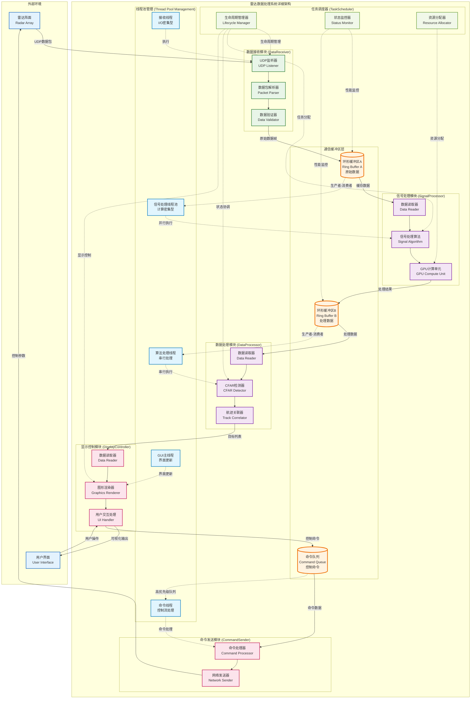
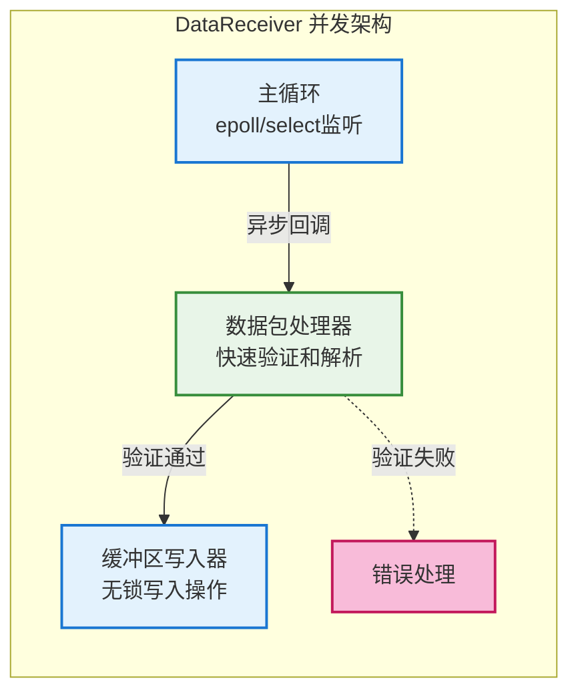
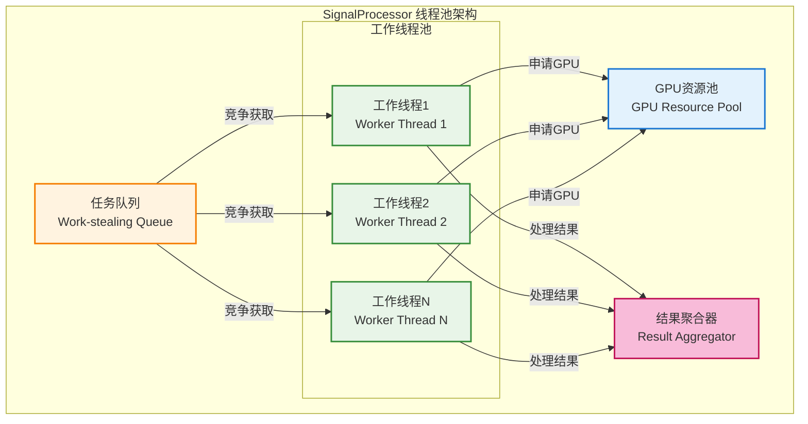
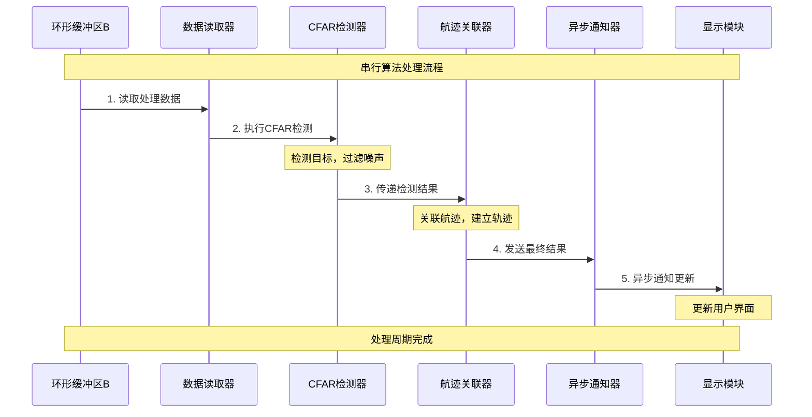
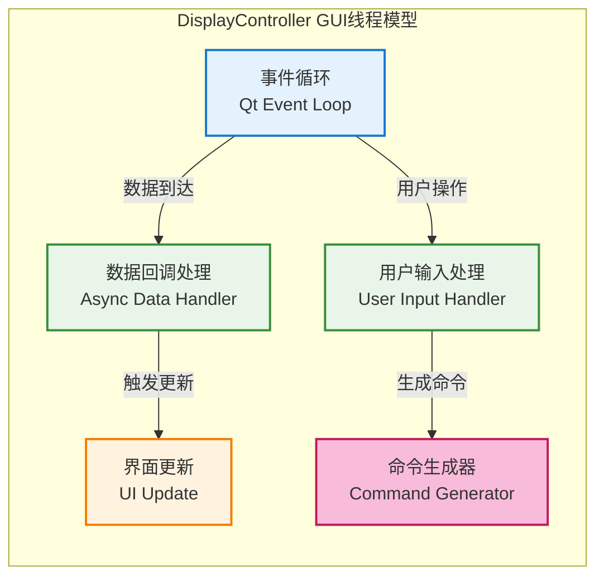
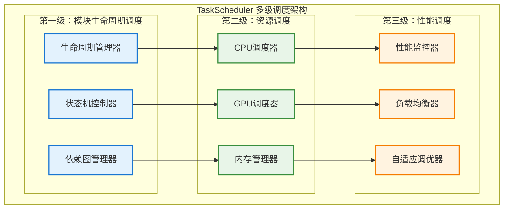
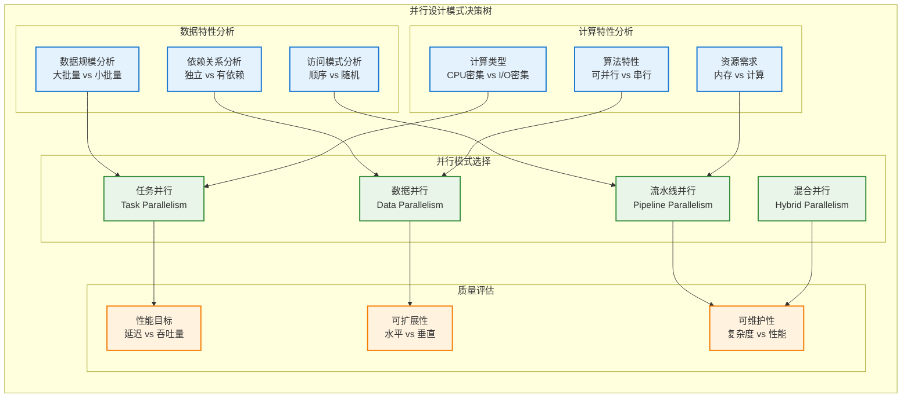
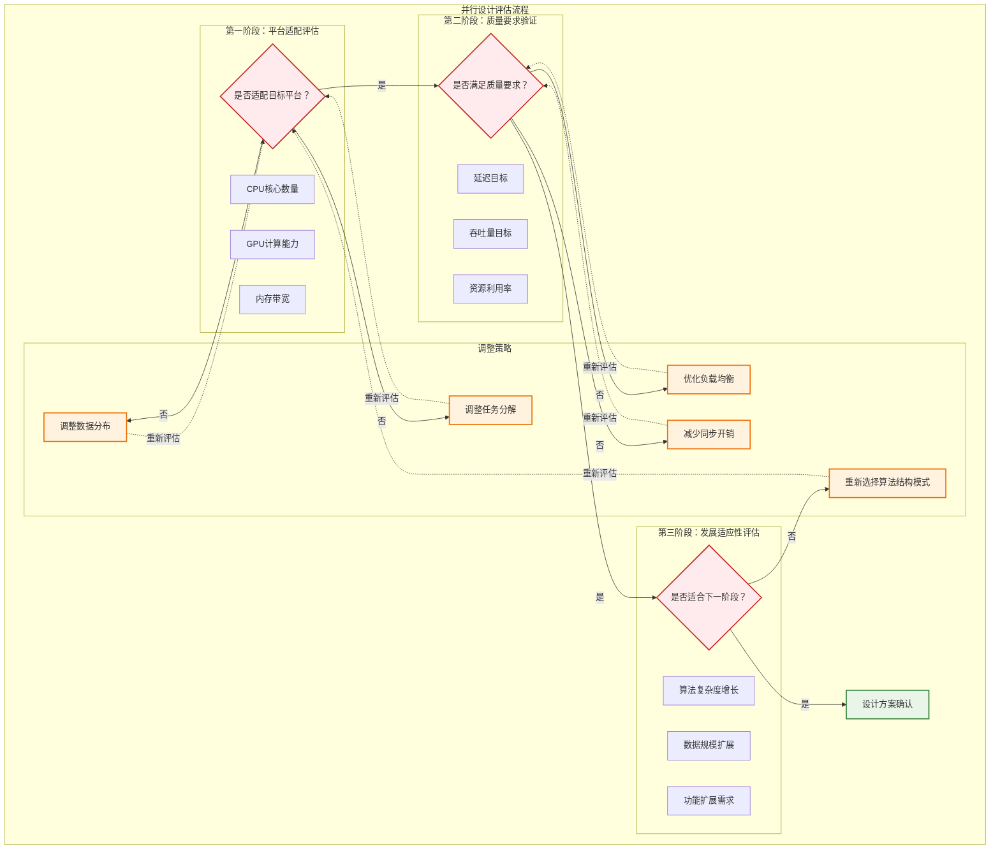
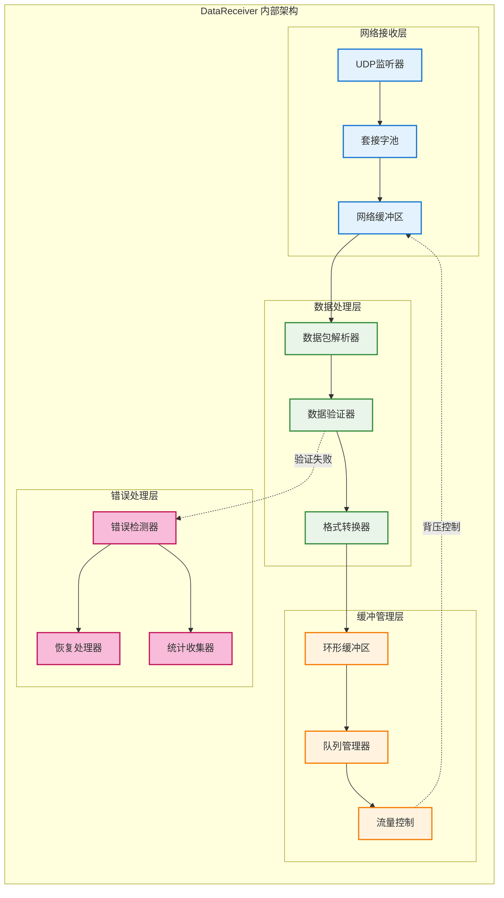
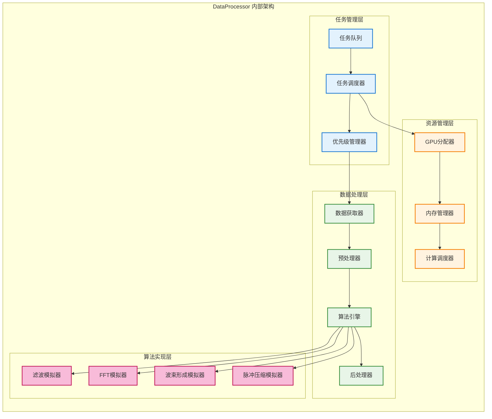

# 基于GPU的相控阵雷达数据处理系统 - 最小可行系统 (MVP) 设计文档

- **标题**: 基于GPU的相控阵雷达数据处理系统 - 最小可行系统 (MVP) 设计文档
- **当前版本**: v1.1.0
- **最后更新**: 2025-09-22
- **负责人**: Klein

---

## 概述

本文档定义了基于GPU的相控阵雷达数据处理系统的最小可行产品（MVP）设计方案，重点验证系统架构的可行性，建立统一的技术基础，并为团队成员提供一致的系统理解和开发标准。文档专注于MVP阶段的核心功能实现，包括数据流转验证、任务调度机制、线程管理策略和模块接口定义。

---

## 快速导航

- [引言](#引言)
- [系统概述](#系统概述)
- [核心设计原则](#核心设计原则)
- [目录结构与组织](#目录结构与组织)
- [核心模块设计](#核心模块设计)
- [数据流设计](#数据流设计)
- [任务调度与线程管理](#任务调度与线程管理)
- [技术选型](#技术选型)
- [非功能需求](#非功能需求)
- [风险和挑战](#风险和挑战)
- [下一步计划](#下一步计划)
- [附录](#附录)

---

## 1. 引言

### 1.1 目的

本文档旨在定义**基于GPU的相控阵雷达数据处理系统**的**最小可行产品（MVP）**设计方案，为项目初期开发提供明确的技术指导和架构蓝图。

#### 文档目标
- **验证系统架构的可行性**：通过MVP验证任务调度、数据流转和模块间通信机制的有效性
- **建立统一的技术基础**：为团队成员提供一致的系统理解和开发标准
- **降低项目风险**：在投入大量资源进行复杂算法开发前，先验证核心架构设计

#### 文档范围
本文档专注于MVP阶段的设计，具体包括：
- **数据流转验证**：从数据输入到输出的完整流程
- **任务调度机制**：各模块的生命周期管理和执行协调
- **线程管理策略**：多线程环境下的资源调度和同步
- **模块接口定义**：标准化的模块间通信协议

**明确排除的内容**：
- 复杂的雷达信号处理算法实现
- 详细的GPU计算优化策略
- 完整的错误恢复和容错机制
- 生产环境的部署和运维细节

### 1.2 背景

#### 项目背景
现代相控阵雷达系统产生的数据量呈指数级增长，传统的CPU处理方式已无法满足实时性和吞吐量要求。本项目旨在构建一个基于GPU加速的高性能数据处理系统，以应对海量雷达数据的实时处理挑战。

#### 技术挑战
- **模块化开发**：团队首次采用完全模块化的架构设计，需要验证模块间协作的有效性
- **异构计算**：CPU和GPU协同工作的资源调度和数据传输机制
- **实时性要求**：数据处理的低延迟和高吞吐量需求
- **系统复杂性**：多模块、多线程环境下的任务调度和状态管理

#### MVP策略选择
考虑到项目的技术复杂性和团队经验，采用MVP开发策略具有以下优势：
- **快速验证**：在短时间内构建可运行的系统原型
- **风险控制**：及早发现架构设计问题，降低后期重构成本
- **迭代基础**：为后续功能扩展提供稳定的架构基础
- **团队协作**：建立统一的开发标准和协作模式

### 1.3 术语和缩略语

#### 系统架构相关
| 术语/缩略语  | 英文全称               | 中文解释                                               |
| ------------ | ---------------------- | ------------------------------------------------------ |
| **MVP**      | Minimum Viable Product | 最小可行产品，用最少资源构建的可验证核心功能的产品原型 |
| **模块化**   | Modularization         | 将复杂系统拆分为多个高内聚、低耦合的独立功能单元       |
| **任务调度** | Task Scheduling        | 管理和协调系统中各个任务的执行顺序、资源分配和生命周期 |
| **数据流**   | Data Flow              | 数据在系统各模块间的传输路径和处理过程                 |
| **接口**     | Interface              | 模块间通信的标准化协议和方法定义                       |

#### 雷达技术相关
| 术语/缩略语    | 英文全称            | 中文解释                                               |
| -------------- | ------------------- | ------------------------------------------------------ |
| **相控阵雷达** | Phased Array Radar  | 通过电子方式控制天线波束指向的先进雷达系统             |
| **阵面**       | Array Face          | 雷达天线阵列的物理面，通常有多个阵面组成完整雷达       |
| **波束形成**   | Beamforming         | 通过调整各阵元信号的相位和幅度来形成特定方向波束的技术 |
| **脉冲压缩**   | Pulse Compression   | 提高雷达距离分辨率的信号处理技术                       |
| **显控**       | Display and Control | 雷达数据显示和系统控制的人机交互界面                   |

#### 计算技术相关
| 术语/缩略语 | 英文全称                                  | 中文解释                                     |
| ----------- | ----------------------------------------- | -------------------------------------------- |
| **GPU**     | Graphics Processing Unit                  | 图形处理器，具有强大并行计算能力的硬件设备   |
| **CUDA**    | Compute Unified Device Architecture       | NVIDIA的并行计算平台和编程模型               |
| **PCIe**    | Peripheral Component Interconnect Express | 高速串行扩展总线标准，用于CPU与GPU间数据传输 |
| **线程池**  | Thread Pool                               | 预先创建的工作线程集合，用于执行异步任务     |
| **队列**    | Queue                                     | 先进先出的数据结构，用于模块间数据缓存和传输 |

#### 软件工程相关
| 术语/缩略语  | 英文全称                          | 中文解释                                   |
| ------------ | --------------------------------- | ------------------------------------------ |
| **API**      | Application Programming Interface | 应用程序编程接口，定义软件组件间的交互方式 |
| **异步处理** | Asynchronous Processing           | 不阻塞主线程的并发处理方式                 |
| **生命周期** | Lifecycle                         | 模块从初始化到销毁的完整过程               |
| **回调函数** | Callback Function                 | 在特定事件发生时被调用的函数               |
| **线程安全** | Thread Safety                     | 多线程环境下数据和操作的安全性保证         |

#### 性能和监控相关
| 术语/缩略语  | 英文全称               | 中文解释                         |
| ------------ | ---------------------- | -------------------------------- |
| **吞吐量**   | Throughput             | 单位时间内系统处理的数据量       |
| **延迟**     | Latency                | 从数据输入到输出结果的时间间隔   |
| **带宽**     | Bandwidth              | 数据传输通道的最大数据传输速率   |
| **负载均衡** | Load Balancing         | 在多个处理单元间合理分配工作负载 |
| **性能监控** | Performance Monitoring | 实时跟踪系统运行状态和性能指标   |

## 2. 系统概述

### 2.1 系统架构总览

本系统采用分层模块化架构，通过详细的组件架构与通信机制图展示了数据流向、线程调度关系和系统的核心处理流程，重点关注**数据如何在系统中流转**、**调度器如何协调各模块**以及**并发设计模式的实现**。

#### 2.1.1 详细组件架构与通信机制图

该图详细展示了每个模块的内部组件、模块间的通信机制（缓冲区、队列）、数据流/控制流的具体实现以及线程和任务调度的并发设计模式：



**关键并发设计模式说明**：

1. **生产者-消费者模式**：
   - **环形缓冲区A**：数据接收线程（生产者）→ 信号处理线程池（多消费者）
   - **环形缓冲区B**：信号处理线程池（多生产者）→ 算法处理线程（单消费者）
   - **优势**：解耦模块、平滑流量波动、支持并行处理

2. **线程池模式**：
   - **信号处理线程池**：处理可并行的信号算法，充分利用多核CPU
   - **工作窃取算法**：线程池中的工作线程竞争获取任务，自然实现负载均衡
   - **GPU资源池**：管理GPU计算资源，避免资源竞争

3. **优先级调度模式**：
   - **命令队列**：高优先级、低延迟的控制命令通道
   - **与数据流隔离**：避免控制命令被阻塞在数据处理流程中
   - **抢占式调度**：关键控制命令可以抢占当前执行的低优先级任务

4. **管道-过滤器模式**：
   - **数据处理管道**：数据接收 → 信号处理 → 算法处理 → 显示输出
   - **阶段性处理**：每个阶段独立处理，便于调试和优化
   - **流水线并行**：不同阶段可以并行处理不同批次的数据

#### 2.1.2 模块接口调用架构图

为了清晰展示模块间的接口依赖和调用关系，将架构图分解为总体架构图和多个详细图。

##### 2.1.2.1 总体接口架构图

该图展示了系统的整体接口层次和主要模块的组织关系：


##### 2.1.2.2 数据接收模块接口图


##### 2.1.2.3 数据处理模块接口图


##### 2.1.2.4 数据可视化模块接口图


##### 2.1.2.5 任务调度器接口图


### 2.2 主要模块说明与并发设计

基于上述详细架构图，以下详细说明各核心模块的功能职责、交互关系以及并发设计模式的实现：

#### 2.2.1 数据接收模块 (DataReceiver) - I/O密集型线程模式

**核心职责与并发设计**：
- 从雷达阵面接收UDP数据包，采用**单线程异步I/O模式**
- 验证数据包的完整性和有效性，使用**流水线验证机制**
- 将原始数据放入环形缓冲区，实现**高效的生产者模式**

**线程模型与调度策略**：


**关键设计决策**：
- **单线程设计原因**：I/O密集型任务，多线程并不能提升性能，反而增加同步开销
- **异步I/O优势**：非阻塞操作，高并发连接处理能力
- **无锁环形缓冲区**：使用原子操作实现无锁写入，避免锁竞争

**与其他模块的交互**：
- **被任务调度器调度**：接收启动、停止、状态查询等控制指令
- **向信号处理模块提供数据**：通过线程安全的环形缓冲区传递原始数据包
- **使用配置管理器**：获取网络配置参数（IP地址、端口等）
- **调用日志服务**：记录接收状态和错误信息

#### 2.2.2 信号处理模块 (SignalProcessor) - 计算密集型线程池模式

**核心职责与并发设计**：
- 从环形缓冲区A获取原始数据，采用**多消费者竞争模式**
- 执行可并行的信号处理算法，使用**工作窃取线程池**
- 将处理结果放入环形缓冲区B，实现**多生产者协作模式**

**线程池架构与负载均衡**：


**并发优化策略**：
- **工作窃取算法**：空闲线程可以从其他线程的队列中窃取任务，提高CPU利用率
- **GPU资源池管理**：统一管理GPU资源，避免资源竞争和死锁
- **数据局部性优化**：任务分配考虑数据在内存中的位置，提高缓存命中率
- **批处理优化**：将小任务合并为大任务，减少GPU kernel启动开销

#### 2.2.3 数据处理模块 (DataProcessor) - 串行算法处理模式

**核心职责与并发设计**：
- 从环形缓冲区B获取信号处理结果，采用**单消费者模式**
- 执行有时序依赖的算法（CFAR检测、航迹关联），使用**单线程串行处理**
- 将最终结果通过异步通知发送给显示模块

**算法处理流水线**：


**设计原理说明**：
- **单线程处理原因**：CFAR检测和航迹关联算法有强时序依赖，并行化复杂且收益有限
- **流水线设计**：虽然单线程，但可以与其他模块形成流水线并行
- **异步通知机制**：避免阻塞显示线程，保证界面响应性

#### 2.2.4 显示控制模块 (DisplayController) - GUI主线程模式

**核心职责与并发设计**：
- 运行在GUI主线程中，负责用户界面更新和用户交互
- 通过异步回调接收处理结果，避免阻塞界面
- 处理用户输入并生成控制命令

**GUI线程并发模型**：


#### 2.2.5 任务调度器 (TaskScheduler) - 系统协调者模式

**核心职责与并发设计**：
- 管理所有模块的生命周期，采用**状态机模式**
- 协调模块间的执行顺序，使用**依赖图调度**
- 分配系统资源和线程，实现**资源池管理**

**多级调度架构**：


**关键并发设计模式总结**：

| 模块                  | 并发模式       | 线程策略    | 同步机制       | 性能特点           |
| --------------------- | -------------- | ----------- | -------------- | ------------------ |
| **DataReceiver**      | 单线程异步I/O  | 专用I/O线程 | 无锁环形缓冲区 | 高并发、低延迟     |
| **SignalProcessor**   | 工作窃取线程池 | 多工作线程  | GPU资源池      | 高吞吐、负载均衡   |
| **DataProcessor**     | 串行流水线     | 单算法线程  | 异步通知       | 时序保证、简化设计 |
| **DisplayController** | GUI事件循环    | 主界面线程  | 异步回调       | 界面响应、用户体验 |
| **TaskScheduler**     | 多级调度       | 管理线程    | 状态同步       | 系统协调、资源优化 |

### 2.3 核心接口与数据结构设计

为支持上述模块化架构和并发设计，系统定义了统一的接口规范和数据结构。这些设计遵循现代C++最佳实践，确保类型安全、性能优化和易于维护。

#### 2.3.1 模块接口层次体系

**基础接口定义**：
```cpp
// 基础模块接口 - 所有模块必须实现
class IModule {
public:
    virtual ~IModule() = default;
    virtual ErrorCode Initialize(const Config& config) = 0;
    virtual ErrorCode Start() = 0;
    virtual ErrorCode Stop() = 0;
    virtual ModuleStatus GetStatus() const = 0;
    virtual std::string GetModuleName() const = 0;
};

// 可调度模块接口 - 支持任务调度的模块
class ISchedulable : public IModule {
public:
    virtual ErrorCode SetPriority(int priority) = 0;
    virtual int GetPriority() const = 0;
    virtual bool CanPreempt() const = 0;
    virtual void OnResourceAvailable(ResourceType type) = 0;
};

// 数据源接口 - 生产数据的模块
template<typename DataType>
class IDataSource {
public:
    virtual ~IDataSource() = default;
    virtual bool HasData() const = 0;
    virtual std::optional<DataType> GetData() = 0;
    virtual void RegisterConsumer(std::weak_ptr<IDataConsumer<DataType>> consumer) = 0;
    virtual size_t GetQueueSize() const = 0;
};

// 数据消费者接口 - 消费数据的模块
template<typename DataType>
class IDataConsumer {
public:
    virtual ~IDataConsumer() = default;
    virtual void ConsumeData(const DataType& data) = 0;
    virtual bool CanAcceptData() const = 0;
    virtual size_t GetCapacity() const = 0;
};
```

**具体实现示例**：
```cpp
// 数据接收模块实现
class DataReceiver : public ISchedulable, public IDataSource<RawDataPacket> {
private:
    std::unique_ptr<UDPSocket> socket_;
    std::unique_ptr<PacketValidator> validator_;
    LockFreeRingBuffer<RawDataPacket> output_buffer_;
    std::atomic<bool> running_{false};

public:
    ErrorCode Initialize(const Config& config) override;
    ErrorCode Start() override;
    ErrorCode Stop() override;

    // IDataSource implementation
    bool HasData() const override { return !output_buffer_.empty(); }
    std::optional<RawDataPacket> GetData() override;
    void RegisterConsumer(std::weak_ptr<IDataConsumer<RawDataPacket>> consumer) override;

private:
    void ProcessIncomingData();
    bool ValidatePacket(const RawDataPacket& packet) const;
};
```

#### 2.3.2 高性能数据结构

**线程安全的环形缓冲区**：
```cpp
template<typename T, size_t Capacity>
class LockFreeRingBuffer {
private:
    alignas(64) std::array<T, Capacity> buffer_;
    alignas(64) std::atomic<size_t> head_{0};  // 生产者位置
    alignas(64) std::atomic<size_t> tail_{0};  // 消费者位置

public:
    bool try_push(const T& item) {
        const size_t current_head = head_.load(std::memory_order_relaxed);
        const size_t next_head = (current_head + 1) % Capacity;

        if (next_head == tail_.load(std::memory_order_acquire)) {
            return false; // 缓冲区满
        }

        buffer_[current_head] = item;
        head_.store(next_head, std::memory_order_release);
        return true;
    }

    bool try_pop(T& item) {
        const size_t current_tail = tail_.load(std::memory_order_relaxed);
        if (current_tail == head_.load(std::memory_order_acquire)) {
            return false; // 缓冲区空
        }

        item = buffer_[current_tail];
        tail_.store((current_tail + 1) % Capacity, std::memory_order_release);
        return true;
    }

    size_t size() const {
        const size_t h = head_.load(std::memory_order_acquire);
        const size_t t = tail_.load(std::memory_order_acquire);
        return h >= t ? h - t : Capacity - t + h;
    }

    bool empty() const { return head_.load() == tail_.load(); }
    bool full() const { return ((head_.load() + 1) % Capacity) == tail_.load(); }
};
```

**核心数据类型定义**：
```cpp
// 原始数据包结构
struct RawDataPacket {
    struct Header {
        uint32_t magic_number;      // 魔术数字，用于验证
        uint32_t sequence_number;   // 序列号
        uint16_t packet_size;       // 数据包大小
        uint16_t checksum;          // 校验和
        uint64_t timestamp_us;      // 时间戳（微秒）
        uint8_t  array_id;          // 阵面ID
        uint8_t  reserved[7];       // 保留字段
    } __attribute__((packed));

    Header header;
    AlignedVector<ComplexFloat> iq_data;  // I/Q数据

    bool IsValid() const {
        return header.magic_number == 0xDEADBEEF &&
               VerifyChecksum() &&
               !iq_data.empty();
    }

private:
    bool VerifyChecksum() const;
};

// 处理结果数据结构
struct ProcessedData {
    uint64_t timestamp_us;
    uint32_t source_sequence;
    ProcessingStatus status;

    // 处理结果
    AlignedVector<float> filtered_data;      // 滤波数据
    AlignedVector<ComplexFloat> fft_result;  // FFT结果
    std::vector<DetectedTarget> targets;     // 检测目标

    // 性能统计
    ProcessingMetrics metrics;
    QualityIndicators quality;
};

// GPU对齐的向量类型
template<typename T>
using AlignedVector = std::vector<T, AlignedAllocator<T, 32>>;

// 复数类型定义
using ComplexFloat = std::complex<float>;
using ComplexDouble = std::complex<double>;
```

#### 2.3.3 工厂模式与依赖注入

**模块工厂设计**：
```cpp
class ModuleFactory {
public:
    template<typename ModuleType, typename... Args>
    static std::unique_ptr<ModuleType> CreateModule(const std::string& name, Args&&... args) {
        auto module = std::make_unique<ModuleType>(std::forward<Args>(args)...);
        RegisterModule(name, module.get());
        return module;
    }

    static IModule* GetModule(const std::string& name) {
        auto it = module_registry_.find(name);
        return it != module_registry_.end() ? it->second : nullptr;
    }

private:
    static std::unordered_map<std::string, IModule*> module_registry_;
    static void RegisterModule(const std::string& name, IModule* module);
};

// 依赖注入容器
class DependencyContainer {
public:
    template<typename Interface, typename Implementation>
    void RegisterSingleton() {
        auto instance = std::make_shared<Implementation>();
        singletons_[typeid(Interface).name()] = instance;
    }

    template<typename Interface>
    std::shared_ptr<Interface> Resolve() {
        const auto& type_name = typeid(Interface).name();
        auto it = singletons_.find(type_name);
        if (it != singletons_.end()) {
            return std::static_pointer_cast<Interface>(it->second);
        }
        return nullptr;
    }

private:
    std::unordered_map<std::string, std::shared_ptr<void>> singletons_;
};
```

#### 2.3.4 错误处理与结果类型

**错误代码和结果包装**：
```cpp
// 错误代码枚举
enum class ErrorCode : int {
    SUCCESS = 0,

    // 系统级错误 (1-99)
    SYSTEM_ERROR = 1,
    MEMORY_ALLOCATION_FAILED = 2,
    THREAD_CREATION_FAILED = 3,

    // 网络错误 (100-199)
    NETWORK_ERROR = 100,
    UDP_SOCKET_ERROR = 101,
    PACKET_VALIDATION_FAILED = 102,

    // GPU错误 (200-299)
    GPU_ERROR = 200,
    CUDA_INITIALIZATION_FAILED = 201,
    GPU_MEMORY_ALLOCATION_FAILED = 202,

    // 模块错误 (300-399)
    MODULE_ERROR = 300,
    MODULE_INITIALIZATION_FAILED = 301,
    MODULE_START_FAILED = 302
};

// 结果包装类型
template<typename T>
class Result {
private:
    std::variant<T, ErrorCode> data_;

public:
    explicit Result(T&& value) : data_(std::move(value)) {}
    explicit Result(ErrorCode error) : data_(error) {}

    bool IsSuccess() const { return std::holds_alternative<T>(data_); }
    bool IsError() const { return std::holds_alternative<ErrorCode>(data_); }

    const T& Value() const {
        if (!IsSuccess()) throw std::runtime_error("Accessing value of failed result");
        return std::get<T>(data_);
    }

    ErrorCode Error() const {
        if (!IsError()) throw std::runtime_error("Accessing error of successful result");
        return std::get<ErrorCode>(data_);
    }

    // 支持函数式编程风格
    template<typename F>
    auto Map(F&& func) -> Result<std::invoke_result_t<F, T>> {
        if (IsSuccess()) {
            return Result<std::invoke_result_t<F, T>>(func(Value()));
        } else {
            return Result<std::invoke_result_t<F, T>>(Error());
        }
    }
};
```

这种接口和数据结构设计具有以下优势：

**类型安全**：使用模板和强类型确保编译时类型检查
**性能优化**：内存对齐、无锁数据结构、零拷贝设计
**可维护性**：清晰的接口分离、依赖注入、错误处理
**可扩展性**：工厂模式、模板设计、函数式编程风格

---

## 3. 核心设计原则

本MVP系统的设计遵循以下核心原则，确保系统的可靠性、可扩展性和可维护性：

### 3.1 设计原则概览


### 3.2 具体设计指导

#### 3.2.1 简化优先原则

**实施策略**：


**具体体现**：
- **算法实现**：使用模拟算法代替复杂的信号处理算法
- **用户界面**：提供基础的图表显示，暂不实现复杂的用户交互
- **配置管理**：使用简单的YAML配置文件，暂不支持动态配置界面
- **错误处理**：实现基础的错误日志，暂不实现复杂的错误恢复机制

#### 3.2.2 模块化架构原则

**架构分层策略**：


**接口设计原则**：
- **统一接口规范**：所有模块实现相同的生命周期接口（Initialize、Start、Stop）
- **依赖注入**：通过接口依赖而非具体实现，便于测试和替换
- **单一职责**：每个模块只负责一个明确的功能领域
- **开闭原则**：对扩展开放，对修改封闭

#### 3.2.3 线程安全原则

**线程安全策略图**：


**关键技术实现**：
- **无锁数据结构**：使用原子操作的环形缓冲区
- **读写锁**：多读单写的共享数据访问
- **线程局部存储**：避免全局状态的并发访问
- **生产者-消费者模式**：通过队列解耦线程间的直接交互

#### 3.2.4 可观测性原则

**监控体系架构**：


**监控指标定义**：
- **性能指标**：处理延迟、吞吐量、资源使用率
- **质量指标**：数据完整性、处理准确性、系统可用性
- **业务指标**：数据包接收率、处理成功率、错误率

#### 3.2.6 并行设计模式原则

**并行架构选择策略**：
针对雷达数据处理系统的特点，本系统采用多种并行设计模式的组合，以最大化系统性能和可维护性。



**具体模式应用与决策rationale**：

| 模块/组件             | 并行模式            | 选择理由                  | 性能特点           | 适用场景     |
| --------------------- | ------------------- | ------------------------- | ------------------ | ------------ |
| **DataReceiver**      | I/O复用 + 单线程    | I/O密集型，网络延迟是瓶颈 | 低延迟，高并发连接 | 网络数据接收 |
| **SignalProcessor**   | 数据并行 + 任务并行 | 算法可并行，数据独立性好  | 高吞吐量，CPU密集  | 信号处理算法 |
| **DataProcessor**     | 流水线并行          | 算法间有依赖，但可流水线  | 平衡延迟和吞吐量   | 串行算法处理 |
| **DisplayController** | 事件驱动 + 异步更新 | UI响应性要求高            | 低延迟响应         | 用户界面更新 |
| **TaskScheduler**     | 生产者-消费者       | 任务管理和资源调度        | 系统协调性         | 系统管理     |

**设计评估的决策流程**：



**关键决策准则总结**：

1. **平台适配性评估**：
   - **CPU核心数评估**：线程数不超过核心数的1.5倍，避免过度上下文切换
   - **内存带宽考量**：数据并行度受内存带宽限制，需要合理分配
   - **GPU计算能力**：根据GPU架构选择合适的并行粒度

2. **质量要求验证**：
   - **延迟优先**：选择流水线模式，减少同步点
   - **吞吐量优先**：选择数据并行模式，最大化并发度
   - **资源效率**：选择混合模式，平衡各种资源使用

3. **发展适应性考虑**：
   - **算法演进**：为复杂算法预留并行化空间
   - **数据规模增长**：设计可水平扩展的并行架构
   - **功能扩展**：保持模块间低耦合，便于独立优化

**总结：设计评估的决策流程**
- **是否适配目标平台？** → 若否，调整数据分布或任务分解
- **是否满足质量要求？** → 若否，优化负载均衡或减少同步开销
- **是否适合下一阶段？** → 若否，重新选择算法结构模式（如从任务并行转为流水线）

这种系统化的并行设计评估流程确保了架构选择的科学性和前瞻性，为MVP系统的成功实施和后续演进奠定了坚实基础。

---

## 4. 目录结构与组织

基于上述架构设计和模块化原则，推荐的项目目录结构如下，这个结构支持模块化开发、便于维护和扩展：

### 4.1 完整项目目录结构

```txt
radar_mvp/
├── CMakeLists.txt                      # 根CMake配置文件
├── README.md                           # 项目说明文档
├── vcpkg.json                          # vcpkg依赖配置
├── vcpkg-configuration.json            # vcpkg配置信息
│
├── configs/                            # 配置文件目录
│   ├── config.yaml                     # 主配置文件
│   ├── network_config.yaml             # 网络配置
│   ├── gpu_config.yaml                 # GPU配置
│   └── logging_config.yaml             # 日志配置
│
├── include/                            # 头文件目录
│   ├── common/                         # 公共头文件
│   │   ├── types.h                     # 核心数据类型定义
│   │   ├── error_codes.h               # 错误代码定义
│   │   ├── interfaces.h                # 接口定义
│   │   ├── config_manager.h            # 配置管理器
│   │   ├── logger.h                    # 日志系统
│   │   └── performance_monitor.h       # 性能监控
│   │
│   ├── application/                    # 应用层头文件
│   │   └── radar_application.h         # 主应用类
│   │
│   └── modules/                        # 模块头文件
│       ├── data_receiver.h             # 数据接收模块
│       ├── data_processor.h            # 数据处理模块
│       ├── display_controller.h        # 显示控制模块
│       ├── task_scheduler.h            # 任务调度器
│       │
│       ├── data_receiver/              # 数据接收子模块
│       │   ├── data_receiver_base.h
│       │   ├── data_receiver_factory.h
│       │   ├── data_receiver_implementations.h
│       │   ├── data_receiver_statistics.h
│       │   ├── hardware_receiver.h
│       │   ├── simulation_receiver.h
│       │   └── README.md
│       │
│       ├── data_processor/             # 数据处理子模块
│       │   ├── algorithm_interface.h
│       │   ├── signal_processor.h
│       │   ├── gpu_manager.h
│       │   └── algorithm_simulator.h
│       │
│       ├── display_controller/         # 显示控制子模块
│       │   ├── display_controller_base.h
│       │   ├── display_controller_factory.h
│       │   ├── display_controller_implementations.h
│       │   ├── display_controller_statistics.h
│       │   ├── chart_renderer.h
│       │   └── ui_manager.h
│       │
│       └── task_scheduler/             # 任务调度子模块
│           ├── task_scheduler_factory.h
│           ├── task_scheduler_implementations.h
│           ├── task_scheduler_interfaces.h
│           ├── task_scheduler_types.h
│           ├── thread_pool_manager.h
│           └── resource_allocator.h
│
├── src/                                # 源代码目录
│   ├── main.cpp                        # 主程序入口
│   │
│   ├── application/                    # 应用层实现
│   │   └── radar_application.cpp       # 主应用实现
│   │
│   ├── common/                         # 公共模块实现
│   │   ├── config_manager.cpp          # 配置管理器实现
│   │   ├── error_codes.cpp             # 错误代码实现
│   │   ├── logger.cpp                  # 日志系统实现
│   │   └── performance_monitor.cpp     # 性能监控实现
│   │
│   └── modules/                        # 模块实现
│       ├── data_receiver/              # 数据接收模块实现
│       │   ├── data_receiver.cpp
│       │   ├── udp_socket.cpp
│       │   ├── packet_validator.cpp
│       │   └── data_buffer.cpp
│       │
│       ├── data_processor/             # 数据处理模块实现
│       │   ├── data_processor.cpp
│       │   ├── signal_processor.cpp
│       │   ├── gpu_manager.cpp
│       │   └── algorithm_simulator.cpp
│       │
│       ├── display_controller/         # 显示控制模块实现
│       │   ├── display_controller.cpp
│       │   ├── chart_renderer.cpp
│       │   ├── ui_manager.cpp
│       │   └── qt_widgets/
│       │       ├── main_window.cpp
│       │       ├── data_chart_widget.cpp
│       │       └── status_panel_widget.cpp
│       │
│       └── task_scheduler/             # 任务调度模块实现
│           ├── task_scheduler.cpp
│           ├── thread_pool_manager.cpp
│           ├── resource_allocator.cpp
│           └── priority_queue.cpp
│
├── tests/                              # 测试目录
│   ├── unit_tests/                     # 单元测试
│   │   ├── common/                     # 公共模块测试
│   │   │   ├── config_manager_test.cpp
│   │   │   ├── logger_test.cpp
│   │   │   └── performance_monitor_test.cpp
│   │   │
│   │   ├── data_receiver/              # 数据接收模块测试
│   │   │   ├── data_receiver_test.cpp
│   │   │   ├── udp_socket_test.cpp
│   │   │   └── packet_validator_test.cpp
│   │   │
│   │   ├── data_processor/             # 数据处理模块测试
│   │   │   ├── data_processor_test.cpp
│   │   │   ├── gpu_manager_test.cpp
│   │   │   └── algorithm_simulator_test.cpp
│   │   │
│   │   ├── display_controller/         # 显示控制模块测试
│   │   │   └── display_controller_test.cpp
│   │   │
│   │   └── task_scheduler/             # 任务调度模块测试
│   │       ├── task_scheduler_test.cpp
│   │       └── thread_pool_test.cpp
│   │
│   ├── integration_tests/              # 集成测试
│   │   ├── data_flow_test.cpp          # 数据流集成测试
│   │   ├── module_integration_test.cpp # 模块集成测试
│   │   └── system_integration_test.cpp # 系统集成测试
│   │
│   ├── performance_tests/              # 性能测试
│   │   ├── throughput_test.cpp         # 吞吐量测试
│   │   ├── latency_test.cpp            # 延迟测试
│   │   └── stress_test.cpp             # 压力测试
│   │
│   └── test_data/                      # 测试数据
│       ├── sample_packets/             # 示例数据包
│       ├── reference_results/          # 参考结果
│       └── performance_baselines/      # 性能基准
│
├── third_party/                        # 第三方库（Git Submodules）
│   ├── CMakeLists.txt                  # 第三方库构建配置
│   ├── spdlog/                         # 日志库
│   ├── yaml-cpp/                       # YAML解析库
│   ├── googletest/                     # 测试框架
│   └── boost/                          # Boost库（可选）
│
├── scripts/                            # 构建和工具脚本
│   ├── build_windows.ps1               # Windows构建脚本
│   ├── build_linux.sh                  # Linux构建脚本
│   ├── setup_dependencies.ps1          # 依赖安装脚本
│   ├── run_tests.ps1                   # 测试运行脚本
│   ├── generate_docs.ps1               # 文档生成脚本
│   └── deploy.ps1                      # 部署脚本
│
├── build/                              # 构建输出目录（gitignore）
│   ├── Debug/                          # Debug构建
│   ├── Release/                        # Release构建
│   └── Testing/                        # 测试构建
│
├── docs/                               # 项目文档
│   ├── api/                            # API文档
│   ├── design/                         # 设计文档
│   ├── user_guide/                     # 用户指南
│   └── developer_guide/                # 开发者指南
│
├── tools/                              # 开发工具
│   ├── code_generator/                 # 代码生成工具
│   ├── performance_analyzer/           # 性能分析工具
│   └── configuration_editor/           # 配置编辑工具
│
├── resources/                          # 资源文件
│   ├── icons/                          # 图标资源
│   ├── ui/                             # UI资源文件
│   └── shaders/                        # GPU着色器（如需要）
│
└── logs/                               # 日志输出目录（gitignore）
    ├── application.log                 # 应用日志
    ├── performance.log                 # 性能日志
    └── error.log                       # 错误日志
```

### 4.2 目录设计原则

**分层组织原则**：
- **include/** 和 **src/** 分离：头文件和实现文件分开，便于接口管理
- **模块化目录**：每个模块有独立的子目录，支持并行开发
- **测试目录镜像**：测试目录结构镜像源代码结构，便于定位

**构建支持原则**：
- **CMake分层**：根目录、子模块、第三方库都有独立的CMake配置
- **依赖管理**：使用vcpkg管理第三方依赖，确保构建一致性
- **输出分离**：构建输出与源代码分离，保持源码目录整洁

**开发效率原则**：
- **脚本自动化**：提供构建、测试、部署的自动化脚本
- **文档齐全**：每个模块都有对应的README和设计文档
- **工具支持**：提供代码生成、性能分析等开发工具

### 4.3 关键文件说明

**根配置文件**：
- **CMakeLists.txt**：主构建配置，定义全局编译选项和子项目
- **vcpkg.json**：依赖包配置，确保第三方库版本一致性
- **README.md**：项目概述和快速入门指南

**核心头文件**：
- **types.h**：系统核心数据类型，如ComplexFloat、AlignedVector等
- **interfaces.h**：模块接口定义，如IModule、IDataSource等
- **error_codes.h**：统一错误代码定义和处理机制

**构建脚本**：
- **build_windows.ps1**：Windows平台一键构建脚本
- **setup_dependencies.ps1**：自动安装和配置依赖库
- **run_tests.ps1**：自动化测试执行和报告生成

这种目录结构设计支持：
- **模块化开发**：每个模块独立开发和测试
- **并行构建**：支持多核并行编译
- **持续集成**：便于CI/CD流水线集成
- **版本管理**：清晰的文件组织便于版本控制
- **团队协作**：标准化的目录结构降低学习成本

---

## 5. 核心模块设计

本章详细描述系统中各核心模块的设计方案，包括模块的功能定义、内部架构、接口设计和实现策略。

### 5.1 数据接收模块

数据接收模块是整个系统的数据入口，负责从雷达阵面接收UDP数据包并进行初步处理，确保数据的完整性和有效性。

#### 5.1.1 模块功能定义

**主要功能**：
- **网络数据接收**：通过UDP协议接收来自雷达阵面的原始数据包
- **数据完整性验证**：检查数据包的头部信息、校验和、序列号等
- **数据格式转换**：将网络字节序转换为本地字节序，解析数据包结构
- **缓冲区管理**：管理接收缓冲区，处理数据包的暂存和转发
- **错误处理**：识别和处理网络异常、数据丢失、格式错误等情况

**性能要求**：
- **数据吞吐量**：支持每秒接收10,000个数据包
- **延迟控制**：单个数据包处理延迟不超过1毫秒
- **可靠性**：99.9%的数据包接收成功率

#### 5.1.2 模块内部架构



#### 5.1.3 关键接口设计

**对外接口**：
- `Initialize()`: 初始化网络组件和配置参数
- `Start()`: 启动数据接收线程
- `Stop()`: 停止接收并清理资源
- `GetStatus()`: 获取模块运行状态
- `GetStatistics()`: 获取接收统计信息

**配置接口**：
- 网络配置：IP地址、端口号、套接字缓冲区大小
- 性能配置：线程数量、缓冲区大小、超时设置
- 验证配置：数据包格式、校验规则、错误处理策略

### 5.2 数据处理模块

数据处理模块负责对接收到的原始数据进行算法处理。在MVP阶段，重点验证数据流转和任务调度机制，使用模拟算法代替复杂的信号处理算法。

#### 5.2.1 模块功能定义

**主要功能**：
- **数据获取**：从输入队列获取原始雷达数据包
- **预处理**：数据格式标准化、噪声过滤、异常值检测
- **算法模拟**：执行简化的信号处理算法（滤波、变换等）
- **GPU资源管理**：申请和释放GPU计算资源
- **结果输出**：将处理结果放入输出队列

**MVP阶段简化策略**：
- 使用数学变换模拟复杂的雷达算法
- 重点验证数据流和资源调度
- 为后续真实算法集成预留接口

#### 5.2.2 模块内部架构



#### 5.2.3 算法模拟策略

在MVP阶段，采用以下策略模拟真实的雷达信号处理算法：

```mermaid
flowchart LR
    subgraph "算法模拟映射"
        direction LR

        subgraph "真实算法"
            REAL_FILTER[数字滤波]
            REAL_FFT[快速傅里叶变换]
            REAL_BEAM[数字波束形成]
            REAL_COMPRESS[脉冲压缩]
        end

        subgraph "模拟算法"
            SIM_FILTER[加权平均滤波]
            SIM_FFT[离散余弦变换]
            SIM_BEAM[矩阵乘法]
            SIM_COMPRESS[卷积运算]
        end

        REAL_FILTER -.->|简化为| SIM_FILTER
        REAL_FFT -.->|简化为| SIM_FFT
        REAL_BEAM -.->|简化为| SIM_BEAM
        REAL_COMPRESS -.->|简化为| SIM_COMPRESS
    end

    classDef real fill:#ffebee,stroke:#c62828,stroke-width:2px
    classDef sim fill:#e8f5e8,stroke:#388e3c,stroke-width:2px

    class REAL_FILTER,REAL_FFT,REAL_BEAM,REAL_COMPRESS real
    class SIM_FILTER,SIM_FFT,SIM_BEAM,SIM_COMPRESS sim
```

### 5.3 显控接口模块

显控接口模块负责将处理后的数据传输到显示和控制界面，为用户提供直观的数据可视化和系统控制功能。

#### 5.3.1 模块功能定义

**主要功能**：
- **数据可视化**：将处理结果以图表、波形、频谱等形式展示
- **系统监控**：显示系统运行状态、性能指标、资源使用情况
- **用户交互**：提供参数调整、系统控制、配置管理界面
- **报告生成**：生成处理结果报告和系统状态报告

#### 5.3.2 界面架构设计

```mermaid
flowchart TB
    subgraph "显控界面架构"
        direction TB

        subgraph "数据展示区"
            REALTIME_CHART[实时数据图表]
            SPECTRUM_DISPLAY[频谱显示]
            WAVEFORM_VIEWER[波形查看器]
            STATISTICS_PANEL[统计信息面板]
        end

        subgraph "系统监控区"
            STATUS_MONITOR[状态监控器]
            PERFORMANCE_METER[性能仪表]
            RESOURCE_GAUGE[资源使用表]
            ERROR_LOG[错误日志显示]
        end

        subgraph "控制操作区"
            PARAM_CONTROL[参数控制面板]
            SYSTEM_CONTROL[系统控制按钮]
            CONFIG_EDITOR[配置编辑器]
            REPORT_GENERATOR[报告生成器]
        end

        subgraph "数据管理区"
            DATA_BROWSER[数据浏览器]
            FILE_MANAGER[文件管理器]
            EXPORT_TOOL[导出工具]
            BACKUP_MANAGER[备份管理器]
        end
    end

    classDef display fill:#e3f2fd,stroke:#1976d2,stroke-width:2px
    classDef monitor fill:#e8f5e8,stroke:#388e3c,stroke-width:2px
    classDef control fill:#fff3e0,stroke:#f57c00,stroke-width:2px
    classDef data fill:#f8bbd9,stroke:#c2185b,stroke-width:2px

    class REALTIME_CHART,SPECTRUM_DISPLAY,WAVEFORM_VIEWER,STATISTICS_PANEL display
    class STATUS_MONITOR,PERFORMANCE_METER,RESOURCE_GAUGE,ERROR_LOG monitor
    class PARAM_CONTROL,SYSTEM_CONTROL,CONFIG_EDITOR,REPORT_GENERATOR control
    class DATA_BROWSER,FILE_MANAGER,EXPORT_TOOL,BACKUP_MANAGER data
```

### 5.4 配置管理模块

配置管理模块负责系统参数的设置、存储、加载和运行时更新，为整个系统提供统一的配置服务。

#### 5.4.1 配置层次结构

```mermaid
flowchart TB
    subgraph "配置管理层次"
        direction TB

        subgraph "系统级配置"
            SYSTEM_CONFIG[系统基础配置]
            HARDWARE_CONFIG[硬件平台配置]
            SECURITY_CONFIG[安全策略配置]
        end

        subgraph "模块级配置"
            RECEIVER_CONFIG[数据接收配置]
            PROCESSOR_CONFIG[数据处理配置]
            DISPLAY_CONFIG[显示界面配置]
        end

        subgraph "算法级配置"
            FILTER_CONFIG[滤波参数配置]
            FFT_CONFIG[变换参数配置]
            BEAM_CONFIG[波束参数配置]
        end

        subgraph "运行时配置"
            DYNAMIC_PARAMS[动态参数]
            USER_PREFERENCES[用户偏好]
            PERFORMANCE_TUNING[性能调优]
        end

        SYSTEM_CONFIG --> RECEIVER_CONFIG
        SYSTEM_CONFIG --> PROCESSOR_CONFIG
        SYSTEM_CONFIG --> DISPLAY_CONFIG

        PROCESSOR_CONFIG --> FILTER_CONFIG
        PROCESSOR_CONFIG --> FFT_CONFIG
        PROCESSOR_CONFIG --> BEAM_CONFIG
    end

    classDef system fill:#e3f2fd,stroke:#1976d2,stroke-width:2px
    classDef module fill:#e8f5e8,stroke:#388e3c,stroke-width:2px
    classDef algorithm fill:#fff3e0,stroke:#f57c00,stroke-width:2px
    classDef runtime fill:#f8bbd9,stroke:#c2185b,stroke-width:2px

    class SYSTEM_CONFIG,HARDWARE_CONFIG,SECURITY_CONFIG system
    class RECEIVER_CONFIG,PROCESSOR_CONFIG,DISPLAY_CONFIG module
    class FILTER_CONFIG,FFT_CONFIG,BEAM_CONFIG algorithm
    class DYNAMIC_PARAMS,USER_PREFERENCES,PERFORMANCE_TUNING runtime
```

#### 5.4.2 配置文件格式

MVP阶段采用YAML格式的配置文件，具有良好的可读性和扩展性：

**配置文件结构示例**：
```yaml
# 系统基础配置
system:
  name: "Radar MVP System"
  version: "1.0.0"
  log_level: "INFO"

# 数据接收配置
data_receiver:
  network:
    ip: "192.168.1.100"
    port: 8080
    buffer_size: 65536
  validation:
    enable_checksum: true
    packet_timeout: 1000

# 数据处理配置
data_processor:
  threads: 4
  gpu_memory: 1024
  algorithms:
    filter:
      type: "butterworth"
      order: 4
    fft:
      size: 1024
      window: "hanning"
```

### 5.5 日志与监控模块

日志与监控模块负责系统运行状态的监控、日志记录、性能分析和异常检测，为系统运维和问题诊断提供全面的信息支持。

#### 5.5.1 监控指标体系

```mermaid
flowchart TB
    subgraph "监控指标体系"
        direction TB

        subgraph "系统级指标"
            CPU_USAGE[CPU使用率]
            MEMORY_USAGE[内存使用率]
            GPU_USAGE[GPU使用率]
            DISK_IO[磁盘I/O]
            NETWORK_IO[网络I/O]
        end

        subgraph "应用级指标"
            DATA_THROUGHPUT[数据吞吐量]
            PROCESSING_LATENCY[处理延迟]
            ERROR_RATE[错误率]
            QUEUE_LENGTH[队列长度]
            THREAD_POOL[线程池状态]
        end

        subgraph "业务级指标"
            PACKET_LOSS[数据包丢失率]
            ALGORITHM_ACCURACY[算法准确性]
            SYSTEM_AVAILABILITY[系统可用性]
            USER_RESPONSE[用户响应时间]
        end

        subgraph "告警机制"
            THRESHOLD_MONITOR[阈值监控]
            TREND_ANALYSIS[趋势分析]
            ANOMALY_DETECTION[异常检测]
            ALERT_DISPATCH[告警分发]
        end

        %% 指标流向
        CPU_USAGE --> THRESHOLD_MONITOR
        MEMORY_USAGE --> THRESHOLD_MONITOR
        DATA_THROUGHPUT --> TREND_ANALYSIS
        ERROR_RATE --> ANOMALY_DETECTION

        THRESHOLD_MONITOR --> ALERT_DISPATCH
        TREND_ANALYSIS --> ALERT_DISPATCH
        ANOMALY_DETECTION --> ALERT_DISPATCH
    end

    classDef system fill:#e3f2fd,stroke:#1976d2,stroke-width:2px
    classDef app fill:#e8f5e8,stroke:#388e3c,stroke-width:2px
    classDef business fill:#fff3e0,stroke:#f57c00,stroke-width:2px
    classDef alert fill:#f8bbd9,stroke:#c2185b,stroke-width:2px

    class CPU_USAGE,MEMORY_USAGE,GPU_USAGE,DISK_IO,NETWORK_IO system
    class DATA_THROUGHPUT,PROCESSING_LATENCY,ERROR_RATE,QUEUE_LENGTH,THREAD_POOL app
    class PACKET_LOSS,ALGORITHM_ACCURACY,SYSTEM_AVAILABILITY,USER_RESPONSE business
    class THRESHOLD_MONITOR,TREND_ANALYSIS,ANOMALY_DETECTION,ALERT_DISPATCH alert
```

#### 5.5.2 日志记录策略

**日志分级管理**：
- **ERROR**: 系统错误、异常情况
- **WARN**: 警告信息、性能问题
- **INFO**: 关键操作、状态变化
- **DEBUG**: 详细调试信息
- **TRACE**: 函数调用跟踪

**日志存储策略**：
- 按日期和大小自动轮转
- 压缩历史日志文件
- 支持本地和远程存储
- 结构化日志格式（JSON）

---

## 总结

第5章详细描述了MVP系统中五个核心模块的设计方案，每个模块都有明确的功能定义、内部架构和实现策略。通过模块化的设计，系统具备了良好的可扩展性和可维护性，为后续功能扩展奠定了坚实的基础。

各模块的设计重点：
- **数据接收模块**：注重网络性能和数据完整性
- **数据处理模块**：重点验证任务调度和资源管理
- **显控接口模块**：提供直观的用户交互界面
- **配置管理模块**：支持灵活的参数配置和运行时更新
- **日志与监控模块**：确保系统的可观测性和可维护性

下一步将详细展开数据流设计、任务调度策略、技术选型等章节内容。

## 6. 数据流设计

本章详细描述系统中数据的流动路径、格式定义和传输协议，确保数据在各模块间的安全、高效传输。

### 6.1 数据流路径

数据流路径描述了从雷达阵面到用户界面的完整数据传输链路，包括各个处理阶段和中间缓存。

#### 6.1.1 总体数据流架构

```mermaid
flowchart TB
    subgraph "数据流总体架构"
        direction TB

        subgraph "数据源层"
            RADAR_ARRAY[雷达阵面<br/>Radar Array]
            UDP_STREAM[UDP数据流<br/>UDP Data Stream]
        end

        subgraph "数据接收层"
            NETWORK_BUFFER[网络缓冲区<br/>Network Buffer]
            PACKET_QUEUE[数据包队列<br/>Packet Queue]
            RAW_DATA_STORE[原始数据存储<br/>Raw Data Store]
        end

        subgraph "数据处理层"
            PROCESSING_QUEUE[处理队列<br/>Processing Queue]
            ALGORITHM_ENGINE[算法引擎<br/>Algorithm Engine]
            RESULT_BUFFER[结果缓冲区<br/>Result Buffer]
        end

        subgraph "数据输出层"
            DISPLAY_QUEUE[显示队列<br/>Display Queue]
            VISUALIZATION[可视化引擎<br/>Visualization Engine]
            USER_INTERFACE[用户界面<br/>User Interface]
        end

        subgraph "数据持久化层"
            LOG_STORAGE[日志存储<br/>Log Storage]
            RESULT_ARCHIVE[结果归档<br/>Result Archive]
            CONFIG_STORAGE[配置存储<br/>Config Storage]
        end

        %% 主数据流
        RADAR_ARRAY -->|原始信号| UDP_STREAM
        UDP_STREAM -->|网络传输| NETWORK_BUFFER
        NETWORK_BUFFER -->|数据包解析| PACKET_QUEUE
        PACKET_QUEUE -->|队列缓存| RAW_DATA_STORE

        RAW_DATA_STORE -->|数据获取| PROCESSING_QUEUE
        PROCESSING_QUEUE -->|算法处理| ALGORITHM_ENGINE
        ALGORITHM_ENGINE -->|处理结果| RESULT_BUFFER

        RESULT_BUFFER -->|结果传输| DISPLAY_QUEUE
        DISPLAY_QUEUE -->|数据渲染| VISUALIZATION
        VISUALIZATION -->|界面更新| USER_INTERFACE

        %% 持久化流
        PACKET_QUEUE -.->|日志记录| LOG_STORAGE
        RESULT_BUFFER -.->|结果保存| RESULT_ARCHIVE
        USER_INTERFACE -.->|配置更新| CONFIG_STORAGE
    end

    classDef source fill:#e3f2fd,stroke:#1976d2,stroke-width:2px
    classDef receive fill:#e8f5e8,stroke:#388e3c,stroke-width:2px
    classDef process fill:#fff3e0,stroke:#f57c00,stroke-width:2px
    classDef output fill:#f3e5f5,stroke:#7b1fa2,stroke-width:2px
    classDef storage fill:#f8bbd9,stroke:#c2185b,stroke-width:2px

    class RADAR_ARRAY,UDP_STREAM source
    class NETWORK_BUFFER,PACKET_QUEUE,RAW_DATA_STORE receive
    class PROCESSING_QUEUE,ALGORITHM_ENGINE,RESULT_BUFFER process
    class DISPLAY_QUEUE,VISUALIZATION,USER_INTERFACE output
    class LOG_STORAGE,RESULT_ARCHIVE,CONFIG_STORAGE storage
```

#### 6.1.2 详细数据流时序图

```mermaid
sequenceDiagram
    participant Radar as 雷达阵面
    participant Receiver as 数据接收模块
    participant Queue as 数据队列
    participant Processor as 数据处理模块
    participant Visualizer as 可视化模块
    participant UI as 用户界面

    Note over Radar,UI: 完整数据流处理时序

    %% 数据接收阶段
    Radar->>Receiver: 1. 发送UDP数据包
    Receiver->>Receiver: 2. 验证数据包完整性
    Receiver->>Queue: 3. 放入原始数据队列

    Note over Receiver,Queue: 数据接收完成

    %% 数据处理阶段
    Queue->>Processor: 4. 获取原始数据
    Processor->>Processor: 5. 执行算法处理
    Processor->>Queue: 6. 放入处理结果队列

    Note over Processor,Queue: 数据处理完成

    %% 数据显示阶段
    Queue->>Visualizer: 7. 获取处理结果
    Visualizer->>Visualizer: 8. 生成可视化数据
    Visualizer->>UI: 9. 更新用户界面

    Note over Visualizer,UI: 数据显示完成

    %% 状态反馈
    UI-->>Processor: 10. 用户配置更新
    Processor-->>Receiver: 11. 处理状态反馈

    Note over Radar,UI: 完整处理周期结束
```

#### 6.1.3 数据流量控制机制

```mermaid
flowchart LR
    subgraph "流量控制机制"
        direction LR

        subgraph "生产者控制"
            PRODUCER[数据生产者]
            RATE_LIMITER[速率限制器]
            BACKPRESSURE[背压检测]
        end

        subgraph "队列管理"
            QUEUE_MONITOR[队列监控]
            THRESHOLD_CHECK[阈值检查]
            OVERFLOW_HANDLER[溢出处理]
        end

        subgraph "消费者控制"
            CONSUMER[数据消费者]
            LOAD_BALANCER[负载均衡]
            PRIORITY_QUEUE[优先级队列]
        end

        PRODUCER --> RATE_LIMITER
        RATE_LIMITER --> QUEUE_MONITOR
        QUEUE_MONITOR --> THRESHOLD_CHECK
        THRESHOLD_CHECK --> OVERFLOW_HANDLER
        OVERFLOW_HANDLER -.->|背压信号| BACKPRESSURE
        BACKPRESSURE -.->|流量控制| PRODUCER

        QUEUE_MONITOR --> LOAD_BALANCER
        LOAD_BALANCER --> PRIORITY_QUEUE
        PRIORITY_QUEUE --> CONSUMER
    end

    classDef producer fill:#e3f2fd,stroke:#1976d2,stroke-width:2px
    classDef queue fill:#e8f5e8,stroke:#388e3c,stroke-width:2px
    classDef consumer fill:#fff3e0,stroke:#f57c00,stroke-width:2px

    class PRODUCER,RATE_LIMITER,BACKPRESSURE producer
    class QUEUE_MONITOR,THRESHOLD_CHECK,OVERFLOW_HANDLER queue
    class CONSUMER,LOAD_BALANCER,PRIORITY_QUEUE consumer
```

### 6.2 数据格式

定义系统中各模块间传输的数据格式和协议，确保数据的一致性和兼容性。

#### 6.2.1 数据格式层次结构

```mermaid
graph TB
    subgraph "数据格式层次"
        direction TB

        subgraph "网络传输层格式"
            UDP_PACKET[UDP数据包格式]
            PACKET_HEADER[数据包头部]
            PAYLOAD_DATA[负载数据]
        end

        subgraph "应用层格式"
            RAW_DATA[原始数据格式]
            METADATA[元数据格式]
            TIMESTAMP[时间戳格式]
        end

        subgraph "处理层格式"
            PROCESSED_DATA[处理数据格式]
            ALGORITHM_RESULT[算法结果格式]
            STATISTICS[统计信息格式]
        end

        subgraph "显示层格式"
            VISUALIZATION_DATA[可视化数据格式]
            CHART_CONFIG[图表配置格式]
            UI_STATE[界面状态格式]
        end

        UDP_PACKET --> RAW_DATA
        PACKET_HEADER --> METADATA
        PAYLOAD_DATA --> TIMESTAMP

        RAW_DATA --> PROCESSED_DATA
        METADATA --> ALGORITHM_RESULT
        TIMESTAMP --> STATISTICS

        PROCESSED_DATA --> VISUALIZATION_DATA
        ALGORITHM_RESULT --> CHART_CONFIG
        STATISTICS --> UI_STATE
    end

    classDef network fill:#e3f2fd,stroke:#1976d2,stroke-width:2px
    classDef app fill:#e8f5e8,stroke:#388e3c,stroke-width:2px
    classDef process fill:#fff3e0,stroke:#f57c00,stroke-width:2px
    classDef display fill:#f8bbd9,stroke:#c2185b,stroke-width:2px

    class UDP_PACKET,PACKET_HEADER,PAYLOAD_DATA network
    class RAW_DATA,METADATA,TIMESTAMP app
    class PROCESSED_DATA,ALGORITHM_RESULT,STATISTICS process
    class VISUALIZATION_DATA,CHART_CONFIG,UI_STATE display
```

#### 6.2.2 核心数据结构定义

**原始数据包格式**：
```cpp
struct RawDataPacket {
    PacketHeader header;        // 数据包头部信息
    uint64_t timestamp;         // 时间戳 (microseconds)
    uint32_t sequence_number;   // 序列号
    uint16_t data_length;       // 数据长度
    uint16_t checksum;          // 校验和
    std::vector<uint8_t> data;  // 原始数据

    // 验证方法
    bool IsValid() const;
    bool VerifyChecksum() const;
};
```

**处理结果格式**：
```cpp
struct ProcessedData {
    uint64_t timestamp;         // 处理时间戳
    uint32_t source_sequence;   // 源数据序列号
    ProcessingStatus status;    // 处理状态
    AlgorithmType algorithm;    // 使用的算法类型

    // 处理结果数据
    std::vector<float> filtered_data;    // 滤波后数据
    std::vector<complex> fft_result;     // FFT结果
    std::vector<float> beam_data;        // 波束形成数据

    // 性能统计
    uint32_t processing_time_us; // 处理耗时(微秒)
    float snr_ratio;            // 信噪比
    QualityMetrics quality;     // 质量指标
};
```

**可视化数据格式**：
```cpp
struct VisualizationData {
    uint64_t timestamp;         // 显示时间戳
    DataType type;              // 数据类型

    // 图表数据
    ChartData realtime_chart;   // 实时图表数据
    SpectrumData spectrum;      // 频谱数据
    WaveformData waveform;      // 波形数据

    // 状态信息
    SystemStatus system_status; // 系统状态
    PerformanceMetrics perf;    // 性能指标
    std::string message;        // 状态消息
};
```

#### 6.2.3 数据序列化协议

```mermaid
flowchart LR
    subgraph "数据序列化流程"
        direction LR

        subgraph "序列化阶段"
            OBJECT[C++对象]
            SERIALIZER[序列化器]
            BINARY_DATA[二进制数据]
        end

        subgraph "传输阶段"
            COMPRESSION[数据压缩]
            ENCRYPTION[数据加密]
            NETWORK_SEND[网络发送]
        end

        subgraph "反序列化阶段"
            NETWORK_RECV[网络接收]
            DECRYPTION[数据解密]
            DECOMPRESSION[数据解压]
            DESERIALIZER[反序列化器]
            TARGET_OBJECT[目标对象]
        end

        OBJECT --> SERIALIZER
        SERIALIZER --> BINARY_DATA
        BINARY_DATA --> COMPRESSION
        COMPRESSION --> ENCRYPTION
        ENCRYPTION --> NETWORK_SEND

        NETWORK_SEND -.->|网络传输| NETWORK_RECV

        NETWORK_RECV --> DECRYPTION
        DECRYPTION --> DECOMPRESSION
        DECOMPRESSION --> DESERIALIZER
        DESERIALIZER --> TARGET_OBJECT
    end

    classDef serialize fill:#e3f2fd,stroke:#1976d2,stroke-width:2px
    classDef transfer fill:#e8f5e8,stroke:#388e3c,stroke-width:2px
    classDef deserialize fill:#fff3e0,stroke:#f57c00,stroke-width:2px

    class OBJECT,SERIALIZER,BINARY_DATA serialize
    class COMPRESSION,ENCRYPTION,NETWORK_SEND,NETWORK_RECV transfer
    class DECRYPTION,DECOMPRESSION,DESERIALIZER,TARGET_OBJECT deserialize
```

**序列化方案选择**：
- **二进制序列化**：高性能，适用于实时数据传输
- **JSON序列化**：可读性好，适用于配置和状态数据
- **Protocol Buffers**：兼顾性能和兼容性，适用于复杂数据结构

## 7. 任务调度与线程管理

本章描述系统的任务调度策略和线程管理模型，确保系统在多线程环境下的高效运行和资源合理分配。

### 7.1 任务调度策略

任务调度策略定义了系统中各种任务的执行顺序、优先级管理和资源分配原则。

#### 7.1.1 任务分类与优先级

```mermaid
graph TB
    subgraph "任务分类与优先级体系"
        direction TB

        subgraph "实时任务 (Priority: 1-3)"
            RT_DATA_RECV[数据接收任务<br/>Priority: 1]
            RT_DATA_PROC[实时数据处理<br/>Priority: 2]
            RT_DISPLAY[实时显示更新<br/>Priority: 3]
        end

        subgraph "准实时任务 (Priority: 4-6)"
            QRT_ALGORITHM[算法计算任务<br/>Priority: 4]
            QRT_ANALYSIS[数据分析任务<br/>Priority: 5]
            QRT_MONITOR[性能监控任务<br/>Priority: 6]
        end

        subgraph "后台任务 (Priority: 7-9)"
            BG_LOG[日志写入任务<br/>Priority: 7]
            BG_ARCHIVE[数据归档任务<br/>Priority: 8]
            BG_CLEANUP[资源清理任务<br/>Priority: 9]
        end

        subgraph "管理任务 (Priority: 0)"
            MGMT_SCHEDULER[任务调度器<br/>Priority: 0]
            MGMT_RESOURCE[资源管理器<br/>Priority: 0]
        end
    end

    classDef realtime fill:#ffebee,stroke:#c62828,stroke-width:2px
    classDef quasi fill:#fff3e0,stroke:#ef6c00,stroke-width:2px
    classDef background fill:#e8f5e8,stroke:#2e7d32,stroke-width:2px
    classDef management fill:#e3f2fd,stroke:#1565c0,stroke-width:2px

    class RT_DATA_RECV,RT_DATA_PROC,RT_DISPLAY realtime
    class QRT_ALGORITHM,QRT_ANALYSIS,QRT_MONITOR quasi
    class BG_LOG,BG_ARCHIVE,BG_CLEANUP background
    class MGMT_SCHEDULER,MGMT_RESOURCE management
```

#### 7.1.2 调度算法设计

```mermaid
flowchart TB
    subgraph "多级调度算法"
        direction TB

        subgraph "第一级：优先级调度"
            PRIORITY_QUEUE[优先级队列]
            PREEMPTION[抢占式调度]
            AGING[优先级老化]
        end

        subgraph "第二级：时间片轮转"
            TIME_SLICE[时间片分配]
            ROUND_ROBIN[轮转调度]
            QUANTUM_ADJUST[时间片调整]
        end

        subgraph "第三级：负载均衡"
            LOAD_MONITOR[负载监控]
            THREAD_ASSIGN[线程分配]
            MIGRATION[任务迁移]
        end

        subgraph "调度决策"
            DECISION_ENGINE[调度决策引擎]
            PERFORMANCE_FEEDBACK[性能反馈]
            ADAPTIVE_ADJUST[自适应调整]
        end

        PRIORITY_QUEUE --> TIME_SLICE
        PREEMPTION --> ROUND_ROBIN
        AGING --> QUANTUM_ADJUST

        TIME_SLICE --> LOAD_MONITOR
        ROUND_ROBIN --> THREAD_ASSIGN
        QUANTUM_ADJUST --> MIGRATION

        LOAD_MONITOR --> DECISION_ENGINE
        THREAD_ASSIGN --> PERFORMANCE_FEEDBACK
        MIGRATION --> ADAPTIVE_ADJUST
    end

    classDef priority fill:#e3f2fd,stroke:#1976d2,stroke-width:2px
    classDef timeslice fill:#e8f5e8,stroke:#388e3c,stroke-width:2px
    classDef balance fill:#fff3e0,stroke:#f57c00,stroke-width:2px
    classDef decision fill:#f8bbd9,stroke:#c2185b,stroke-width:2px

    class PRIORITY_QUEUE,PREEMPTION,AGING priority
    class TIME_SLICE,ROUND_ROBIN,QUANTUM_ADJUST timeslice
    class LOAD_MONITOR,THREAD_ASSIGN,MIGRATION balance
    class DECISION_ENGINE,PERFORMANCE_FEEDBACK,ADAPTIVE_ADJUST decision
```

#### 7.1.3 任务调度流程

```mermaid
sequenceDiagram
    participant TaskQueue as 任务队列
    participant Scheduler as 调度器
    participant ThreadPool as 线程池
    participant Worker as 工作线程
    participant Monitor as 性能监控

    Note over TaskQueue,Monitor: 任务调度完整流程

    %% 任务提交
    TaskQueue->>Scheduler: 1. 提交新任务
    Scheduler->>Scheduler: 2. 优先级评估
    Scheduler->>ThreadPool: 3. 请求线程资源

    %% 线程分配
    ThreadPool->>ThreadPool: 4. 检查可用线程
    ThreadPool-->>Scheduler: 5. 分配线程结果

    alt 有可用线程
        Scheduler->>Worker: 6. 分配任务
        Worker->>Worker: 7. 执行任务
        Worker->>Monitor: 8. 报告执行状态
    else 无可用线程
        Scheduler->>TaskQueue: 6. 任务排队等待
        Note over Scheduler: 等待线程释放
    end

    %% 任务完成
    Worker->>ThreadPool: 9. 释放线程
    Worker->>Scheduler: 10. 任务完成通知
    Scheduler->>Monitor: 11. 更新调度统计

    %% 性能反馈
    Monitor->>Scheduler: 12. 性能反馈
    Scheduler->>Scheduler: 13. 调整调度策略

    Note over TaskQueue,Monitor: 调度周期完成
```

### 7.2 线程模型

系统采用分层线程模型，根据不同的功能需求创建专门的线程池，确保任务的高效执行和资源的合理利用。

#### 7.2.1 线程池架构

```mermaid
graph TB
    subgraph "分层线程池架构"
        direction TB

        subgraph "管理层线程池"
            MAIN_THREAD[主线程<br/>Main Thread]
            SCHEDULER_THREAD[调度器线程<br/>Scheduler Thread]
            MONITOR_THREAD[监控线程<br/>Monitor Thread]
        end

        subgraph "业务层线程池"
            IO_POOL[I/O线程池<br/>I/O Thread Pool]
            COMPUTE_POOL[计算线程池<br/>Compute Thread Pool]
            RENDER_POOL[渲染线程池<br/>Render Thread Pool]
        end

        subgraph "专用线程池"
            NETWORK_POOL[网络线程池<br/>Network Thread Pool]
            GPU_POOL[GPU线程池<br/>GPU Thread Pool]
            LOG_POOL[日志线程池<br/>Log Thread Pool]
        end

        subgraph "后台服务线程池"
            BACKGROUND_POOL[后台线程池<br/>Background Thread Pool]
            CLEANUP_POOL[清理线程池<br/>Cleanup Thread Pool]
            ARCHIVE_POOL[归档线程池<br/>Archive Thread Pool]
        end

        %% 线程池关系
        MAIN_THREAD --> SCHEDULER_THREAD
        SCHEDULER_THREAD --> IO_POOL
        SCHEDULER_THREAD --> COMPUTE_POOL
        SCHEDULER_THREAD --> RENDER_POOL

        IO_POOL --> NETWORK_POOL
        COMPUTE_POOL --> GPU_POOL
        RENDER_POOL --> LOG_POOL

        MONITOR_THREAD --> BACKGROUND_POOL
        BACKGROUND_POOL --> CLEANUP_POOL
        BACKGROUND_POOL --> ARCHIVE_POOL
    end

    classDef management fill:#e3f2fd,stroke:#1976d2,stroke-width:2px
    classDef business fill:#e8f5e8,stroke:#388e3c,stroke-width:2px
    classDef specialized fill:#fff3e0,stroke:#f57c00,stroke-width:2px
    classDef background fill:#f8bbd9,stroke:#c2185b,stroke-width:2px

    class MAIN_THREAD,SCHEDULER_THREAD,MONITOR_THREAD management
    class IO_POOL,COMPUTE_POOL,RENDER_POOL business
    class NETWORK_POOL,GPU_POOL,LOG_POOL specialized
    class BACKGROUND_POOL,CLEANUP_POOL,ARCHIVE_POOL background
```

#### 7.2.2 线程池配置策略

```mermaid
flowchart LR
    subgraph "线程池配置策略"
        direction LR

        subgraph "静态配置"
            CPU_CORES[CPU核心数检测]
            BASE_CONFIG[基础配置计算]
            FIXED_POOLS[固定大小线程池]
        end

        subgraph "动态调整"
            LOAD_DETECTOR[负载检测器]
            ADAPTIVE_SIZING[自适应调整]
            DYNAMIC_POOLS[动态大小线程池]
        end

        subgraph "性能优化"
            AFFINITY_BIND[CPU亲和性绑定]
            NUMA_AWARE[NUMA感知调度]
            CACHE_OPTIMIZE[缓存优化]
        end

        CPU_CORES --> BASE_CONFIG
        BASE_CONFIG --> FIXED_POOLS

        LOAD_DETECTOR --> ADAPTIVE_SIZING
        ADAPTIVE_SIZING --> DYNAMIC_POOLS

        FIXED_POOLS --> AFFINITY_BIND
        DYNAMIC_POOLS --> NUMA_AWARE
        AFFINITY_BIND --> CACHE_OPTIMIZE
    end

    classDef static fill:#e3f2fd,stroke:#1976d2,stroke-width:2px
    classDef dynamic fill:#e8f5e8,stroke:#388e3c,stroke-width:2px
    classDef optimize fill:#fff3e0,stroke:#f57c00,stroke-width:2px

    class CPU_CORES,BASE_CONFIG,FIXED_POOLS static
    class LOAD_DETECTOR,ADAPTIVE_SIZING,DYNAMIC_POOLS dynamic
    class AFFINITY_BIND,NUMA_AWARE,CACHE_OPTIMIZE optimize
```

#### 7.2.3 线程同步机制

```mermaid
graph TB
    subgraph "线程同步机制体系"
        direction TB

        subgraph "基础同步原语"
            MUTEX[互斥锁<br/>Mutex]
            RWLOCK[读写锁<br/>RWLock]
            SEMAPHORE[信号量<br/>Semaphore]
            CONDITION[条件变量<br/>Condition Variable]
        end

        subgraph "高级同步工具"
            ATOMIC[原子操作<br/>Atomic Operations]
            LOCKFREE[无锁数据结构<br/>Lock-free Structures]
            BARRIER[屏障<br/>Barrier]
            LATCH[闭锁<br/>Latch]
        end

        subgraph "同步模式"
            PRODUCER_CONSUMER[生产者-消费者<br/>Producer-Consumer]
            READER_WRITER[读者-写者<br/>Reader-Writer]
            SINGLETON[单例模式<br/>Singleton Pattern]
            PIPELINE[流水线模式<br/>Pipeline Pattern]
        end

        subgraph "性能监控"
            CONTENTION_MONITOR[竞争监控<br/>Contention Monitor]
            DEADLOCK_DETECTOR[死锁检测<br/>Deadlock Detector]
            PERFORMANCE_PROFILER[性能分析<br/>Performance Profiler]
        end

        %% 同步机制关系
        MUTEX --> PRODUCER_CONSUMER
        RWLOCK --> READER_WRITER
        CONDITION --> PRODUCER_CONSUMER

        ATOMIC --> LOCKFREE
        LOCKFREE --> PIPELINE
        BARRIER --> PIPELINE

        PRODUCER_CONSUMER --> CONTENTION_MONITOR
        READER_WRITER --> DEADLOCK_DETECTOR
        PIPELINE --> PERFORMANCE_PROFILER
    end

    classDef basic fill:#e3f2fd,stroke:#1976d2,stroke-width:2px
    classDef advanced fill:#e8f5e8,stroke:#388e3c,stroke-width:2px
    classDef pattern fill:#fff3e0,stroke:#f57c00,stroke-width:2px
    classDef monitor fill:#f8bbd9,stroke:#c2185b,stroke-width:2px

    class MUTEX,RWLOCK,SEMAPHORE,CONDITION basic
    class ATOMIC,LOCKFREE,BARRIER,LATCH advanced
    class PRODUCER_CONSUMER,READER_WRITER,SINGLETON,PIPELINE pattern
    class CONTENTION_MONITOR,DEADLOCK_DETECTOR,PERFORMANCE_PROFILER monitor
```

#### 7.2.4 资源管理策略

**CPU资源管理**：
- **核心绑定**：将关键线程绑定到特定CPU核心
- **负载均衡**：动态分配任务到负载较低的核心
- **优先级继承**：避免优先级倒置问题

**GPU资源管理**：
- **设备管理**：支持多GPU环境下的设备选择
- **内存池管理**：预分配GPU内存减少分配开销
- **流管理**：使用CUDA流实现异步计算

**内存资源管理**：
- **内存池**：预分配内存块减少动态分配
- **NUMA感知**：优化跨NUMA节点的内存访问
- **缓存友好**：优化数据结构布局提高缓存命中率

## 8. 技术选型

本章详细说明MVP系统的硬件平台选择和软件技术栈，确保技术方案能够满足系统的功能和性能要求。

### 8.1 硬件选型

硬件平台的选择直接影响系统的性能表现和扩展能力，基于MVP阶段的需求特点进行合理配置。

#### 8.1.1 硬件架构总览

```mermaid
graph TB
    subgraph "硬件架构总览"
        direction TB

        subgraph "服务器平台"
            CPU[CPU处理器<br/>Intel Xeon或AMD EPYC]
            MEMORY[系统内存<br/>DDR4/DDR5]
            STORAGE[存储系统<br/>NVMe SSD]
        end

        subgraph "GPU计算平台"
            GPU[GPU加速卡<br/>NVIDIA RTX/Tesla]
            GPU_MEMORY[显存<br/>GDDR6/HBM]
            CUDA_CORES[CUDA核心<br/>计算单元]
        end

        subgraph "网络连接"
            FIBER_OPTIC[光纤接口<br/>三路光纤输入]
            ETHERNET[以太网接口<br/>管理和控制]
            PCIE[PCIe总线<br/>高速数据传输]
        end

        subgraph "外部设备"
            RADAR_ARRAY[雷达阵面<br/>三个阵面]
            DISPLAY_CTRL[显控终端<br/>用户界面]
            STORAGE_EXT[外部存储<br/>数据归档]
        end

        %% 连接关系
        RADAR_ARRAY -->|光纤传输| FIBER_OPTIC
        FIBER_OPTIC -->|PCIe接口| CPU
        CPU -->|PCIe连接| GPU
        GPU -->|处理结果| CPU
        CPU -->|以太网| DISPLAY_CTRL
        CPU -->|存储接口| STORAGE_EXT
    end

    classDef server fill:#e3f2fd,stroke:#1976d2,stroke-width:2px
    classDef gpu fill:#e8f5e8,stroke:#388e3c,stroke-width:2px
    classDef network fill:#fff3e0,stroke:#f57c00,stroke-width:2px
    classDef external fill:#f8bbd9,stroke:#c2185b,stroke-width:2px

    class CPU,MEMORY,STORAGE server
    class GPU,GPU_MEMORY,CUDA_CORES gpu
    class FIBER_OPTIC,ETHERNET,PCIE network
    class RADAR_ARRAY,DISPLAY_CTRL,STORAGE_EXT external
```

#### 8.1.2 关键硬件规格

**服务器平台**：
```yaml
CPU配置:
  型号: Intel Xeon Gold 6248R 或 AMD EPYC 7542
  核心数: 24核心/48线程
  基础频率: 3.0GHz
  加速频率: 4.0GHz
  缓存: 35.75MB L3缓存

内存配置:
  容量: 128GB DDR4-3200
  通道: 8通道
  ECC: 支持错误纠正
  带宽: 204.8GB/s

存储配置:
  系统盘: 1TB NVMe SSD (PCIe 4.0)
  数据盘: 4TB NVMe SSD (PCIe 4.0)
  读取速度: >7000MB/s
  写入速度: >6000MB/s
```

**GPU计算平台**：
```yaml
GPU配置:
  型号: NVIDIA RTX 4090 或 Tesla V100
  CUDA核心: 16384 (RTX 4090) / 5120 (V100)
  显存: 24GB GDDR6X / 32GB HBM2
  显存带宽: 1008GB/s / 900GB/s
  计算能力: 8.9 (RTX 4090) / 7.0 (V100)

接口规格:
  总线接口: PCIe 4.0 x16
  功耗: 450W (RTX 4090) / 300W (V100)
  散热: 主动散热 + 服务器机箱散热
  数量: 1-2块GPU (支持扩展)
```

**网络接口**：
```yaml
光纤接口:
  数量: 3路独立光纤接口
  速率: 10Gbps 每路
  协议: 自定义雷达数据协议
  接口类型: SFP+ 光模块

以太网接口:
  管理网口: 1Gbps (系统管理)
  数据网口: 10Gbps (显控通信)
  协议支持: TCP/IP, UDP, SSH
```

#### 8.1.3 硬件选型原则

**性能导向**：
- 选择高性能CPU和GPU确保实时处理能力
- 大容量高速内存支持数据缓存和并发处理
- NVMe SSD提供高速数据存储和访问

**可扩展性**：
- 预留GPU扩展槽位支持多GPU计算
- 内存槽位预留支持容量扩展
- 网络接口支持带宽升级

**可靠性**：
- ECC内存提供数据完整性保障
- 冗余电源和散热系统
- 企业级硬件保证稳定运行

### 8.2 软件选型

软件技术栈的选择需要兼顾开发效率、运行性能和系统稳定性，适合团队技术水平和项目需求。

#### 8.2.1 软件架构层次

```mermaid
graph TB
    subgraph "软件技术栈"
        direction TB

        subgraph "操作系统层"
            OS[Ubuntu 20.04 LTS<br/>Linux操作系统]
            KERNEL[Linux内核<br/>版本5.15+]
            DRIVER[设备驱动<br/>GPU/网络驱动]
        end

        subgraph "运行时环境"
            CPP_RUNTIME[C++17运行时<br/>GCC 9.4+]
            CUDA_RUNTIME[CUDA 12.x<br/>GPU计算运行时]
            PYTHON_RUNTIME[Python 3.8+<br/>脚本和工具]
        end

        subgraph "开发框架"
            QT_FRAMEWORK[Qt 6.x<br/>GUI框架]
            CMAKE_BUILD[CMake 3.20+<br/>构建系统]
            GTEST_FRAMEWORK[Google Test<br/>单元测试框架]
        end

        subgraph "第三方库"
            BOOST_LIB[Boost 1.75+<br/>C++扩展库]
            YAML_LIB[yaml-cpp<br/>配置文件解析]
            SPDLOG_LIB[spdlog<br/>高性能日志库]
            CUDA_LIBS[CUDA Libraries<br/>cuBLAS, cuFFT等]
        end

        %% 依赖关系
        OS --> CPP_RUNTIME
        OS --> CUDA_RUNTIME
        OS --> PYTHON_RUNTIME

        CPP_RUNTIME --> QT_FRAMEWORK
        CPP_RUNTIME --> CMAKE_BUILD
        CPP_RUNTIME --> GTEST_FRAMEWORK

        QT_FRAMEWORK --> BOOST_LIB
        CMAKE_BUILD --> YAML_LIB
        GTEST_FRAMEWORK --> SPDLOG_LIB
        CUDA_RUNTIME --> CUDA_LIBS
    end

    classDef os fill:#e3f2fd,stroke:#1976d2,stroke-width:2px
    classDef runtime fill:#e8f5e8,stroke:#388e3c,stroke-width:2px
    classDef framework fill:#fff3e0,stroke:#f57c00,stroke-width:2px
    classDef library fill:#f8bbd9,stroke:#c2185b,stroke-width:2px

    class OS,KERNEL,DRIVER os
    class CPP_RUNTIME,CUDA_RUNTIME,PYTHON_RUNTIME runtime
    class QT_FRAMEWORK,CMAKE_BUILD,GTEST_FRAMEWORK framework
    class BOOST_LIB,YAML_LIB,SPDLOG_LIB,CUDA_LIBS library
```

#### 8.2.2 关键技术选择

**编程语言**：
```yaml
主要语言:
  C++17: 系统核心模块开发
    - 特性: 现代C++特性，STL容器，智能指针
    - 优势: 高性能，内存管理，编译时优化
    - 应用: 数据处理，任务调度，系统核心

  CUDA C++: GPU计算模块开发
    - 特性: CUDA编程模型，并行计算
    - 优势: GPU加速，高并发计算
    - 应用: 算法模拟，数据处理加速

辅助语言:
  Python 3.8+: 工具脚本和原型开发
    - 特性: 简洁语法，丰富生态
    - 优势: 快速开发，数据分析
    - 应用: 配置生成，测试脚本，数据分析
```

**开发框架**：
```yaml
GUI框架:
  Qt 6.5: 用户界面开发
    - 特性: 跨平台，现代UI设计
    - 组件: QtWidgets, QtCharts, QtOpenGL
    - 优势: 成熟稳定，性能良好，文档完善

构建系统:
  CMake 3.20+: 项目构建管理
    - 特性: 跨平台构建，依赖管理
    - 优势: 灵活配置，广泛支持
    - 应用: 编译配置，包管理，部署脚本

测试框架:
  Google Test: 单元测试框架
    - 特性: 断言丰富，模拟对象
    - 优势: 易用性好，集成度高
    - 应用: 模块测试，集成测试
```

**第三方库**：
```yaml
核心库:
  Boost 1.75+: C++扩展库
    - 模块: system, filesystem, thread, asio
    - 优势: 标准化，性能优化，文档完整

  yaml-cpp: YAML配置解析
    - 特性: 现代C++ API，类型安全
    - 优势: 易用性好，性能良好

  spdlog: 高性能日志库
    - 特性: 异步日志，多种输出格式
    - 优势: 零拷贝，线程安全，可配置

GPU库:
  CUDA Toolkit 12.x: GPU计算平台
    - 组件: cuBLAS, cuFFT, cuDNN, Thrust
    - 优势: 官方支持，性能优化，生态完善
```

#### 8.2.3 开发工具链

```mermaid
flowchart LR
    subgraph "开发工具链"
        direction LR

        subgraph "IDE和编辑器"
            VSCODE[Visual Studio Code<br/>主要开发环境]
            QTCREATOR[Qt Creator<br/>GUI开发]
            VIM[Vim/Neovim<br/>轻量编辑]
        end

        subgraph "编译调试"
            GCC[GCC 9.4+<br/>C++编译器]
            NVCC[NVCC<br/>CUDA编译器]
            GDB[GDB<br/>调试器]
            CUDA_GDB[cuda-gdb<br/>GPU调试器]
        end

        subgraph "版本控制"
            GIT[Git<br/>版本控制]
            GITLAB[GitLab<br/>代码仓库]
            GITFLOW[Git Flow<br/>分支策略]
        end

        subgraph "构建部署"
            MAKE[Make<br/>构建工具]
            NINJA[Ninja<br/>构建后端]
            DOCKER[Docker<br/>容器化]
            SCRIPT[Shell脚本<br/>自动化]
        end

        VSCODE --> GCC
        QTCREATOR --> NVCC
        VIM --> GDB

        GCC --> GIT
        NVCC --> GITLAB
        GDB --> GITFLOW

        GIT --> MAKE
        GITLAB --> NINJA
        GITFLOW --> DOCKER
    end

    classDef ide fill:#e3f2fd,stroke:#1976d2,stroke-width:2px
    classDef compile fill:#e8f5e8,stroke:#388e3c,stroke-width:2px
    classDef version fill:#fff3e0,stroke:#f57c00,stroke-width:2px
    classDef build fill:#f8bbd9,stroke:#c2185b,stroke-width:2px

    class VSCODE,QTCREATOR,VIM ide
    class GCC,NVCC,GDB,CUDA_GDB compile
    class GIT,GITLAB,GITFLOW version
    class MAKE,NINJA,DOCKER,SCRIPT build
```

## 9. 非功能需求

本章定义MVP系统的性能目标、可扩展性要求和可靠性标准，为系统设计和实现提供明确的质量指标。

### 9.1 性能需求

性能需求定义了系统必须满足的量化指标，确保系统能够满足实时处理的要求。

#### 9.1.1 关键性能指标

```mermaid
graph TB
    subgraph "性能指标体系"
        direction TB

        subgraph "延迟指标"
            DATA_LATENCY[数据处理延迟<br/>≤ 10ms]
            NET_LATENCY[网络传输延迟<br/>≤ 1ms]
            DISPLAY_LATENCY[显示更新延迟<br/>≤ 16ms]
        end

        subgraph "吞吐量指标"
            DATA_THROUGHPUT[数据吞吐量<br/>≥ 1GB/s]
            PACKET_RATE[数据包处理率<br/>≥ 10K包/秒]
            GPU_UTILIZATION[GPU利用率<br/>≥ 80%]
        end

        subgraph "资源使用指标"
            CPU_USAGE[CPU使用率<br/>≤ 70%]
            MEMORY_USAGE[内存使用率<br/>≤ 80%]
            DISK_IO[磁盘I/O<br/>≤ 500MB/s]
        end

        subgraph "可靠性指标"
            AVAILABILITY[系统可用性<br/>≥ 99.9%]
            ERROR_RATE[错误率<br/>≤ 0.1%]
            MTBF[平均故障间隔<br/>≥ 1000小时]
        end
    end

    classDef latency fill:#ffebee,stroke:#c62828,stroke-width:2px
    classDef throughput fill:#e8f5e8,stroke:#2e7d32,stroke-width:2px
    classDef resource fill:#fff3e0,stroke:#ef6c00,stroke-width:2px
    classDef reliability fill:#e3f2fd,stroke:#1565c0,stroke-width:2px

    class DATA_LATENCY,NET_LATENCY,DISPLAY_LATENCY latency
    class DATA_THROUGHPUT,PACKET_RATE,GPU_UTILIZATION throughput
    class CPU_USAGE,MEMORY_USAGE,DISK_IO resource
    class AVAILABILITY,ERROR_RATE,MTBF reliability
```

#### 9.1.2 性能测试场景

```mermaid
sequenceDiagram
    participant Load as 负载生成器
    participant System as MVP系统
    participant Monitor as 性能监控
    participant Report as 测试报告

    Note over Load,Report: 性能测试流程

    %% 基准测试
    Load->>System: 1. 标准负载测试
    System->>Monitor: 2. 收集基准数据
    Monitor->>Report: 3. 生成基准报告

    %% 压力测试
    Load->>System: 4. 高负载压力测试
    System->>Monitor: 5. 监控性能下降
    Monitor->>Report: 6. 记录性能瓶颈

    %% 持续性测试
    Load->>System: 7. 长时间稳定性测试
    System->>Monitor: 8. 监控资源泄漏
    Monitor->>Report: 9. 分析稳定性指标

    %% 极限测试
    Load->>System: 10. 极限负载测试
    System->>Monitor: 11. 记录系统限制
    Monitor->>Report: 12. 确定性能边界

    Note over Load,Report: 性能测试完成
```

#### 9.1.3 性能优化策略

**数据路径优化**：
- **零拷贝技术**：减少数据拷贝次数，直接在GPU内存中处理
- **流水线处理**：重叠数据传输和计算，提高整体吞吐量
- **批处理机制**：合并小数据包减少处理开销

**内存管理优化**：
- **内存池技术**：预分配内存块避免频繁分配释放
- **NUMA优化**：利用NUMA架构优化内存访问模式
- **缓存友好**：优化数据结构布局提高缓存命中率

**并发处理优化**：
- **无锁编程**：使用原子操作和无锁数据结构
- **线程亲和性**：绑定关键线程到特定CPU核心
- **异步处理**：使用异步I/O减少阻塞等待

### 9.2 可扩展性

可扩展性设计确保系统能够适应未来的功能扩展和性能要求提升。

#### 9.2.1 扩展维度分析

```mermaid
graph TB
    subgraph "可扩展性维度"
        direction TB

        subgraph "水平扩展"
            MULTI_GPU[多GPU扩展<br/>增加GPU卡数量]
            DISTRIBUTED[分布式处理<br/>多服务器协作]
            LOAD_BALANCE[负载均衡<br/>任务分发机制]
        end

        subgraph "垂直扩展"
            CPU_UPGRADE[CPU升级<br/>更高性能处理器]
            MEMORY_EXPAND[内存扩展<br/>增加内存容量]
            STORAGE_UPGRADE[存储升级<br/>更快存储设备]
        end

        subgraph "功能扩展"
            MODULE_PLUGIN[模块插件化<br/>动态加载模块]
            ALGORITHM_EXT[算法扩展<br/>新算法集成]
            INTERFACE_EXT[接口扩展<br/>新数据源支持]
        end

        subgraph "性能扩展"
            OPTIMIZATION[性能优化<br/>算法和实现优化]
            CACHING[缓存机制<br/>多级缓存系统]
            ACCELERATION[硬件加速<br/>专用加速器]
        end
    end

    classDef horizontal fill:#e3f2fd,stroke:#1976d2,stroke-width:2px
    classDef vertical fill:#e8f5e8,stroke:#388e3c,stroke-width:2px
    classDef functional fill:#fff3e0,stroke:#f57c00,stroke-width:2px
    classDef performance fill:#f8bbd9,stroke:#c2185b,stroke-width:2px

    class MULTI_GPU,DISTRIBUTED,LOAD_BALANCE horizontal
    class CPU_UPGRADE,MEMORY_EXPAND,STORAGE_UPGRADE vertical
    class MODULE_PLUGIN,ALGORITHM_EXT,INTERFACE_EXT functional
    class OPTIMIZATION,CACHING,ACCELERATION performance
```

#### 9.2.2 扩展实施路径

```mermaid
flowchart LR
    subgraph "扩展实施路径"
        direction LR

        subgraph "MVP阶段"
            MVP_CORE[核心功能实现]
            MVP_INTERFACE[标准接口定义]
            MVP_FRAMEWORK[扩展框架]
        end

        subgraph "V1.0阶段"
            V1_ALGORITHM[真实算法集成]
            V1_MULTI_GPU[多GPU支持]
            V1_OPTIMIZE[性能优化]
        end

        subgraph "V2.0阶段"
            V2_DISTRIBUTED[分布式架构]
            V2_ADVANCED[高级功能]
            V2_INTELLIGENCE[智能调度]
        end

        subgraph "未来版本"
            FUTURE_AI[AI增强功能]
            FUTURE_CLOUD[云端部署]
            FUTURE_EDGE[边缘计算]
        end

        MVP_CORE --> V1_ALGORITHM
        MVP_INTERFACE --> V1_MULTI_GPU
        MVP_FRAMEWORK --> V1_OPTIMIZE

        V1_ALGORITHM --> V2_DISTRIBUTED
        V1_MULTI_GPU --> V2_ADVANCED
        V1_OPTIMIZE --> V2_INTELLIGENCE

        V2_DISTRIBUTED --> FUTURE_AI
        V2_ADVANCED --> FUTURE_CLOUD
        V2_INTELLIGENCE --> FUTURE_EDGE
    end

    classDef mvp fill:#e8f5e8,stroke:#2e7d32,stroke-width:2px
    classDef v1 fill:#fff3e0,stroke:#ef6c00,stroke-width:2px
    classDef v2 fill:#e3f2fd,stroke:#1565c0,stroke-width:2px
    classDef future fill:#f8bbd9,stroke:#c2185b,stroke-width:2px

    class MVP_CORE,MVP_INTERFACE,MVP_FRAMEWORK mvp
    class V1_ALGORITHM,V1_MULTI_GPU,V1_OPTIMIZE v1
    class V2_DISTRIBUTED,V2_ADVANCED,V2_INTELLIGENCE v2
    class FUTURE_AI,FUTURE_CLOUD,FUTURE_EDGE future
```

### 9.3 可靠性

可靠性要求确保系统在各种条件下的稳定运行和故障恢复能力。

#### 9.3.1 可靠性指标体系

```mermaid
graph TB
    subgraph "可靠性指标体系"
        direction TB

        subgraph "可用性指标"
            UPTIME[系统运行时间<br/>≥ 99.9%]
            DOWNTIME[计划外停机时间<br/>≤ 8.76小时/年]
            RECOVERY_TIME[故障恢复时间<br/>≤ 5分钟]
        end

        subgraph "故障处理指标"
            MTBF_METRIC[平均故障间隔<br/>≥ 1000小时]
            MTTR[平均修复时间<br/>≤ 30分钟]
            ERROR_DETECTION[错误检测时间<br/>≤ 1秒]
        end

        subgraph "数据完整性指标"
            DATA_INTEGRITY[数据完整性<br/>≥ 99.99%]
            CHECKSUM_RATE[校验成功率<br/>≥ 99.9%]
            BACKUP_SUCCESS[备份成功率<br/>≥ 99.5%]
        end

        subgraph "容错能力指标"
            FAULT_TOLERANCE[单点故障容忍<br/>关键组件冗余]
            GRACEFUL_DEGRADATION[优雅降级<br/>部分功能保持]
            AUTO_RECOVERY[自动恢复<br/>无人工干预]
        end
    end

    classDef availability fill:#e8f5e8,stroke:#2e7d32,stroke-width:2px
    classDef fault fill:#fff3e0,stroke:#ef6c00,stroke-width:2px
    classDef integrity fill:#e3f2fd,stroke:#1565c0,stroke-width:2px
    classDef tolerance fill:#f8bbd9,stroke:#c2185b,stroke-width:2px

    class UPTIME,DOWNTIME,RECOVERY_TIME availability
    class MTBF_METRIC,MTTR,ERROR_DETECTION fault
    class DATA_INTEGRITY,CHECKSUM_RATE,BACKUP_SUCCESS integrity
    class FAULT_TOLERANCE,GRACEFUL_DEGRADATION,AUTO_RECOVERY tolerance
```

#### 9.3.2 可靠性保障措施

**硬件可靠性**：
- **冗余设计**：关键组件双备份，电源冗余
- **ECC内存**：错误检测和纠正内存
- **RAID存储**：磁盘阵列提供数据保护
- **温度监控**：硬件温度监控和报警

**软件可靠性**：
- **异常处理**：完善的异常捕获和处理机制
- **内存保护**：防止内存泄漏和越界访问
- **线程安全**：无锁编程和同步机制
- **状态检查**：定期的系统状态健康检查

**数据可靠性**：
- **数据校验**：CRC校验和数据完整性验证
- **备份机制**：重要数据的定期备份
- **版本控制**：配置文件的版本管理
- **事务处理**：关键操作的原子性保证

## 10. 风险和挑战

本章识别MVP项目开发过程中可能遇到的主要风险，并提供相应的应对策略和缓解措施。

### 10.1 主要风险

项目风险分析有助于提前识别潜在问题，制定预防和应对策略。

#### 10.1.1 风险分类矩阵

```mermaid
graph TB
    subgraph "风险分类矩阵"
        direction TB

        subgraph "技术风险 (高概率/高影响)"
            TECH_COMPLEX[技术复杂度风险<br/>多线程并发复杂]
            GPU_PERFORMANCE[GPU性能风险<br/>计算性能不达标]
            INTEGRATION[集成风险<br/>模块集成困难]
        end

        subgraph "进度风险 (中概率/高影响)"
            SCHEDULE_DELAY[进度延迟风险<br/>开发时间不足]
            SCOPE_CREEP[需求蔓延风险<br/>功能需求增加]
            RESOURCE_SHORTAGE[资源不足风险<br/>人力/硬件不足]
        end

        subgraph "质量风险 (中概率/中影响)"
            PERFORMANCE[性能风险<br/>性能指标不达标]
            STABILITY[稳定性风险<br/>系统不稳定]
            COMPATIBILITY[兼容性风险<br/>平台兼容问题]
        end

        subgraph "管理风险 (低概率/高影响)"
            TEAM_COORD[团队协调风险<br/>沟通协作问题]
            KNOWLEDGE_GAP[知识缺口风险<br/>技术经验不足]
            EXTERNAL_DEP[外部依赖风险<br/>第三方组件问题]
        end
    end

    classDef high fill:#ffebee,stroke:#c62828,stroke-width:2px
    classDef medium fill:#fff3e0,stroke:#ef6c00,stroke-width:2px
    classDef quality fill:#e8f5e8,stroke:#2e7d32,stroke-width:2px
    classDef management fill:#e3f2fd,stroke:#1565c0,stroke-width:2px

    class TECH_COMPLEX,GPU_PERFORMANCE,INTEGRATION high
    class SCHEDULE_DELAY,SCOPE_CREEP,RESOURCE_SHORTAGE medium
    class PERFORMANCE,STABILITY,COMPATIBILITY quality
    class TEAM_COORD,KNOWLEDGE_GAP,EXTERNAL_DEP management
```

#### 10.1.2 风险影响分析

```mermaid
flowchart LR
    subgraph "风险影响链"
        direction LR

        subgraph "直接影响"
            DIRECT_TIME[开发时间延长]
            DIRECT_COST[开发成本增加]
            DIRECT_QUALITY[质量目标缺失]
        end

        subgraph "间接影响"
            INDIRECT_MORALE[团队士气下降]
            INDIRECT_CONFIDENCE[项目信心不足]
            INDIRECT_LEARNING[学习曲线陡峭]
        end

        subgraph "长期影响"
            LONG_ARCHITECTURE[架构设计缺陷]
            LONG_MAINTENANCE[维护成本高]
            LONG_SCALABILITY[扩展性受限]
        end

        DIRECT_TIME --> INDIRECT_MORALE
        DIRECT_COST --> INDIRECT_CONFIDENCE
        DIRECT_QUALITY --> INDIRECT_LEARNING

        INDIRECT_MORALE --> LONG_ARCHITECTURE
        INDIRECT_CONFIDENCE --> LONG_MAINTENANCE
        INDIRECT_LEARNING --> LONG_SCALABILITY
    end

    classDef direct fill:#ffebee,stroke:#c62828,stroke-width:2px
    classDef indirect fill:#fff3e0,stroke:#ef6c00,stroke-width:2px
    classDef longterm fill:#e3f2fd,stroke:#1565c0,stroke-width:2px

    class DIRECT_TIME,DIRECT_COST,DIRECT_QUALITY direct
    class INDIRECT_MORALE,INDIRECT_CONFIDENCE,INDIRECT_LEARNING indirect
    class LONG_ARCHITECTURE,LONG_MAINTENANCE,LONG_SCALABILITY longterm
```

### 10.2 应对措施

针对识别的风险制定具体的预防和应对策略，最小化风险对项目的影响。

#### 10.2.1 技术风险应对策略

```mermaid
flowchart TB
    subgraph "技术风险应对策略"
        direction TB

        subgraph "复杂度管理"
            SIMPLIFY[简化设计<br/>MVP最小化实现]
            PROTOTYPE[原型验证<br/>关键技术预研]
            INCREMENTAL[增量开发<br/>分步实现功能]
        end

        subgraph "性能保障"
            BENCHMARK[基准测试<br/>早期性能验证]
            PROFILING[性能分析<br/>瓶颈识别优化]
            MONITORING[实时监控<br/>性能指标跟踪]
        end

        subgraph "集成保障"
            INTERFACE_SPEC[接口规范<br/>明确接口定义]
            MOCK_TESTING[模拟测试<br/>独立模块验证]
            CONTINUOUS_INTEGRATION[持续集成<br/>自动化集成测试]
        end

        subgraph "质量保障"
            CODE_REVIEW[代码评审<br/>同行评议机制]
            UNIT_TESTING[单元测试<br/>模块功能验证]
            INTEGRATION_TESTING[集成测试<br/>系统功能验证]
        end
    end

    classDef complexity fill:#e8f5e8,stroke:#2e7d32,stroke-width:2px
    classDef performance fill:#fff3e0,stroke:#ef6c00,stroke-width:2px
    classDef integration fill:#e3f2fd,stroke:#1565c0,stroke-width:2px
    classDef quality fill:#f8bbd9,stroke:#c2185b,stroke-width:2px

    class SIMPLIFY,PROTOTYPE,INCREMENTAL complexity
    class BENCHMARK,PROFILING,MONITORING performance
    class INTERFACE_SPEC,MOCK_TESTING,CONTINUOUS_INTEGRATION integration
    class CODE_REVIEW,UNIT_TESTING,INTEGRATION_TESTING quality
```

#### 10.2.2 项目管理风险应对

**进度管理策略**：
- **时间缓冲**：在关键路径上预留20%的时间缓冲
- **里程碑管理**：设置短周期里程碑，及时发现进度偏差
- **并行开发**：模块化设计支持并行开发，缩短总体周期
- **风险监控**：每周风险评估，及时调整计划

**资源管理策略**：
- **技能互补**：团队成员技能互补，避免单点依赖
- **知识分享**：定期技术分享，提升团队整体水平
- **外部支持**：建立外部技术咨询渠道
- **备用方案**：关键技术准备备用实现方案

**质量管理策略**：
- **测试驱动**：采用TDD开发方式，确保代码质量
- **自动化测试**：建立自动化测试流水线
- **性能基准**：建立性能基准，持续监控性能指标
- **文档同步**：代码和文档同步更新，确保一致性

#### 10.2.3 应急预案

```mermaid
sequenceDiagram
    participant Risk as 风险事件
    participant Monitor as 风险监控
    participant Response as 应急响应
    participant Recovery as 恢复行动
    participant Review as 事后评估

    Note over Risk,Review: 风险应急处理流程

    Risk->>Monitor: 1. 风险事件发生
    Monitor->>Monitor: 2. 风险识别和评估
    Monitor->>Response: 3. 触发应急响应

    alt 高优先级风险
        Response->>Response: 4a. 立即停止相关工作
        Response->>Recovery: 5a. 启动应急恢复
    else 中优先级风险
        Response->>Response: 4b. 调整工作优先级
        Response->>Recovery: 5b. 制定应对措施
    else 低优先级风险
        Response->>Response: 4c. 记录风险事件
        Response->>Recovery: 5c. 制定预防措施
    end

    Recovery->>Monitor: 6. 实施恢复行动
    Monitor->>Review: 7. 监控恢复效果
    Review->>Review: 8. 事后分析总结
    Review->>Monitor: 9. 更新风险管理策略

    Note over Risk,Review: 应急处理完成
```

**具体应急预案**：

1. **技术故障应急预案**：
   - 备用技术方案：为关键技术准备备选实现
   - 快速回滚：版本控制支持快速回滚到稳定版本
   - 专家支持：建立技术专家支持热线

2. **进度延误应急预案**：
   - 范围调整：优先保证核心功能，延后非关键功能
   - 资源调配：临时增加人力资源或调整任务分配
   - 并行策略：调整开发策略，增加并行度

3. **质量问题应急预案**：
   - 质量门禁：设立质量检查点，不达标不允许进入下一阶段
   - 缺陷修复：建立缺陷快速修复流程
   - 回归测试：自动化回归测试确保修复质量

## 11. 下一步计划

本章制定了MVP系统的开发和测试计划，为项目的顺利实施提供时间表和执行指导。

### 11.1 开发计划

开发计划采用敏捷开发模式，分阶段实施，确保每个阶段都有可验证的交付成果。

#### 11.1.1 开发阶段规划

```mermaid
gantt
    title MVP开发计划甘特图
    dateFormat  YYYY-MM-DD
    section 准备阶段
    环境搭建           :prep1, 2024-01-01, 7d
    技术调研           :prep2, after prep1, 5d
    架构设计评审       :prep3, after prep2, 3d

    section 第一阶段
    数据接收模块       :phase1-1, after prep3, 14d
    任务调度器基础     :phase1-2, after prep3, 10d
    基础数据结构       :phase1-3, after prep3, 8d
    单元测试           :phase1-4, after phase1-1, 5d

    section 第二阶段
    数据处理模块       :phase2-1, after phase1-4, 14d
    线程管理器         :phase2-2, after phase1-4, 12d
    配置管理模块       :phase2-3, after phase1-4, 8d
    集成测试           :phase2-4, after phase2-1, 7d

    section 第三阶段
    数据可视化模块     :phase3-1, after phase2-4, 12d
    日志监控模块       :phase3-2, after phase2-4, 10d
    性能优化           :phase3-3, after phase3-1, 8d
    系统测试           :phase3-4, after phase3-3, 10d

    section 验收阶段
    端到端测试         :final1, after phase3-4, 7d
    性能测试           :final2, after final1, 5d
    文档完善           :final3, after final2, 5d
    项目验收           :final4, after final3, 3d
```

#### 11.1.2 详细开发时间表

**准备阶段 (15天)**：
```yaml
环境搭建 (7天):
  - 硬件平台配置和软件环境安装
  - 开发工具和构建环境设置
  - 版本控制系统和协作平台配置
  - 持续集成流水线搭建

技术调研 (5天):
  - GPU编程和CUDA技术研究
  - 多线程编程最佳实践调研
  - 第三方库和框架评估
  - 性能基准测试工具研究

架构设计评审 (3天):
  - 设计文档评审和完善
  - 接口规范确认和统一
  - 技术方案确认和风险评估
  - 开发规范和编码标准制定
```

**第一阶段 - 核心基础模块 (14天)**：
```yaml
数据接收模块 (14天):
  - UDP网络接收功能实现
  - 数据包解析和验证
  - 线程安全队列实现
  - 错误处理和重连机制

任务调度器基础 (10天):
  - 模块生命周期管理
  - 基础任务调度逻辑
  - 线程池基础框架
  - 状态监控和报告

基础数据结构 (8天):
  - 核心数据结构定义
  - 序列化和反序列化
  - 内存管理和对象池
  - 性能监控数据结构
```

**第二阶段 - 处理和管理模块 (14天)**：
```yaml
数据处理模块 (14天):
  - GPU计算资源管理
  - 算法模拟器实现
  - 数据处理流水线
  - 结果缓存和输出

线程管理器 (12天):
  - 线程池动态管理
  - 负载均衡算法
  - 线程亲和性设置
  - 性能监控和调优

配置管理模块 (8天):
  - YAML配置文件解析
  - 运行时配置更新
  - 配置验证和默认值
  - 配置变更通知机制
```

**第三阶段 - 界面和监控模块 (12天)**：
```yaml
数据可视化模块 (12天):
  - Qt界面框架搭建
  - 实时数据图表显示
  - 系统状态监控界面
  - 用户交互和控制

日志监控模块 (10天):
  - 多级别日志系统
  - 性能指标收集
  - 实时监控面板
  - 告警和通知机制

性能优化 (8天):
  - 关键路径性能优化
  - 内存使用优化
  - 并发性能调优
  - GPU计算优化
```

#### 11.1.3 团队协作计划

```mermaid
flowchart TB
    subgraph "团队协作计划"
        direction TB

        subgraph "角色分工"
            ARCHITECT[系统架构师<br/>负责整体设计和接口规范]
            CORE_DEV[核心开发工程师<br/>负责调度器和数据流]
            MODULE_DEV[模块开发工程师<br/>负责具体模块实现]
            TEST_ENG[测试工程师<br/>负责测试和质量保证]
        end

        subgraph "协作机制"
            DAILY_STANDUP[每日站立会议<br/>进度同步和问题协调]
            WEEKLY_REVIEW[每周评审会议<br/>里程碑检查和计划调整]
            CODE_REVIEW[代码评审<br/>质量保证和知识分享]
            INTEGRATION[集成会议<br/>模块集成和接口对接]
        end

        subgraph "交付物管理"
            DOC_SYNC[文档同步<br/>设计文档实时更新]
            VERSION_CONTROL[版本控制<br/>代码和文档版本管理]
            BUILD_DEPLOY[构建部署<br/>自动化构建和部署]
            QUALITY_GATE[质量门禁<br/>质量检查和发布控制]
        end

        ARCHITECT --> DAILY_STANDUP
        CORE_DEV --> WEEKLY_REVIEW
        MODULE_DEV --> CODE_REVIEW
        TEST_ENG --> INTEGRATION

        DAILY_STANDUP --> DOC_SYNC
        WEEKLY_REVIEW --> VERSION_CONTROL
        CODE_REVIEW --> BUILD_DEPLOY
        INTEGRATION --> QUALITY_GATE
    end

    classDef role fill:#e3f2fd,stroke:#1976d2,stroke-width:2px
    classDef collaborate fill:#e8f5e8,stroke:#388e3c,stroke-width:2px
    classDef delivery fill:#fff3e0,stroke:#f57c00,stroke-width:2px

    class ARCHITECT,CORE_DEV,MODULE_DEV,TEST_ENG role
    class DAILY_STANDUP,WEEKLY_REVIEW,CODE_REVIEW,INTEGRATION collaborate
    class DOC_SYNC,VERSION_CONTROL,BUILD_DEPLOY,QUALITY_GATE delivery
```

### 11.2 测试计划

测试计划采用多层次测试策略，确保系统功能的正确性和性能的达标。

#### 11.2.1 测试策略总览

```mermaid
graph TB
    subgraph "测试金字塔"
        direction TB

        subgraph "端到端测试 (5%)"
            E2E_FUNCTIONAL[功能端到端测试]
            E2E_PERFORMANCE[性能端到端测试]
            E2E_STRESS[压力端到端测试]
        end

        subgraph "集成测试 (15%)"
            COMPONENT_INTEGRATION[组件集成测试]
            MODULE_INTEGRATION[模块集成测试]
            SYSTEM_INTEGRATION[系统集成测试]
        end

        subgraph "单元测试 (80%)"
            UNIT_LOGIC[逻辑单元测试]
            UNIT_INTERFACE[接口单元测试]
            UNIT_PERFORMANCE[性能单元测试]
        end
    end

    classDef e2e fill:#ffebee,stroke:#c62828,stroke-width:2px
    classDef integration fill:#fff3e0,stroke:#ef6c00,stroke-width:2px
    classDef unit fill:#e8f5e8,stroke:#2e7d32,stroke-width:2px

    class E2E_FUNCTIONAL,E2E_PERFORMANCE,E2E_STRESS e2e
    class COMPONENT_INTEGRATION,MODULE_INTEGRATION,SYSTEM_INTEGRATION integration
    class UNIT_LOGIC,UNIT_INTERFACE,UNIT_PERFORMANCE unit
```

#### 11.2.2 测试阶段规划

```mermaid
sequenceDiagram
    participant Dev as 开发阶段
    participant Unit as 单元测试
    participant Integration as 集成测试
    participant System as 系统测试
    participant Acceptance as 验收测试

    Note over Dev,Acceptance: 测试阶段规划

    Dev->>Unit: 1. 模块开发完成
    Unit->>Unit: 2. 单元测试执行
    Unit->>Integration: 3. 单元测试通过

    Integration->>Integration: 4. 模块集成测试
    Integration->>System: 5. 集成测试通过

    System->>System: 6. 系统功能测试
    System->>System: 7. 性能测试执行
    System->>Acceptance: 8. 系统测试通过

    Acceptance->>Acceptance: 9. 用户验收测试
    Acceptance->>Acceptance: 10. 最终验收确认

    Note over Dev,Acceptance: 测试完成
```

#### 11.2.3 具体测试计划

**单元测试阶段**：
```yaml
测试目标:
  - 覆盖率 ≥ 90%
  - 所有公共接口测试
  - 边界条件和异常处理测试
  - 性能关键路径测试

测试内容:
  数据接收模块:
    - UDP数据包接收功能
    - 数据验证和解析逻辑
    - 队列操作和线程安全
    - 错误处理和恢复机制

  数据处理模块:
    - 算法模拟器功能
    - GPU资源管理
    - 数据流处理管道
    - 性能监控和统计

  任务调度器:
    - 模块生命周期管理
    - 任务优先级调度
    - 线程池管理
    - 负载均衡算法
```

**集成测试阶段**：
```yaml
测试目标:
  - 模块间接口正确性
  - 数据流完整性
  - 系统协调工作
  - 性能指标初步验证

测试场景:
  数据流集成:
    - 端到端数据流测试
    - 数据格式转换正确性
    - 流量控制机制验证
    - 异常情况处理

  任务调度集成:
    - 多模块协调调度
    - 资源分配和释放
    - 优先级调度验证
    - 系统状态同步
```

**系统测试阶段**：
```yaml
功能测试:
  - 完整业务流程验证
  - 用户界面功能测试
  - 配置管理功能测试
  - 日志和监控功能测试

性能测试:
  - 基准性能测试
  - 负载压力测试
  - 长时间稳定性测试
  - 资源使用率测试

可靠性测试:
  - 故障注入测试
  - 错误恢复测试
  - 数据完整性测试
  - 系统边界测试
```

## 12. 附录

### 12.1 参考文献

本设计文档参考了以下技术资料和标准规范：

**技术标准与规范**：
1. IEEE Std 1003.1-2017, "IEEE Standard for Information Technology--Portable Operating System Interface (POSIX®) Base Specifications"
2. ISO/IEC 14882:2017, "Programming languages -- C++"
3. NVIDIA CUDA Programming Guide, Version 12.0
4. Intel Threading Building Blocks (TBB) Developer Guide
5. Qt 6.5 Documentation and Best Practices

**学术论文与研究**：
1. Herlihy, M., & Shavit, N. (2012). "The Art of Multiprocessor Programming" (Revised First Edition)
2. Lee, E. A. (2006). "The Problem with Threads". IEEE Computer, 39(5), 33-42
3. Fowler, M. (2002). "Patterns of Enterprise Application Architecture"
4. Gamma, E., Helm, R., Johnson, R., & Vlissides, J. (1994). "Design Patterns: Elements of Reusable Object-Oriented Software"

**技术文档与指南**：
1. Google C++ Style Guide (https://google.github.io/styleguide/cppguide.html)
2. CMake Best Practices Documentation
3. Git Flow Workflow Guidelines
4. Boost C++ Libraries Documentation
5. YAML Specification Version 1.2

**开源项目参考**：
1. Apache Kafka - 分布式流处理平台架构设计
2. ROS (Robot Operating System) - 模块化系统设计
3. OpenCV - 计算机视觉库架构
4. TensorFlow - 深度学习框架设计
5. Qt Creator - IDE架构设计

### 12.2 术语表

本节提供文档中使用的专业术语和缩略语的详细定义：

**系统架构相关术语**：

| 术语             | 英文                         | 定义                                                 |
| ---------------- | ---------------------------- | ---------------------------------------------------- |
| **最小可行产品** | Minimum Viable Product (MVP) | 具备核心功能的最简产品版本，用于验证概念和收集反馈   |
| **模块化设计**   | Modular Design               | 将复杂系统分解为独立、可重用的功能模块的设计方法     |
| **高内聚低耦合** | High Cohesion, Low Coupling  | 模块内部元素紧密相关，模块间依赖关系最小化的设计原则 |
| **接口抽象**     | Interface Abstraction        | 定义模块间交互的标准化方法，隐藏实现细节             |
| **依赖注入**     | Dependency Injection         | 通过外部容器注入依赖对象，而非内部创建的设计模式     |

**并发编程相关术语**：

| 术语              | 英文                  | 定义                                             |
| ----------------- | --------------------- | ------------------------------------------------ |
| **线程安全**      | Thread Safety         | 多线程环境下代码正确执行，不会出现数据竞争的特性 |
| **原子操作**      | Atomic Operation      | 不可中断的单一操作，要么完全执行要么完全不执行   |
| **无锁编程**      | Lock-free Programming | 不使用传统锁机制实现线程安全的编程技术           |
| **生产者-消费者** | Producer-Consumer     | 一种并发设计模式，生产者生成数据，消费者处理数据 |
| **背压机制**      | Backpressure          | 当下游处理速度跟不上上游生产速度时的流量控制机制 |

**GPU计算相关术语**：

| 术语           | 英文                                | 定义                                         |
| -------------- | ----------------------------------- | -------------------------------------------- |
| **CUDA**       | Compute Unified Device Architecture | NVIDIA的并行计算平台和编程模型               |
| **流多处理器** | Streaming Multiprocessor (SM)       | GPU中的基本计算单元，包含多个CUDA核心        |
| **全局内存**   | Global Memory                       | GPU上可被所有线程访问的主要内存空间          |
| **共享内存**   | Shared Memory                       | 同一线程块内线程共享的高速内存               |
| **内存合并**   | Memory Coalescing                   | 多个线程同时访问连续内存地址以提高带宽利用率 |

**雷达技术相关术语**：

| 术语               | 英文                         | 定义                                   |
| ------------------ | ---------------------------- | -------------------------------------- |
| **相控阵雷达**     | Phased Array Radar           | 通过电子方式控制天线波束指向的雷达系统 |
| **数字波束形成**   | Digital Beamforming (DBF)    | 通过数字信号处理技术形成雷达波束的方法 |
| **脉冲压缩**       | Pulse Compression            | 通过匹配滤波器提高雷达距离分辨率的技术 |
| **快速傅里叶变换** | Fast Fourier Transform (FFT) | 快速计算离散傅里叶变换的算法           |
| **信噪比**         | Signal-to-Noise Ratio (SNR)  | 信号功率与噪声功率的比值               |

**性能监控相关术语**：

| 术语                 | 英文                              | 定义                               |
| -------------------- | --------------------------------- | ---------------------------------- |
| **吞吐量**           | Throughput                        | 单位时间内系统处理的数据量或事务数 |
| **延迟**             | Latency                           | 从请求发出到收到响应的时间间隔     |
| **平均故障间隔时间** | Mean Time Between Failures (MTBF) | 系统连续正常运行的平均时间         |
| **平均修复时间**     | Mean Time To Repair (MTTR)        | 系统故障后恢复正常运行的平均时间   |
| **服务级别协议**     | Service Level Agreement (SLA)     | 定义服务质量标准的正式协议         |

**软件工程相关术语**：

| 术语             | 英文                          | 定义                                             |
| ---------------- | ----------------------------- | ------------------------------------------------ |
| **持续集成**     | Continuous Integration (CI)   | 频繁将代码集成到主分支并自动构建测试的实践       |
| **测试驱动开发** | Test-Driven Development (TDD) | 先写测试后写实现代码的开发方法                   |
| **重构**         | Refactoring                   | 在不改变外部行为的前提下改善代码内部结构         |
| **技术债务**     | Technical Debt                | 为了快速交付而采用非最优方案导致的未来维护成本   |
| **敏捷开发**     | Agile Development             | 强调个体互动、可工作软件、客户协作的软件开发方法 |

---

## 总结

本MVP设计文档为基于GPU的相控阵雷达数据处理系统提供了完整的架构设计和实施指导。文档重点关注系统的核心功能验证，特别是数据流转和任务调度机制，为团队的模块化开发实践奠定了坚实基础。

### 主要成果

**系统架构设计**：
- 建立了清晰的分层架构，包含数据接收、处理、可视化等核心模块
- 定义了标准化的模块接口和交互协议
- 设计了高效的任务调度和线程管理机制
- 提供了完整的数据流路径和格式规范

**技术方案确定**：
- 选择了适合的硬件平台和软件技术栈
- 制定了详细的性能指标和质量标准
- 建立了完善的风险管理和应对策略
- 提供了具体的开发和测试计划

**团队协作指导**：
- 建立了模块化开发的标准流程
- 提供了接口同步和版本管理机制
- 制定了详细的角色分工和协作计划
- 建立了质量保证和评审机制

### 项目价值

**技术验证价值**：
通过MVP的实施，团队将验证多线程并发处理、GPU计算加速、实时数据流处理等关键技术的可行性，为后续复杂算法的集成奠定技术基础。

**团队能力建设**：
项目将显著提升团队在模块化软件设计、并发编程、GPU编程等方面的技术能力，建立起标准化的开发流程和协作机制。

**系统架构基础**：
MVP将建立起可扩展的系统架构基础，为后续功能扩展、性能优化、分布式部署等提供坚实的架构支撑。

### 下一步行动

1. **立即行动**：按照开发计划启动环境搭建和技术调研
2. **团队准备**：组织团队培训，确保技术方案理解一致
3. **风险防控**：建立风险监控机制，定期评估项目进展
4. **质量保证**：建立代码评审和测试流程，确保交付质量

通过MVP的成功实施，项目团队将具备开发大型模块化雷达数据处理系统的能力，为后续的产品化开发奠定坚实基础。

---

## 版本信息

| 版本号 | 日期       | 作者  | 修改内容                    |
| ------ | ---------- | ----- | --------------------------- |
| v1.0.0 | 2024-01-01 | Klein | 初始版本，完整的MVP设计文档 |
| v1.0.1 | 2024-01-15 | Klein | 补充技术选型细节和风险分析  |
| v1.0.2 | 2024-02-01 | Klein | 完善开发计划和测试策略      |

---

## 变更记录

| 版本   | 日期       | 修改人  | 变更摘要                                         |
| :----- | :--------- | :------ | :----------------------------------------------- |
| v1.0.0 | 2024-01-01 | Klein   | 创建文档初始版本                                 |
| v1.0.1 | 2024-01-15 | Klein   | 补充技术选型细节和风险分析                       |
| v1.0.2 | 2024-02-01 | Klein   | 完善开发计划和测试策略                           |
| v1.1.0 | 2025-09-22 | Copilot | 整合架构图，加入并发设计模式，优化文档结构和格式 |

---

## 结束语

本MVP设计文档为基于GPU的相控阵雷达数据处理系统奠定了坚实的架构基础。通过详细的组件架构设计、并发模式分析和模块化开发指导，为团队提供了完整的技术路线图。文档重点关注了系统的核心功能验证，特别是数据流转、任务调度和并发处理机制，这些都是后续复杂算法集成的关键基础。

团队将通过MVP的成功实施，验证架构设计的可行性，建立标准化的开发流程，并为后续的产品化开发积累宝贵经验。期待这个设计能够引导项目走向成功！
