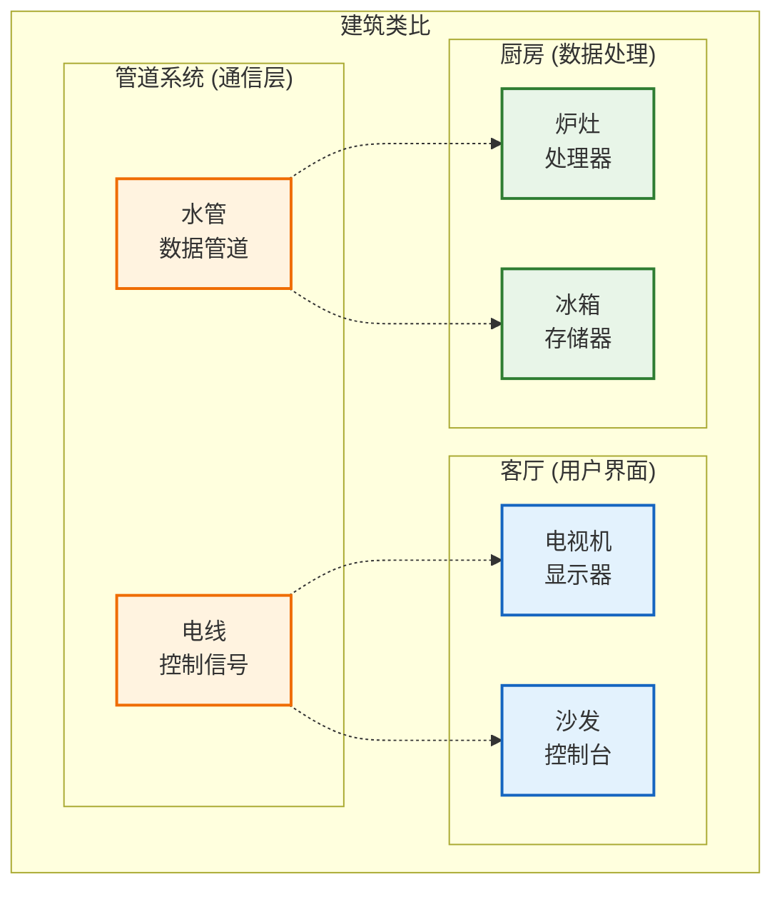
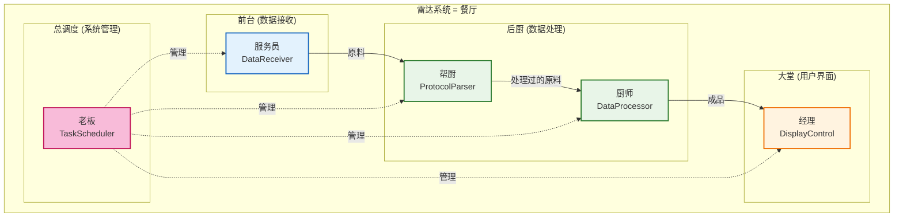
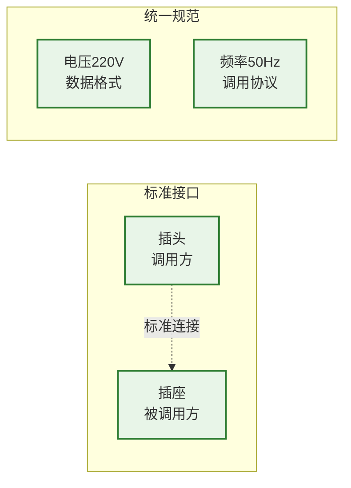
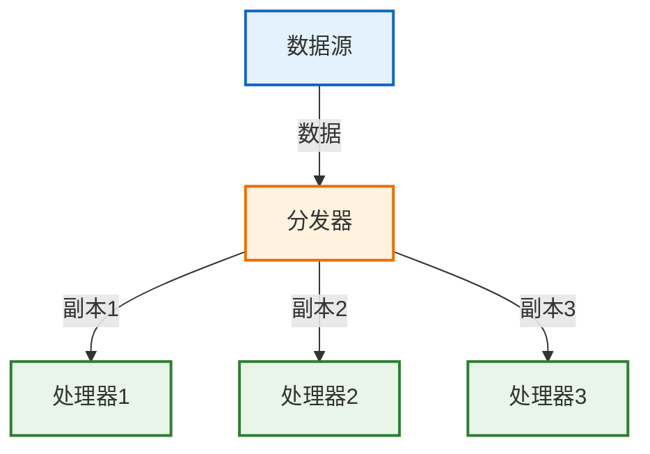
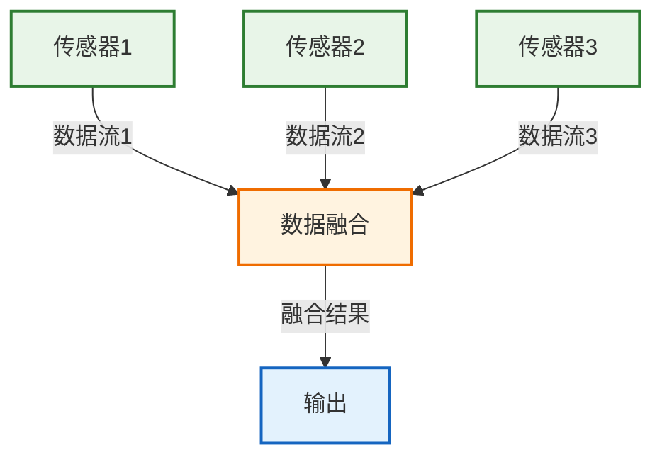
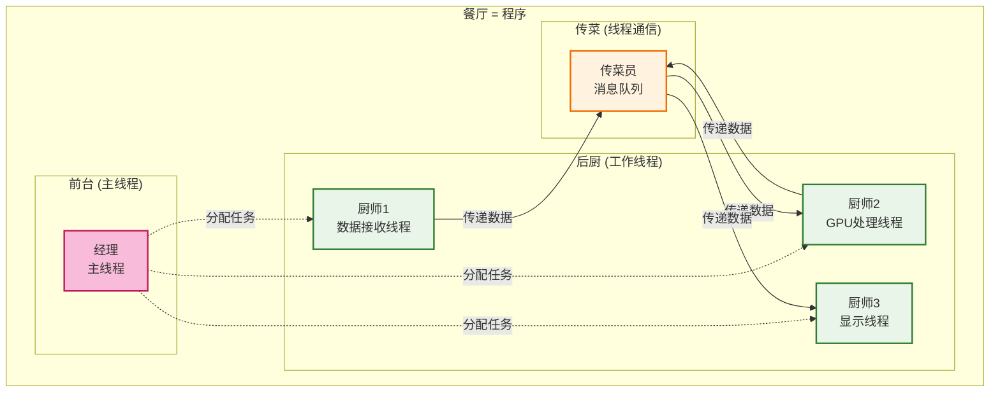
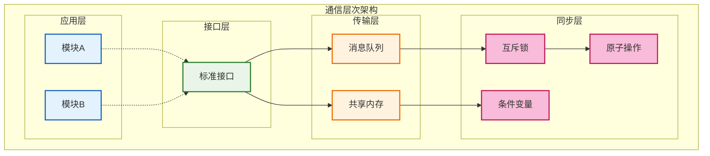
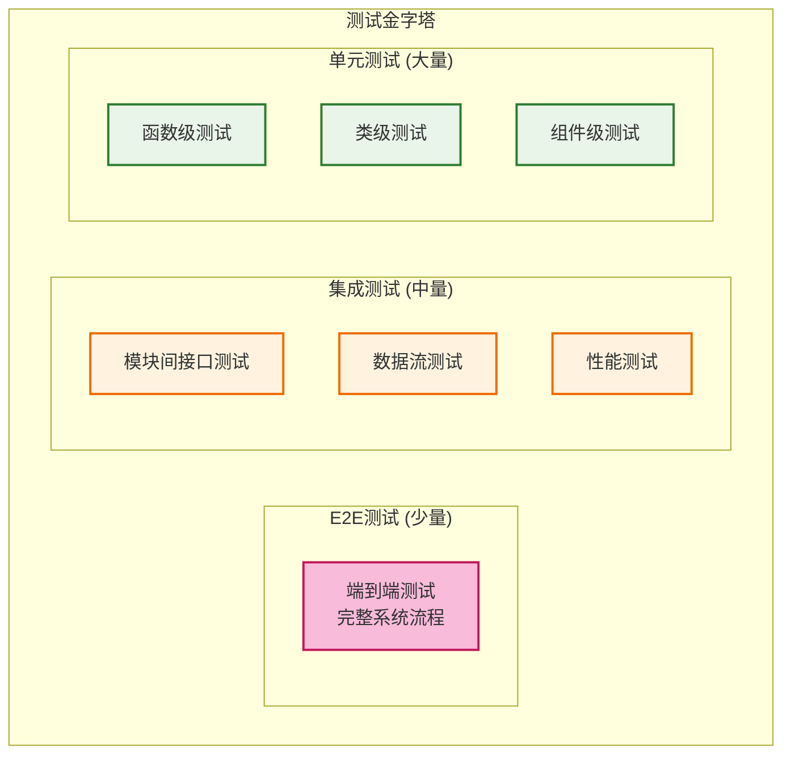

# 从零架构起一个系统并调度各模块和线程 - 小白指南

## 文档目标
为没有大型软件架构经验的开发者提供一个清晰、实用的指南，学会如何从零开始设计系统架构，并有效管理模块和线程。

## 1. 系统架构基础

### 1.1 什么是系统架构？
系统架构就像建筑设计图纸，它定义了：
- **房间布局**（模块划分）
- **房间功能**（模块职责）
- **通道连接**（模块间通信）
- **水电管道**（数据流向）



### 1.2 为什么架构重要？

#### 没有架构的系统（意大利面条代码）
```cpp
// 糟糕的例子：所有功能混在一起
void main() {
    // 接收数据
    char buffer[1024];
    recv(socket, buffer, 1024, 0);
    
    // 解析数据
    int data_type = buffer[0];
    float* values = (float*)(buffer + 4);
    
    // 处理数据
    for(int i = 0; i < 100; i++) {
        values[i] = values[i] * 2.0f;  // 某种处理
    }
    
    // 显示数据
    for(int i = 0; i < 100; i++) {
        printf("%.2f ", values[i]);
    }
    
    // 保存数据
    FILE* f = fopen("output.txt", "w");
    fwrite(values, sizeof(float), 100, f);
    fclose(f);
}
```

#### 有架构的系统（清晰模块化）
```cpp
// 良好的例子：清晰的模块分工
class DataReceiver {
public:
    bool ReceiveData(DataPacket& packet);
};

class DataProcessor {
public:
    bool ProcessData(const DataPacket& input, ProcessedData& output);
};

class DataDisplayer {
public:
    bool DisplayData(const ProcessedData& data);
};

class DataStorage {
public:
    bool SaveData(const ProcessedData& data);
};

// 主控制器协调各模块
class SystemController {
    DataReceiver receiver_;
    DataProcessor processor_;
    DataDisplayer displayer_;
    DataStorage storage_;
    
public:
    void Run() {
        DataPacket packet;
        ProcessedData processed;
        
        if (receiver_.ReceiveData(packet)) {
            if (processor_.ProcessData(packet, processed)) {
                displayer_.DisplayData(processed);
                storage_.SaveData(processed);
            }
        }
    }
};
```

### 1.3 架构设计的核心思想
1. **分而治之**: 复杂问题分解为简单问题
2. **单一职责**: 每个模块只做一件事
3. **高内聚低耦合**: 模块内部紧密合作，模块间松散连接
4. **可测试性**: 每个模块都能独立测试

## 2. 模块划分 - 如何"切蛋糕"

### 2.1 识别系统中的"角色"

以雷达系统为例，就像一个餐厅：


### 2.2 模块划分的三个步骤

#### 步骤1: 按数据流划分
```
数据从哪里来？ → 数据接收模块
数据要做什么？ → 数据处理模块
数据到哪里去？ → 数据输出模块
谁来协调？   → 调度管理模块
```

#### 步骤2: 按职责划分
```cpp
// 每个模块都有明确的"工作描述"
class DataReceiver {
    // 工作内容：我负责从网络接收原始数据
    // 不管：数据是什么意思，怎么处理
    // 输出：原始数据包
};

class ProtocolParser {
    // 工作内容：我负责理解数据包格式，提取有用信息
    // 不管：数据从哪来，处理后做什么
    // 输出：结构化数据
};

class GPUProcessor {
    // 工作内容：我负责用GPU进行计算
    // 不管：数据格式，计算结果用途
    // 输出：计算结果
};
```

#### 步骤3: 检查模块合理性
```
✅ 每个模块职责单一明确
✅ 模块之间不直接访问内部数据
✅ 模块可以独立开发和测试
✅ 替换一个模块不影响其他模块
```

### 2.3 模块大小的"黄金法则"
- **一个人两周能完成**: 模块不能太大
- **功能完整独立**: 模块不能太小
- **代码行数1000-3000行**: 经验值
- **接口数量3-8个**: 太多说明职责不清

## 3. 接口设计 - 模块间的"语言"

### 3.1 接口就像电器插座


### 3.2 设计接口的三原则

#### 原则1: 简单明了
```cpp
// ❌ 复杂接口
bool ProcessData(void* data, int type, size_t size, int flags, 
                 void* output, size_t* output_size, ErrorInfo* error);

// ✅ 简单接口
class IDataProcessor {
public:
    ProcessResult Process(const InputData& input, OutputData& output);
};
```

#### 原则2: 稳定可靠
```cpp
// 接口版本化，保证兼容性
namespace DataProcessor {
    namespace v1 {
        class IProcessor {
            virtual bool Process(const RawData& data) = 0;
        };
    }
    
    namespace v2 {
        class IProcessor {
            virtual ProcessResult Process(const InputData& data, OutputData& output) = 0;
            virtual bool ProcessLegacy(const RawData& data) = 0;  // 兼容v1
        };
    }
}
```

#### 原则3: 自说明
```cpp
// 接口要能"自己解释自己"
class IDataProcessor {
public:
    /**
     * @brief 处理雷达数据
     * @param input 输入的雷达数据包，必须已验证格式
     * @param output 输出处理结果，调用方负责分配内存
     * @return ProcessResult::SUCCESS 成功
     *         ProcessResult::INVALID_INPUT 输入数据无效
     *         ProcessResult::GPU_ERROR GPU处理错误
     * @note 此函数线程安全，可并发调用
     */
    virtual ProcessResult Process(const RadarData& input, ProcessedData& output) = 0;
};
```

### 3.3 接口设计实战练习

#### 任务：设计雷达数据接收接口
```cpp
// 第一步：明确职责
// 职责：从网络接收UDP数据包，验证格式，传递给下一模块

// 第二步：定义数据结构
struct RawPacket {
    uint32_t sequence_id;    // 包序号
    uint64_t timestamp;      // 时间戳
    std::vector<uint8_t> data;  // 原始数据
};

// 第三步：设计接口
class IDataReceiver {
public:
    // 启动接收
    virtual bool Start(const std::string& ip, int port) = 0;
    
    // 停止接收
    virtual bool Stop() = 0;
    
    // 获取一个数据包（非阻塞）
    virtual bool GetPacket(RawPacket& packet, int timeout_ms = 0) = 0;
    
    // 获取状态
    virtual ReceiverStatus GetStatus() const = 0;
};
```

## 4. 数据流设计 - 信息的"高速公路"

### 4.1 数据流的三种模式

#### 模式1: 流水线模式（适合雷达系统）


#### 模式2: 分发模式


#### 模式3: 汇聚模式


### 4.2 选择数据传输方式

#### 方式比较表
| 传输方式     | 速度 | 复杂度 | 适用场景   | 代码示例                           |
| ------------ | ---- | ------ | ---------- | ---------------------------------- |
| **函数调用** | 最快 | 最简单 | 同一进程内 | `result = processor.Process(data)` |
| **共享内存** | 很快 | 中等   | 进程间通信 | `shared_queue.push(data)`          |
| **消息队列** | 快   | 中等   | 异步通信   | `queue.send(message)`              |
| **网络通信** | 较慢 | 复杂   | 分布式系统 | `socket.send(packet)`              |

#### 雷达系统的选择
```cpp
// 推荐方案：共享内存 + 无锁队列
class DataChannel {
private:
    boost::lockfree::spsc_queue<DataPacket, 
        boost::lockfree::capacity<1024>> queue_;
    
public:
    bool Send(const DataPacket& packet) {
        return queue_.push(packet);
    }
    
    bool Receive(DataPacket& packet) {
        return queue_.pop(packet);
    }
};
```

### 4.3 数据流控制策略

#### 背压控制（防止数据堆积）
```cpp
class FlowController {
private:
    size_t max_queue_size_ = 1000;
    std::atomic<size_t> current_size_{0};
    
public:
    bool CanSendData() const {
        return current_size_.load() < max_queue_size_;
    }
    
    void OnDataSent() {
        current_size_.fetch_add(1);
    }
    
    void OnDataProcessed() {
        current_size_.fetch_sub(1);
    }
};
```

## 5. 技术选型 - 选择合适的"工具"

### 5.1 选型决策矩阵

#### 编程语言选择
| 语言       | 性能  | 开发效率 | 生态系统 | GPU支持 | 推荐度 |
| ---------- | ----- | -------- | -------- | ------- | ------ |
| **C++**    | ⭐⭐⭐⭐⭐ | ⭐⭐⭐      | ⭐⭐⭐⭐     | ⭐⭐⭐⭐⭐   | ✅      |
| **Python** | ⭐⭐    | ⭐⭐⭐⭐⭐    | ⭐⭐⭐⭐⭐    | ⭐⭐⭐⭐    | ⚠️      |
| **Rust**   | ⭐⭐⭐⭐⭐ | ⭐⭐       | ⭐⭐⭐      | ⭐⭐⭐     | ⚠️      |

#### 通信库选择
| 库                 | 性能  | 学习成本 | 稳定性 | 适用场景         |
| ------------------ | ----- | -------- | ------ | ---------------- |
| **Boost.Lockfree** | ⭐⭐⭐⭐⭐ | ⭐⭐⭐      | ⭐⭐⭐⭐⭐  | 高性能进程内通信 |
| **ZeroMQ**         | ⭐⭐⭐⭐  | ⭐⭐⭐⭐     | ⭐⭐⭐⭐   | 分布式消息传递   |
| **共享内存**       | ⭐⭐⭐⭐⭐ | ⭐⭐       | ⭐⭐⭐    | 进程间高速通信   |

### 5.2 技术选型的步骤

#### 步骤1: 列出需求
```
雷达系统需求：
- 实时性：延迟 < 100ms
- 吞吐量：100MB/s
- 可靠性：99.9%可用性
- 扩展性：支持多雷达阵面
- 团队技能：C++熟悉度中等
```

#### 步骤2: 列出候选方案
```
方案A：C++ + Boost + CUDA + Qt
方案B：Python + NumPy + PyCUDA + Tkinter
方案C：C++ + ZeroMQ + CUDA + Qt
```

#### 步骤3: 评估决策
```cpp
// 技术选型评估函数
struct TechOption {
    std::string name;
    int performance_score;    // 1-5分
    int maintainability_score;
    int team_familiarity_score;
    int ecosystem_score;
};

TechOption EvaluateOption(const std::string& tech_stack) {
    // 根据项目需求打分
    // 综合考虑性能、维护性、团队能力等因素
}
```

## 6. 线程调度 - 管理"工人"

### 6.1 理解线程

#### 线程就像餐厅的工人


### 6.2 线程模型设计

#### 雷达系统的线程架构
```cpp
class RadarSystem {
private:
    // 各个功能线程
    std::thread data_receiver_thread_;
    std::thread protocol_parser_thread_;
    std::thread gpu_processor_thread_;
    std::thread display_thread_;
    std::thread scheduler_thread_;
    
    // 线程间通信
    ThreadSafeQueue<RawPacket> raw_data_queue_;
    ThreadSafeQueue<ParsedData> parsed_data_queue_;
    ThreadSafeQueue<ProcessedData> processed_data_queue_;
    
    // 控制标志
    std::atomic<bool> running_{false};
    
public:
    void Start() {
        running_ = true;
        
        // 启动各个线程
        data_receiver_thread_ = std::thread(&RadarSystem::DataReceiverLoop, this);
        protocol_parser_thread_ = std::thread(&RadarSystem::ProtocolParserLoop, this);
        gpu_processor_thread_ = std::thread(&RadarSystem::GPUProcessorLoop, this);
        display_thread_ = std::thread(&RadarSystem::DisplayLoop, this);
        scheduler_thread_ = std::thread(&RadarSystem::SchedulerLoop, this);
    }
    
private:
    void DataReceiverLoop() {
        while (running_) {
            RawPacket packet;
            if (data_receiver_.ReceiveData(packet)) {
                raw_data_queue_.Push(packet);
            }
        }
    }
    
    void ProtocolParserLoop() {
        while (running_) {
            RawPacket raw_packet;
            if (raw_data_queue_.Pop(raw_packet, 100)) {  // 100ms超时
                ParsedData parsed;
                if (protocol_parser_.Parse(raw_packet, parsed)) {
                    parsed_data_queue_.Push(parsed);
                }
            }
        }
    }
    
    // 其他线程循环...
};
```

### 6.3 线程同步的常见模式

#### 模式1: 生产者-消费者
```cpp
template<typename T>
class ThreadSafeQueue {
private:
    std::queue<T> queue_;
    std::mutex mutex_;
    std::condition_variable condition_;
    
public:
    void Push(const T& item) {
        std::lock_guard<std::mutex> lock(mutex_);
        queue_.push(item);
        condition_.notify_one();
    }
    
    bool Pop(T& item, int timeout_ms = -1) {
        std::unique_lock<std::mutex> lock(mutex_);
        
        if (timeout_ms < 0) {
            // 无限等待
            condition_.wait(lock, [this] { return !queue_.empty(); });
        } else {
            // 超时等待
            if (!condition_.wait_for(lock, std::chrono::milliseconds(timeout_ms),
                                    [this] { return !queue_.empty(); })) {
                return false;  // 超时
            }
        }
        
        item = queue_.front();
        queue_.pop();
        return true;
    }
};
```

#### 模式2: 读写锁
```cpp
class SharedDataManager {
private:
    std::shared_mutex rw_mutex_;
    std::map<std::string, std::string> config_data_;
    
public:
    // 多个线程可同时读
    std::string GetConfig(const std::string& key) {
        std::shared_lock<std::shared_mutex> lock(rw_mutex_);
        auto it = config_data_.find(key);
        return (it != config_data_.end()) ? it->second : "";
    }
    
    // 只有一个线程可以写
    void SetConfig(const std::string& key, const std::string& value) {
        std::unique_lock<std::shared_mutex> lock(rw_mutex_);
        config_data_[key] = value;
    }
};
```

## 7. 同步与通信 - 协调"团队合作"

### 7.1 模块间通信的层次



### 7.2 设计通信协议

#### 统一消息格式
```cpp
// 统一的消息格式
struct SystemMessage {
    enum Type {
        DATA_PACKET,
        CONTROL_COMMAND,
        STATUS_REPORT,
        ERROR_NOTIFICATION
    };
    
    Type type;
    uint32_t source_module;
    uint32_t target_module;
    uint64_t timestamp;
    uint32_t data_size;
    std::vector<uint8_t> payload;
};

// 消息序列化/反序列化
class MessageSerializer {
public:
    static std::vector<uint8_t> Serialize(const SystemMessage& msg);
    static bool Deserialize(const std::vector<uint8_t>& data, SystemMessage& msg);
};
```

#### 消息路由器
```cpp
class MessageRouter {
private:
    std::map<uint32_t, std::shared_ptr<IMessageHandler>> handlers_;
    ThreadSafeQueue<SystemMessage> message_queue_;
    std::thread routing_thread_;
    
public:
    void RegisterHandler(uint32_t module_id, std::shared_ptr<IMessageHandler> handler) {
        handlers_[module_id] = handler;
    }
    
    void SendMessage(const SystemMessage& message) {
        message_queue_.Push(message);
    }
    
private:
    void RoutingLoop() {
        while (running_) {
            SystemMessage message;
            if (message_queue_.Pop(message, 100)) {
                auto it = handlers_.find(message.target_module);
                if (it != handlers_.end()) {
                    it->second->HandleMessage(message);
                }
            }
        }
    }
};
```

### 7.3 错误处理和恢复

#### 错误分类和处理策略
```cpp
enum class ErrorSeverity {
    INFO,       // 信息：记录日志
    WARNING,    // 警告：记录日志，继续运行
    ERROR,      // 错误：尝试恢复
    FATAL       // 致命：停止系统
};

class ErrorHandler {
public:
    void HandleError(ErrorSeverity severity, const std::string& module, 
                    const std::string& message) {
        switch (severity) {
            case ErrorSeverity::INFO:
                logger_.Info("[{}] {}", module, message);
                break;
                
            case ErrorSeverity::WARNING:
                logger_.Warning("[{}] {}", module, message);
                break;
                
            case ErrorSeverity::ERROR:
                logger_.Error("[{}] {}", module, message);
                TryRecovery(module);
                break;
                
            case ErrorSeverity::FATAL:
                logger_.Fatal("[{}] {}", module, message);
                ShutdownSystem();
                break;
        }
    }
    
private:
    void TryRecovery(const std::string& module) {
        // 尝试重启模块
        if (auto it = modules_.find(module); it != modules_.end()) {
            it->second->Stop();
            std::this_thread::sleep_for(std::chrono::seconds(1));
            it->second->Start();
        }
    }
};
```

## 8. 测试与验证 - 确保系统"不出错"

### 8.1 测试金字塔



### 8.2 单元测试示例

#### 测试数据处理模块
```cpp
#include <gtest/gtest.h>

class DataProcessorTest : public ::testing::Test {
protected:
    void SetUp() override {
        processor_ = std::make_unique<DataProcessor>();
        processor_->Initialize(test_config_);
    }
    
    void TearDown() override {
        processor_->Cleanup();
    }
    
    std::unique_ptr<DataProcessor> processor_;
    ProcessorConfig test_config_;
};

TEST_F(DataProcessorTest, ProcessValidData) {
    // 准备测试数据
    InputData input = CreateTestData();
    OutputData output;
    
    // 执行测试
    auto result = processor_->Process(input, output);
    
    // 验证结果
    EXPECT_EQ(result, ProcessResult::SUCCESS);
    EXPECT_FALSE(output.data.empty());
    EXPECT_GT(output.confidence, 0.8f);
}

TEST_F(DataProcessorTest, HandleInvalidData) {
    // 测试错误输入
    InputData invalid_input;  // 空数据
    OutputData output;
    
    auto result = processor_->Process(invalid_input, output);
    
    EXPECT_EQ(result, ProcessResult::INVALID_INPUT);
}
```

### 8.3 集成测试策略

#### 模块间接口测试
```cpp
class IntegrationTest : public ::testing::Test {
protected:
    void SetUp() override {
        // 启动测试环境
        data_receiver_ = std::make_unique<DataReceiver>();
        protocol_parser_ = std::make_unique<ProtocolParser>();
        
        // 连接模块
        data_channel_ = std::make_shared<DataChannel>();
        data_receiver_->SetOutputChannel(data_channel_);
        protocol_parser_->SetInputChannel(data_channel_);
    }
};

TEST_F(IntegrationTest, DataFlowTest) {
    // 发送测试数据
    RawPacket test_packet = CreateTestPacket();
    data_receiver_->InjectTestData(test_packet);
    
    // 等待处理
    std::this_thread::sleep_for(std::chrono::milliseconds(100));
    
    // 验证输出
    ParsedData parsed_data;
    EXPECT_TRUE(protocol_parser_->GetLastOutput(parsed_data));
    EXPECT_EQ(parsed_data.sequence_id, test_packet.sequence_id);
}
```

### 8.4 性能测试

#### 吞吐量测试
```cpp
class PerformanceTest : public ::testing::Test {
public:
    void TestThroughput() {
        const int test_duration_seconds = 10;
        const int packet_size = 1024;
        
        auto start_time = std::chrono::high_resolution_clock::now();
        int packet_count = 0;
        
        while (true) {
            auto current_time = std::chrono::high_resolution_clock::now();
            auto elapsed = std::chrono::duration_cast<std::chrono::seconds>(
                current_time - start_time).count();
            
            if (elapsed >= test_duration_seconds) {
                break;
            }
            
            // 发送测试包
            RawPacket packet = CreateTestPacket(packet_size);
            system_->ProcessPacket(packet);
            packet_count++;
        }
        
        double throughput_mbps = (packet_count * packet_size * 8.0) / 
                                (test_duration_seconds * 1024 * 1024);
        
        std::cout << "吞吐量: " << throughput_mbps << " Mbps" << std::endl;
        EXPECT_GT(throughput_mbps, 100.0);  // 要求 > 100 Mbps
    }
};
```

## 9. 文档编写 - 留下"设计思路"

### 9.1 文档的重要性
文档就像建筑图纸，没有图纸：
- 新人无法理解系统
- 维护时找不到入口
- 出错时不知道原因
- 扩展时不敢动手

### 9.2 必需的文档类型

#### 系统级文档
```
1. 架构设计文档
   - 整体架构图
   - 模块划分和职责
   - 数据流设计
   - 技术选型理由

2. 接口规范文档
   - 所有模块的接口定义
   - 数据格式说明
   - 调用时序图
   - 错误码定义
```

#### 模块级文档
```
1. 模块设计文档
   - 功能描述
   - 内部设计
   - 配置参数
   - 性能指标

2. API文档
   - 函数接口说明
   - 参数含义
   - 返回值说明
   - 使用示例
```

### 9.3 文档编写技巧

#### 技巧1: 图文并茂
```markdown
## 数据流设计

数据在系统中的流动如下图所示：


每个步骤的详细说明：
1. **数据接收**: 从UDP端口8080接收数据包
2. **协议解析**: 解析包头，提取有效载荷
3. **GPU处理**: 使用CUDA进行并行计算
4. **显示输出**: 通过Qt界面实时显示结果
```

#### 技巧2: 代码示例
```markdown
## 使用示例

```cpp
// 初始化系统
RadarSystem system;
system.Initialize("config.yaml");

// 启动处理
system.Start();

// 等待用户输入
std::cout << "按任意键停止..." << std::endl;
std::cin.get();

// 停止系统
system.Stop();
```
```

#### 技巧3: 常见问题
```markdown
## FAQ

**Q: 系统启动失败怎么办？**
A: 检查以下几点：
1. GPU驱动是否正确安装
2. 配置文件是否存在
3. 网络端口是否被占用

**Q: 处理延迟过高怎么办？**
A: 可以尝试：
1. 增加GPU内存分配
2. 调整队列大小
3. 优化数据包格式
```

## 10. 实践建议 - 避免"踩坑"

### 10.1 开发阶段建议

#### 建议1: 从简单开始
```cpp
// ❌ 一开始就想做复杂的架构
class SuperComplexProcessor {
    // 100个参数，50个接口，支持所有可能的功能...
};

// ✅ 从最简单的版本开始
class SimpleProcessor {
public:
    bool Process(const Data& input, Data& output);
};
```

#### 建议2: 接口先行
```cpp
// 第一步：定义接口
class IDataProcessor {
public:
    virtual bool Process(const InputData& input, OutputData& output) = 0;
};

// 第二步：写测试
TEST(DataProcessorTest, BasicProcess) {
    MockDataProcessor processor;
    // 测试逻辑...
}

// 第三步：实现功能
class RealDataProcessor : public IDataProcessor {
    // 真实实现...
};
```

#### 建议3: 小步迭代
```
第1周：搭建基础框架，能跑起来
第2周：实现核心功能，能处理数据
第3周：优化性能，提高稳定性
第4周：增加高级功能，完善文档
```

### 10.2 常见错误及避免

#### 错误1: 过度设计
```cpp
// ❌ 为了可能的需求设计复杂接口
class IProcessor {
    virtual Result Process(const Input& input, Output& output,
                          const Config& config, const Context& context,
                          ProcessingHints hints, CallbackFunction callback,
                          ErrorHandler error_handler, ProgressTracker tracker) = 0;
};

// ✅ 简单实用的接口
class IProcessor {
    virtual bool Process(const Input& input, Output& output) = 0;
    virtual void SetConfig(const Config& config) = 0;
};
```

#### 错误2: 忽视错误处理
```cpp
// ❌ 忽视错误情况
void ProcessData(const Data& input) {
    auto parsed = parser.Parse(input);  // 可能失败
    auto processed = processor.Process(parsed);  // 可能失败
    displayer.Display(processed);  // 可能失败
}

// ✅ 完善的错误处理
bool ProcessData(const Data& input) {
    ParsedData parsed;
    if (!parser.Parse(input, parsed)) {
        LOG_ERROR("解析失败");
        return false;
    }
    
    ProcessedData processed;
    if (!processor.Process(parsed, processed)) {
        LOG_ERROR("处理失败");
        return false;
    }
    
    if (!displayer.Display(processed)) {
        LOG_ERROR("显示失败");
        return false;
    }
    
    return true;
}
```

#### 错误3: 忽视性能
```cpp
// ❌ 每次都重新分配内存
void ProcessLoop() {
    while (running) {
        std::vector<float> buffer(1024 * 1024);  // 每次1MB分配
        // 处理逻辑...
    }
}

// ✅ 预分配内存池
class DataProcessor {
private:
    std::vector<float> reusable_buffer_;
    
public:
    DataProcessor() : reusable_buffer_(1024 * 1024) {}
    
    void ProcessLoop() {
        while (running) {
            // 重用缓冲区
            ProcessData(reusable_buffer_);
        }
    }
};
```

### 10.3 团队协作建议

#### 建议1: 统一代码规范
```cpp
// 团队统一的命名规范
class DataProcessor {        // 类名：PascalCase
private:
    int packet_count_;       // 成员变量：snake_case + 下划线后缀
    
public:
    bool ProcessData(        // 函数名：PascalCase
        const InputData& input_data,  // 参数：snake_case
        OutputData& output_data) {
        
        int local_variable = 0;       // 局部变量：snake_case
        const int MAX_RETRY_COUNT = 3; // 常量：UPPER_CASE
        
        return true;
    }
};
```

#### 建议2: 定期代码审查
```
每周代码审查检查清单：
□ 接口设计是否合理？
□ 错误处理是否完整？
□ 性能是否满足要求？
□ 代码是否易于理解？
□ 测试覆盖是否充分？
□ 文档是否同步更新？
```

#### 建议3: 持续学习
```
技能提升计划：
第1个月：掌握基础模块化设计
第2个月：学习高性能编程技巧
第3个月：理解分布式系统设计
第4个月：掌握系统性能调优
```

---

## 总结

系统架构设计是一个渐进的过程，关键是：

1. **从简单开始**: 不要一开始就追求完美
2. **接口先行**: 先定义清楚模块间的"合同"
3. **小步迭代**: 每次只解决一个问题
4. **充分测试**: 确保每个环节都能正常工作
5. **及时文档**: 记录下设计思路和决策过程

记住，好的架构不是设计出来的，而是演进出来的！

---

**祝您的架构设计之路顺利！🚀**
