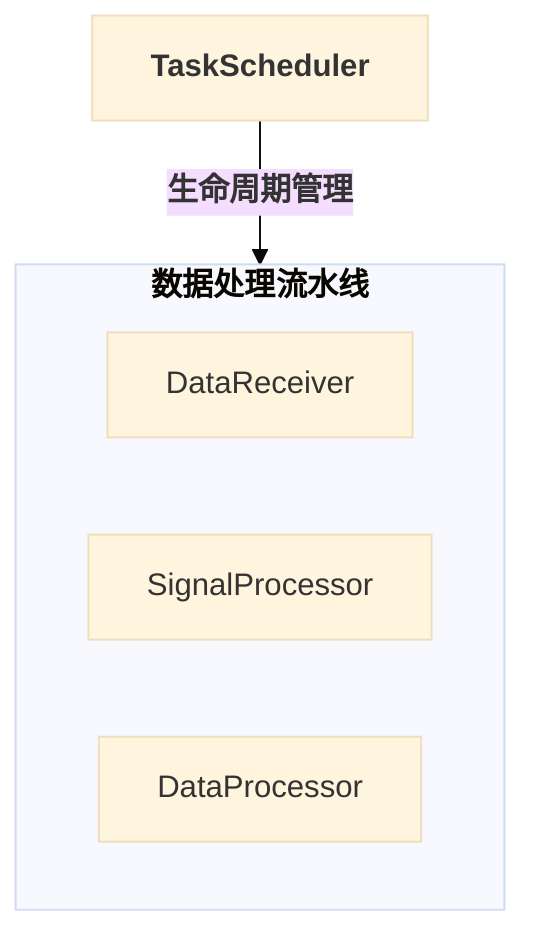
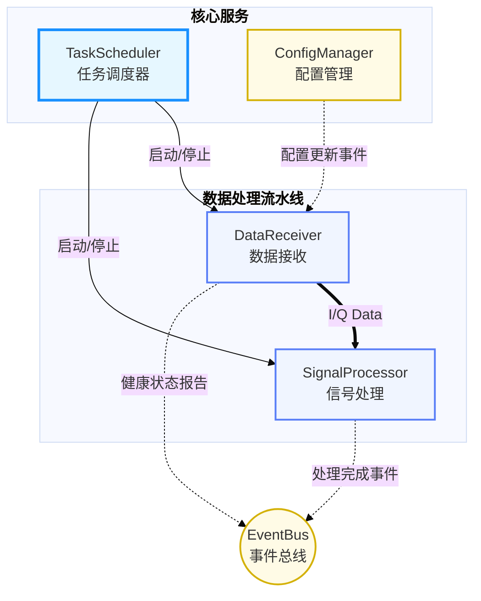

# Mermaid 可视化设计指南

- **文档版本**: v1.0.0
- **最后更新**: 2025-10-13
- **负责人**: Klein

-----

## 概述

本文件是雷达数据处理系统所有设计文档中，关于 **Mermaid 图表绘制**的官方标准与实践指南。其核心目标是为团队所有成员提供一套统一、清晰、高效的视觉语言，确保我们将复杂的技术架构、交互流程和概念关系，转化为直观、易于理解且风格一致的图表。

遵循本指南不仅能提升文档的专业性和可读性，更重要的是能够**加速知识传递、降低沟通成本、减少因理解偏差导致的错误**。本指南定义的原则、工具和模板，是项目所有 `*.md` 文件中 Mermaid 图表设计的唯一真实来源（Single Source of Truth）。

-----

## 目录

- [Mermaid 可视化设计指南](#mermaid-可视化设计指南)
  - [概述](#概述)
  - [目录](#目录)
  - [1 目的与核心原则](#1-目的与核心原则)
    - [1.1 最终目标：加速理解](#11-最终目标加速理解)
    - [1.2 核心设计四原则](#12-核心设计四原则)
      - [1.2.1 清晰性与去噪音](#121-清晰性与去噪音)
      - [1.2.2 一致性与语义化](#122-一致性与语义化)
      - [1.2.3 目的性与择图](#123-目的性与择图)
      - [1.2.4 聚焦与灵活化](#124-聚焦与灵活化)
  - [2 项目统一视觉语言与配置（硬性标准）](#2-项目统一视觉语言与配置硬性标准)
    - [2.1 基础配置与兼容性](#21-基础配置与兼容性)
    - [2.2 字符与命名规范（强制）](#22-字符与命名规范强制)
    - [2.3 节点与线条语义（全局统一）](#23-节点与线条语义全局统一)
  - [3 实践工具箱：高级技巧与反模式](#3-实践工具箱高级技巧与反模式)
    - [3.1 解决复杂图表的三大难题（强制实践）](#31-解决复杂图表的三大难题强制实践)
      - [3.1.1 可交互的大模块设计（强制推荐）](#311-可交互的大模块设计强制推荐)
      - [3.1.2 隐形锚点：解决连接线遮挡](#312-隐形锚点解决连接线遮挡)
      - [3.1.3 便签式注释：利用子图实现 Note 效果](#313-便签式注释利用子图实现-note-效果)
    - [3.2 颜色与样式灵活应用（聚焦核心）](#32-颜色与样式灵活应用聚焦核心)
  - [4 图表工具箱：按需择图指导](#4-图表工具箱按需择图指导)
    - [4.1 `graph` \& `flowchart`：静态结构与流程（原则性指导）](#41-graph--flowchart静态结构与流程原则性指导)
    - [4.2 `sequenceDiagram`：时序交互](#42-sequencediagram时序交互)
    - [4.3 `stateDiagram-v2`：状态机](#43-statediagram-v2状态机)
    - [4.4 `classDiagram`：类与接口](#44-classdiagram类与接口)
    - [4.5 `gantt` \& `mindmap`](#45-gantt--mindmap)
  - [5 最佳实践与反模式](#5-最佳实践与反模式)
    - [5.1 推荐做法 (${Best Practices}$)](#51-推荐做法-best-practices)
      - [5.1.1 结构与可维护性](#511-结构与可维护性)
      - [5.1.2 信息传达与专业度](#512-信息传达与专业度)
    - [5.2 避免做法 (${Anti-Patterns}$)](#52-避免做法-anti-patterns)
      - [5.2.1 结构与视觉陷阱](#521-结构与视觉陷阱)
      - [5.2.2 格式与字符陷阱（强制）](#522-格式与字符陷阱强制)

-----

## 1 目的与核心原则

### 1.1 最终目标：加速理解

- **图表的角色**：在本技术文档体系中，图表不是装饰品，而是核心信息的 **“翻译器”** 和 **“加速器”**。我们的目标不是画图，而是通过图形化的方式，将抽象的代码结构、复杂的动态交互和深层的设计思想，以**最直接、最低认知负担**的方式传递给读者。
- **衡量标准**：一份好的图表，应该能让初次接触该设计的工程师在**一分钟内**抓住核心要点。图表的存在是为了回答问题，而不是制造更多问题。

### 1.2 核心设计四原则

所有图表的绘制都必须严格遵守以下四大原则，它们是保证图表**专业质量**和**一致性**的基石。这些原则将指导我们从静态结构到动态交互的全方位可视化实践。

#### 1.2.1 清晰性与去噪音

- **单一职责**：一张图只应该讲述一个核心故事，无论是展示分层架构、数据流转还是状态变迁，都应有**明确的焦点**。
- **化繁为简**：如果一张图变得过于拥挤和复杂，则必须将其拆分为多张范围更小、逻辑更聚焦的关联子图。细节应交由图表下方的文字进行阐述。
- **杜绝线条混乱（强制实践）**：我们**必须杜绝**因活动块与多模块间存在相同交互（例如 $\text{EventBus}$）而导致的**线条交叉和视觉混乱**。对于一个活动块与**三个或更多**模块发生相同交互的场景，**强制**要求采用 **“可交互的大模块设计”** 或 **“隐形锚点”** 等高级技巧进行优化。

#### 1.2.2 一致性与语义化

- **全局统一**：项目中所有图表必须共享一套统一的视觉语言。相同的颜色、形状和线条样式在不同的文档中必须代表**相同的语义**。
- **逻辑同构**：图表的布局应反映其内在逻辑。例如，表示分层架构时，应始终采用“自上而下”或“自左向右”的布局来表示依赖或控制关系。
- **术语规范**：图表中的所有术语和缩写，必须与**项目术语表**保持完全一致。

#### 1.2.3 目的性与择图

- **按需择图**：必须为正确的表达目的选择正确的图表类型。
  - 展示**静态结构与依赖**，使用 `graph` 或 `flowchart`。
  - 展示**动态时序交互**，使用 `sequenceDiagram`。
  - 展示**生命周期与状态**，使用 `stateDiagram-v2`。
- **强制考虑要素**：在绘制 `graph` 或 `flowchart` 时，**语义化颜色、多维关系表达、分层分组（`subgraph`）**为**强制性**考虑要素。

#### 1.2.4 聚焦与灵活化

- **灵活强调原则**：在保留**项目推荐调色盘**的基础色调语义的前提下，允许作者通过调整 `stroke-width`（边框粗细）、`stroke`（边框颜色）、**线条标签颜色**等 $\text{CSS}$ 属性，对图表中的**核心组件、关键路径或重要决策点**进行**特殊、灵活的强调**。
- **目的驱动**：这种灵活化的样式调整必须服务于**聚焦核心、突出重点**的设计目的，而**严禁**为装饰而装饰，以避免视觉噪音。

-----

## 2 项目统一视觉语言与配置（硬性标准）

- **概要**: 本章定义了项目中所有 $\text{Mermaid}$ 图表在**代码风格、命名和基础配置**上必须遵守的**强制性基准**。严格遵循这些标准是确保图表在不同工具中**渲染一致性、源代码可维护性和专业性**的前提。

### 2.1 基础配置与兼容性

- **强制主题与曲线（硬性约束）**：

    - 除了 `mindmap` 和 `gantt` 之外，所有其他图表类型（包括 `graph`、`flowchart`、`sequenceDiagram`、`stateDiagram-v2`、`classDiagram`）**必须**使用统一的主题和曲线配置，以保证渲染风格和线条的专业平滑度。
    - **标准头部模板** (整合快速参考)：在开始编写这些图表时，必须使用以下代码块作为图表的开头：

    ```txt
    ---
        config:
        theme: base
        flowchart:
            curve: basis
    ---
    ```

- **源代码排版（整合风格约束）**：

    - **注释规范**：只允许在 $\text{Mermaid}$ 代码块的**顶层**和**关键结构块**（如 `subgraph`、`classDef`、`participant` 定义区）前使用**概括性注释**（例如：`%% --- 参与者定义 ---`）。**严禁**在语句段内插入行内注释，以保持代码的简洁性。
    - **空行使用**：在 `classDef`、`subgraph` 定义块、`participant` 定义之间等逻辑结构块之间，应**适当保留空行**，以增强 $\text{Markdown}$ 源代码的可读性。

### 2.2 字符与命名规范（强制）

  - **双语命名规范（强制推荐）**：
      - 所有核心组件的**节点标签**（$\text{NodeID}$ 的内容）**强烈推荐**使用**双语命名**格式（例如：`TS["TaskScheduler<br/>任务调度器"]`）。
      - **子图（$\text{subgraph}$）标题必须使用简短的中文标题**。**严禁**在 $\text{subgraph}$ 标题中使用双语或冗长描述。
          - *示例*：`subgraph DataPath["<b>数据处理流水线</b>"]`
  - **字符控制与半角禁令（严禁）**：
      - **半角括号禁令**：**严禁**在 $\text{Mermaid}$ 节点标签、连接标签等元素内容中，使用**半角括号**（`()`、`[]`）。由于半角括号是 $\text{Mermaid}$ 的**保留关键字**，在不同渲染环境可能导致解析错误或语义混乱。
      - **替代方案**：如需在标签中表示括号，**必须优先使用中文全角括号**（`（）`）。
      - **中英混排**：在节点标签中，中文字符与嵌入的英文/数字/代码实体之间，应加入**一个半角空格**进行隔离，以增强视觉可读性。

### 2.3 节点与线条语义（全局统一）

  - **原则**：节点形状和线条样式具有**全局固定**的语义，在所有文档中都必须保持一致，以形成团队的视觉肌肉记忆。

  - **节点形状（固定语义）**：

| 节点形状 | 描述 | Mermaid 语法示例 | 建议应用场景 |
| :--- | :--- | :--- | :--- |
| `[...]` | **标准矩形** | `NodeID[文本]` | 标准组件、模块、处理步骤。 |
| `(...)` | **圆角矩形** | `NodeID(文本)` | 外部实体、系统边界、流程的开始/结束。 |
| `[(...)]` | **体育场形** | `NodeID[(文本)]` | 核心数据结构、数据载体（强调数据本身）。 |
| `((...))` | **圆形** | `NodeID((文本))` | 关键实体、入口点（如 EventBus）、数据库。 |
| `{...}` | **菱形** | `NodeID{文本}` | 决策或判断点（主要用于 `flowchart`）。 |

  - **线条样式（固定语义）**：

| 样式 | 符号 | 语义 | 建议应用场景 |
| :--- | :--- | :--- | :--- |
| **控制流 / 强依赖** | `-->` | 同步的调用关系、生命周期管理、强依赖调用。 | `TaskScheduler --> Module` |
| **数据流 / 高性能传递** | `==>` | 高性能数据传输、零拷贝内存传递等**数据面**传输。 | `Processor ==> DataQueue` |
| **事件流 / 弱通知** | `-.->` | 异步事件发布/订阅、弱通知、解耦的信号发送。 | `Module -.-> EventBus` |
| **继承 / 实现** | `..|>` | 在 `classDiagram` 中表示接口实现。 | `Interface ..|> Class` |

-----

## 3 实践工具箱：高级技巧与反模式

  - **概要**: 本章提供经实践验证的**高级技巧**，旨在解决复杂图表中的**可读性和可维护性**难题。它也是**灵活样式原则**的指导实践，帮助作者在遵循统一视觉语言的基础上，实现对核心设计点的**聚焦和强调**。

### 3.1 解决复杂图表的三大难题（强制实践）

本节旨在解决复杂架构图和流程图（`graph` / `flowchart`）中最常见的**线条交叉混乱**和**信息不完整**两大难题。

#### 3.1.1 可交互的大模块设计（强制推荐）

  - **问题场景**: 多个内部组件需要聚合为一个逻辑整体（如“数据处理流水线”），同时这个整体又需要参与到更高层次的交互中（如与调度器的管理关系）。
  - **解决方案**: 使用 `subgraph` 关键字，为大模块命名，并给子图赋予一个 $\text{ID}$，使子图本身成为一个可交互的节点。
  - **强制性实践**: 对于一个活动块（如 $\text{EventBus}$、$\text{TaskScheduler}$）与**三个或更多**模块发生**相同交互**（如发布/订阅、生命周期管理）时，**强烈推荐使用此模式进行聚合，以杜绝线条混乱**。



#### 3.1.2 隐形锚点：解决连接线遮挡

  - **问题场景**: 在无法聚合为大模块时，多个模块连接到同一个核心组件（如 $\text{EventBus}$），导致线条重叠、交叉，难以辨认。
  - **解决方案**: 引入一个\*\*不可见的“锚点节点”\*\*作为中转站，先将所有模块连接到锚点，再由锚点连接到目标组件。
  - **实施步骤**:
    1.  定义锚点：`ANCHOR_NODE[ ]`。
    2.  定义不可见样式：`classDef invisible fill:transparent,stroke:transparent,height:1px,width:1px`。
    3.  应用样式：`class ANCHOR_NODE invisible`。

#### 3.1.3 便签式注释：利用子图实现 Note 效果

  - **问题场景**: $\text{Mermaid}$ 的 `note` 语法在 `flowchart/graph` 中不被支持，但需要为特定节点添加重要、详细的说明。
  - **解决方案**: 创建一个包含说明文字的**子图**，并为其应用**便签样式**（浅黄背景和虚线边框）。
  - **实施步骤**:
    1.  创建子图：`subgraph NoteID["说明文字<br/>支持换行"] ... end`。
    2.  应用样式：使用项目调色盘中的**浅黄色/橙黄色**，并设置虚线边框。
        \*示例：`classDef note fill:#fffbe6,stroke:#d4b106,stroke-width:2px,stroke-dasharray: 5 5`。

### 3.2 颜色与样式灵活应用（聚焦核心）

本节是 **1.2.4 聚焦与灵活化原则**的具体实施指导，旨在确保样式调整是**服务于设计目的**的，而非视觉噪音。

  - **语义化调色盘（基础）**：

      - 图表必须从**项目推荐调色盘**（在 $\text{classDef}$ 模板中定义）中选择基础颜色，确保风格统一。
      - 颜色的基础语义（如浅蓝代表**协调者**，浅黄代表**消息/事件**）在项目内必须保持一致。

  - **灵活强调原则（进阶）**：

      - **强调核心组件**：允许通过使用 **`stroke-width` 属性**来显著增加核心组件（如调度器）的边框粗细（例如 `3px` 或 `4px`），使其在视觉上比普通模块更突出。
      - **强调关键路径**：允许通过调整线条的颜色或粗细，来强调图表中的**关键路径**。例如，在 $\text{A/B}$ 路径中，将**首选路径**的线条颜色设置为更醒目的**深蓝**。
      - **线条标签颜色（采纳）**：允许通过 $\text{CSS}$ 样式注入或 `style` 关键字，改变 `-->|标签|` 中**标签的颜色**，以表达不同的语义。例如，**错误或异常路径的标签**使用**红色**，而**正常数据流标签**使用**蓝色**。

  - **标准 `classDef` 模板（整合）**：

      - 在图表绘制时，**必须**使用以下**标准 $\text{classDef}$ 代码块**作为样式的基础来源，并根据图表上下文，将 `role_A` 等占位符重命名为有意义的角色名（如 `coordinator`、`data_pipeline`）：

    ```txt
    %% --- 标准 classDef 模板 ---
    %% 复制此模板，并根据图表上下文重命名 role_A, role_B 等。
    classDef role_A fill:#e6f7ff,stroke:#1890ff,stroke-width:2px
    classDef role_B fill:#f6ffed,stroke:#52c41a,stroke-width:2px
    classDef role_C fill:#fffbe6,stroke:#d4b106,stroke-width:2px
    classDef role_D fill:#f0f5ff,stroke:#597ef7,stroke-width:2px
    classDef role_E fill:#fff0f6,stroke:#eb2f96,stroke-width:2px
    ```

-----

## 4 图表工具箱：按需择图指导

- **概要**: 本章为项目中最常用的 $\text{Mermaid}$ 图表类型提供**原则性指导、核心语法和项目级约束**。目标是确保所有图表都能准确、高效地服务于其设计目的，并统一其表达风格。

### 4.1 `graph` & `flowchart`：静态结构与流程（原则性指导）

  - **用途**: 用于描绘系统的**静态结构蓝图**（组件、分层、依赖）或**步骤明确的动态流程**（算法、配置加载）。

  - **核心原则约束（强制）**:

      - **分组与层次**：必须使用 `subgraph` 进行逻辑分组. 对于分层架构图 (`graph TD`)，应优先使用 `subgraph` 来表达**逻辑层次**。
      - **高级技巧整合**：在绘图前，必须评估是否需要使用 **“可交互的大模块设计”** 或 **“隐形锚点”** 来**消除线条交叉**，确保图表清晰性（参照 $\text{3.1}$ 节）。
      - **多维关系表达**：必须通过 **2.3 节**定义的**线条样式（`-->`、`==>`、`-.->`）**，结合**线条标签**（`-->|标签|`），清晰区分控制流、数据流和事件流。

  - **核心语法片段（修正，仅展示一个标准的 `graph` 示例）**：

<!-- end list -->



### 4.2 `sequenceDiagram`：时序交互

  - **用途**: 用于描绘多个组件或模块之间**按时间顺序发生的动态交互**。它是解释端到端业务流程和故障恢复协调的**唯一指定工具**。

  - **核心原则约束（强制）**:

      - **生命周期激活**：必须使用 `activate` 和 `deactivate` 来清晰地展示**调用栈和执行时间**，提升流程的可追踪性。
      - **消息兼容性禁令**：**禁止**在消息内容中使用 $\text{HTML}$ 标签（如 `<b>`、`<br/>`）进行渲染，以确保最大的跨软件渲染兼容性。
      - **流程控制**：复杂逻辑必须使用 `loop`、`alt` 或 `par` 等块结构，明确表达流程中的**循环、分支和并行**。

  - **标准示例图：端到端异步数据推送**

    ```mermaid
    ---
    config:
        theme: base
    ---
    %% --- 参与者定义 ---
    sequenceDiagram
        participant TaskScheduler as 任务调度器
        participant DataReceiver as 数据接收
        participant SignalProcessor as 信号处理
        participant Queue as 共享内存队列
        participant Logger as 日志服务

        Note over TaskScheduler, SignalProcessor: 初始化与启动阶段

        TaskScheduler->>DataReceiver: 1. start() 启动命令
        activate DataReceiver
        DataReceiver->>SignalProcessor: 2. start() 启动命令
        activate SignalProcessor

        %% --- 核心数据流（异步） ---
        loop 每收到一个数据包
            DataReceiver->>Queue: 3. 异步推送 (DataBuffer)
            Note right of DataReceiver: 零拷贝/无等待
            SignalProcessor->>Queue: 4. 异步拉取 (DataBuffer)

            SignalProcessor->>SignalProcessor: 5. 处理数据...
            SignalProcessor->>Logger: 6. 异步记录 TraceID

            alt 信号处理失败
                SignalProcessor->>TaskScheduler: 7. 错误事件通知 (ERROR_CODE)
            else 信号处理成功
                SignalProcessor->>TaskScheduler: 8. 运行状态心跳
            end
        end

        deactivate SignalProcessor
        deactivate DataReceiver
    ```

### 4.3 `stateDiagram-v2`：状态机

  - **用途**: 用于描绘一个实体（模块或系统）**所有可能存在的状态，以及在何种条件下从一个状态转换到另一个状态**。它是生命周期和故障恢复逻辑建模的指定工具。

  - **核心原则约束（强制）**:

      - **路径明确**：所有的状态转换箭头都必须附有清晰的**触发条件或事件标签**（例如：`: 收到停止命令`）。
      - **异常状态**：必须将**错误、恢复和失败**等异常状态作为一等公民纳入模型，以可视化系统的**容错和恢复逻辑**。
      - **复合状态**：对于复杂的嵌套状态，必须使用 `state [状态名] { ... }` 创建**复合状态**。

  - **标准示例图：模块生命周期状态机**

    ```mermaid
    ---
    config:
        theme: base
    ---
    %% --- 初始与结束状态 ---
    stateDiagram-v2
        [*] --> Uninitialized : 系统上电

        %% --- 正常流程 ---
        Uninitialized --> Initializing : 收到 "Init" 命令
        Initializing --> Running : 初始化成功
        Running --> Pausing : 收到 "Pause" 命令
        Pausing --> Paused : 暂停完成
        Paused --> Running : 收到 "Resume" 命令
        Running --> Stopping : 收到 "Stop" 命令
        Paused --> Stopping : 收到 "Stop" 命令 (直接停止)
        Stopping --> [*] : 资源释放完成

        %% --- 异常路径 ---
        Initializing --> Error : 初始化失败
        Running --> Error : 运行时发生致命错误

        Error --> Recovering : 自动/手动触发恢复
        Recovering --> Running : 恢复尝试成功
        Recovering --> Failed : 恢复尝试失败

        Failed --> Uninitialized : 必须外部干预重置
    ```

### 4.4 `classDiagram`：类与接口

  - **用途**: 用于可视化面向对象设计（$\text{OOD}$）中的**静态结构**，特别是**类、接口和它们之间的关系**（继承、实现、关联、组合）。

  - **核心原则约束（强制）**:

      - **接口隔离可视化**：必须清晰地展示如何通过实现多个**职责单一的接口**，而不是继承一个臃肿的基类，来组合模块的能力。
      - **设计哲学注解**：必须使用 `note for ClassName "解释文本"` 为核心类和接口添加**设计哲学或实现目的**的注解。

  - **标准示例图：接口隔离与实现**

    ```mermaid
    ---
    config:
        theme: base
    ---
    %% --- 接口定义 ---
    classDiagram
        class ILifecycleManaged {
            <<Interface>>
            +start() ErrorCode
            +stop() ErrorCode
        }
        note for ILifecycleManaged "所有模块必须实现的<br/>基础生命周期契约。"

        class IConfigListener {
            <<Interface>>
            +onConfigUpdate() ErrorCode
        }

        class DataReceiver {
            -buffer_size : int
            +start() ErrorCode
            +stop() ErrorCode
            +onConfigUpdate() ErrorCode
        }
        note for DataReceiver "实现了多接口，以获取启动/停止能力和配置更新通知。"

        %% --- 关系定义 (实现) ---
        DataReceiver ..|> ILifecycleManaged
        DataReceiver ..|> IConfigListener
    ```

### 4.5 `gantt` & `mindmap`

  - **用途**:
      - `gantt`：用于**项目计划、版本路线图**等时间安排的可视化。
      - `mindmap`：用于**概念分解、模块职责概览**等高层级层级结构的展示。
  - **原则**：
      - 这两类图表风格相对固定，**不强制**要求使用 $\text{3.1}$ 节中的复杂技巧。
      - 在 `gantt` 中，应重点标记**里程碑**（`milestone`）和**关键任务**（`crit`）。
      - 在 `mindmap` 中，应通过**二级节点粗体**来体现清晰的功能分组。

-----

## 5 最佳实践与反模式

- **概要**: 本章总结了在项目中使用 $\text{Mermaid}$ 绘制专业技术图表的**推荐做法**和**必须避免的反模式**。遵循这些实践，可以确保图表不仅技术上正确，而且在信息传达和文档维护上**高效、优雅**。

### 5.1 推荐做法 (${Best Practices}$)

#### 5.1.1 结构与可维护性

- **聚焦核心：一图一故事**：在动手画图前，先用一句话明确这张图的核心目的。图中的所有元素都应服务于这个核心目的，任何无关的细节都应被移除。
- **可维护性优先（代码洁净度）**：
    - 复杂图表必须能够被合理拆分或聚合，以便于后续的修改和重用。
    - **善用分组** (`subgraph`)：`subgraph` 是将混乱变有序的最强大工具。在架构图中按**“层”**分组，在流程图中按**“阶段”**分组，在视觉上建立清晰的层次感和归属感.
- **代码风格**：
    - **注释代码** (`%%`)：仅添加总结性注释，不添加行间注释例如，这样的注释不需要：“participant TaskScheduler as 任务调度器  %% xxxx”
    - **双语命名**：在节点标签中使用**双语命名**（如 `TASK_SCHEDULER["<b>TaskScheduler</b><br/>任务调度器"]`），以确保最大的理解一致性.

#### 5.1.2 信息传达与专业度

- **标记流向：让关系不言自明**：为关键的连接线添加简短、精确的标签，清晰表示**关系或消息的性质**（例如：“管理”、“使用”、“配置更新”）。
- **图表标题与解读**：所有图表**必须**有简洁、专业的**图表标题**。在 $\text{Markdown}$ 正文中，应对图表进行**专业解读和引用**，解释图表背后的设计思想和关键技术点，而不仅仅是堆砌图形.
- **设计哲学注解**：在 $\text{classDiagram}$ 或 $\text{stateDiagram}$ 中，使用 `note for ClassName "解释文本"` 增加**设计哲学或实现目的**的注解，将图表从“代码结构图”提升到**“设计思想传达图”**的高度.

### 5.2 避免做法 (${Anti-Patterns}$)

#### 5.2.1 结构与视觉陷阱

- **避免“上帝图” ($\text{The "God" Diagram}$)**：
    - **反模式**：试图在一张图表中画出系统的所有组件、所有关系、所有流程，导致产生“意大利面条图”。
    - **解决方案**：**拆分**。遵循单一职责原则，将一张大图拆分为多张聚焦于特定视角（如：宏观架构图、核心数据流图、故障恢复流程图）的子图。
- **避免视觉噪音 ($\text{Visual Noise}$)**：
    - **反模式**：滥用各种节点形状、线条样式和颜色，却没有赋予它们清晰、一致的语义。
    - **解决方案**：**克制**。严格遵循 **2.3 节**的**全局固定语义**，只在能够明确传递额外信息时才使用特殊的形状或样式。

#### 5.2.2 格式与字符陷阱（强制）

- **字符陷阱（严禁）**：
    - **禁止在标签中使用半角括号**（`()`、`[]`），应优先使用中文全角括号（`（）`）或避免使用。
    - **禁止在行文标签中出现不规范的中英混排**，必须在中文和嵌入的英文/代码实体之间加入**一个半角空格**。
- **图文不分：避免在图中写“小说”**：
    - **反模式**：在节点标签或 `note` 中写入大段的解释性文字，破坏了图表作为“骨架”的简洁性。
    - **解决方案**：图表应专注于展示**结构和关系**，详细的解释、背景和原因应放在图表下方或上方的 $\text{Markdown}$ 正文中。

-----

<style>
.mermaid {
  text-align: center;
  margin: 0 auto;
}
</style>
