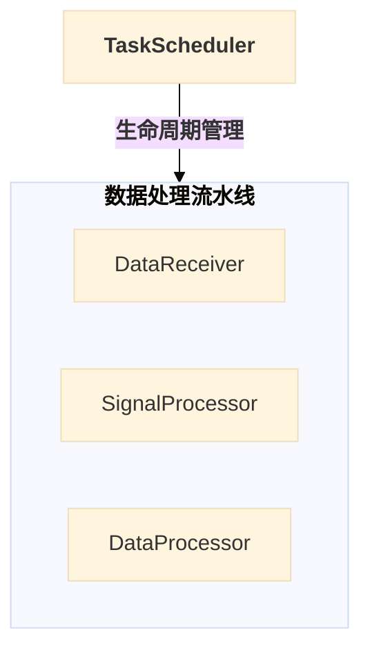

# Mermaid 可视化设计指南

-----

**标题**: Mermaid 可视化设计指南
**文档版本**: v1.0.0
**最后更新**: 2025-10-13
**负责人**: Klein

-----

## 概述

本文件是雷达数据处理系统所有设计文档中，关于 **Mermaid 图表绘制**的官方标准与实践指南。其核心目标是为团队所有成员提供一套统一、清晰、高效的视觉语言，确保我们将复杂的技术架构、交互流程和概念关系，转化为直观、易于理解且风格一致的图表。

遵循本指南不仅能提升文档的专业性和可读性，更重要的是能够**加速知识传递、降低沟通成本、减少因理解偏差导致的错误**。本指南定义的原则、工具和模板，是项目所有 `*.md` 文件中 Mermaid 图表设计的唯一真实来源（Single Source of Truth）。

-----

## 目录

- [Mermaid 可视化设计指南](#mermaid-可视化设计指南)
  - [概述](#概述)
  - [目录](#目录)
  - [1 目的与核心原则](#1-目的与核心原则)
    - [1.1 最终目标：加速理解](#11-最终目标加速理解)
    - [1.2 核心设计四原则](#12-核心设计四原则)
      - [1.2.1 清晰性与去噪音](#121-清晰性与去噪音)
      - [1.2.2 一致性与语义化](#122-一致性与语义化)
      - [1.2.3 目的性与择图](#123-目的性与择图)
      - [1.2.4 聚焦与灵活化](#124-聚焦与灵活化)
  - [2 项目统一视觉语言与配置（硬性标准）](#2-项目统一视觉语言与配置硬性标准)
    - [2.1 基础配置与兼容性](#21-基础配置与兼容性)
    - [2.2 字符与命名规范（强制）](#22-字符与命名规范强制)
    - [2.3 节点与线条语义（全局统一）](#23-节点与线条语义全局统一)
  - [3 实践工具箱：高级技巧与反模式](#3-实践工具箱高级技巧与反模式)
    - [3.1 解决复杂图表的三大难题（强制实践）](#31-解决复杂图表的三大难题强制实践)
      - [3.1.1 可交互的大模块设计（强制推荐）](#311-可交互的大模块设计强制推荐)
      - [3.1.2 隐形锚点：解决连接线遮挡](#312-隐形锚点解决连接线遮挡)
      - [3.1.3 便签式注释：利用子图实现 Note 效果](#313-便签式注释利用子图实现-note-效果)
    - [3.2 颜色与样式灵活应用（聚焦核心）](#32-颜色与样式灵活应用聚焦核心)
  - [3 图表工具箱：按需择图](#3-图表工具箱按需择图)
    - [3.1 `graph`: 描绘系统静态架构](#31-graph-描绘系统静态架构)
      - [3.1.1 用途](#311-用途)
      - [3.1.2 核心语法与技巧](#312-核心语法与技巧)
      - [3.1.3 项目案例：核心处理服务器内部分层架构](#313-项目案例核心处理服务器内部分层架构)
    - [3.2 `flowchart`: 描绘处理流程](#32-flowchart-描绘处理流程)
      - [3.2.1 用途](#321-用途)
      - [3.2.2 核心语法与技巧](#322-核心语法与技巧)
      - [3.2.3 项目案例：两阶段配置验证架构](#323-项目案例两阶段配置验证架构)
    - [3.3 `sequenceDiagram`: 描绘时序交互](#33-sequencediagram-描绘时序交互)
      - [3.3.1 用途](#331-用途)
      - [3.3.2 核心语法与技巧](#332-核心语法与技巧)
      - [3.3.3 项目案例："Happy Path" 端到端数据处理流程](#333-项目案例happy-path-端到端数据处理流程)
    - [3.4 `stateDiagram-v2`: 描绘状态机](#34-statediagram-v2-描绘状态机)
      - [3.4.1 用途](#341-用途)
      - [3.4.2 核心语法与技巧](#342-核心语法与技巧)
      - [3.4.3 项目案例：系统统一状态机设计](#343-项目案例系统统一状态机设计)
    - [3.5 `gantt`: 描绘项目计划与时间线](#35-gantt-描绘项目计划与时间线)
      - [3.5.1 用途](#351-用途)
      - [3.5.2 核心语法与技巧](#352-核心语法与技巧)
      - [3.5.3 项目案例：系统架构演进路线图 (MVP → V2.0)](#353-项目案例系统架构演进路线图-mvp--v20)
    - [3.6 `mindmap`: 描绘概念结构与层级](#36-mindmap-描绘概念结构与层级)
      - [3.6.1 用途](#361-用途)
      - [3.6.2 核心语法与技巧](#362-核心语法与技巧)
      - [3.6.3 项目案例：模块职责定义](#363-项目案例模块职责定义)
    - [3.7 `classDiagram`: 描绘类与接口关系](#37-classdiagram-描绘类与接口关系)
      - [3.7.1 用途](#371-用途)
      - [3.7.2 核心语法与技巧](#372-核心语法与技巧)
      - [3.7.3 项目案例：接口隔离原则下的模块接口体系](#373-项目案例接口隔离原则下的模块接口体系)
  - [4 最佳实践与反模式](#4-最佳实践与反模式)
    - [4.1 推荐做法](#41-推荐做法)
    - [4.2 避免做法](#42-避免做法)
  - [5 快速参考与模板](#5-快速参考与模板)
    - [5.1 标准图表头部模板](#51-标准图表头部模板)
    - [5.2 完整 `classDef` 样式集合](#52-完整-classdef-样式集合)

-----

## 1 目的与核心原则

### 1.1 最终目标：加速理解

  - **图表的角色**：在本技术文档体系中，图表不是装饰品，而是核心信息的 **“翻译器”** 和 **“加速器”**。我们的目标不是画图，而是通过图形化的方式，将抽象的代码结构、复杂的动态交互和深层的设计思想，以**最直接、最低认知负担**的方式传递给读者。
  - **衡量标准**：一份好的图表，应该能让初次接触该设计的工程师在**一分钟内**抓住核心要点。图表的存在是为了回答问题，而不是制造更多问题。

### 1.2 核心设计四原则

所有图表的绘制都必须严格遵守以下四大原则，它们是保证图表**专业质量**和**一致性**的基石。这些原则将指导我们从静态结构到动态交互的全方位可视化实践。

#### 1.2.1 清晰性与去噪音

  - **单一职责**：一张图只应该讲述一个核心故事，无论是展示分层架构、数据流转还是状态变迁，都应有**明确的焦点**。
  - **化繁为简**：如果一张图变得过于拥挤和复杂，则必须将其拆分为多张范围更小、逻辑更聚焦的关联子图。细节应交由图表下方的文字进行阐述。
  - **杜绝线条混乱（强制实践）**：我们**必须杜绝**因活动块与多模块间存在相同交互（例如 $\text{EventBus}$）而导致的**线条交叉和视觉混乱**。对于一个活动块与**三个或更多**模块发生相同交互的场景，**强制**要求采用 **“可交互的大模块设计”** 或 **“隐形锚点”** 等高级技巧进行优化。

#### 1.2.2 一致性与语义化

  - **全局统一**：项目中所有图表必须共享一套统一的视觉语言。相同的颜色、形状和线条样式在不同的文档中必须代表**相同的语义**。
  - **逻辑同构**：图表的布局应反映其内在逻辑。例如，表示分层架构时，应始终采用“自上而下”或“自左向右”的布局来表示依赖或控制关系。
  - **术语规范**：图表中的所有术语和缩写，必须与**项目术语表**保持完全一致。

#### 1.2.3 目的性与择图

  - **按需择图**：必须为正确的表达目的选择正确的图表类型。
    - 展示**静态结构与依赖**，使用 `graph` 或 `flowchart`。
    - 展示**动态时序交互**，使用 `sequenceDiagram`。
    - 展示**生命周期与状态**，使用 `stateDiagram-v2`。
  - **强制考虑要素**：在绘制 `graph` 或 `flowchart` 时，**语义化颜色、多维关系表达、分层分组（`subgraph`）**为**强制性**考虑要素。

#### 1.2.4 聚焦与灵活化

  - **灵活强调原则**：在保留**项目推荐调色盘**的基础色调语义的前提下，允许作者通过调整 `stroke-width`（边框粗细）、`stroke`（边框颜色）、**线条标签颜色**等 $\text{CSS}$ 属性，对图表中的**核心组件、关键路径或重要决策点**进行**特殊、灵活的强调**。
  - **目的驱动**：这种灵活化的样式调整必须服务于**聚焦核心、突出重点**的设计目的，而**严禁**为装饰而装饰，以避免视觉噪音。

-----

## 2 项目统一视觉语言与配置（硬性标准）

  - **概要**: 本章定义了项目中所有 $\text{Mermaid}$ 图表在**代码风格、命名和基础配置**上必须遵守的**强制性基准**。严格遵循这些标准是确保图表在不同工具中**渲染一致性、源代码可维护性和专业性**的前提。

### 2.1 基础配置与兼容性

  - **强制主题与曲线（硬性约束）**：

      - 除了 `mindmap` 和 `gantt` 之外，所有其他图表类型（包括 `graph`、`flowchart`、`sequenceDiagram`、`stateDiagram-v2`、`classDiagram`）**必须**使用统一的主题和曲线配置，以保证渲染风格和线条的专业平滑度。
      - **标准头部模板** (整合快速参考)：在开始编写这些图表时，必须使用以下代码块作为图表的开头：

    ```mermaid
    ---
      config:
        theme: base
        flowchart:
          curve: basis  %% 适用于 graph/flowchart
    ---
    ```

  - **源代码排版（整合风格约束）**：

      - **注释规范**：只允许在 $\text{Mermaid}$ 代码块的**顶层**和**关键结构块**（如 `subgraph`、`classDef`、`participant` 定义区）前使用**概括性注释**（例如：`%% --- 参与者定义 ---`）。**严禁**在语句段内插入行内注释，以保持代码的简洁性。
      - **空行使用**：在 `classDef`、`subgraph` 定义块、`participant` 定义之间等逻辑结构块之间，应**适当保留空行**，以增强 $\text{Markdown}$ 源代码的可读性。

### 2.2 字符与命名规范（强制）

  - **双语命名规范（强制推荐）**：
      - 所有核心组件的节点标签，**强烈推荐**使用**双语命名**格式。
      - **格式示例**：`TASK_SCHEDULER["<b>TaskScheduler</b><br/>任务调度器"]`
  - **字符控制与半角禁令（严禁）**：
      - **半角括号禁令**：**严禁**在 $\text{Mermaid}$ 节点标签、连接标签等元素内容中，使用**半角括号**（`()`、`[]`）。由于半角括号是 $\text{Mermaid}$ 的**保留关键字**，在不同渲染环境可能导致解析错误或语义混乱。
      - **替代方案**：如需在标签中表示括号，**必须优先使用中文全角括号**（`（）`）。
      - **中英混排**：在节点标签中，中文字符与嵌入的英文/数字/代码实体之间，应加入**一个半角空格**进行隔离，以增强视觉可读性。
          - *示例*：`任务队列 ProcessQueue` (错误) $\rightarrow$ `任务队列 ProcessQueue` (正确)

### 2.3 节点与线条语义（全局统一）

  - **原则**：节点形状和线条样式具有**全局固定**的语义，在所有文档中都必须保持一致，以形成团队的视觉肌肉记忆。

  - **节点形状（固定语义）**：

| 节点形状 | 描述 | Mermaid 语法示例 | 建议应用场景 |
| :--- | :--- | :--- | :--- |
| `[...]` | **标准矩形** | `NodeID[文本]` | 标准组件、模块、处理步骤。 |
| `(...)` | **圆角矩形** | `NodeID(文本)` | 外部实体、系统边界、流程的开始/结束。 |
| `[(...)]` | **体育场形** | `NodeID[(文本)]` | 核心数据结构、数据载体（强调数据本身）。 |
| `((...))` | **圆形** | `NodeID((文本))` | 关键实体、入口点（如 EventBus）、数据库。 |
| `{...}` | **菱形** | `NodeID{文本}` | 决策或判断点（主要用于 `flowchart`）。 |

  - **线条样式（固定语义）**：

| 样式 | 符号 | 语义 | 建议应用场景 |
| :--- | :--- | :--- | :--- |
| **控制流 / 强依赖** | `-->` | 同步的调用关系、生命周期管理、强依赖调用。 | `TaskScheduler --> Module` |
| **数据流 / 高性能传递** | `==>` | 高性能数据传输、零拷贝内存传递等**数据面**传输。 | `Processor ==> DataQueue` |
| **事件流 / 弱通知** | `-.->` | 异步事件发布/订阅、弱通知、解耦的信号发送。 | `Module -.-> EventBus` |
| **继承 / 实现** | `..|>` | 在 `classDiagram` 中表示接口实现。 | `Interface ..|> Class` |

-----

## 3 实践工具箱：高级技巧与反模式

  - **概要**: 本章提供经实践验证的**高级技巧**，旨在解决复杂图表中的**可读性和可维护性**难题。它也是**灵活样式原则**的指导实践，帮助作者在遵循统一视觉语言的基础上，实现对核心设计点的**聚焦和强调**。

### 3.1 解决复杂图表的三大难题（强制实践）

本节旨在解决复杂架构图和流程图（`graph` / `flowchart`）中最常见的**线条交叉混乱**和**信息不完整**两大难题。

#### 3.1.1 可交互的大模块设计（强制推荐）

  - **问题场景**: 多个内部组件需要聚合为一个逻辑整体（如“数据处理流水线”），同时这个整体又需要参与到更高层次的交互中（如与调度器的管理关系）。
  - **解决方案**: 使用 `subgraph` 关键字，为大模块命名，并给子图赋予一个 $\text{ID}$，使子图本身成为一个可交互的节点。
  - **强制性实践**: 对于一个活动块（如 $\text{EventBus}$、$\text{TaskScheduler}$）与**三个或更多**模块发生**相同交互**（如发布/订阅、生命周期管理）时，**强烈推荐使用此模式进行聚合，以杜绝线条混乱**。

<!-- end list -->




#### 3.1.2 隐形锚点：解决连接线遮挡

  - **问题场景**: 在无法聚合为大模块时，多个模块连接到同一个核心组件（如 $\text{EventBus}$），导致线条重叠、交叉，难以辨认。
  - **解决方案**: 引入一个\*\*不可见的“锚点节点”\*\*作为中转站，先将所有模块连接到锚点，再由锚点连接到目标组件。
  - **实施步骤**:
    1.  定义锚点：`ANCHOR_NODE[ ]`。
    2.  定义不可见样式：`classDef invisible fill:transparent,stroke:transparent,height:1px,width:1px`。
    3.  应用样式：`class ANCHOR_NODE invisible`。

#### 3.1.3 便签式注释：利用子图实现 Note 效果

  - **问题场景**: $\text{Mermaid}$ 的 `note` 语法在 `flowchart/graph` 中不被支持，但需要为特定节点添加重要、详细的说明。
  - **解决方案**: 创建一个包含说明文字的**子图**，并为其应用**便签样式**（浅黄背景和虚线边框）。
  - **实施步骤**:
    1.  创建子图：`subgraph NoteID["说明文字<br/>支持换行"] ... end`。
    2.  应用样式：使用项目调色盘中的**浅黄色/橙黄色**，并设置虚线边框。
        \*示例：`classDef note fill:#fffbe6,stroke:#d4b106,stroke-width:2px,stroke-dasharray: 5 5`。

### 3.2 颜色与样式灵活应用（聚焦核心）

本节是 **1.2.4 聚焦与灵活化原则**的具体实施指导，旨在确保样式调整是**服务于设计目的**的，而非视觉噪音。

  - **语义化调色盘（基础）**：

      - 图表必须从**项目推荐调色盘**（在 $\text{classDef}$ 模板中定义）中选择基础颜色，确保风格统一。
      - 颜色的基础语义（如浅蓝代表**协调者**，浅黄代表**消息/事件**）在项目内必须保持一致。

  - **灵活强调原则（进阶）**：

      - **强调核心组件**：允许通过使用 **`stroke-width` 属性**来显著增加核心组件（如调度器）的边框粗细（例如 `3px` 或 `4px`），使其在视觉上比普通模块更突出。
      - **强调关键路径**：允许通过调整线条的颜色或粗细，来强调图表中的**关键路径**。例如，在 $\text{A/B}$ 路径中，将**首选路径**的线条颜色设置为更醒目的**深蓝**。
      - **线条标签颜色（采纳）**：允许通过 $\text{CSS}$ 样式注入或 `style` 关键字，改变 `-->|标签|` 中**标签的颜色**，以表达不同的语义。例如，**错误或异常路径的标签**使用**红色**，而**正常数据流标签**使用**蓝色**。

  - **标准 `classDef` 模板（整合）**：

      - 在图表绘制时，**必须**使用以下**标准 $\text{classDef}$ 代码块**作为样式的基础来源，并根据图表上下文，将 `role_A` 等占位符重命名为有意义的角色名（如 `coordinator`、`data_pipeline`）：

    <!-- end list -->

    ```mermaid
    %% --- 标准 classDef 模板 ---
    %% 复制此模板，并根据图表上下文重命名 role_A, role_B 等。
    classDef role_A fill:#e6f7ff,stroke:#1890ff,stroke-width:2px
    classDef role_B fill:#f6ffed,stroke:#52c41a,stroke-width:2px
    classDef role_C fill:#fffbe6,stroke:#d4b106,stroke-width:2px
    classDef role_D fill:#f0f5ff,stroke:#597ef7,stroke-width:2px
    classDef role_E fill:#fff0f6,stroke:#eb2f96,stroke-width:2px
    ```

## 3 图表工具箱：按需择图

  - **概要**: 本章是 Mermaid 可视化实践的核心。我们将详细介绍项目中最常用的几种图表类型，明确它们的适用场景，并提供一个源自本项目真实设计的、足够复杂的“最佳实践”案例。目标是让每位工程师都能为正确的表达目的选择正确的图表工具。

### 3.1 `graph`: 描绘系统静态架构

#### 3.1.1 用途

  - 使用 `graph` (或其别名 `flowchart`) 来描绘系统的 **“静态蓝图”**。它专注于回答以下问题：
      - 系统由哪些核心组件或模块构成？
      - 这些组件在逻辑上是如何分层的？
      - 它们之间存在着怎样的静态依赖或关系？
  - 它非常适合用于展示模块内部的组件划分、整个系统的宏观分层架构，或几个关键模块之间的依赖关系。**它不关心时间顺序或动态交互**，只关心结构。

#### 3.1.2 核心语法与技巧

  - **方向定义**: 在图表开始时使用 `graph TD` (Top-Down) 或 `graph LR` (Left-Right) 来控制整体布局。对于层级和依赖关系，`TD` 通常是最佳选择。
  - **节点定义**: 使用 `NodeID["清晰的节点标签<br/>(支持换行)"]` 来定义一个组件。
  - **关系连接**: 使用不同线条样式来表达不同的语义，并可添加标签说明，例如 `NodeA -->|管理| NodeB`。
  - **逻辑分组 (关键)**: 使用 `subgraph "分组名" ... end` 是构建清晰架构图的**最重要技巧**。它能将相关的组件圈在一起，形成逻辑层次或功能单元，极大地增强了图表的可读性。

**🌟 高级技巧：解决复杂图表的三大难题**

本节介绍三个经实践验证的高级技巧，它们能有效解决复杂架构图中的常见设计挑战：

1. **✅ 强烈推荐：可交互的大模块设计**

   **问题场景**：当需要将多个小模块聚合为一个大模块（如"数据处理流水线"），同时希望这个大模块作为整体能参与到更高层次的交互中（如与 TaskScheduler 的管理关系）。

   **解决方案**：使用 `subgraph` 为大模块命名，并给子图赋予一个 ID，这样子图本身就成为了一个可交互的节点。

   ```mermaid
    ---
      config:
        theme: base
        flowchart:
          curve: basis  %% 适用于 graph/flowchart
    ---
    flowchart TB
       subgraph Pipeline["<b>数据处理流水线</b>"]
           DATA_RECV["数据接收<br/>DataReceiver"]
           SIGNAL_PROC["信号处理<br/>SignalProcessor"]
           DATA_PROC["数据处理<br/>DataProcessor"]
       end

       TASK_ENGINE["<b>TaskScheduler</b><br/>任务调度器"]

       %% Pipeline 作为整体参与交互
       TASK_ENGINE -- "<b>生命周期管理</b>" --> Pipeline

       classDef pipeline fill:#f0f5ff,stroke:#597ef7,stroke-width:2px
       class Pipeline pipeline
   ```

   **优势**：
   - 大模块既能聚拢内部小模块，又能作为独立实体参与高层交互
   - 避免了为每个子模块单独绘制连接线的混乱
   - 清晰展现了"整体-部分"的层次关系
   - 提升了图表的可读性和语义准确性

2. **便签式注释：利用子图实现 Note 效果**

   **问题场景**：Mermaid 的 `note` 语法在 `flowchart/graph` 中不被支持，但有时需要为特定节点添加重要说明。

   **解决方案**：创建一个包含说明文字的子图，并为其应用便签样式（黄色背景）。

   ```mermaid
   flowchart TB
       subgraph ClientNote["<b>显控终端</b>（独立进程）"]
           CLIENT["<b>物理隔离说明</b><br/>CLIENT与Pipeline处于不同进程<br/>通过UDP/REST跨网络通信"]
       end

       GATEWAY["数据网关<br/>DisplayController"]
       GATEWAY == "<b>数据流 (UDP)</b>" ==> ClientNote

       %% 便签样式：黄色背景，虚线边框
       classDef note fill:#fffbe6,stroke:#d4b106,stroke-width:2px,stroke-dasharray: 5 5
       class ClientNote,CLIENT note
   ```

   **优势**：
   - 提供了类似便签的视觉效果
   - 黄色背景使注释信息醒目但不突兀
   - 说明文字可以很长，适合复杂的补充说明

3. **隐形锚点：解决连接线遮挡问题**

   **问题场景**：当多个模块需要连接到同一个核心组件（如 EventBus）时，直接连接会导致线条重叠、交叉，难以辨认。

   **解决方案**：引入一个不可见的"锚点节点"作为中转站，先将所有模块连接到锚点，再由锚点连接到目标组件。

   ```mermaid
   flowchart TB
       subgraph Pipeline["数据处理流水线"]
           DATA_RECV["DataReceiver"]
           SIGNAL_PROC["SignalProcessor"]
       end

       EVENTBUS["<b>EventBus</b><br/>事件总线"]

       %% 引入不可见的锚点节点
       EVENTBUS_ANCHOR[ ]:::invisible

       %% 模块连接到锚点（无标签）
       Pipeline -.- EVENTBUS_ANCHOR

       %% 锚点连接到 EventBus（带标签）
       EVENTBUS_ANCHOR -.-> |"<i>发布/订阅</i>"| EVENTBUS

       %% 定义不可见样式
       classDef invisible fill:transparent,stroke:transparent,height:1px,width:1px
       classDef eventbus fill:#fffbe6,stroke:#d4b106,stroke-width:3px

       class EVENTBUS_ANCHOR invisible
       class EVENTBUS eventbus
   ```

   **优势**：
   - 有效避免了连接线的交叉和遮挡
   - 保持了图表的整洁性和可读性
   - 锚点完全透明，不会引入视觉噪音
   - 适用于任何"多对一"的连接场景

**最佳实践建议**：
- **技巧1（可交互大模块）** 是最推荐的设计模式，应优先考虑使用
- 三个技巧可以组合使用，以应对更复杂的架构表达需求
- 始终保持图表的语义清晰性，不要为了技巧而技巧

#### 3.1.3 项目案例：核心处理服务器内部分层架构

  - **场景描述**: 下图源自 **[`99_模块集成策略.md`](../01_项目设计/02_模块设计/99_模块集成策略.md)**，它精确地描绘了核心处理服务器内部各个组件的逻辑分层和它们之间的静态依赖关系。这是一个优秀的 `graph` 应用案例，因为它清晰地展示了系统的静态组成。

  - **Mermaid 源代码**:

    ```mermaid
    graph TD
        %% --- 图例 (上下文颜色语义) ---
        %% 协调者 (浅蓝): 系统的核心控制器, TaskScheduler。
        %% 基础服务 (浅绿): 为所有模块提供支持的核心服务。
        %% 消息总线 (浅黄): 系统事件通信的中枢。
        %% 数据管道 (淡紫): 核心数据处理流水线中的所有业务模块。
        %% 外部实体 (粉色): 位于本服务器进程之外的交互方。

        subgraph "核心处理服务器内部架构"
            direction LR

            subgraph "调度与服务层"
                direction TB
                TASK_SCHEDULER["<b>TaskScheduler</b><br/>任务调度器"]
                CORE_SERVICES["<b>核心基础服务</b><br/>(ConfigManager, LoggingService)"]
                EVENT_BUS(("<b>EventBus</b><br/>事件总线"))
            end

            subgraph "数据处理流水线层"
                direction TB

                %% 定义一个“范例”模块，用于展示通用交互模式
                PIPELINE_ARCHETYPE["<i>[流水线模块范例]</i>"]

                %% 列出所有实际的模块
                DATA_RECV["DataReceiver"]
                SIGNAL_PROC["SignalProcessor"]
                DATA_PROC["DataProcessor"]
                DISPLAY_GW["DisplayController"]

                style PIPELINE_ARCHETYPE fill:#f0f5ff,stroke:#597ef7,stroke-width:2px,stroke-dasharray: 5 5
                PIPELINE_ARCHETYPE --- DATA_RECV
                PIPELINE_ARCHETYPE --- SIGNAL_PROC
                PIPELINE_ARCHETYPE --- DATA_PROC
                PIPELINE_ARCHETYPE --- DISPLAY_GW
            end
        end

        subgraph "外部实体"
        CLIENT_APP["显控终端<br/>(独立进程)"]
        end

        %% --- 关系定义 ---

        %% 1. 调度器 -> 流水线模块 (控制关系)
        %% TaskScheduler 对该层所有模块都有生命周期管理关系
        TASK_SCHEDULER -->|生命周期管理| PIPELINE_ARCHETYPE

        %% 2. 流水线模块 -> 核心服务 (通用依赖)
        %% 该层所有模块都“使用”核心服务，并与EventBus交互
        PIPELINE_ARCHETYPE -.->|使用| CORE_SERVICES
        PIPELINE_ARCHETYPE <-.->|发布/订阅| EVENT_BUS

        %% 3. 外部接口关系
        CLIENT_APP -->|"控制流 (REST API)"| TASK_SCHEDULER
        DISPLAY_GW -->|"数据流 (UDP)"| CLIENT_APP


        %% --- 标准 classDef 模板 ---
        classDef coordinator fill:#e6f7ff,stroke:#1890ff,stroke-width:3px
        classDef service fill:#f6ffed,stroke:#52c41a,stroke-width:3px
        classDef message_bus fill:#fffbe6,stroke:#d4b106,stroke-width:3px
        classDef data_pipeline fill:#f0f5ff,stroke:#597ef7,stroke-width:3px
        classDef external fill:#fff0f6,stroke:#eb2f96,stroke-width:3px

        %% --- 样式应用 ---
        class TASK_SCHEDULER coordinator
        class CORE_SERVICES service
        class EVENT_BUS message_bus
        class DATA_RECV,SIGNAL_PROC,DATA_PROC,DISPLAY_GW data_pipeline
        class CLIENT_APP external
    ```

  - **图表解读与设计思想**:

      - **分层与分组**: 该图使用 `subgraph` 将服务器内部分为两大逻辑区域：“调度与服务层”和“数据处理流水线层”，清晰地表达了控制与执行分离的设计思想。
      - **语义化颜色**: 通过 `classDef` 和注释中的图例，读者可以快速识别出`TaskScheduler`是核心协调者（浅蓝），`EventBus`是消息中枢（浅黄），而所有数据处理模块共享同一种角色（淡紫）。
      - **多维关系表达**:
          - `-->` (实线箭头) 清晰地表示了 `TaskScheduler` 对数据处理模块的**强控制关系**（生命周期管理）。
          - `-.->` (虚线箭头) 表示了所有模块对 `CORE_SERVICES` 的**服务使用关系**（依赖注入）。
          - `<.-.>` (带点的双向虚线) 表示了与 `EventBus` 的**事件发布/订阅关系**。
      - **外部交互**: 将`显控终端`放在独立的`subgraph`中，并通过不同类型的箭头明确区分了**控制流**与**数据流**，完整地展示了系统与外部的交互模式。

-----

### 3.2 `flowchart`: 描绘处理流程

#### 3.2.1 用途

  - 使用 `flowchart` 来描绘一个具有 **明确起止和步骤顺序的流程**。它非常适合回答以下问题：
      - 一个任务从开始到结束，都经历了哪些步骤？
      - 在流程中存在哪些决策点（分支）？
      - 流程在逻辑上可以划分为哪几个阶段？
  - 它是展示算法执行步骤、配置加载过程、故障恢复预案等顺序性任务的理想工具。与 `graph` 专注于“静态结构”不同，`flowchart` 专注于 **“动态进程”**。

#### 3.2.2 核心语法与技巧

  - **方向定义**: 同样使用 `flowchart TD` (Top-Down) 或 `LR` (Left-Right)。对于多阶段的流程，`TD` 是最自然的选择。
  - **节点形状**: `flowchart` 提供了比 `graph` 更丰富的节点形状，用于表达不同语义。
      - `NodeID[...]`: 矩形，表示一个具体的处理步骤。
      - `NodeID{...}`: 菱形，表示一个决策点，通常会引出两条或多条路径。
      - `NodeID(...)`: 圆角矩形，表示流程的开始或结束。
  - **关系连接**:
      - `-->`: 标准的流程走向。
      - `-->|标签|`: 在箭头上添加标签，常用于表示菱形决策点的“是/否”或“成功/失败”路径。
  - **逻辑分组 (`subgraph`)**: 这是将一个长流程分解为多个逻辑阶段的关键技巧。它可以极大地增强复杂流程图的结构感和可读性。

#### 3.2.3 项目案例：两阶段配置验证架构

  - **场景描述**: 下图源自 **[`06_配置管理模块设计.md`](../01_项目设计/02_模块设计/06_配置管理模块设计.md)**，它完美地展示了一个复杂的、包含多个阶段、决策和并行路径的“配置热更新验证”流程。这是一个优秀的 `flowchart` 案例，因为它将一个复杂的异步交互过程分解得清晰易懂。

  - **Mermaid 源代码**:

    ```mermaid
    flowchart TD
        %% --- 图例 (上下文颜色语义) ---
        %% 通用验证 (浅蓝): 由ConfigManager负责的基础验证。
        %% 业务验证 (浅绿): 由具体业务模块负责的领域特定验证。
        %% 协调机制 (浅黄): 负责驱动和同步整个验证流程的组件。
        %% 结果处理 (淡紫): 验证完成后最终的成功或失败路径。

        subgraph "两阶段配置验证架构"
            direction TB

            subgraph "阶段1: ConfigManager通用验证"
                YAML_SYNTAX["YAML语法验证"]
                FILE_EXISTENCE["文件存在性检查"]
                STRUCTURE_CHECK["配置结构验证"]
                KEY_PRESENCE["必需键检查"]
            end

            subgraph "阶段2: 业务模块验证 (并行)"
                BUSINESS_LOGIC["业务逻辑验证"]
                PARAMETER_RANGE["参数范围检查"]
                DEPENDENCY_CHECK["依赖关系验证"]
            end

            subgraph "协调机制"
                VALIDATION_REQUEST["发布 VALIDATE_CONFIG_CHANGE 事件"]
                TIMEOUT_GUARD{"超时保护 (5s)"}
                VALIDATION_RESPONSE["接收 VALIDATE_SUCCESS/FAILURE 事件"]
                CONSENSUS_COLLECTOR["收集所有模块响应"]
            end

            subgraph "最终结果"
                SUCCESS_PATH["应用配置变更"]
                FAILURE_PATH["拒绝变更并上报错误"]
            end

            %% --- 流程定义 ---
            %% 阶段1 流程
            YAML_SYNTAX --> FILE_EXISTENCE --> STRUCTURE_CHECK --> KEY_PRESENCE

            %% 从阶段1到协调机制
            KEY_PRESENCE --> VALIDATION_REQUEST

            %% 协调与阶段2的交互
            VALIDATION_REQUEST --> TIMEOUT_GUARD
            TIMEOUT_GUARD -->|"向业务模块发出询问"| BUSINESS_LOGIC
            BUSINESS_LOGIC & PARAMETER_RANGE & DEPENDENCY_CHECK -->|"返回验证结果"| VALIDATION_RESPONSE
            VALIDATION_RESPONSE --> CONSENSUS_COLLECTOR

            %% 超时路径
            TIMEOUT_GUARD -->|"5秒内未收到所有响应"| CONSENSUS_COLLECTOR

            %% 结果处理
            CONSENSUS_COLLECTOR -->|"全部成功"| SUCCESS_PATH
            CONSENSUS_COLLECTOR -->|"任何失败或超时"| FAILURE_PATH

        end

        %% --- 标准 classDef 模板 ---
        classDef general_validation fill:#e6f7ff,stroke:#1890ff,stroke-width:2px
        classDef business_validation fill:#f6ffed,stroke:#52c41a,stroke-width:2px
        classDef coordination fill:#fffbe6,stroke:#d4b106,stroke-width:2px
        classDef result fill:#f0f5ff,stroke:#597ef7,stroke-width:2px

        %% --- 样式应用 ---
        class YAML_SYNTAX,FILE_EXISTENCE,STRUCTURE_CHECK,KEY_PRESENCE general_validation
        class BUSINESS_LOGIC,PARAMETER_RANGE,DEPENDENCY_CHECK business_validation
        class VALIDATION_REQUEST,TIMEOUT_GUARD,VALIDATION_RESPONSE,CONSENSUS_COLLECTOR coordination
        class SUCCESS_PATH,FAILURE_PATH result
    ```

  - **图表解读与设计思想**:

      - **阶段化分解**: 该图使用 `subgraph` 将复杂的验证流程清晰地分解为四个逻辑阶段：“通用验证”、“业务验证”、“协调机制”和“最终结果”，使得读者可以循序渐进地理解整个过程。
      - **决策点的清晰表达**: 菱形节点 `TIMEOUT_GUARD` 和 `CONSENSUS_COLLECTOR` 及其带标签的连线，非常直观地展示了流程中的核心决策逻辑（超时判断和共识判断）。
      - **并行性暗示**: 在“阶段2: 业务模块验证”中，多个验证步骤被并列呈现，并且通过 `&` 连接符共同指向 `VALIDATION_RESPONSE`，巧妙地暗示了这些验证是可以由不同模块并行执行的。
      - **语义化颜色**: 同样地，通过 `classDef` 和图例，不同角色的组件（如通用验证、业务验证）被赋予了不同的颜色，使得它们的职责划分一目了然。
      - **端到端完整性**: 该图描绘了从“输入”（配置检查）到“最终输出”（应用或拒绝）的完整闭环，没有遗漏任何关键路径，包括了重要的“超时”异常路径。

-----

### 3.3 `sequenceDiagram`: 描绘时序交互

#### 3.3.1 用途

  - 使用 `sequenceDiagram` 来描绘多个组件或模块之间 **按时间顺序发生的动态交互**。它专注于回答以下问题：
      - 一个请求或一个数据流是如何在系统中传递的？
      - 各个组件的调用顺序是什么？
      - 交互是同步的（等待响应）还是异步的（立即返回）？
  - 它是解释端到端业务流程、故障恢复协调、配置热更新等复杂交互场景的**唯一指定工具**。与 `graph` 描绘“静态骨架”不同，`sequenceDiagram` 描绘的是“动态血脉”。

#### 3.3.2 核心语法与技巧

  - **参与者 (Participants)**: 使用 `participant Name as Alias` 定义流程中的参与者。使用 `actor` 可以表示用户或外部系统。
  - **消息传递**:
      - `->>`: **同步消息**。表示发送方发出消息后，会等待接收方处理完成。
      - `->`: **异步消息**。表示发送方发出消息后，不等待响应，立即继续执行。
      - `-->>` 和 `-->`: 分别表示同步和异步的**返回消息**。
  - **生命周期激活 (Activation)**: 使用 `activate Participant` 和 `deactivate Participant` 可以高亮显示参与者在处理消息期间的“激活”状态，这能清晰地展示出调用栈和执行时间。
  - **流程控制**:
      - `loop [描述] ... end`: 表示一个循环块。
      - `alt [条件1] ... else [条件2] ... end`: 表示一个 `if-else` 逻辑分支。
      - `par [任务1] ... and [任务2] ... end`: 表示可以并行执行的任务。
  - **注解 (Notes)**: 使用 `Note over A,B: 文本` 或 `Note right of A: 文本` 可以在图表中添加关键的解释性说明，这是增强图表信息量的核心技巧。

#### 3.3.3 项目案例："Happy Path" 端到端数据处理流程

  - **场景描述**: 下图源自 **[`99_模块集成策略.md`](../01_项目设计/02_模块设计/99_模块集成策略.md)**，是整个系统最核心的业务流程图。它完美展示了从雷达硬件发出UDP包，到数据在服务器内部多个模块间流转，最终被发送到独立显控终端并渲染出来的完整生命周期。这是一个展示复杂、分布式、多阶段交互的最佳 `sequenceDiagram` 案例。

  - **Mermaid 源代码**:

    ```mermaid
    sequenceDiagram
        %% --- 参与者定义 ---
        participant Radar as 雷达硬件
        participant DataReceiver as 数据接收模块
        participant SignalProcessor as 信号处理模块
        participant DataProcessor as 数据处理模块
        participant DisplayController as 数据网关模块
        participant Network as 物理网络 (UDP)
        participant ClientApp as 显控终端 (独立应用)

        %% --- 注解：定义图表的核心故事 ---
        Note over Radar,ClientApp: 端到端数据处理流程 (分布式架构)

        %% --- 阶段1: 数据接收与缓存 ---
        Radar->>DataReceiver: 1. 发送UDP数据包 (原始I/Q数据)
        activate DataReceiver
        DataReceiver->>DataReceiver: 2. 解析、验证、生成TraceID
        DataReceiver-->>SignalProcessor: 3. 推送DataObject指针至缓冲区
        deactivate DataReceiver

        %% --- 阶段2: GPU信号处理 ---
        SignalProcessor->>SignalProcessor: 4. 从缓冲区获取DataObject
        activate SignalProcessor
        Note right of SignalProcessor: 继承TraceID, 开始GPU计算
        SignalProcessor->>SignalProcessor: 5. 执行GPU算法流水线 (FFT->滤波->CFAR)
        SignalProcessor-->>DataProcessor: 6. 推送DetectionResult指针至缓冲区
        deactivate SignalProcessor

        %% --- 阶段3: 目标跟踪处理 ---
        DataProcessor->>DataProcessor: 7. 从缓冲区获取DetectionResult
        activate DataProcessor
        DataProcessor->>DataProcessor: 8. 数据关联与航迹管理 (CPU密集型)
        DataProcessor-->>DisplayController: 9. 推送TrackData指针至缓冲区
        deactivate DataProcessor

        %% --- 阶段4: 数据网关处理与网络分发 ---
        DisplayController->>DisplayController: 10. 从缓冲区获取TrackData
        activate DisplayController
        DisplayController->>DisplayController: 11. 序列化TrackData (Protobuf)
        Note right of DisplayController: TraceID被一同序列化
        DisplayController->>Network: 12. 发送UDP单播数据包
        deactivate DisplayController

        %% --- 阶段5: 客户端接收与显示 ---
        Network->>ClientApp: 13. 接收UDP数据包
        activate ClientApp
        ClientApp->>ClientApp: 14. 反序列化数据并提取TraceID
        ClientApp->>ClientApp: 15. 渲染目标点到屏幕
        deactivate ClientApp

        Note over Radar,ClientApp: 完整链路处理完成
    ```

  - **图表解读与设计思想**:

      - **端到端视角**: 该图包含了从硬件到最终UI的**所有关键参与者**，包括了物理网络和独立的应用进程，完整地展现了分布式架构的全貌。
      - **阶段化叙事**: 通过 `activate`/`deactivate` 和 `Note` 注解，将复杂的流程清晰地划分为五个逻辑阶段（数据接收、信号处理、跟踪处理、网关分发、客户端显示），引导读者逐步理解。
      - **动静分离**: 图表清晰地展示了模块间的**动态交互**，而每个模块内部的“静态组成”则由各自设计文档中的 `graph` 图负责。这体现了“为正确目的选择正确图表”的原则。
      - **关键信息高亮**: 通过 `Note right of ...` 突出了 `TraceID` 的传递、GPU计算的发生、Protobuf序列化等核心技术点，使读者不仅知道“发生了什么”，还知道“关键点在哪”。
      - **数据流向清晰**: 使用了 `->>` (同步处理) 和 `-->>` (异步推送至下一缓冲区) 两种箭头，精确表达了数据在流水线中的传递方式。

-----

### 3.4 `stateDiagram-v2`: 描绘状态机

#### 3.4.1 用途

  - 使用 `stateDiagram-v2` 来描绘一个对象、模块或整个系统 **所有可能存在的状态，以及在何种条件下从一个状态转换到另一个状态**。它专注于回答以下问题：
      - 系统有哪些核心状态？（如：初始化中、运行中、失败）
      - 是什么事件或操作触发了状态的改变？
      - 状态转换是否存在一个有序的、可预测的路径？
  - 它是为**模块生命周期管理**、**故障恢复逻辑**和任何具有复杂状态转换行为的组件建立清晰模型的最佳工具。

#### 3.4.2 核心语法与技巧

  - **状态定义**: 直接写状态名即可定义一个状态，例如 `RUNNING`。使用 `[*]` 表示流程的开始或结束。
  - **状态转换**: 使用 `-->` 来表示状态之间的转换。例如 `INITIALIZING --> RUNNING`。
  - **转换标签**: 在箭头上添加冒号 `:` 和文本，用以说明触发转换的事件或条件。例如 `RUNNING --> STOPPING : 收到停止命令`。
  - **注释**: 使用 `note right of [状态名]` 来为特定状态添加详细的说明，这对于解释状态的含义非常有用。
  - **复合状态 (高级)**: 使用 `state [状态名] { ... }` 可以创建包含子状态的复合状态，用于描述更复杂的嵌套状态机。

#### 3.4.3 项目案例：系统统一状态机设计

  - **场景描述**: 下图源自 **[`05_任务调度器设计.md`](../01_项目设计/02_模块设计/05_任务调度器设计.md)**，它描绘了整个雷达数据处理系统的顶层状态机。这是一个绝佳的 `stateDiagram-v2` 案例，因为它不仅展示了“Happy Path”（正常启停流程），还完整地定义了错误、恢复和失败等所有异常状态的转换路径，为系统的稳定性和可靠性提供了模型基础。

  - **Mermaid 源代码**:

    ```mermaid
    stateDiagram-v2
        %% --- 初始与结束状态 ---
        [*] --> SystemUninitialized : 系统上电

        %% --- 正常启动流程 ---
        SystemUninitialized --> SystemInitializing : 收到"系统启动"事件
        SystemInitializing --> SystemReady : 所有模块初始化成功
        SystemReady --> SystemStarting : 收到"开始运行"命令
        SystemStarting --> SystemRunning : 所有模块启动成功

        %% --- 正常运行与暂停 ---
        SystemRunning --> SystemPausing : 收到"暂停"命令
        SystemPausing --> SystemPaused : 所有模块暂停完成
        SystemPaused --> SystemResuming : 收到"恢复"命令
        SystemResuming --> SystemRunning : 所有模块恢复运行

        %% --- 正常停止流程 ---
        SystemRunning --> SystemStopping : 收到"停止"命令
        SystemPaused --> SystemStopping : 收到"停止"命令
        SystemStopping --> SystemStopped : 所有模块停止完成
        SystemStopped --> SystemUninitialized : 收到"系统重置"命令

        %% --- 异常与恢复路径 ---
        SystemInitializing --> SystemError : 任一模块初始化失败
        SystemStarting --> SystemError : 任一模块启动失败
        SystemPausing --> SystemError : 任一模块暂停失败
        SystemResuming --> SystemError : 任一模块恢复失败

        SystemError --> SystemRecovering : 自动或手动触发恢复
        SystemRecovering --> SystemReady : 恢复成功, 返回就绪状态
        SystemRecovering --> SystemFailed : 恢复流程失败

        %% --- 最终失败与重置 ---
        SystemFailed --> SystemUninitialized : 需要"系统重置"进行干预

        %% --- 注释说明 ---
        note right of SystemRunning
            系统核心业务运行状态。
            所有数据处理流水线在此状态下工作。
        end note
        note right of SystemError
            一个或多个模块发生错误。
            系统暂停核心业务，等待恢复决策。
        end note
        note left of SystemFailed
            恢复尝试失败，系统无法自动复原。
            必须由外部（如操作员）
            发起"系统重置"才能重新开始。
        end note
    ```

  - **图表解读与设计思想**:

      - **生命周期全覆盖**: 该图清晰地描绘了系统从上电 `SystemUninitialized` 到最终关机重置的完整生命周期，没有遗漏任何一个核心状态。
      - **路径明确**: 每一条状态转换的箭头都附有清晰的**触发条件**（如：“收到‘暂停’命令”），使得读者可以精确地理解状态变化的因果关系。
      - **异常处理的可视化**: 图表没有回避复杂性，而是将 `SystemError`、`SystemRecovering` 和 `SystemFailed` 等异常状态作为一等公民包含进来。这使得系统的**容错和恢复逻辑**变得非常直观，任何人都能看懂在发生错误后，系统会如何尝试恢复，以及何时需要人工干预。
      - **信息注解**: 通过 `note` 关键字，为 `SystemRunning`、`SystemError` 和 `SystemFailed` 等关键状态添加了详细的文字说明。这极大地增强了图表的信息量，解释了每个状态的具体业务含义，避免了读者的猜测。
      - **逻辑闭环**: 所有的状态路径最终都形成了逻辑闭环，要么回到一个稳定状态（如 `SystemRunning` 或 `SystemUninitialized`），要么进入一个明确的终止状态（如 `SystemFailed`），展示了设计的严谨性。

-----

### 3.5 `gantt`: 描绘项目计划与时间线

#### 3.5.1 用途

  - 使用 `gantt` (甘特图) 来可视化**项目或任务的时间安排**。它专注于回答以下问题：
      - 一个项目包含哪些主要阶段和具体任务？
      - 每个任务的计划开始时间、持续时间和当前状态是什么？
      - 任务之间是否存在依赖关系（例如，任务B必须在任务A完成后才能开始）？
      - 项目的关键里程碑是什么？
  - 它是为**开发路线图**、**版本发布计划**、**文档编写顺序**等与时间相关的规划提供清晰视图的理想工具。

#### 3.5.2 核心语法与技巧

  - **图表设置**:
      - `title [标题]`: 设置整个甘特图的标题。
      - `dateFormat [格式]`: 定义日期的输入格式，例如 `YYYY-MM-DD`。
      - `axisFormat [格式]`: 定义时间轴的显示格式，例如 `%Y-%m` (年-月)。
  - **阶段划分**: 使用 `section [阶段名]` 来将任务分组，形成逻辑上的项目阶段。
  - **任务定义**: 格式为 `任务名 :[状态], [ID], [起始], [持续/结束]`。
      - **状态 (可选)**: `done` (已完成), `active` (进行中), `crit` (关键任务)。
      - **ID (可选)**: 任务的唯一标识符，用于定义依赖。
      - **起始**: 任务的开始日期或在另一个任务之后 (`after id1`)。
      - **持续/结束**: 任务的持续时间 (`30d` 表示30天) 或明确的结束日期。
  - **里程碑**: 使用 `任务名 :milestone, [ID], [日期], [持续]` 来定义一个关键的项目节点。

#### 3.5.3 项目案例：系统架构演进路线图 (MVP → V2.0)

  - **场景描述**: 下图为一个典型的系统架构演进路线图，它规划了从最小可行产品（MVP）到功能完备的V2.0版本的开发路径。这是一个优秀的甘特图案例，因为它包含了并行任务、跨阶段依赖、关键任务高亮和阶段性交付物（里程碑），真实地反映了复杂软件项目的管理视图。

  - **Mermaid 源代码**:

    ```mermaid
    gantt
        %% --- 图表设置 ---
        title 架构演进路线图 (MVP → V2.0)
        dateFormat  YYYY-MM-DD
        axisFormat  %Y-%m

        %% --- 阶段1: MVP - 核心架构验证 ---
        section MVP阶段 (架构验证)
        架构与数据通路验证 :done, mvp_a, 2025-08-01, 60d
        并发模型与核心接口定义 :done, mvp_b, after mvp_a, 30d
        产出 - 骨架代码, 模块接口, 性能基线 :milestone, mvp_milestone, 2025-10-30, 0d

        %% --- 阶段2: V1.0 - 核心功能集成 ---
        section V1.0 (功能集成)
        真实算法集成 (FFT/CFAR/关联) :active, v1_a, 2025-11-01, 75d
        算法适配层与策略模式实现 :v1_b, after v1_a, 30d
        产出 - 功能完整版本, 算法正确率报告 :milestone, v1_milestone, 2026-02-15, 0d

        %% --- 阶段3: V2.0 - 性能与稳定性 ---
        section V2.0 (性能与稳定性)
        性能瓶颈分析与优化 (零拷贝/CUDA) :crit, v2_a, 2026-02-16, 60d
        长稳测试与故障恢复增强 :crit, v2_b, after v2_a, 45d
        产出 - 性能优化报告, 7x24h稳定性证明 :milestone, v2_milestone, 2026-06-01, 0d
    ```

  - **图表解读与设计思想**:

      - **宏观规划与分阶段**: `section` 将整个演进过程清晰地划分为 MVP、V1.0 和 V2.0 三个主要阶段，每个阶段都有明确的目标（架构验证、功能集成、性能稳定），为团队提供了清晰的宏观路线图。
      - **目标驱动的里程碑**: 每个 `section` 的结尾都定义了一个 `milestone`，明确了该阶段的核心**交付物**（“产出 - ...”）。这使得计划不再仅仅是时间的堆砌，而是以达成具体目标为导向，非常符合现代项目管理思想。
      - **关键路径高亮**: 在 V2.0 阶段，两个核心任务都被标记为 `crit` (critical)。这在视觉上高亮了项目当前的关键路径，提醒所有成员这些是决定项目成败和进度的核心任务，需要优先保证资源。
      - **真实的任务依赖**: 图表通过 `after` 关键字清晰地展示了任务间的依赖关系，既有阶段内的顺序依赖（`v1_b, after v1_a`），也隐含了阶段间的依赖（V1.0在MVP里程碑后开始）。
      - **适应性的时间尺度**: 对于一个跨年的长期规划，`axisFormat %Y-%m` (年-月) 提供了比 `%m-%d` (月-日) 更合适的宏观时间视图，避免了时间轴过于拥挤。

-----

### 3.6 `mindmap`: 描绘概念结构与层级

#### 3.6.1 用途

  - 使用 `mindmap` (思维导图) 来**从一个中心主题发散，展示其层次化的组成部分或相关概念**。它专注于回答以下问题：
      - 一个复杂的模块由哪些主要职责构成？
      - 一个核心功能可以被分解为哪些子功能？
      - 一个设计文档的章节结构是怎样的？
  - 它非常适合用于**头脑风暴**、**功能分解**和提供一个主题的**高层级概览**。与 `flowchart` 的线性流程不同，`mindmap` 是辐射状的，强调的是“是什么”而不是“怎么做”。

#### 3.6.2 核心语法与技巧

  - **根节点**: 图表以 `mindmap` 关键字开始，第一行通常是根节点，使用 `root((文本))` 格式来创建一个醒目的圆形中心。
  - **层级与缩进**: 思维导图的核心在于**缩进**。每一级缩进代表了更深一层的分支。
  - **节点样式 (项目规范)**:
      - **二级节点**: 使用 Markdown 的 `**粗体**` 语法来定义第二级的主要分支，这能创建强烈的视觉分组效果。
      - **叶子节点**: 直接使用纯文本。
      - **简洁性**: 为保持图表的清晰，应**省略**节点前的冒号或其他不必要的符号。
  - **分支形状**: Mermaid 允许为不同分支指定形状，但为保持简洁，本项目中我们通常使用默认的线条分支。

#### 3.6.3 项目案例：模块职责定义

  - **场景描述**: 下图源自 **[`01_数据接收模块设计.md`](../01_项目设计/02_模块设计/01_数据接收模块设计.md)**，用于在高层级上定义“数据接收模块”的全部职责范围。这是一个完美的 `mindmap` 应用案例，因为它能让任何读者在10秒内快速掌握该模块是做什么的，包含了哪些核心功能领域。

  - **Mermaid 源代码**:

    ```mermaid
    mindmap
      root((数据接收模块))
        **核心职责**
          UDP数据包接收
          数据包解析
          数据完整性验证
          缓冲区管理
        **质量保障**
          错误处理
          流量控制
          性能监控
          异常恢复
        **资源协调**
          GPU资源协调
          抢占式优先级控制
          任务切分与调度
          双优先级流管理
        **对外服务**
          数据提供服务
          状态报告服务
          配置管理服务
          统计收集服务
    ```

  - **图表解读与设计思想**:

      - **中心辐射结构**: 图表以 `((数据接收模块))` 为绝对中心，所有信息都围绕它展开，这完全符合思维导图的表达直觉。
      - **清晰的功能分组**: 通过 `**粗体**` 形式的二级节点（`**核心职责**`, `**质量保障**` 等），将模块的数十个具体职责清晰地归纳为四个主要领域。这种视觉分组是快速理解模块全貌的关键。
      - **层次化分解**: 简单的缩进关系清晰地展示了从“模块”到“功能领域”再到“具体职责”的层次化分解过程，逻辑非常清晰。
      - **高信息密度与易读性的平衡**: 该图在有限的空间内高效地传递了大量信息，但由于其清晰的结构和简洁的文本，并未显得拥挤或混乱。它是一个优秀的高层概览工具，为读者进入更深层次的技术细节讨论做好了铺垫。

-----

### 3.7 `classDiagram`: 描绘类与接口关系

#### 3.7.1 用途

  - 使用 `classDiagram` 来**可视化面向对象设计 (OOD) 中的静态结构**。它专注于回答以下问题：
      - 系统中有哪些核心的类和接口？
      - 它们之间存在什么样的关系（继承、实现、关联、聚合、组合）？
      - 一个类或接口包含哪些重要的属性和方法？
  - 它是为**展示接口隔离原则**、**解释继承体系**、**说明策略模式**等面向对象设计模式提供清晰模型的首选工具。

#### 3.7.2 核心语法与技巧

  - **类与接口**:
      - `class ClassName { ... }`: 定义一个类。
      - `class InterfaceName { <<Interface>> ... }`: 使用 `<<Interface>>` 标注来定义一个接口（纯虚基类）。
  - **关系**:
      - `Base <|-- Derived`: **继承** (Derived 继承自 Base)。
      - `Interface <|.. Implementation`: **实现** (Implementation 实现 Interface)。
      - `ClassA *-- ClassB`: **组合** (A 拥有 B，生命周期绑定)。
      - `ClassA o-- ClassB`: **聚合** (A 拥有 B，生命周期不绑定)。
      - `ClassA --> ClassB`: **关联** (A 使用 B)。
  - **成员**: 在类的大括号内，可以定义属性和方法。例如 `+string name` (公有属性), `-int calculate() T` (私有方法，返回类型为T)。
  - **如何添加中文注释 (关键技巧)**
      - **源代码注释 (`%%`)**: 用于解释 Mermaid 代码，不会显示在图上。
        ```mermaid
        %% 这是一个 DataReceiver 类的定义
        class DataReceiver
        ```
      - **可见笔记 (`note`)**: 这是在图表上添加解释性文本的**最佳方式**。
          - **通用笔记**: `note "这是一条通用注释"`
          - **关联到类的笔记**: `note for ClassName "这条注释解释了 ClassName 的作用"`

#### 3.7.3 项目案例：接口隔离原则下的模块接口体系

  - **场景描述**: 下图源自 **[`99_模块集成策略.md`](../01_项目设计/02_模块设计/99_模块集成策略.md)**，用于清晰地展示系统如何应用**接口隔离原则 (ISP)**，将一个庞大的 `IModule` 接口拆分为多个职责单一的小接口，并由一个具体的业务模块（`DataReceiver`）按需组合实现。这是一个完美的 `classDiagram` 案例，因为它不仅画出了结构，更通过 `note` 解释了其背后的设计哲学。

  - **Mermaid 源代码**:

    ```mermaid
    ---
      config:
        theme: base
        flowchart:
          curve: basis
    ---
    classDiagram
        %% --- 接口定义 ---
        class ILifecycleManaged {
            <<Interface>>
            +initialize() ErrorCode
            +start() ErrorCode
            +stop() ErrorCode
            +cleanup() ErrorCode
            +getState() ModuleState
        }
        note for ILifecycleManaged "定义所有模块必须实现的<br/><b>基础生命周期契约</b>。<br/>这是被TaskScheduler管理的基础。"

        class IPausable {
            <<Interface>>
            +pause() ErrorCode
            +resume() ErrorCode
        }

        class IMonitorable {
            <<Interface>>
            +getHealthStatus() HealthStatus
        }

        %% --- 具体实现类 ---
        class DataReceiver {
            -ModuleState state_
            -bool paused_
            +initialize() ErrorCode
            +start() ErrorCode
            +stop() ErrorCode
            +cleanup() ErrorCode
            +getState() ModuleState
            +pause() ErrorCode
            +resume() ErrorCode
            +getHealthStatus() HealthStatus
        }
        note for DataReceiver "<b>全功能业务模块示例</b><br/>它需要完整的生命周期管理、<br/>暂停/恢复以及健康监控能力，<br/>因此实现了所有相关的角色接口。"

        %% --- 关系定义 ---
        DataReceiver ..|> ILifecycleManaged
        DataReceiver ..|> IPausable
        DataReceiver ..|> IMonitorable
    ```

  - **图表解读与设计思想**:

      - **可视化设计原则**: 该图的核心价值在于它将抽象的“接口隔离原则”具象化了。读者可以清晰地看到，一个模块的能力是由它实现的**接口组合**来定义的，而不是继承自一个臃肿的基类。
      - **注释的画龙点睛作用**: **`note` 的使用是本图的灵魂**。
          - `ILifecycleManaged` 的注释解释了 **“为什么”**要有这个接口（“基础生命周期契约”）。
          - `DataReceiver` 的注释解释了 **“为什么”**它要实现这么多接口（“全功能业务模块示例”）。
          - 这些注释将图表从一个单纯的“代码结构图”提升到了**“设计思想传达图”**的高度。
      - **清晰的关系表达**: `..|>` (虚线空心三角箭头) 清晰地表达了 `DataReceiver` 是对多个接口的**实现 (realization)** 关系，符合UML标准。
      - **职责分离**: 通过将 `ILifecycleManaged`, `IPausable`, `IMonitorable` 分开定义，图表本身就传达了“生命周期管理”、“可暂停能力”、“可监控能力”是三种可以独立存在的不同职责。

-----

## 4 最佳实践与反模式

- **概要**: 掌握了图表的“语法”之后，本章将传授如何写出“好文章”的**“文法”**。遵循这些最佳实践，可以确保我们绘制出的图表不仅技术上正确，而且在信息传达上高效、优雅。同样，了解并避免常见的反模式，可以帮助我们远离那些看似信息量大，实则难以阅读的“视觉陷阱”。

### 4.1 推荐做法

- **聚焦核心：一张图只讲一个核心故事**
  - **原则**：在动手画图前，先用一句话明确这张图的核心目的（例如：“这张图展示了数据接收模块的内部三层逻辑结构”）。然后，图中的所有元素都应服务于这个核心目的，任何无关的细节都应被移除。
  - **实践**：与其在一张系统总览图中详细画出每个模块的内部组件，不如先画一张只包含模块和它们之间关系的宏观图，然后为每个模块单独绘制其内部组件的详细图。

- **善用分组 (`subgraph`)：创建视觉层次**
  - **原则**：`subgraph` 是将混乱变有序的最强大工具。它通过创建“盒子”来将逻辑上相关的节点圈在一起，从而在视觉上建立清晰的层次感和归属感。
  - **实践**：在绘制任何包含超过5个节点的图表时，都应首先思考：这些节点是否可以被归入几个逻辑分组？例如，在架构图中按“层”分组，在流程图中按“阶段”分组。

- **注释代码 (`%%`)：为未来的你和同事着想**
  - **原则**：Mermaid 源代码也是代码，同样需要注释。清晰的注释可以解释你当初的设计意图、颜色选择的语义，或是一个复杂连接的背后逻辑。
  - **实践**：为每个 `classDef` 块添加注释说明颜色含义；为每个复杂的 `subgraph` 或连接关系添加注释，解释其目的。这在几个月后维护文档时，会节省大量的时间。

- **标记流向 (`-->|描述|`)：让关系不言自明**
  - **原则**：箭头连接了两个节点，但它没有告诉我们这种连接的**性质**。为关键的连接线添加简短、精确的标签，是提升图表信息密度的关键。
  - **实践**：在`graph`图中，用它来表示“管理”、“使用”、“依赖”等关系；在`flowchart`中，用它来表示菱形决策的“是/否”分支；在`sequenceDiagram`中，用它来简述传递的消息内容。

### 4.2 避免做法

- **避免“上帝图” (The "God" Diagram)**
  - **反模式**：试图在一张图表中画出系统的所有组件、所有关系、所有流程。结果往往是一张巨大、线条盘根错节、无法阅读的“意大利面条图”。
  - **解决方案**：**拆分**。遵循单一职责原则，将“上帝图”拆分为多张聚焦于特定视角（如：宏观架构图、核心数据流图、故障恢复流程图）的子图。

- **避免视觉噪音 (Visual Noise)**
  - **反模式**：滥用各种节点形状、线条样式和颜色，却没有赋予它们清晰、一致的语义。这只会分散读者的注意力，增加认知负担。
  - **解决方案**：**克制**。严格遵循 **第二章“项目统一视觉语言”** 的规范。只在能够明确传递额外信息时才使用特殊的形状或线条。在大多数情况下，简单的矩形和 `-->` 箭头就足够了。

- **图文不分：避免在图中写“小说”**
  - **反模式**：在节点标签或 `note` 中写入大段的解释性文字。这使得图表本身变得臃肿，破坏了其作为“骨架”的简洁性。
  - **解决方案**：**图是骨架，文是血肉**。图表应专注于展示**结构和关系**，而详细的解释、背景和原因应放在图表下方或上方的Markdown正文中。图表的 `note` 和标签只应用于画龙点睛式的简短提示。

-----

## 5 快速参考与模板

  - **概要**: 本章是 `Mermaid可视化设计指南` 的实用工具箱。它将前面章节中定义的核心规范，固化为两个可以直接复制粘贴的代码模板：**标准图表头部**和**完整 `classDef` 样式集合**。在绘制任何新图表时，您都应该从这里开始，以确保您的图表从一开始就符合项目的统一视觉标准。

### 5.1 标准图表头部模板

  - **用途**: 为 `graph` 和 `flowchart` 类型的图表提供一个统一的、包含项目标准主题和曲线样式的头部。

  - **使用方法**: 在开始编写任何 `graph` 或 `flowchart` 图表时，复制并粘贴以下代码作为图表的开头。

  - **代码模板**:

    ```mermaid
    ---
      config:
        theme: base
        flowchart:
          curve: basis
    ---
    ```

### 5.2 完整 `classDef` 样式集合

  - **用途**: 提供项目中所有标准语义角色的 `classDef` 样式定义。这确保了所有图表都源自**项目推荐调色盘**，从而在视觉风格上保持高度一致。

  - **使用方法**:

    1.  复制以下完整的 `classDef` 代码块并粘贴到您的 Mermaid 图表代码中。
    2.  根据您图表的具体上下文，将 `role_A`, `role_B` 等占位符重命名为有意义的角色名（例如，`coordinator`, `service`, `data_pipeline`）。
    3.  在图表末尾，使用 `class [节点ID] [角色名]` 的方式将样式应用到具体节点上。

  - **代码模板**:

    ```mermaid
    %% --- 标准 classDef 模板 ---
    %% 复制此模板，并根据图表上下文重命名 role_A, role_B 等。
    classDef role_A fill:#e6f7ff,stroke:#1890ff,stroke-width:2px  // 主角色/协调者 (浅蓝)
    classDef role_B fill:#f6ffed,stroke:#52c41a,stroke-width:2px  // 支撑服务/组件 (浅绿)
    classDef role_C fill:#fffbe6,stroke:#d4b106,stroke-width:2px  // 消息/事件/数据 (浅黄)
    classDef role_D fill:#f0f5ff,stroke:#597ef7,stroke-width:2px  // 处理单元/模块 (淡紫)
    classDef role_E fill:#fff0f6,stroke:#eb2f96,stroke-width:2px  // 外部/客户端 (粉色)
    ```
