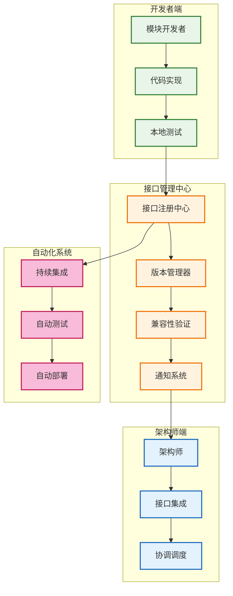
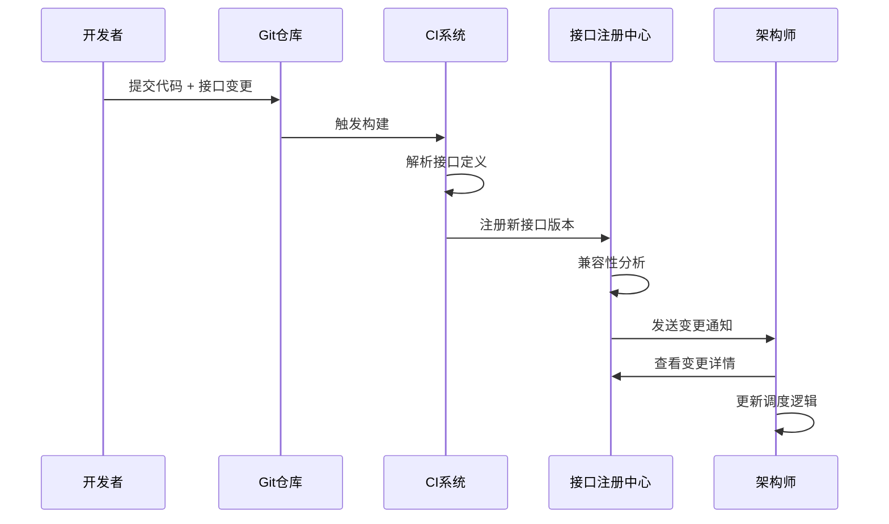
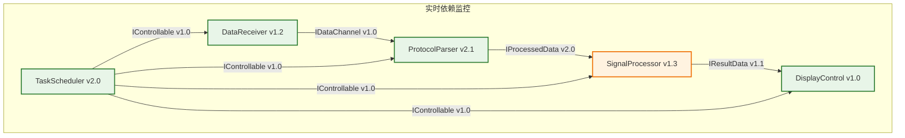

# 接口同步管理方案 - 解决模块间接口变更协调问题

## 问题背景
当信号处理负责人今天写了新的代码和接口，如何及时同步到架构师进行调用和更新？这是模块化开发中的核心问题。

## 解决方案总览

### 方案架构


## 详细实施方案

### 1. 接口注册中心 (Interface Registry)

#### 1.1 接口定义标准化
```cpp
// 接口元数据定义
struct InterfaceMetadata {
    std::string module_name;        // 模块名称
    std::string interface_name;     // 接口名称
    std::string version;            // 版本号 (semantic versioning)
    std::string author;             // 开发者
    std::string description;        // 功能描述
    std::vector<std::string> dependencies; // 依赖接口
    std::string contract_hash;      // 接口契约哈希
    std::time_t last_modified;      // 最后修改时间
};

// 接口注册宏
#define REGISTER_INTERFACE(module, interface, version, desc) \
    static InterfaceRegistrar __reg_##interface(#module, #interface, version, desc);
```

#### 1.2 接口注册流程


### 2. 自动化通知系统

#### 2.1 通知触发条件
- **新接口添加**: 模块添加了新的对外接口
- **接口签名变更**: 函数参数、返回值类型变化
- **接口行为变更**: 功能语义发生变化
- **依赖关系变更**: 模块依赖的其他接口发生变化
- **性能特性变更**: 接口性能指标发生显著变化

#### 2.2 通知内容模板
```markdown
## 接口变更通知

**模块名称**: SignalProcessor
**变更类型**: 接口签名变更
**变更时间**: 2025-09-05 14:30:00
**开发者**: 张三

### 变更详情
- **接口名称**: ProcessRadarData
- **旧版本**: v1.2.0
- **新版本**: v1.3.0

### 具体变更
```cpp
// 旧接口
bool ProcessRadarData(const float* input, size_t size, float* output);

// 新接口
bool ProcessRadarData(const ComplexData& input, ProcessingConfig config, ProcessedResult& output);
```

### 影响分析
- **破坏性变更**: 是
- **影响模块**: DataReceiver, DisplayControl
- **迁移工作量**: 预计2小时

### 后续行动
- [ ] 架构师更新调度逻辑
- [ ] 相关模块适配新接口
- [ ] 集成测试验证
```

#### 2.3 通知渠道配置
```yaml
notification:
  channels:
    - type: email
      recipients: [architect@company.com, team-lead@company.com]
      priority: high
    - type: slack
      channel: "#interface-changes"
      priority: medium
    - type: webhook
      url: "http://dashboard.company.com/api/interface-changes"
      priority: low
  
  filters:
    breaking_changes: 
      channels: [email, slack]
      immediate: true
    new_interfaces:
      channels: [slack]
      immediate: false
    performance_changes:
      channels: [webhook]
      immediate: false
```

### 3. 版本兼容性管理

#### 3.1 接口版本化策略
```cpp
// 接口版本管理
namespace SignalProcessor {
    namespace v1 {
        class IProcessor {
        public:
            virtual bool ProcessData(const float* data, size_t size) = 0;
        };
    }
    
    namespace v2 {
        class IProcessor {
        public:
            virtual bool ProcessData(const ComplexData& data) = 0;
            virtual bool ProcessDataLegacy(const float* data, size_t size) = 0; // 兼容v1
        };
    }
    
    // 当前版本别名
    using IProcessor = v2::IProcessor;
}
```

#### 3.2 自动化兼容性检测
```python
# 接口兼容性检测脚本
class InterfaceCompatibilityChecker:
    def check_compatibility(self, old_interface, new_interface):
        issues = []
        
        # 检查函数签名变化
        if self.signature_changed(old_interface, new_interface):
            issues.append(CompatibilityIssue.BREAKING_CHANGE)
        
        # 检查返回值类型
        if self.return_type_changed(old_interface, new_interface):
            issues.append(CompatibilityIssue.RETURN_TYPE_CHANGE)
        
        # 检查参数类型
        if self.parameter_types_changed(old_interface, new_interface):
            issues.append(CompatibilityIssue.PARAMETER_CHANGE)
        
        return CompatibilityReport(issues)
```

### 4. 工具链集成

#### 4.1 Git Hook 集成
```bash
#!/bin/bash
# pre-commit hook: 接口变更检测

echo "检查接口变更..."

# 提取接口定义
python3 tools/extract_interfaces.py --source=src/ --output=.interfaces/current.json

# 与上一版本比较
if [ -f .interfaces/previous.json ]; then
    python3 tools/compare_interfaces.py \
        --old=.interfaces/previous.json \
        --new=.interfaces/current.json \
        --output=.interfaces/changes.json
    
    # 如果有破坏性变更，要求确认
    if python3 tools/has_breaking_changes.py .interfaces/changes.json; then
        echo "检测到破坏性接口变更，请确认:"
        cat .interfaces/changes.json
        read -p "继续提交? (y/N): " confirm
        if [ "$confirm" != "y" ]; then
            exit 1
        fi
    fi
fi

# 备份当前接口定义
cp .interfaces/current.json .interfaces/previous.json
```

#### 4.2 CMake 集成
```cmake
# CMakeLists.txt 中添加接口检查
function(register_module_interfaces MODULE_NAME)
    # 扫描接口定义
    file(GLOB_RECURSE INTERFACE_HEADERS 
         "${CMAKE_CURRENT_SOURCE_DIR}/include/*.h"
         "${CMAKE_CURRENT_SOURCE_DIR}/include/*.hpp")
    
    # 生成接口元数据
    add_custom_command(
        OUTPUT ${CMAKE_BINARY_DIR}/interfaces/${MODULE_NAME}.json
        COMMAND python3 ${CMAKE_SOURCE_DIR}/tools/extract_interfaces.py
                --module=${MODULE_NAME}
                --headers="${INTERFACE_HEADERS}"
                --output=${CMAKE_BINARY_DIR}/interfaces/${MODULE_NAME}.json
        DEPENDS ${INTERFACE_HEADERS}
        COMMENT "Extracting interfaces for ${MODULE_NAME}"
    )
    
    # 添加到构建目标
    add_custom_target(${MODULE_NAME}_interfaces
        DEPENDS ${CMAKE_BINARY_DIR}/interfaces/${MODULE_NAME}.json)
endfunction()
```

### 5. 实时协调机制

#### 5.1 接口依赖图可视化


#### 5.2 冲突检测与解决
```cpp
// 接口冲突检测器
class InterfaceConflictDetector {
public:
    struct ConflictReport {
        std::string module_a;
        std::string module_b;
        std::string interface_name;
        ConflictType type;
        std::string description;
        std::vector<std::string> suggested_solutions;
    };
    
    std::vector<ConflictReport> DetectConflicts(const ModuleDependencyGraph& graph) {
        std::vector<ConflictReport> conflicts;
        
        // 检测版本冲突
        for (const auto& dependency : graph.GetAllDependencies()) {
            auto providers = graph.GetProviders(dependency.interface);
            if (providers.size() > 1) {
                conflicts.push_back(CreateVersionConflictReport(dependency, providers));
            }
        }
        
        // 检测循环依赖
        auto cycles = graph.DetectCycles();
        for (const auto& cycle : cycles) {
            conflicts.push_back(CreateCyclicDependencyReport(cycle));
        }
        
        return conflicts;
    }
};
```

### 6. 实施步骤

#### 阶段1: 基础设施搭建 (第1周)
1. **搭建接口注册中心**
   - 创建接口元数据数据库
   - 实现接口注册API
   - 部署Web管理界面

2. **集成Git工作流**
   - 配置pre-commit hooks
   - 设置CI/CD管道
   - 创建接口提取工具

#### 阶段2: 通知系统实现 (第2周)
1. **实现通知系统**
   - 邮件通知服务
   - Slack集成
   - Web Dashboard

2. **兼容性检测**
   - 接口diff工具
   - 兼容性分析引擎
   - 冲突检测器

#### 阶段3: 工具集成 (第3周)
1. **开发工具集成**
   - CMake函数
   - IDE插件(VS Code)
   - 命令行工具

2. **监控面板**
   - 实时依赖图
   - 变更历史
   - 性能监控

#### 阶段4: 团队培训 (第4周)
1. **制定使用规范**
   - 接口设计规范
   - 变更流程规范
   - 应急处理流程

2. **团队培训**
   - 工具使用培训
   - 最佳实践分享
   - 案例研究

### 7. 使用示例

#### 7.1 开发者日常工作流
```bash
# 1. 开发者修改接口
vim src/signal_processor/include/processor_interface.h

# 2. 本地验证
make check-interfaces
# 输出: 检测到接口变更，影响2个模块

# 3. 提交代码
git add .
git commit -m "[SignalProcessor] Add new processing mode

- Added ProcessWithConfig() method
- Deprecated old Process() method
- Affects: DataReceiver, DisplayControl"

# 4. 系统自动处理
# - 提取接口变更
# - 发送通知给架构师
# - 更新依赖图
# - 触发相关模块的CI检查
```

#### 7.2 架构师响应流程
```bash
# 1. 收到通知邮件，查看详情
interface-manager show-change --change-id=12345

# 2. 分析影响范围
interface-manager analyze-impact --module=SignalProcessor --version=v1.3.0

# 3. 协调相关模块更新
interface-manager notify-affected --change-id=12345 --message="请在2天内适配新接口"

# 4. 监控更新进度
interface-manager status --change-id=12345
```

### 8. 成功指标

#### 8.1 效率指标
- **通知延迟**: 接口变更后5分钟内通知到位
- **集成时间**: 从接口变更到系统集成 < 1天
- **冲突检测**: 90%的接口冲突在提交前发现

#### 8.2 质量指标
- **接口文档同步率**: 95%以上
- **破坏性变更预警**: 100%
- **依赖关系准确性**: 95%以上

---

**总结**: 这套方案通过自动化工具、标准化流程和实时通知机制，解决了模块化开发中接口同步的核心问题，确保团队协作的高效性和系统集成的稳定性。
