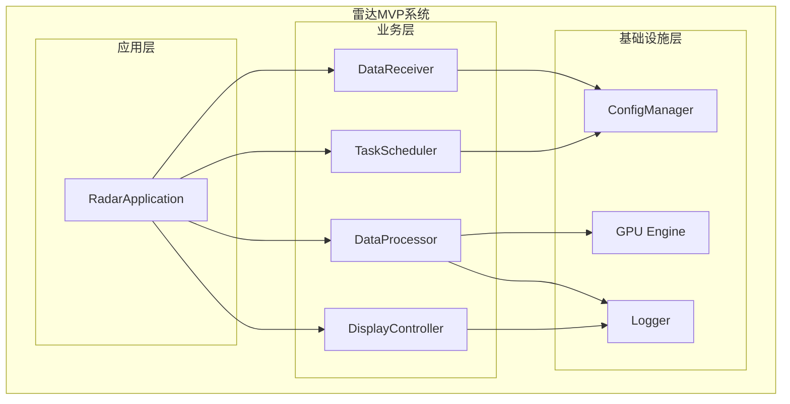
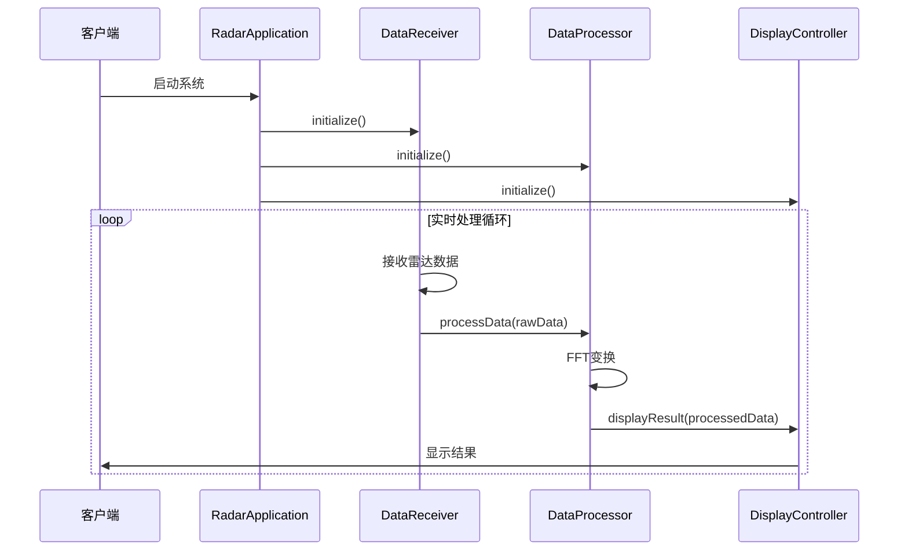
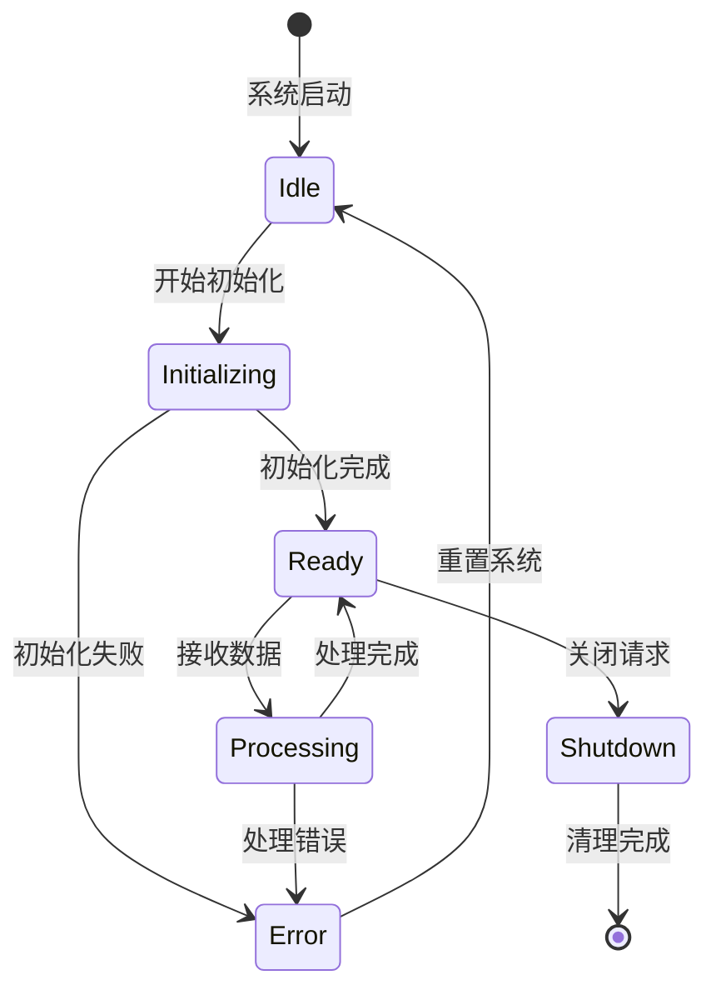
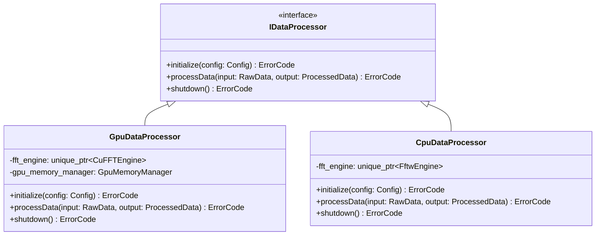
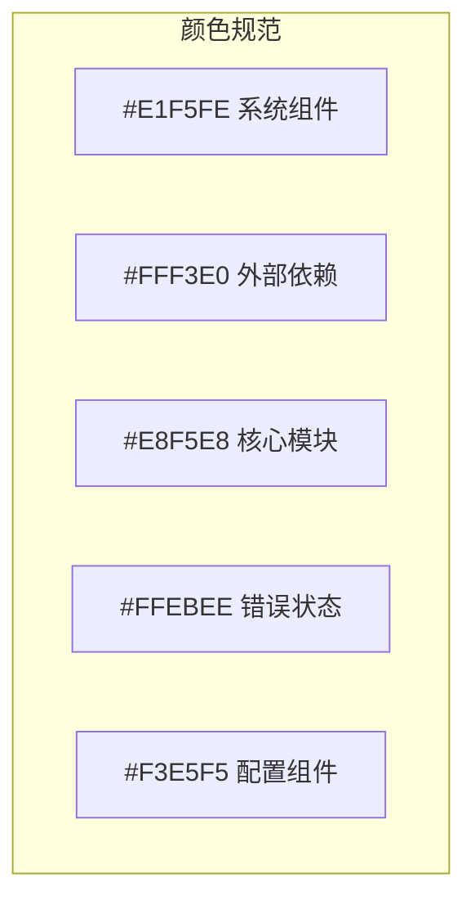

# 文档与设计规范

- **标题**: Radar MVP 文档与设计规范
- **当前版本**: v2.0
- **最后更新**: 2025-09-14
- **目标读者**: 项目开发团队、技术写作人员
- **适用范围**: 技术文档、设计文档、API文档、用户指南

---

## 📋 快速导航

| 章节                                | 用途             | 阅读时间 |
| ----------------------------------- | ---------------- | -------- |
| [文档编写规范](#文档编写规范)       | 通用文档标准     | 15分钟   |
| [设计文档规范](#设计文档规范)       | 技术设计文档标准 | 20分钟   |
| [Mermaid图表规范](#mermaid图表规范) | 图表绘制标准     | 15分钟   |
| [API文档规范](#api文档规范)         | 接口文档标准     | 15分钟   |
| [注释与文档生成](#注释与文档生成)   | 代码注释转文档   | 10分钟   |

---

## 文档编写规范

### 文档结构标准

#### 通用文档模板
```markdown
# 文档标题

- **标题**: 具体的文档名称
- **当前版本**: v1.0
- **最后更新**: YYYY-MM-DD
- **负责人**: 作者姓名
- **目标读者**: 明确的目标受众
- **适用范围**: 文档适用的项目范围

---

## 📋 快速导航
<!-- 提供清晰的章节导航表格 -->

## 概述
<!-- 文档目的、范围、前置条件 -->

## 详细内容
<!-- 按逻辑顺序组织的主要内容 -->

## 示例
<!-- 实际使用示例 -->

## 参考资料
<!-- 相关文档、链接、标准 -->

## 变更记录
<!-- 版本变更历史 -->
```

#### 技术文档特殊要求
```markdown
## 技术规格
- **性能要求**: 具体的性能指标
- **兼容性**: 支持的平台和版本
- **依赖关系**: 外部依赖和版本要求
- **限制条件**: 已知限制和约束

## 实现细节
- **算法描述**: 核心算法的数学表达
- **数据结构**: 关键数据结构定义
- **接口规范**: API接口的详细说明
- **错误处理**: 错误码和异常处理策略
```

### 语言风格规范

#### 写作原则
1. **简洁明确**: 用最少的词表达最准确的意思
2. **逻辑清晰**: 按照逻辑顺序组织内容
3. **术语统一**: 在整个文档中保持术语的一致性
4. **读者导向**: 始终考虑目标读者的背景和需求

#### 术语使用规范

| 统一术语       | 避免使用的术语         | 说明                 |
| -------------- | ---------------------- | -------------------- |
| 雷达数据处理器 | 雷达处理器、数据处理机 | 使用完整准确的术语   |
| FFT变换        | 快速傅里叶变换         | 在技术文档中使用缩写 |
| GPU加速        | 显卡加速               | 使用专业术语         |
| 实时处理       | 即时处理               | 保持技术术语的准确性 |
| 配置文件       | 配置档案、设定文件     | 使用标准IT术语       |


#### 代码示例规范

<!-- ✅ 正确的代码示例格式 -->
以下是数据处理器的基本使用方法：

```cpp
// 创建数据处理器实例
auto processor = std::make_unique<DataProcessor>(config);

// 处理雷达数据
ErrorCode result = processor->processData(input_data, output_data);
if (result == ErrorCode::SUCCESS) {
    RADAR_INFO("Data processing completed successfully");
} else {
    RADAR_ERROR("Processing failed with error: {}", static_cast<int>(result));
}
```

**说明**：
- `config` 参数包含处理器的配置信息
- 返回值 `ErrorCode::SUCCESS` 表示处理成功
- 建议在生产环境中添加详细的错误处理逻辑


---

## 设计文档规范

### 架构设计文档

#### 文档结构
```markdown
# 系统架构设计

## 1. 系统概述
### 1.1 业务背景
### 1.2 技术目标
### 1.3 约束条件

## 2. 架构设计
### 2.1 整体架构
### 2.2 模块划分
### 2.3 接口设计
### 2.4 数据流设计

## 3. 技术选型
### 3.1 开发语言和框架
### 3.2 第三方库选择
### 3.3 工具链配置

## 4. 部署架构
### 4.1 运行环境
### 4.2 配置管理
### 4.3 监控和日志

## 5. 风险评估
### 5.1 技术风险
### 5.2 性能风险
### 5.3 维护风险
```

#### 模块设计文档
```markdown
# 数据处理模块设计

## 模块概述
- **模块名称**: DataProcessor
- **功能描述**: 实时雷达数据处理和分析
- **输入**: 原始雷达信号数据
- **输出**: 处理后的目标检测结果

## 接口设计
### 公共接口

class IDataProcessor {
public:
    virtual ~IDataProcessor() = default;
    virtual ErrorCode initialize(const Config& config) = 0;
    virtual ErrorCode processData(const RawData& input, ProcessedData& output) = 0;
    virtual ErrorCode shutdown() = 0;
};


### 配置接口

data_processor:
  fft_size: 1024
  sampling_rate: 1000000
  window_type: "hamming"
  gpu_enabled: true


## 实现策略
### 算法选择
- **FFT算法**: 使用CUDA cuFFT库实现GPU加速
- **滤波算法**: 采用IIR滤波器进行预处理
- **检测算法**: 基于CFAR(恒虚警率)的目标检测

### 性能优化
- **内存管理**: 使用内存池避免频繁分配
- **并行处理**: GPU并行计算FFT变换
- **流水线**: 采用生产者-消费者模式实现流水线处理
```

---

## Mermaid图表规范

### 图表类型和使用场景

#### 1. 系统架构图 (C4 Model)


#### 2. 序列图 (时序图)


#### 3. 状态图


#### 4. 类图


### 图表样式规范

#### 颜色约定


#### 命名约定
- **节点名称**: 使用PascalCase，如 `DataProcessor`
- **关系标签**: 使用动词短语，如 `processData`
- **子图标题**: 使用中文描述，如 `"数据处理层"`

---

## API文档规范

### RESTful API文档
```markdown
## 数据处理接口

### 处理雷达数据
处理上传的雷达原始数据并返回分析结果。

**请求**
```http
POST /api/v1/process-data
Content-Type: application/json

{
    "data": "base64编码的雷达数据",
    "config": {
        "fft_size": 1024,
        "sampling_rate": 1000000
    }
}
```

**响应**
```http
HTTP/1.1 200 OK
Content-Type: application/json

{
    "status": "success",
    "processing_time_ms": 45,
    "result": {
        "target_count": 3,
        "targets": [
            {
                "range_m": 1500.5,
                "velocity_ms": 25.3,
                "amplitude_db": -12.5
            }
        ]
    }
}
```

**错误响应**
```http
HTTP/1.1 400 Bad Request
Content-Type: application/json

{
    "status": "error",
    "error_code": "INVALID_DATA_FORMAT",
    "message": "输入数据格式不正确",
    "details": "期望base64编码的二进制数据"
}
```
```

### C++ API文档
使用Doxygen格式编写详细的API文档：

```cpp
/**
 * @brief 雷达数据处理器接口
 * @details 定义了雷达数据处理的标准接口，支持CPU和GPU两种实现方式
 *
 * ## 使用示例
 * ```cpp
 * // 创建GPU处理器
 * auto config = Config::loadFromFile("config.yaml");
 * auto processor = DataProcessorFactory::createGpuProcessor(config);
 *
 * // 初始化处理器
 * if (processor->initialize(config) != ErrorCode::SUCCESS) {
 *     // 处理初始化错误
 * }
 *
 * // 处理数据
 * RawData input_data = loadRadarData("data.bin");
 * ProcessedData output_data;
 * auto result = processor->processData(input_data, output_data);
 * ```
 *
 * ## 性能特性
 * - **吞吐量**: GPU版本可达10GB/s，CPU版本约1GB/s
 * - **延迟**: GPU版本<5ms，CPU版本<20ms
 * - **内存使用**: 约为输入数据大小的2-3倍
 *
 * @warning 在多线程环境中使用时，需要确保线程安全
 * @note 建议在生产环境中使用GPU版本以获得最佳性能
 *
 * @since 1.0.0
 * @author Radar Dev Team
 */
class IDataProcessor {
    // 接口定义...
};
```

---

## 注释与文档生成

### Doxygen配置
项目使用Doxygen自动生成API文档，配置要点：

```ini
# Doxyfile主要配置
PROJECT_NAME           = "Radar MVP"
PROJECT_VERSION        = "1.0.0"
OUTPUT_DIRECTORY       = docs/api
INPUT                  = include/ src/
RECURSIVE              = YES
EXTRACT_ALL            = NO
EXTRACT_PRIVATE        = NO
EXTRACT_STATIC         = YES
GENERATE_HTML          = YES
GENERATE_LATEX         = NO
```

### 注释质量标准

#### ✅ 优秀的注释示例
```cpp
/**
 * @brief 计算雷达目标的距离
 * @details 基于脉冲往返时间计算目标距离，考虑了大气折射和系统延迟补偿
 *
 * 计算公式：distance = (time_of_flight * LIGHT_SPEED) / 2 - system_delay
 *
 * @param[in] time_of_flight 脉冲往返时间，单位：秒
 * @param[in] system_delay 系统固有延迟，单位：秒，默认值0.0
 * @return 目标距离，单位：米
 * @retval >0 有效距离值
 * @retval -1 计算错误（时间参数无效）
 *
 * @pre time_of_flight必须大于0
 * @post 返回值的精度约为±0.1米
 *
 * @warning 该函数不考虑多径传播效应
 * @note 在高精度应用中，建议配合多普勒校正使用
 *
 * @see calculateVelocity(), compensateAtmosphericDelay()
 *
 * @par 示例:
 * @code
 * double tof = 0.000001;  // 1微秒
 * double distance = calculateTargetDistance(tof);
 * if (distance > 0) {
 *     std::cout << "目标距离: " << distance << " 米" << std::endl;
 * }
 * @endcode
 */
double calculateTargetDistance(double time_of_flight, double system_delay = 0.0);
```

#### ❌ 需要改进的注释
```cpp
// 计算距离
double calcDist(double t);  // 参数和返回值不明确

/*
 * 这个函数很复杂，做了很多事情
 * 输入一些数据，输出一些结果
 */
void processStuff(void* data);  // 说明太模糊
```

### 文档生成工作流

#### 自动化文档生成
```powershell
# 生成API文档
doxygen Doxyfile

# 生成用户手册
pandoc user_manual.md -o user_manual.pdf

# 检查文档链接
markdown-link-check docs/**/*.md
```

#### CI/CD集成
在GitHub Actions中自动生成和发布文档：

```yaml
- name: Generate Documentation
  run: |
    doxygen Doxyfile
    pandoc README.md -o README.pdf

- name: Deploy Documentation
  uses: peaceiris/actions-gh-pages@v3
  with:
    github_token: ${{ secrets.GITHUB_TOKEN }}
    publish_dir: ./docs/api/html
```

---

## 文档维护流程

### 版本控制
- 文档版本与代码版本同步
- 重大变更必须更新相关文档
- 使用语义化版本号：主版本.次版本.修订号

### 审查流程
1. **技术审查**: 验证技术内容的准确性
2. **语言审查**: 检查语言表达和格式规范
3. **用户验证**: 确保文档对目标读者有用

### 质量检查清单
- [ ] 文档结构清晰，导航明确
- [ ] 技术内容准确无误
- [ ] 代码示例可以运行
- [ ] 链接和引用有效
- [ ] 符合项目文档规范
- [ ] 目标读者能够理解和使用

---

**记住：优秀的文档是项目成功的重要组成部分。清晰、准确、及时的文档能够显著提高团队协作效率和项目质量。**
