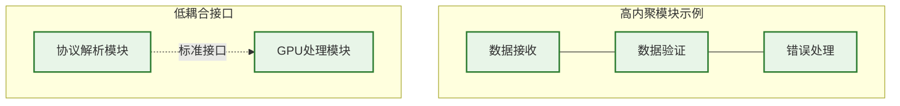
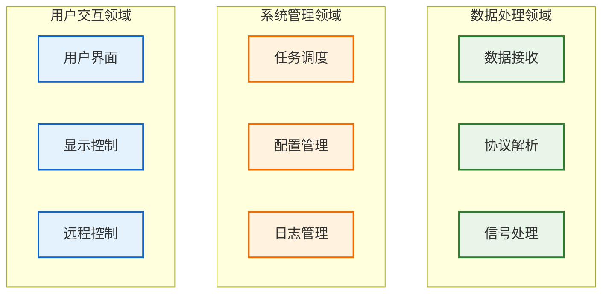
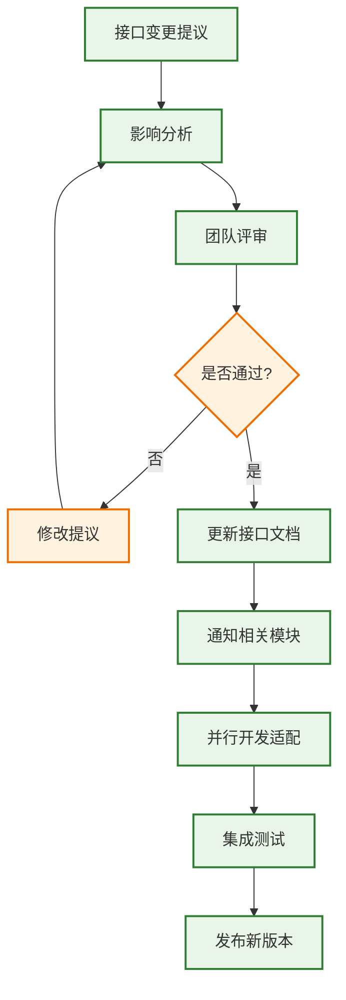
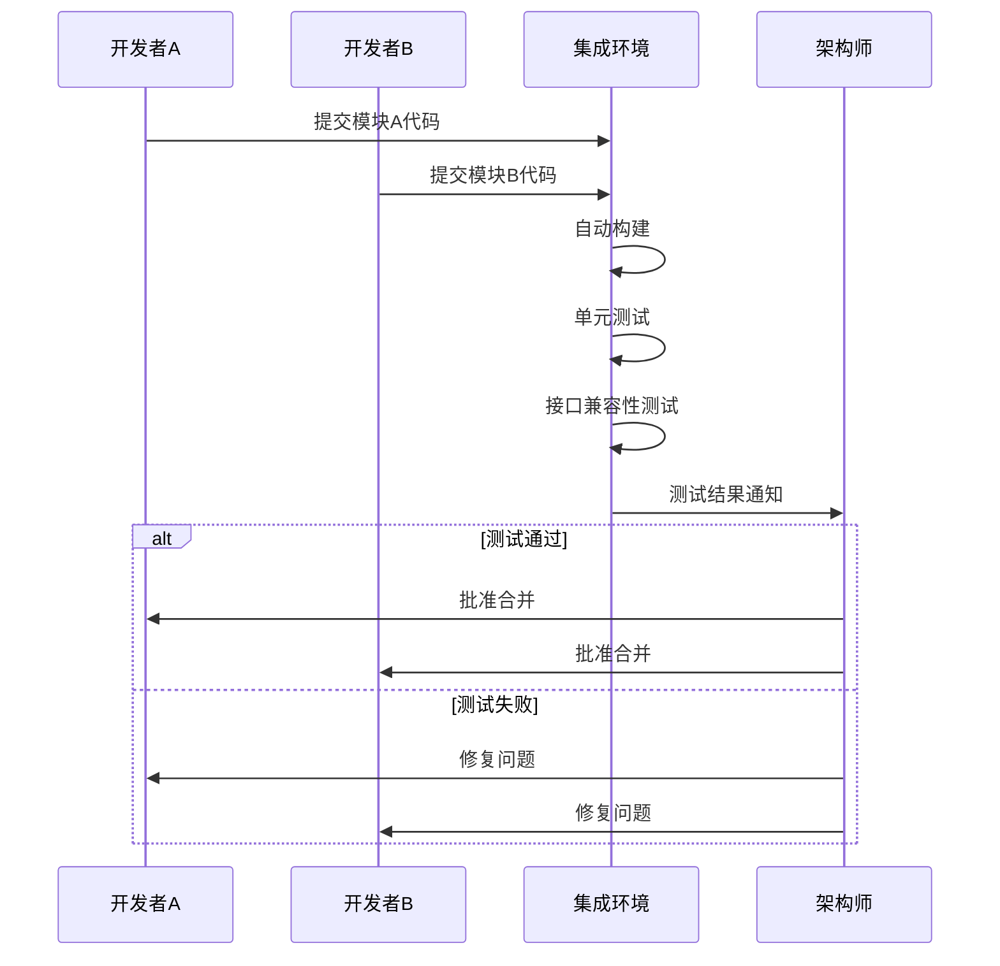
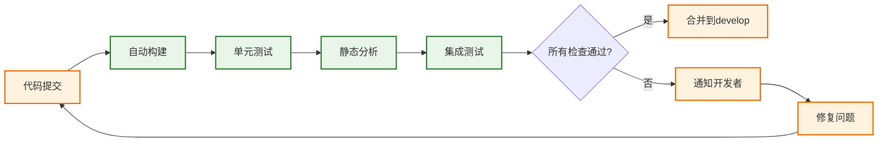

# 模块化软件设计与开发规范文档 v1.0

## 文档信息
- **版本**: v1.0
- **创建日期**: 2025年9月5日
- **适用范围**: 雷达数据处理系统项目团队
- **目标受众**: 项目组所有开发人员

## 1. 设计原则

### 1.1 核心设计原则

#### 1.1.1 模块化原则
- **单一职责**: 每个模块只负责一个明确的功能领域
- **独立性**: 模块能够独立开发、测试和维护
- **可替换性**: 模块可以在不影响其他模块的情况下被替换

#### 1.1.2 高内聚低耦合


- **高内聚**: 模块内部组件紧密协作，功能相关
- **低耦合**: 模块间通过标准接口通信，减少依赖

#### 1.1.3 接口清晰原则
- **接口标准化**: 所有模块遵循统一的接口规范
- **版本兼容**: 接口升级要考虑向后兼容性
- **文档完整**: 每个接口都有详细的文档说明

### 1.2 设计禁忌
- ❌ **避免循环依赖**: 模块A依赖B，B又依赖A
- ❌ **避免神类**: 一个模块处理过多不相关功能
- ❌ **避免硬编码**: 配置参数要外部化
- ❌ **避免私有协议**: 使用标准化的通信格式

## 2. 文档结构与编写规范

### 2.1 模块文档标准结构
```
模块名称_设计文档.md
├── 1. 模块概述
│   ├── 功能描述
│   ├── 职责边界
│   └── 依赖关系
├── 2. 接口定义
│   ├── 输入接口
│   ├── 输出接口
│   └── 控制接口
├── 3. 内部设计
│   ├── 核心算法
│   ├── 数据结构
│   └── 状态管理
├── 4. 配置参数
├── 5. 错误处理
├── 6. 性能指标
└── 7. 测试规范
```

### 2.2 接口文档模板
```cpp
/**
 * @brief 模块功能简述
 * @version 1.0
 * @author 开发者姓名
 * @date 2025-09-05
 */
class IModuleName {
public:
    /**
     * @brief 初始化模块
     * @param config 配置参数
     * @return true 成功，false 失败
     * @note 必须在使用其他接口前调用
     */
    virtual bool Initialize(const Config& config) = 0;
    
    /**
     * @brief 处理数据
     * @param input 输入数据
     * @param output 输出数据
     * @return 处理结果状态
     * @warning 输入数据必须已验证
     */
    virtual ProcessResult Process(const InputData& input, OutputData& output) = 0;
};
```

### 2.3 文档版本管理
- **语义化版本**: Major.Minor.Patch (如 1.2.3)
- **变更记录**: 每次修改都要记录原因和影响
- **评审标记**: 文档状态（草稿/评审中/已批准）

## 3. 模块划分指导

### 3.1 模块识别方法

#### 3.1.1 按功能领域划分


#### 3.1.2 按数据流划分
- **输入模块**: 负责外部数据接入
- **处理模块**: 负责数据转换和计算
- **输出模块**: 负责结果输出和显示
- **控制模块**: 负责流程协调和管理

### 3.2 模块大小原则
- **代码行数**: 单个模块不超过3000行C++代码
- **接口数量**: 对外接口不超过10个
- **依赖数量**: 直接依赖不超过5个其他模块
- **开发时间**: 单人开发时间不超过2周

### 3.3 接口定义标准

#### 3.3.1 数据接口规范
```cpp
// 统一的数据传输接口
template<typename DataType>
class IDataChannel {
public:
    virtual bool Send(const DataType& data, uint32_t timeout_ms = 1000) = 0;
    virtual bool Receive(DataType& data, uint32_t timeout_ms = 1000) = 0;
    virtual size_t GetQueueSize() const = 0;
    virtual bool IsConnected() const = 0;
};

// 统一的处理接口
class IProcessor {
public:
    virtual bool Initialize(const std::string& config_file) = 0;
    virtual ProcessResult Process(const InputData& input, OutputData& output) = 0;
    virtual ModuleStatus GetStatus() const = 0;
    virtual bool Shutdown() = 0;
};
```

#### 3.3.2 控制接口规范
```cpp
// 统一的控制接口
class IControllable {
public:
    virtual bool Start() = 0;
    virtual bool Stop() = 0;
    virtual bool Pause() = 0;
    virtual bool Resume() = 0;
    virtual bool SetParameter(const std::string& key, const std::string& value) = 0;
    virtual std::string GetParameter(const std::string& key) const = 0;
};
```

## 4. 版本控制与变更管理

### 4.1 Git分支策略
```mermaid
gitgraph
    commit id: "Initial"
    branch develop
    checkout develop
    commit id: "Feature A"
    branch feature/data-receiver
    checkout feature/data-receiver
    commit id: "Implement UDP"
    commit id: "Add validation"
    checkout develop
    merge feature/data-receiver
    commit id: "Integration test"
    checkout main
    merge develop
    commit id: "Release v1.0"
```

- **main分支**: 稳定发布版本
- **develop分支**: 开发集成分支
- **feature分支**: 功能开发分支（feature/模块名称）
- **hotfix分支**: 紧急修复分支

### 4.2 接口变更流程


### 4.3 版本兼容性规则
- **Major版本**: 破坏性变更，不兼容旧版本
- **Minor版本**: 功能添加，向后兼容
- **Patch版本**: Bug修复，完全兼容

## 5. 协作流程

### 5.1 日常开发流程
1. **晨会同步** (15分钟)
   - 昨天进展
   - 今天计划
   - 遇到的问题

2. **接口变更通知**
   - 使用邮件/IM通知相关开发者
   - 更新共享文档
   - 在Git提交信息中标注

3. **代码提交规范**
   ```
   [模块名] 功能描述
   
   - 详细变更说明
   - 影响的其他模块
   - 测试情况
   
   Closes #issue_number
   ```

### 5.2 集成测试流程


### 5.3 沟通机制
- **技术讨论群**: 日常技术问题讨论
- **架构评审会**: 重大设计决策（每周一次）
- **代码审查**: 每个PR至少一人审查
- **文档共享**: 使用共享网盘同步文档

## 6. 评审机制

### 6.1 设计评审检查清单
#### 架构层面
- [ ] 模块职责是否清晰单一？
- [ ] 模块间依赖是否合理？
- [ ] 接口设计是否符合标准？
- [ ] 是否存在循环依赖？
- [ ] 扩展性是否足够？

#### 实现层面
- [ ] 代码是否符合编码规范？
- [ ] 错误处理是否完整？
- [ ] 性能是否满足要求？
- [ ] 内存管理是否安全？
- [ ] 线程安全是否考虑？

#### 文档层面
- [ ] 接口文档是否完整？
- [ ] 示例代码是否正确？
- [ ] 版本信息是否更新？
- [ ] 变更记录是否详细？

### 6.2 评审角色分工
- **架构师**: 整体架构合理性
- **技术负责人**: 技术实现可行性
- **测试负责人**: 可测试性和质量
- **项目经理**: 进度和资源影响

## 7. 常见陷阱与避免

### 7.1 过度设计陷阱
**症状**:
- 接口过于复杂，参数过多
- 为了"可能的需求"设计复杂架构
- 过早优化性能

**避免方法**:
- 遵循YAGNI原则（You Aren't Gonna Need It）
- 从简单开始，逐步迭代
- 优先满足当前需求

### 7.2 设计僵化陷阱
**症状**:
- 接口一旦定义就不敢改变
- 新需求只能通过绕路实现
- 代码变得难以维护

**避免方法**:
- 设计时考虑扩展点
- 定期重构和优化
- 接口版本化管理

### 7.3 沟通不足陷阱
**症状**:
- 接口变更没有及时通知
- 重复开发相似功能
- 集成时发现不兼容

**避免方法**:
- 建立强制的通知机制
- 定期代码审查
- 频繁的集成测试

## 8. 工具和自动化

### 8.1 推荐工具
- **版本控制**: Git + GitHub/GitLab
- **构建系统**: CMake + Make
- **文档生成**: Doxygen（API文档）
- **静态分析**: Clang-tidy、Cppcheck
- **单元测试**: Google Test
- **集成测试**: 自定义脚本

### 8.2 自动化流程


## 9. 实践建议

### 9.1 开发阶段建议
1. **接口先行**: 先定义接口，再实现功能
2. **测试驱动**: 先写测试用例，再写实现代码
3. **小步迭代**: 每次提交都是可工作的版本
4. **及时集成**: 每天至少集成一次

### 9.2 维护阶段建议
1. **定期重构**: 每月检查代码质量
2. **文档同步**: 代码变更时同步更新文档
3. **性能监控**: 持续监控系统性能指标
4. **安全审查**: 定期进行安全漏洞检查

### 9.3 团队协作建议
1. **代码规范**: 使用统一的代码格式化工具
2. **知识分享**: 定期进行技术分享会
3. **结对编程**: 复杂模块采用结对开发
4. **导师制度**: 新成员配备技术导师

---

**备注**: 本规范为第一版，将根据项目实践情况持续完善和更新。所有团队成员都有义务遵守本规范，并提出改进建议。
