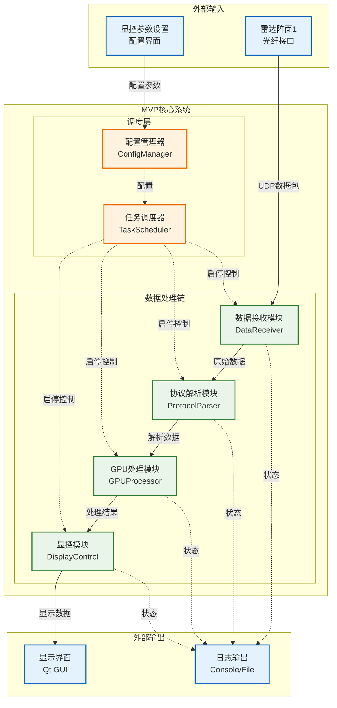
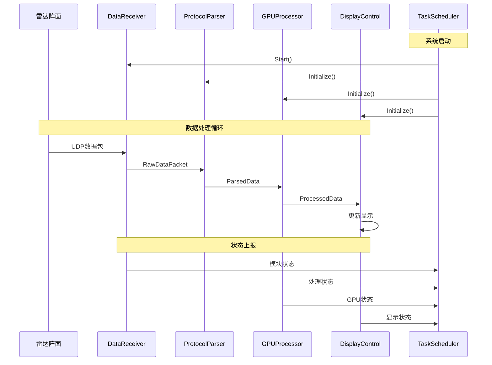
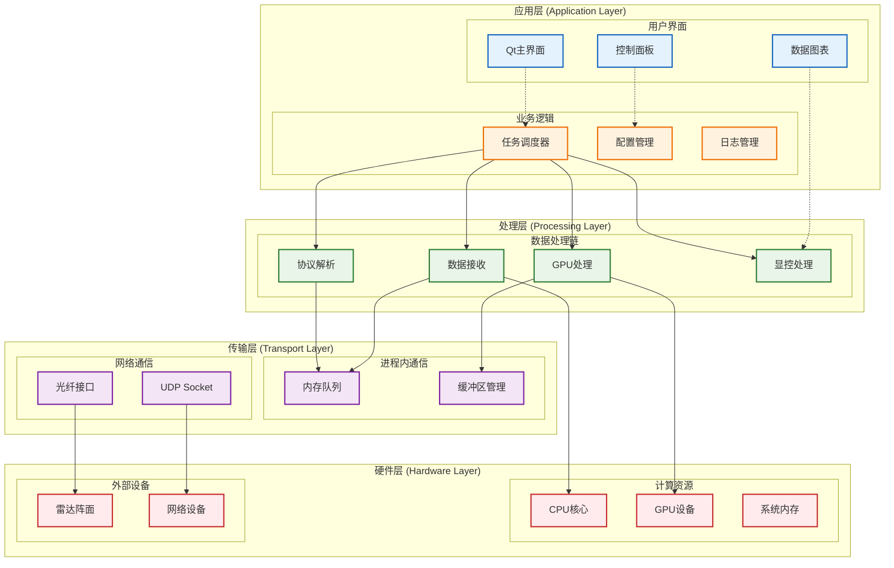
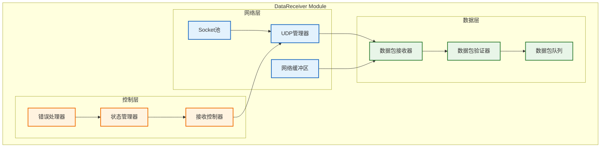
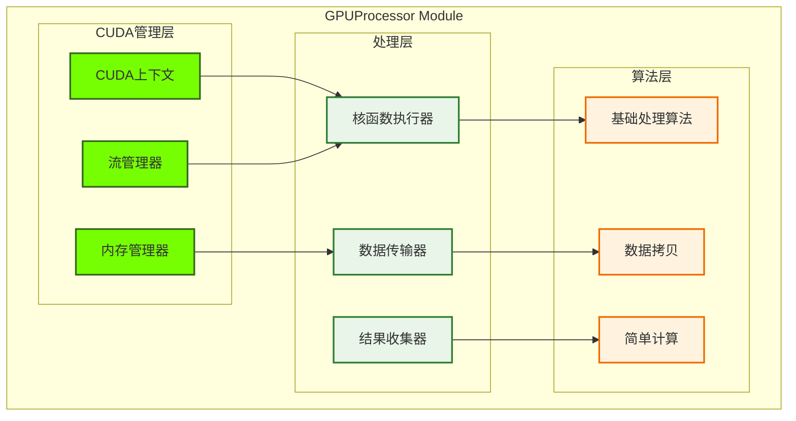
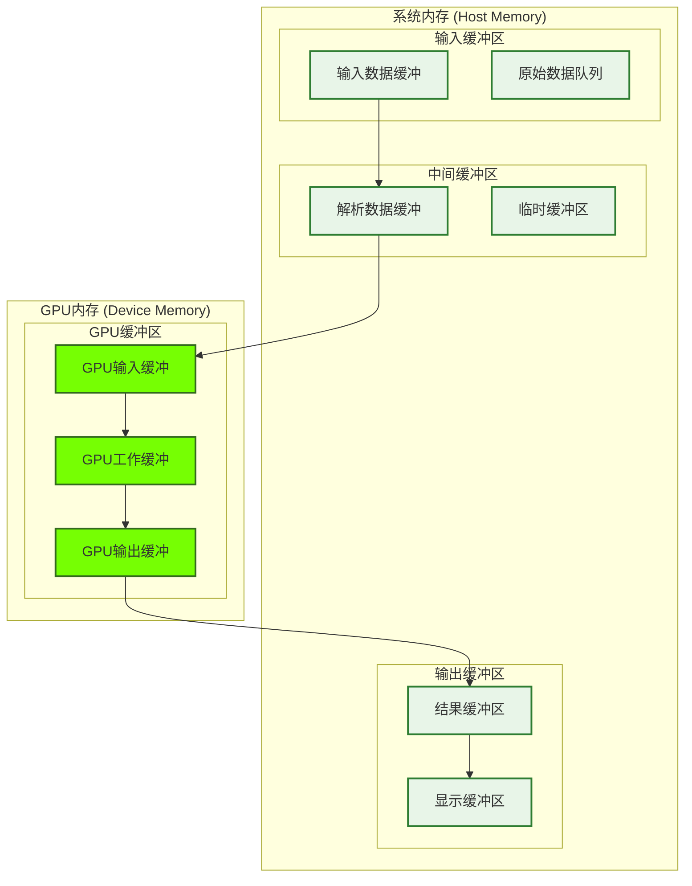
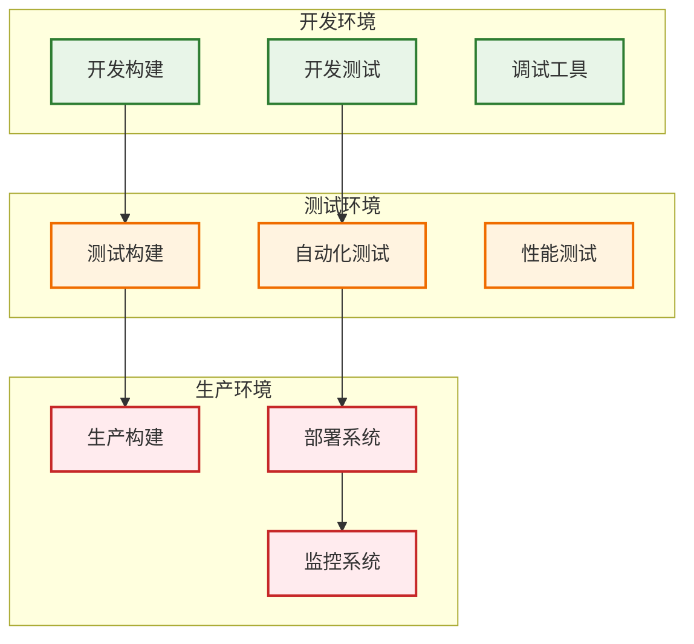

# 基于GPU的相控阵雷达数据处理系统 - MVP设计文档

## 文档信息
- **版本**: MVP v1.0
- **创建日期**: 2025年9月5日
- **负责人**: 架构设计师
- **目标**: 验证最基础的原理性功能，为后续迭代奠定基础

## 1. MVP目标与范围

### 1.1 MVP核心目标
- **验证数据流**: 从三个雷达阵面到显控的完整数据传输链路
- **验证GPU处理**: 基础的GPU数据处理能力
- **验证模块化**: 基本的模块化架构可行性
- **验证接口**: 核心模块间的接口通信

### 1.2 MVP功能范围
**包含功能**:
- 基础数据接收（单个阵面）
- 简单协议解析（最小数据包格式）
- 基础GPU处理（简单数据拷贝和基础运算）
- 基本显控输出（数据可视化）
- 核心模块调度

**不包含功能**:
- 复杂信号处理算法
- 热插拔机制
- 高级错误恢复
- 性能优化
- 多阵面并行处理

## 2. 系统架构图

### 2.1 MVP整体架构


### 2.2 调度器的职责
您问到"调度什么"，在MVP中调度器主要负责：
- **生命周期管理**: 启动/停止各模块
- **执行顺序控制**: 确保数据按正确顺序流转
- **资源分配**: 管理GPU内存和CPU线程
- **错误处理**: 模块异常时的重启和恢复
- **配置同步**: 参数变更时通知相关模块

## 3. 模块说明

### 3.1 数据接收模块 (DataReceiver)
```cpp
// MVP简化接口
class DataReceiver {
public:
    bool Initialize(const std::string& ip, int port);
    bool Start();
    bool Stop();
    bool ReceiveData(RawDataPacket& packet);
    ModuleStatus GetStatus();
private:
    UDPSocket socket_;
    std::atomic<bool> running_;
};
```
**功能**: 接收单个雷达阵面的UDP数据包
**输入**: 网络UDP数据流
**输出**: 原始数据包结构

### 3.2 协议解析模块 (ProtocolParser)
```cpp
class ProtocolParser {
public:
    bool Initialize(const ParserConfig& config);
    bool ParsePacket(const RawDataPacket& raw, ParsedData& parsed);
    bool Validate(const ParsedData& data);
private:
    PacketValidator validator_;
};
```
**功能**: 解析数据包头，提取有效载荷
**输入**: 原始数据包
**输出**: 结构化数据矩阵

### 3.3 GPU处理模块 (GPUProcessor)
```cpp
class GPUProcessor {
public:
    bool Initialize();
    bool ProcessData(const ParsedData& input, ProcessedData& output);
    bool Cleanup();
private:
    cudaStream_t stream_;
    void* gpu_buffer_;
};
```
**功能**: 基础GPU数据处理（MVP阶段仅做数据拷贝和简单运算）
**输入**: 解析后的数据矩阵
**输出**: 处理后的数据

### 3.4 显控模块 (DisplayControl)
```cpp
class DisplayControl {
public:
    bool Initialize(QWidget* parent);
    bool UpdateDisplay(const ProcessedData& data);
    bool ShowStatus(const SystemStatus& status);
private:
    QChartView* chart_view_;
    QTimer* update_timer_;
};
```
**功能**: 实时数据可视化和系统状态显示
**输入**: 处理后的数据
**输出**: Qt界面显示

### 3.5 任务调度器 (TaskScheduler)
```cpp
class TaskScheduler {
public:
    bool StartSystem();
    bool StopSystem();
    bool SetConfiguration(const SystemConfig& config);
    SystemStatus GetSystemStatus();
private:
    std::vector<std::unique_ptr<ModuleInterface>> modules_;
    std::thread scheduler_thread_;
};
```
**功能**: 系统启停、模块调度、状态监控

## 4. 数据流设计

### 4.1 数据包格式定义
```cpp
// MVP数据包结构
struct RawDataPacket {
    uint32_t magic_number;      // 包头标识
    uint32_t sequence_id;       // 序列号
    uint32_t data_size;         // 数据长度
    uint64_t timestamp;         // 时间戳
    uint8_t data[MAX_PACKET_SIZE]; // 数据载荷
};

struct ParsedData {
    uint32_t sequence_id;
    uint64_t timestamp;
    std::vector<std::complex<float>> matrix; // 数据矩阵
};

struct ProcessedData {
    uint32_t sequence_id;
    uint64_t timestamp;
    std::vector<float> result;  // 处理结果
};
```

### 4.2 数据流转时序


## 5. 技术选型

### 5.1 MVP技术栈
| 组件         | 技术选择    | 选择理由             |
| ------------ | ----------- | -------------------- |
| **开发语言** | C++17       | 性能要求，CUDA兼容性 |
| **GUI框架**  | Qt 6.x      | 跨平台，图表支持好   |
| **GPU计算**  | CUDA 12.x   | NVIDIA GPU标准       |
| **网络通信** | UDP Socket  | 实时性好，实现简单   |
| **构建系统** | CMake       | 跨平台，依赖管理     |
| **线程模型** | std::thread | C++标准，简单可靠    |

### 5.2 简化的依赖
- **不使用**: Boost（减少复杂性）
- **不使用**: FlatBuffers（MVP阶段用原生结构体）
- **不使用**: 复杂日志库（用std::cout）

## 6. 非功能需求

### 6.1 性能需求（MVP目标）
- **数据吞吐量**: 10 MB/s （单阵面）
- **处理延迟**: < 1秒 （可接受）
- **显示刷新率**: 1 Hz （基础可视化）
- **内存使用**: < 4GB （包含GPU内存）

### 6.2 可扩展性
- **模块接口**: 预留标准接口，便于后续扩展
- **配置文件**: 支持运行时参数调整
- **数据格式**: 支持不同数据包大小

### 6.3 可靠性（MVP最低要求）
- **基础错误检测**: 数据包校验，模块状态检查
- **简单恢复**: 模块重启机制
- **日志记录**: 基础操作日志

## 7. 风险和挑战

### 7.1 技术风险
| 风险               | 影响 | 应对措施                       |
| ------------------ | ---- | ------------------------------ |
| **CUDA环境配置**   | 高   | 提前准备开发环境，准备备用方案 |
| **网络数据丢包**   | 中   | 实现基础的包序列检查           |
| **GPU内存不足**    | 中   | 限制数据包大小，分批处理       |
| **模块接口不兼容** | 高   | 严格定义接口，增加版本检查     |

### 7.2 团队风险
| 风险                   | 影响 | 应对措施                       |
| ---------------------- | ---- | ------------------------------ |
| **模块化开发经验不足** | 高   | 制定详细开发规范，定期代码审查 |
| **接口同步困难**       | 高   | 建立接口变更通知机制           |
| **版本管理混乱**       | 中   | 使用Git，制定分支策略          |

## 8. 下一步计划

### 8.1 第1周：基础框架
- [ ] 搭建CMake项目结构
- [ ] 实现基础模块接口定义
- [ ] 完成UDP数据接收测试

### 8.2 第2周：核心功能
- [ ] 实现协议解析模块
- [ ] 完成基础GPU数据处理
- [ ] 实现简单的Qt显示界面

### 8.3 第3周：系统集成
- [ ] 集成所有模块
- [ ] 实现任务调度器
- [ ] 端到端功能测试

### 8.4 第4周：测试与优化
- [ ] 性能测试和调优
- [ ] 稳定性测试
- [ ] 文档完善

## 9. 成功标准

### 9.1 功能验证
- [ ] 能接收单个雷达阵面数据
- [ ] 数据能正确解析和处理
- [ ] GPU处理无错误
- [ ] 显示界面能实时更新
- [ ] 系统能稳定运行30分钟

### 9.2 技术验证
- [ ] 模块化架构可行
- [ ] 接口设计合理
- [ ] 调度机制有效
- [ ] 扩展性满足要求

## 10. 详细系统架构设计

### 10.1 系统架构层次图


### 10.2 模块详细架构

#### 10.2.1 数据接收模块架构


#### 10.2.2 GPU处理模块架构


### 10.3 数据流架构设计

#### 10.3.1 数据流水线架构

```mermaid
flowchart LR
    subgraph "输入阶段"
        A1[雷达数据]
        A2[UDP接收]
        A3[数据验证]
    end
    
    subgraph "处理阶段"
        B1[协议解析]
        B2[数据格式化]
        B3[GPU传输]
        B4[GPU计算]
        B5[结果回传]
    end
    
    subgraph "输出阶段"
        C1[数据整理]
        C2[界面更新]
        C3[状态显示]
    end
    
    A1 --> A2 --> A3 --> B1 --> B2 --> B3 --> B4 --> B5 --> C1 --> C2 --> C3
    
    %% 缓冲队列
    A3 -.->|Queue1| B1
    B2 -.->|Queue2| B3
    B5 -.->|Queue3| C1
    
    classDef input fill:#e3f2fd,stroke:#1565c0,stroke-width:2px
    classDef process fill:#e8f5e8,stroke:#2e7d32,stroke-width:2px
    classDef output fill:#fff3e0,stroke:#ef6c00,stroke-width:2px
    
    class A1,A2,A3 input
    class B1,B2,B3,B4,B5 process
    class C1,C2,C3 output
```


#### 10.3.2 内存布局架构


## 11. 详细项目目录结构

### 11.1 完整目录树
```
radar_mvp_system/
├── CMakeLists.txt                      # 主构建配置文件
├── README.md                           # 项目说明文档
├── LICENSE                             # 开源许可证
├── .gitignore                          # Git忽略文件配置
├── build.sh                            # Linux构建脚本
├── build.bat                           # Windows构建脚本
├── 
├── cmake/                              # CMake配置文件
│   ├── FindCUDA.cmake                 # CUDA查找配置
│   ├── FindQt6.cmake                  # Qt6查找配置
│   ├── CompilerSettings.cmake         # 编译器设置
│   └── PackageConfig.cmake            # 包配置
├── 
├── docs/                               # 项目文档
│   ├── architecture/                  # 架构文档
│   │   ├── system_design.md          # 系统设计文档
│   │   ├── module_interfaces.md      # 模块接口文档
│   │   └── data_flow.md              # 数据流设计
│   ├── api/                           # API参考文档
│   │   ├── data_receiver_api.md      # 数据接收API
│   │   ├── gpu_processor_api.md      # GPU处理API
│   │   └── display_control_api.md    # 显控API
│   ├── user_manual/                   # 用户手册
│   │   ├── installation.md           # 安装指南
│   │   ├── configuration.md          # 配置说明
│   │   └── troubleshooting.md        # 故障排除
│   └── development/                   # 开发文档
│       ├── coding_standards.md       # 编码规范
│       ├── testing_guide.md          # 测试指南
│       └── deployment_guide.md       # 部署指南
├── 
├── include/                            # 公共头文件目录
│   ├── common/                        # 公共基础组件
│   │   ├── types.h                   # 基础数据类型定义
│   │   ├── constants.h               # 系统常量定义
│   │   ├── error_codes.h             # 错误码定义
│   │   ├── config.h                  # 配置结构定义
│   │   ├── logger.h                  # 日志系统接口
│   │   ├── utils.h                   # 工具函数声明
│   │   └── thread_safe_queue.h       # 线程安全队列
│   ├── interfaces/                    # 模块接口定义
│   │   ├── module_interface.h        # 模块基础接口
│   │   ├── data_receiver_interface.h # 数据接收接口
│   │   ├── protocol_parser_interface.h # 协议解析接口
│   │   ├── gpu_processor_interface.h # GPU处理接口
│   │   ├── display_control_interface.h # 显控接口
│   │   └── task_scheduler_interface.h # 任务调度接口
│   └── data/                          # 数据结构定义
│       ├── packet_types.h            # 数据包类型定义
│       ├── radar_data.h              # 雷达数据结构
│       ├── processed_data.h          # 处理后数据结构
│       └── system_status.h           # 系统状态结构
├── 
├── src/                               # 源代码目录
│   ├── main.cpp                      # 主程序入口
│   ├── 
│   ├── common/                       # 公共组件实现
│   │   ├── CMakeLists.txt           # 公共组件构建配置
│   │   ├── logger.cpp               # 日志系统实现
│   │   ├── config_manager.cpp       # 配置管理器实现
│   │   ├── utils.cpp                # 工具函数实现
│   │   ├── error_handler.cpp        # 错误处理器实现
│   │   └── memory_pool.cpp          # 内存池实现
│   ├── 
│   ├── modules/                     # 核心模块实现
│   │   ├── data_receiver/           # 数据接收模块
│   │   │   ├── CMakeLists.txt      # 模块构建配置
│   │   │   ├── data_receiver.h     # 模块头文件
│   │   │   ├── data_receiver.cpp   # 模块主实现
│   │   │   ├── udp_socket.h        # UDP套接字封装
│   │   │   ├── udp_socket.cpp      # UDP套接字实现
│   │   │   ├── packet_validator.h  # 数据包验证器
│   │   │   ├── packet_validator.cpp # 验证器实现
│   │   │   ├── network_buffer.h    # 网络缓冲区
│   │   │   ├── network_buffer.cpp  # 缓冲区实现
│   │   │   └── receiver_config.h   # 接收器配置
│   │   ├── 
│   │   ├── protocol_parser/         # 协议解析模块
│   │   │   ├── CMakeLists.txt      # 模块构建配置
│   │   │   ├── protocol_parser.h   # 模块头文件
│   │   │   ├── protocol_parser.cpp # 模块主实现
│   │   │   ├── packet_header.h     # 数据包头解析
│   │   │   ├── packet_header.cpp   # 包头解析实现
│   │   │   ├── data_extractor.h    # 数据提取器
│   │   │   ├── data_extractor.cpp  # 提取器实现
│   │   │   ├── format_converter.h  # 格式转换器
│   │   │   ├── format_converter.cpp # 转换器实现
│   │   │   └── parser_config.h     # 解析器配置
│   │   ├── 
│   │   ├── gpu_processor/           # GPU处理模块
│   │   │   ├── CMakeLists.txt      # 模块构建配置
│   │   │   ├── gpu_processor.h     # 模块头文件
│   │   │   ├── gpu_processor.cpp   # 模块主实现
│   │   │   ├── cuda_manager.h      # CUDA管理器
│   │   │   ├── cuda_manager.cpp    # CUDA管理实现
│   │   │   ├── gpu_memory.h        # GPU内存管理
│   │   │   ├── gpu_memory.cpp      # 内存管理实现
│   │   │   ├── kernel_launcher.h   # 核函数启动器
│   │   │   ├── kernel_launcher.cpp # 启动器实现
│   │   │   ├── kernels.cu          # CUDA核函数
│   │   │   ├── data_transfer.h     # 数据传输管理
│   │   │   ├── data_transfer.cpp   # 传输管理实现
│   │   │   └── processor_config.h  # 处理器配置
│   │   ├── 
│   │   ├── display_control/         # 显控模块
│   │   │   ├── CMakeLists.txt      # 模块构建配置
│   │   │   ├── display_control.h   # 模块头文件
│   │   │   ├── display_control.cpp # 模块主实现
│   │   │   ├── main_window.h       # 主窗口类
│   │   │   ├── main_window.cpp     # 主窗口实现
│   │   │   ├── main_window.ui      # UI设计文件
│   │   │   ├── chart_widget.h      # 图表组件
│   │   │   ├── chart_widget.cpp    # 图表实现
│   │   │   ├── status_panel.h      # 状态面板
│   │   │   ├── status_panel.cpp    # 状态面板实现
│   │   │   ├── data_visualizer.h   # 数据可视化器
│   │   │   ├── data_visualizer.cpp # 可视化实现
│   │   │   └── display_config.h    # 显示配置
│   │   └── 
│   │   └── task_scheduler/          # 任务调度模块
│   │       ├── CMakeLists.txt      # 模块构建配置
│   │       ├── task_scheduler.h    # 模块头文件
│   │       ├── task_scheduler.cpp  # 模块主实现
│   │       ├── module_manager.h    # 模块管理器
│   │       ├── module_manager.cpp  # 管理器实现
│   │       ├── scheduler_thread.h  # 调度线程
│   │       ├── scheduler_thread.cpp # 调度线程实现
│   │       ├── system_monitor.h    # 系统监控器
│   │       ├── system_monitor.cpp  # 监控器实现
│   │       ├── health_checker.h    # 健康检查器
│   │       ├── health_checker.cpp  # 健康检查实现
│   │       └── scheduler_config.h  # 调度器配置
│   └── 
│   └── application/                 # 应用程序层
│       ├── CMakeLists.txt          # 应用构建配置
│       ├── app.h                   # 应用程序类
│       ├── app.cpp                 # 应用程序实现
│       ├── system_initializer.h    # 系统初始化器
│       ├── system_initializer.cpp  # 初始化器实现
│       ├── signal_handler.h        # 信号处理器
│       └── signal_handler.cpp      # 信号处理实现
├── 
├── tests/                           # 测试代码目录
│   ├── CMakeLists.txt              # 测试构建配置
│   ├── 
│   ├── unit_tests/                 # 单元测试
│   │   ├── common/                 # 公共组件测试
│   │   │   ├── test_logger.cpp    # 日志系统测试
│   │   │   ├── test_config.cpp    # 配置管理测试
│   │   │   ├── test_utils.cpp     # 工具函数测试
│   │   │   └── test_queue.cpp     # 队列测试
│   │   ├── data_receiver/          # 数据接收测试
│   │   │   ├── test_receiver.cpp  # 接收器测试
│   │   │   ├── test_udp_socket.cpp # UDP套接字测试
│   │   │   └── test_validator.cpp # 验证器测试
│   │   ├── protocol_parser/        # 协议解析测试
│   │   │   ├── test_parser.cpp    # 解析器测试
│   │   │   └── test_converter.cpp # 转换器测试
│   │   ├── gpu_processor/          # GPU处理测试
│   │   │   ├── test_processor.cpp # 处理器测试
│   │   │   ├── test_cuda_mgr.cpp  # CUDA管理测试
│   │   │   └── test_kernels.cpp   # 核函数测试
│   │   ├── display_control/        # 显控测试
│   │   │   ├── test_display.cpp   # 显示测试
│   │   │   └── test_charts.cpp    # 图表测试
│   │   └── task_scheduler/         # 调度器测试
│   │       ├── test_scheduler.cpp # 调度器测试
│   │       └── test_manager.cpp   # 管理器测试
│   ├── 
│   ├── integration_tests/          # 集成测试
│   │   ├── test_data_flow.cpp     # 数据流测试
│   │   ├── test_module_comm.cpp   # 模块通信测试
│   │   ├── test_system_startup.cpp # 系统启动测试
│   │   └── test_error_recovery.cpp # 错误恢复测试
│   ├── 
│   ├── performance_tests/          # 性能测试
│   │   ├── test_throughput.cpp    # 吞吐量测试
│   │   ├── test_latency.cpp       # 延迟测试
│   │   ├── test_memory_usage.cpp  # 内存使用测试
│   │   └── test_gpu_performance.cpp # GPU性能测试
│   ├── 
│   └── mock/                       # 模拟对象
│       ├── mock_data_source.h     # 模拟数据源
│       ├── mock_data_source.cpp   # 数据源实现
│       ├── mock_gpu_device.h      # 模拟GPU设备
│       ├── mock_gpu_device.cpp    # GPU设备实现
│       └── test_data_generator.h  # 测试数据生成器
├── 
├── tools/                          # 开发工具
│   ├── data_generator/             # 数据生成工具
│   │   ├── CMakeLists.txt         # 工具构建配置
│   │   ├── radar_data_gen.cpp     # 雷达数据生成器
│   │   ├── packet_sender.cpp      # 数据包发送器
│   │   └── config_generator.cpp   # 配置生成器
│   ├── 
│   ├── performance_monitor/        # 性能监控工具
│   │   ├── CMakeLists.txt         # 监控工具构建
│   │   ├── perf_monitor.cpp       # 性能监控器
│   │   ├── gpu_profiler.cpp       # GPU性能分析器
│   │   └── memory_tracker.cpp     # 内存追踪器
│   ├── 
│   ├── config_validator/           # 配置验证工具
│   │   ├── CMakeLists.txt         # 验证工具构建
│   │   ├── config_check.cpp       # 配置检查器
│   │   └── schema_validator.cpp   # 模式验证器
│   └── 
│   └── log_analyzer/               # 日志分析工具
│       ├── CMakeLists.txt         # 分析工具构建
│       ├── log_parser.cpp         # 日志解析器
│       └── error_extractor.cpp    # 错误提取器
├── 
├── configs/                        # 配置文件目录
│   ├── system_config.yaml         # 系统主配置文件
│   ├── modules/                    # 模块配置目录
│   │   ├── data_receiver.yaml     # 数据接收配置
│   │   ├── protocol_parser.yaml   # 协议解析配置
│   │   ├── gpu_processor.yaml     # GPU处理配置
│   │   ├── display_control.yaml   # 显控配置
│   │   └── task_scheduler.yaml    # 任务调度配置
│   ├── 
│   ├── logging/                    # 日志配置
│   │   ├── log_config.yaml        # 日志系统配置
│   │   └── log_levels.yaml        # 日志级别配置
│   ├── 
│   ├── testing/                    # 测试配置
│   │   ├── test_config.yaml       # 测试环境配置
│   │   ├── mock_data_config.yaml  # 模拟数据配置
│   │   └── performance_config.yaml # 性能测试配置
│   └── 
│   └── deployment/                 # 部署配置
│       ├── production.yaml        # 生产环境配置
│       ├── development.yaml       # 开发环境配置
│       └── testing.yaml           # 测试环境配置
├── 
├── data/                           # 数据文件目录
│   ├── sample/                     # 样本数据
│   │   ├── radar_sample_1.dat     # 雷达样本数据1
│   │   ├── radar_sample_2.dat     # 雷达样本数据2
│   │   └── protocol_samples.bin   # 协议样本数据
│   ├── 
│   ├── templates/                  # 数据模板
│   │   ├── packet_template.json   # 数据包模板
│   │   ├── config_template.yaml   # 配置文件模板
│   │   └── test_template.xml      # 测试数据模板
│   └── 
│   └── schemas/                    # 数据模式定义
│       ├── packet_schema.json     # 数据包模式
│       ├── config_schema.json     # 配置模式
│       └── api_schema.json        # API模式
├── 
├── third_party/                    # 第三方库
│   ├── googletest/                 # Google Test测试框架
│   │   └── (子模块或源码)
│   ├── spdlog/                     # 高性能日志库
│   │   └── (子模块或源码)
│   ├── yaml-cpp/                   # YAML解析库
│   │   └── (子模块或源码)
│   └── nlohmann_json/              # JSON解析库
│       └── (子模块或源码)
├── 
├── scripts/                        # 自动化脚本
│   ├── build/                      # 构建脚本
│   │   ├── build_all.sh           # 完整构建脚本
│   │   ├── build_release.sh       # 发布版本构建
│   │   ├── build_debug.sh         # 调试版本构建
│   │   └── clean_build.sh         # 清理构建
│   ├── 
│   ├── test/                       # 测试脚本
│   │   ├── run_all_tests.sh       # 运行所有测试
│   │   ├── run_unit_tests.sh      # 运行单元测试
│   │   ├── run_integration_tests.sh # 运行集成测试
│   │   └── run_performance_tests.sh # 运行性能测试
│   ├── 
│   ├── deployment/                 # 部署脚本
│   │   ├── setup_environment.sh   # 环境设置脚本
│   │   ├── install_dependencies.sh # 依赖安装脚本
│   │   ├── deploy_system.sh       # 系统部署脚本
│   │   └── health_check.sh        # 健康检查脚本
│   └── 
│   └── maintenance/                # 维护脚本
│       ├── backup_data.sh         # 数据备份脚本
│       ├── clean_logs.sh          # 日志清理脚本
│       ├── update_configs.sh      # 配置更新脚本
│       └── monitor_system.sh      # 系统监控脚本
├── 
└── output/                         # 输出目录
    ├── bin/                        # 可执行文件
    │   ├── radar_mvp_system        # 主程序可执行文件
    │   └── tools/                  # 工具可执行文件
    ├── lib/                        # 库文件
    │   ├── libcommon.a            # 公共组件库
    │   ├── libdata_receiver.a     # 数据接收库
    │   ├── libprotocol_parser.a   # 协议解析库
    │   ├── libgpu_processor.a     # GPU处理库
    │   ├── libdisplay_control.a   # 显控库
    │   └── libtask_scheduler.a    # 任务调度库
    ├── logs/                       # 日志输出
    │   ├── system.log             # 系统日志
    │   ├── error.log              # 错误日志
    │   ├── performance.log        # 性能日志
    │   └── debug.log              # 调试日志
    ├── data/                       # 处理结果数据
    │   ├── processed/             # 处理后数据
    │   └── reports/               # 报告文件
    └── temp/                       # 临时文件
        ├── gpu_buffers/           # GPU缓冲区备份
        └── crash_dumps/           # 崩溃转储文件
```

### 11.2 目录结构说明

#### 核心组织原则
1. **按功能分层**: 将代码按照功能层次组织（接口、实现、测试）
2. **模块化隔离**: 每个模块都有独立的目录和构建配置
3. **配置外部化**: 所有配置文件集中管理，支持不同环境
4. **文档完整性**: 每个层级都有对应的文档说明
5. **工具集成**: 提供完整的开发、测试、部署工具链

#### 关键目录解释
- **`include/`**: 头文件按照依赖层次组织，便于管理和引用
- **`src/modules/`**: 每个模块都是完整的子项目，可独立开发和测试
- **`tests/`**: 完整的三级测试体系（单元、集成、性能）
- **`tools/`**: 实用工具集，提高开发效率
- **`configs/`**: 分环境配置管理，支持灵活部署
- **`scripts/`**: 自动化脚本，减少手工操作

## 12. 构建和部署架构

### 12.1 CMake构建架构
```cmake
# 主CMakeLists.txt结构
cmake_minimum_required(VERSION 3.20)
project(RadarMVPSystem VERSION 1.0.0)

# 设置C++标准
set(CMAKE_CXX_STANDARD 17)
set(CMAKE_CXX_STANDARD_REQUIRED ON)

# 包含自定义CMake模块
list(APPEND CMAKE_MODULE_PATH "${CMAKE_SOURCE_DIR}/cmake")

# 查找依赖包
find_package(CUDA REQUIRED)
find_package(Qt6 REQUIRED COMPONENTS Core Widgets Charts)
find_package(PkgConfig REQUIRED)

# 设置编译选项
include(cmake/CompilerSettings.cmake)

# 添加子目录
add_subdirectory(src/common)
add_subdirectory(src/modules)
add_subdirectory(src/application)
add_subdirectory(tests)
add_subdirectory(tools)

# 设置安装规则
include(cmake/PackageConfig.cmake)
```

### 12.2 模块构建配置示例
```cmake
# src/modules/data_receiver/CMakeLists.txt
# 数据接收模块构建配置

# 定义模块库
add_library(data_receiver STATIC
    data_receiver.cpp
    udp_socket.cpp
    packet_validator.cpp
    network_buffer.cpp
)

# 设置包含目录
target_include_directories(data_receiver
    PUBLIC
        ${CMAKE_SOURCE_DIR}/include
    PRIVATE
        ${CMAKE_CURRENT_SOURCE_DIR}
)

# 链接依赖库
target_link_libraries(data_receiver
    PRIVATE
        common
        ${CMAKE_THREAD_LIBS_INIT}
)

# 设置编译属性
set_target_properties(data_receiver PROPERTIES
    CXX_STANDARD 17
    CXX_STANDARD_REQUIRED ON
    POSITION_INDEPENDENT_CODE ON
)

# 导出库信息
install(TARGETS data_receiver
    EXPORT RadarMVPTargets
    LIBRARY DESTINATION lib
    ARCHIVE DESTINATION lib
    RUNTIME DESTINATION bin
)
```

### 12.3 系统部署架构


---

**备注**: 此MVP系统架构设计提供了完整的项目组织结构和具体实现指导，为团队快速启动开发提供了详细的路线图。所有组件都采用模块化设计，便于后续迭代和扩展。
