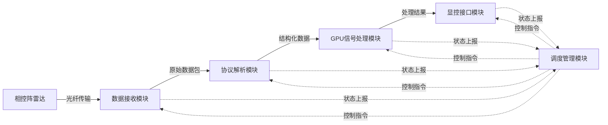
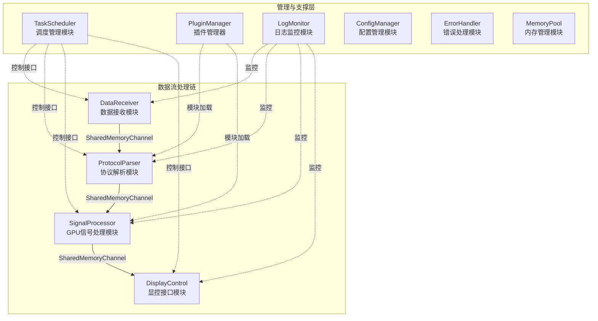
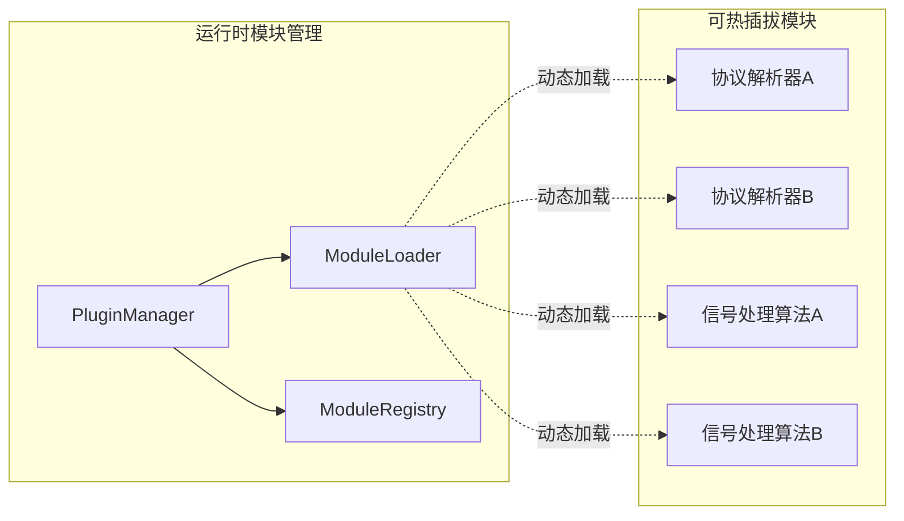
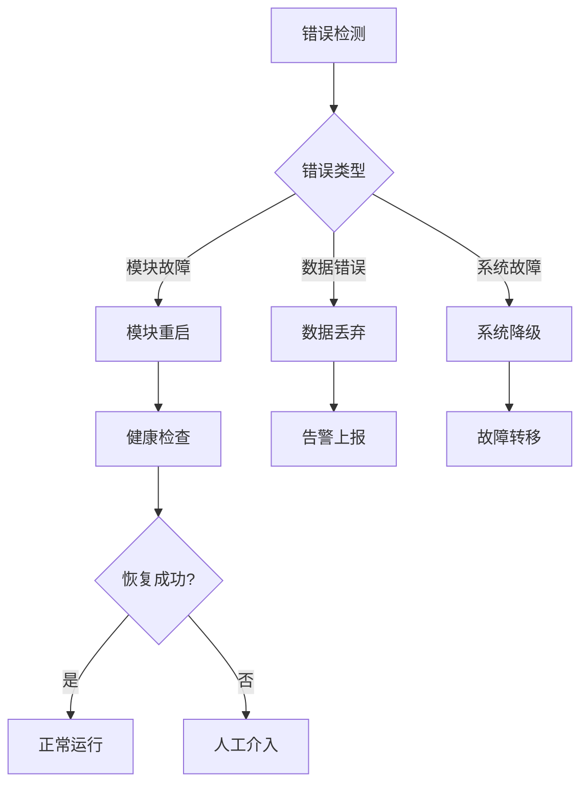

#  雷达数据处理系统架构设计文档 v2.0

## 文档信息
- **版本**: v2.0
- **创建日期**: 2025年9月5日
- **修订日期**: 2025年9月5日
- **负责人**: 周俊飞
- **审核状态**: 待审核

## 版本变更记录
| 版本 | 日期       | 修改内容                                                                                                                   | 修改人 |
| ---- | ---------- | -------------------------------------------------------------------------------------------------------------------------- | ------ |
| v1.0 | 2025-09-05 | 初始版本，基础架构设计                                                                                                     | 周俊飞 |
| v2.0 | 2025-09-05 | 1. 使用Mermaid重绘流程图<br/>2. 细化项目组织结构<br/>3. 明确环境配置需求<br/>4. 选择具体技术方案<br/>5. 增加热插拔模块设计 | 周俊飞 |

## 1. 项目概述

### 1.1 系统目标
构建一个基于GPU的相控阵雷达数据处理系统，实现从光纤数据接收到显控输出的完整数据流转架构。重点关注模块间接口调度和数据流管理。

### 1.2 核心数据流程


## 2. 技术栈选型（架构级决策）

### 2.1 已确定技术栈
- **开发语言**: C/C++17 (主要)
- **GPU计算**: CUDA 12.x
- **GPU库**: cuFFT (快速傅里叶变换)
- **运行平台**: Linux (Ubuntu 20.04 LTS 推荐)
- **显控**: Qt 6.x

### 2.2 架构级技术选型
- **通信方式**: 共享内存 + 无锁环形缓冲区 (boost::lockfree::spsc_queue)
  - **选择理由**: 零拷贝、低延迟、高吞吐量，适合雷达实时数据处理
- **序列化协议**: FlatBuffers
  - **选择理由**: 零拷贝反序列化、内存布局紧凑、跨语言支持
- **模块热插拔**: 动态库(.so) + 插件管理器
  - **选择理由**: 支持运行时模块替换，便于算法升级和A/B测试
- **日志系统**: spdlog (异步模式)
- **配置管理**: YAML-cpp
- **构建系统**: CMake 3.20+
- **内存管理**: 内存池 + CUDA统一内存

### 2.3 数据传输协议选择
- **光纤到服务器**: UDP (高性能、可接受少量丢包)
- **模块间通信**: 共享内存 (最高性能)
- **显控通信**: Qt信号槽机制

## 3. 详细模块化架构

### 3.1 核心模块流程图


### 3.2 热插拔模块设计


## 4. 接口设计规范

### 4.1 统一数据处理接口
```cpp
// 标准数据处理接口
class IDataProcessor {
public:
    virtual ~IDataProcessor() = default;
    virtual bool Initialize(const Config& config) = 0;
    virtual bool Process(const DataPacket& input, DataPacket& output) = 0;
    virtual void Cleanup() = 0;
    virtual std::string GetModuleName() const = 0;
    virtual std::string GetVersion() const = 0;
};

// 热插拔模块接口
class IPluginModule : public IDataProcessor {
public:
    virtual bool CanHotSwap() const = 0;
    virtual bool PrepareForSwap() = 0;
    virtual bool CompleteSwap() = 0;
};
```

### 4.2 数据包格式定义
```cpp
// 使用FlatBuffers定义的数据包格式
struct DataPacket {
    uint64_t timestamp;      // 时间戳
    uint32_t sequence_id;    // 序列号
    uint32_t data_type;      // 数据类型标识
    uint32_t data_size;      // 数据大小
    void* data_ptr;          // 数据指针
    uint32_t checksum;       // 校验和
};
```

### 4.3 通信接口
```cpp
// 异步通信接口
template<typename T>
class IAsyncChannel {
public:
    virtual bool Send(const T& data, uint32_t timeout_ms = 0) = 0;
    virtual bool Receive(T& data, uint32_t timeout_ms = 1000) = 0;
    virtual size_t GetQueueSize() const = 0;
    virtual bool IsConnected() const = 0;
};

// 性能监控接口
class IPerformanceMonitor {
public:
    virtual void RecordLatency(const std::string& module, uint64_t latency_us) = 0;
    virtual void RecordThroughput(const std::string& module, size_t bytes_per_sec) = 0;
    virtual void RecordError(const std::string& module, const std::string& error) = 0;
    virtual void RecordModuleSwap(const std::string& module, const std::string& operation) = 0;
};
```

## 5. 详细项目组织结构

```
radar_system/
├── CMakeLists.txt                    # 主构建文件
├── README.md                         # 项目说明
├── VERSION                           # 版本信息
├── LICENSE                           # 许可证
├── .gitignore                        # Git忽略文件
├── 
├── docs/                             # 文档目录
│   ├── architecture/                 # 架构文档
│   ├── api/                         # API文档
│   ├── deployment/                  # 部署文档
│   └── user_manual/                 # 用户手册
├── 
├── include/                          # 公共头文件
│   ├── interfaces/                   # 接口定义
│   │   ├── data_processor.h         # 数据处理接口
│   │   ├── async_channel.h          # 异步通信接口
│   │   ├── plugin_module.h          # 插件模块接口
│   │   └── performance_monitor.h    # 性能监控接口
│   ├── common/                      # 公共组件
│   │   ├── data_packet.h           # 数据包定义
│   │   ├── config.h                # 配置结构
│   │   ├── error_codes.h           # 错误码定义
│   │   └── utils.h                 # 工具函数
│   └── modules/                     # 各模块头文件
│       ├── data_receiver.h
│       ├── protocol_parser.h
│       ├── signal_processor.h
│       ├── display_control.h
│       └── task_scheduler.h
├── 
├── src/                             # 源代码
    │   ├── modules/                     # 模块实现
│   │   ├── data_receiver/           # 数据接收模块
│   │   │   ├── CMakeLists.txt
│   │   │   ├── data_receiver.cpp
│   │   │   ├── udp_receiver.cpp
│   │   │   └── fiber_interface.cpp
│   │   ├── protocol_parser/         # 协议解析模块
│   │   │   ├── CMakeLists.txt
│   │   │   ├── protocol_parser.cpp
│   │   │   ├── flatbuffer_parser.cpp
│   │   │   └── plugin_interface.cpp
│   │   ├── signal_processor/        # GPU信号处理模块
│   │   │   ├── CMakeLists.txt
│   │   │   ├── signal_processor.cpp
│   │   │   ├── cuda_kernels.cu
│   │   │   ├── fft_processor.cpp
│   │   │   └── plugin_interface.cpp
│   │   ├── display_control/         # 显控接口模块
│   │   │   ├── CMakeLists.txt
│   │   │   ├── display_control.cpp
│   │   │   ├── qt_interface.cpp
│   │   │   └── data_visualization.cpp
│   │   └── task_scheduler/          # 调度管理模块
│   │       ├── CMakeLists.txt
│   │       ├── task_scheduler.cpp
│   │       ├── module_manager.cpp
│   │       └── health_monitor.cpp
│   ├── common/                      # 公共组件实现
│   │   ├── CMakeLists.txt
│   │   ├── shared_memory.cpp        # 共享内存管理
│   │   ├── plugin_manager.cpp       # 插件管理器
│   │   ├── config_manager.cpp       # 配置管理
│   │   ├── log_monitor.cpp          # 日志监控
│   │   ├── memory_pool.cpp          # 内存池
│   │   └── error_handler.cpp        # 错误处理
│   ├── plugins/                     # 插件模块
│   │   ├── protocol_parsers/        # 协议解析插件
│   │   └── signal_processors/       # 信号处理插件
│   └── main.cpp                     # 主程序入口
├── 
├── tests/                           # 测试代码
│   ├── unit_tests/                  # 单元测试
│   ├── integration_tests/           # 集成测试
│   ├── performance_tests/           # 性能测试
│   └── mock/                        # 模拟组件
├── 
├── tools/                           # 工具脚本
│   ├── build_scripts/               # 构建脚本
│   ├── deployment/                  # 部署工具
│   ├── monitoring/                  # 监控工具
│   └── data_generators/             # 数据生成器
├── 
├── configs/                         # 配置文件
│   ├── system_config.yaml          # 系统配置
│   ├── module_config.yaml          # 模块配置
│   ├── logging_config.yaml         # 日志配置
│   └── gpu_config.yaml             # GPU配置
├── 
├── schemas/                         # 数据模式定义
│   ├── flatbuffers/                # FlatBuffers定义
│   └── protobuf/                   # ProtoBuf定义(备用)
├── 
├── third_party/                     # 第三方库
│   ├── boost/                      # Boost库
│   ├── flatbuffers/                # FlatBuffers
│   ├── spdlog/                     # 日志库
│   ├── yaml-cpp/                   # YAML解析
│   └── cuda_samples/               # CUDA示例
└── 
└── scripts/                         # 运行脚本
    ├── start_system.sh             # 启动脚本
    ├── stop_system.sh              # 停止脚本
    ├── restart_module.sh           # 模块重启
    └── health_check.sh             # 健康检查
```

## 6. 环境配置与依赖软件

### 6.1 必需环境组件
| 软件/库          | 版本要求 | 作用描述                           | 配置要点                          |
| ---------------- | -------- | ---------------------------------- | --------------------------------- |
| **CUDA Toolkit** | 12.x     | GPU并行计算框架，提供cuFFT等库     | 需配置环境变量，确保驱动兼容      |
| **Boost**        | 1.75+    | 提供无锁队列、智能指针等高性能组件 | 编译时需启用lockfree模块          |
| **FlatBuffers**  | 2.0+     | 高性能序列化库，零拷贝数据传输     | 需要flatc编译器生成C++代码        |
| **spdlog**       | 1.9+     | 高性能异步日志库                   | 配置异步模式，避免日志I/O阻塞     |
| **YAML-cpp**     | 0.7+     | YAML配置文件解析库                 | 用于系统配置管理                  |
| **Qt**           | 6.x      | 跨平台GUI框架                      | 显控界面开发，需配置Qt Charts模块 |

### 6.2 开发工具链
| 工具              | 版本要求         | 作用描述                         |
| ----------------- | ---------------- | -------------------------------- |
| **CMake**         | 3.20+            | 跨平台构建系统，管理复杂依赖关系 |
| **GCC/Clang**     | GCC 9+/Clang 10+ | C++17编译器，支持现代C++特性     |
| **NVIDIA nsight** | 最新版           | CUDA性能分析和调试工具           |
| **Valgrind**      | 3.16+            | 内存泄漏检测和性能分析           |
| **GDB**           | 9.0+             | 调试器，支持CUDA调试             |

### 6.3 系统级配置
| 配置项         | 作用描述           | 配置要点                           |
| -------------- | ------------------ | ---------------------------------- |
| **共享内存**   | 模块间高速数据传输 | 需配置足够的共享内存大小(/dev/shm) |
| **GPU内存**    | CUDA统一内存管理   | 确保GPU内存充足，配置内存池        |
| **网络缓冲区** | UDP数据接收优化    | 调整内核网络缓冲区大小             |
| **CPU亲和性**  | 优化线程调度       | 为关键线程绑定CPU核心              |
| **实时调度**   | 降低调度延迟       | 配置实时调度策略(SCHED_FIFO)       |

## 7. 系统可靠性设计

### 7.1 常规雷达系统可靠性要求
- **系统可用性**: 99.5% (年停机时间 < 44小时)
- **故障恢复时间**: < 30秒 (模块级故障)
- **数据完整性**: 99.99% (可接受极少量丢包)
- **实时性**: 平均延迟 < 100ms，99%延迟 < 200ms

### 7.2 错误处理策略


### 7.3 热插拔实现机制
- **模块状态管理**: INIT -> RUNNING -> STOPPING -> STOPPED
- **数据缓冲**: 切换期间数据暂存
- **版本兼容性**: 接口版本检查
- **回滚机制**: 新模块异常时自动回滚

## 8. 显控功能设计

### 8.1 显示需求（架构级）
- **数据类型**: 时域波形、频域频谱、二维雷达图像
- **刷新率**: 30-60 FPS (可配置)
- **历史数据**: 支持最近1小时数据回放
- **多窗口**: 支持多视图同时显示

### 8.2 交互功能（架构级）
- **实时控制**: 启动/停止各模块
- **参数调整**: 运行时修改处理参数
- **状态监控**: 实时显示系统健康状态
- **告警管理**: 错误和异常的可视化

## 9. 下一步实施计划

### 9.1 第一阶段：框架搭建（2周）
1. 搭建CMake构建系统
2. 实现基础接口定义
3. 完成共享内存通信框架
4. 实现插件管理器基础功能

### 9.2 第二阶段：核心模块（4周）
1. 实现数据接收模块框架
2. 完成协议解析模块接口
3. 搭建GPU信号处理框架
4. 实现基础显控界面

### 9.3 第三阶段：集成测试（2周）
1. 端到端数据流测试
2. 性能基准测试
3. 热插拔功能验证
4. 错误处理机制验证

---

**备注**: 本文档专注于架构设计和接口规范，具体算法实现细节由相应模块负责人完成。
