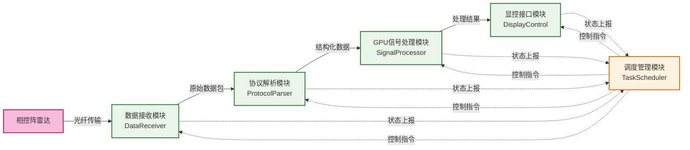
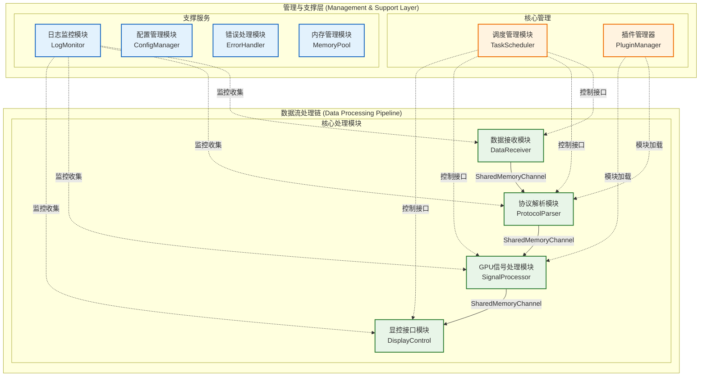
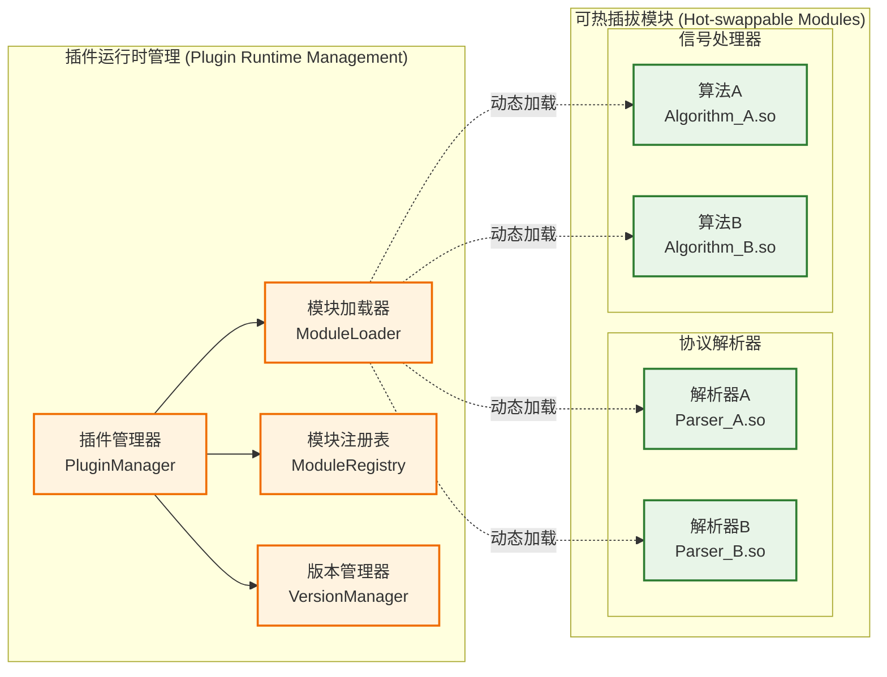
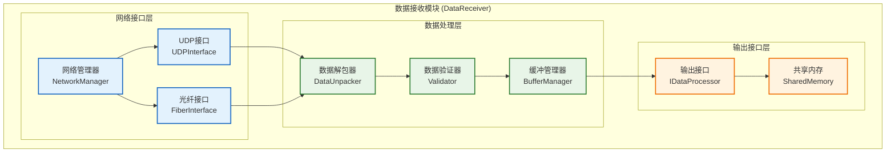
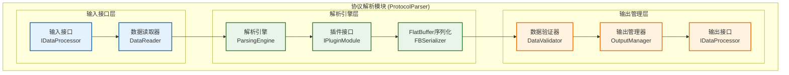
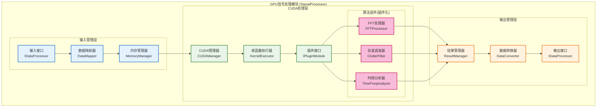
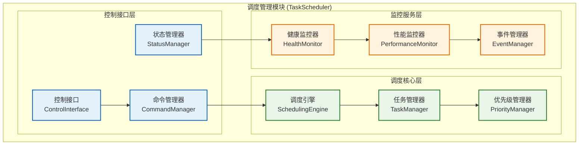

# 雷达数据处理系统架构设计文档 v3.0

## 文档信息
- **版本**: v3.0
- **创建日期**: 2025年9月5日
- **修订日期**: 2025年9月5日
- **负责人**: 架构设计师
- **审核状态**: 待审核

## 版本变更记录
| 版本 | 日期       | 修改内容                                                                                                                                                                             | 修改人     |
| ---- | ---------- | ------------------------------------------------------------------------------------------------------------------------------------------------------------------------------------ | ---------- |
| v1.0 | 2025-09-05 | 初始版本，基础架构设计                                                                                                                                                               | 架构设计师 |
| v2.0 | 2025-09-05 | 1. 使用Mermaid重绘流程图<br/>2. 细化项目组织结构<br/>3. 明确环境配置需求<br/>4. 选择具体技术方案<br/>5. 增加热插拔模块设计                                                           | 架构设计师 |
| v3.0 | 2025-09-05 | 1. 优化Mermaid图表设计，遵循知识图谱绘制指南<br/>2. 简化项目组织结构，专注架构设计<br/>3. 移除系统可靠性和显控功能具体实现<br/>4. 新增项目架构完成操作顺序<br/>5. 新增模块组件细化图 | 架构设计师 |

## 1. 项目概述

### 1.1 系统目标
构建一个基于GPU的相控阵雷达数据处理系统，实现从光纤数据接收到显控输出的完整数据流转架构。重点关注模块间接口调度和数据流管理。

### 1.2 核心数据流程


## 2. 技术栈选型（架构级决策）

### 2.1 已确定技术栈
- **开发语言**: C/C++17 (主要)
- **GPU计算**: CUDA 12.x
- **GPU库**: cuFFT (快速傅里叶变换)
- **运行平台**: Linux (Ubuntu 20.04 LTS 推荐)
- **显控**: Qt 6.x

### 2.2 架构级技术选型
- **通信方式**: 共享内存 + 无锁环形缓冲区 (boost::lockfree::spsc_queue)
  - **选择理由**: 零拷贝、低延迟、高吞吐量，适合雷达实时数据处理
- **序列化协议**: FlatBuffers
  - **选择理由**: 零拷贝反序列化、内存布局紧凑、跨语言支持
- **模块热插拔**: 动态库(.so) + 插件管理器
  - **选择理由**: 支持运行时模块替换，便于算法升级和A/B测试
- **日志系统**: spdlog (异步模式)
- **配置管理**: YAML-cpp
- **构建系统**: CMake 3.20+
- **内存管理**: 内存池 + CUDA统一内存

### 2.3 数据传输协议选择
- **光纤到服务器**: UDP (高性能、可接受少量丢包)
- **模块间通信**: 共享内存 (最高性能)
- **显控通信**: Qt信号槽机制

## 3. 模块化架构设计

### 3.1 系统架构总览


### 3.2 热插拔模块设计


## 4. 模块组件细化图

### 4.1 数据接收模块细化


### 4.2 协议解析模块细化


### 4.3 GPU信号处理模块细化


### 4.4 调度管理模块细化


## 5. 接口设计规范

### 5.1 统一数据处理接口
```cpp
// 标准数据处理接口
class IDataProcessor {
public:
    virtual ~IDataProcessor() = default;
    virtual bool Initialize(const Config& config) = 0;
    virtual bool Process(const DataPacket& input, DataPacket& output) = 0;
    virtual void Cleanup() = 0;
    virtual std::string GetModuleName() const = 0;
    virtual std::string GetVersion() const = 0;
    virtual ModuleStatus GetStatus() const = 0;
};

// 热插拔模块接口
class IPluginModule : public IDataProcessor {
public:
    virtual bool CanHotSwap() const = 0;
    virtual bool PrepareForSwap() = 0;
    virtual bool CompleteSwap() = 0;
    virtual std::vector<std::string> GetDependencies() const = 0;
};

// 控制接口
class IControlInterface {
public:
    virtual bool Start() = 0;
    virtual bool Stop() = 0;
    virtual bool Pause() = 0;
    virtual bool Resume() = 0;
    virtual bool SetParameter(const std::string& key, const std::string& value) = 0;
    virtual std::string GetParameter(const std::string& key) const = 0;
};
```

### 5.2 数据包格式定义
```cpp
// 使用FlatBuffers定义的数据包格式
struct DataPacket {
    uint64_t timestamp;      // 时间戳
    uint32_t sequence_id;    // 序列号
    uint32_t data_type;      // 数据类型标识
    uint32_t data_size;      // 数据大小
    void* data_ptr;          // 数据指针
    uint32_t checksum;       // 校验和
    ModuleID source_module;  // 源模块标识
    ModuleID target_module;  // 目标模块标识
};

// 模块状态定义
enum class ModuleStatus {
    UNINITIALIZED,
    INITIALIZING,
    READY,
    RUNNING,
    PAUSED,
    STOPPING,
    STOPPED,
    ERROR
};
```

### 5.3 通信接口
```cpp
// 异步通信接口
template<typename T>
class IAsyncChannel {
public:
    virtual bool Send(const T& data, uint32_t timeout_ms = 0) = 0;
    virtual bool Receive(T& data, uint32_t timeout_ms = 1000) = 0;
    virtual size_t GetQueueSize() const = 0;
    virtual bool IsConnected() const = 0;
    virtual void SetBackpressureThreshold(size_t threshold) = 0;
};

// 监控接口 (预留接口，具体实现待定)
class IPerformanceMonitor {
public:
    virtual void RecordLatency(const std::string& module, uint64_t latency_us) = 0;
    virtual void RecordThroughput(const std::string& module, size_t bytes_per_sec) = 0;
    virtual void RecordError(const std::string& module, const std::string& error) = 0;
    virtual void RecordModuleSwap(const std::string& module, const std::string& operation) = 0;
    // TODO: 添加更多监控指标
};
```

## 6. 项目组织结构

```
radar_system/
├── CMakeLists.txt                    # 主构建文件
├── README.md                         # 项目说明
├── VERSION                           # 版本信息
├── LICENSE                           # 许可证
├── .gitignore                        # Git忽略文件
├── 
├── docs/                             # 文档目录
│   ├── architecture/                 # 架构文档
│   ├── api/                         # API文档
│   └── interfaces/                  # 接口规范文档
├── 
├── include/                          # 公共头文件
│   ├── interfaces/                   # 接口定义
│   │   ├── data_processor.h         # 数据处理接口
│   │   ├── async_channel.h          # 异步通信接口
│   │   ├── plugin_module.h          # 插件模块接口
│   │   ├── control_interface.h      # 控制接口
│   │   └── performance_monitor.h    # 性能监控接口
│   ├── common/                      # 公共组件
│   │   ├── data_packet.h           # 数据包定义
│   │   ├── config.h                # 配置结构
│   │   ├── error_codes.h           # 错误码定义
│   │   ├── module_status.h         # 模块状态定义
│   │   └── utils.h                 # 工具函数
│   └── modules/                     # 各模块头文件
│       ├── data_receiver.h         # 数据接收模块
│       ├── protocol_parser.h       # 协议解析模块
│       ├── signal_processor.h      # 信号处理模块
│       ├── display_control.h       # 显控接口模块
│       └── task_scheduler.h        # 调度管理模块
├── 
├── src/                             # 源代码
│   ├── modules/                     # 模块实现
│   │   ├── data_receiver/           # 数据接收模块
│   │   ├── protocol_parser/         # 协议解析模块
│   │   ├── signal_processor/        # GPU信号处理模块
│   │   ├── display_control/         # 显控接口模块
│   │   └── task_scheduler/          # 调度管理模块
│   ├── common/                      # 公共组件实现
│   │   ├── shared_memory.cpp        # 共享内存管理
│   │   ├── plugin_manager.cpp       # 插件管理器
│   │   ├── config_manager.cpp       # 配置管理
│   │   ├── log_monitor.cpp          # 日志监控
│   │   ├── memory_pool.cpp          # 内存池
│   │   └── error_handler.cpp        # 错误处理
│   ├── plugins/                     # 插件模块
│   │   ├── protocol_parsers/        # 协议解析插件
│   │   └── signal_processors/       # 信号处理插件
│   └── main.cpp                     # 主程序入口
├── 
├── tests/                           # 测试代码
│   ├── unit_tests/                  # 单元测试
│   ├── integration_tests/           # 集成测试
│   └── mock/                        # 模拟组件
├── 
├── tools/                           # 工具脚本
│   ├── build_scripts/               # 构建脚本
│   └── data_generators/             # 数据生成器
├── 
├── configs/                         # 配置文件
│   ├── system_config.yaml          # 系统配置
│   ├── module_config.yaml          # 模块配置
│   ├── logging_config.yaml         # 日志配置
│   └── gpu_config.yaml             # GPU配置
├── 
├── schemas/                         # 数据模式定义
│   └── flatbuffers/                # FlatBuffers定义
├── 
├── third_party/                     # 第三方库
│   ├── boost/                      # Boost库
│   ├── flatbuffers/                # FlatBuffers
│   ├── spdlog/                     # 日志库
│   ├── yaml-cpp/                   # YAML解析
│   └── cuda_samples/               # CUDA示例
└── 
└── scripts/                         # 运行脚本
    ├── start_system.sh             # 启动脚本
    ├── stop_system.sh              # 停止脚本
    └── health_check.sh             # 健康检查
```

## 7. 环境配置与依赖软件

### 7.1 必需环境组件
| 软件/库          | 版本要求 | 作用描述                           | 配置要点                          |
| ---------------- | -------- | ---------------------------------- | --------------------------------- |
| **CUDA Toolkit** | 12.x     | GPU并行计算框架，提供cuFFT等库     | 需配置环境变量，确保驱动兼容      |
| **Boost**        | 1.75+    | 提供无锁队列、智能指针等高性能组件 | 编译时需启用lockfree模块          |
| **FlatBuffers**  | 2.0+     | 高性能序列化库，零拷贝数据传输     | 需要flatc编译器生成C++代码        |
| **spdlog**       | 1.9+     | 高性能异步日志库                   | 配置异步模式，避免日志I/O阻塞     |
| **YAML-cpp**     | 0.7+     | YAML配置文件解析库                 | 用于系统配置管理                  |
| **Qt**           | 6.x      | 跨平台GUI框架                      | 显控界面开发，需配置Qt Charts模块 |

### 7.2 开发工具链
| 工具              | 版本要求         | 作用描述                         |
| ----------------- | ---------------- | -------------------------------- |
| **CMake**         | 3.20+            | 跨平台构建系统，管理复杂依赖关系 |
| **GCC/Clang**     | GCC 9+/Clang 10+ | C++17编译器，支持现代C++特性     |
| **NVIDIA nsight** | 最新版           | CUDA性能分析和调试工具           |
| **Valgrind**      | 3.16+            | 内存泄漏检测和性能分析           |
| **GDB**           | 9.0+             | 调试器，支持CUDA调试             |

### 7.3 系统级配置
| 配置项         | 作用描述           | 配置要点                           |
| -------------- | ------------------ | ---------------------------------- |
| **共享内存**   | 模块间高速数据传输 | 需配置足够的共享内存大小(/dev/shm) |
| **GPU内存**    | CUDA统一内存管理   | 确保GPU内存充足，配置内存池        |
| **网络缓冲区** | UDP数据接收优化    | 调整内核网络缓冲区大小             |
| **CPU亲和性**  | 优化线程调度       | 为关键线程绑定CPU核心              |
| **实时调度**   | 降低调度延迟       | 配置实时调度策略(SCHED_FIFO)       |

## 8. 完成项目架构的操作顺序

### 8.1 架构设计阶段（第1-2周）

#### 步骤1: 接口设计与定义
- **操作内容**: 完善核心接口定义，确保接口的完整性和一致性
- **关键产出**: 
  - `include/interfaces/` 目录下的所有接口头文件
  - 数据包格式和模块状态枚举定义
- **注意事项**: 
  - 接口设计要考虑未来扩展性
  - 确保接口的向后兼容性
  - 预留错误处理和监控接口

#### 步骤2: 数据流设计
- **操作内容**: 设计详细的数据流转规范和缓冲机制
- **关键产出**:
  - FlatBuffers数据格式定义 (`schemas/flatbuffers/`)
  - 共享内存通信协议规范
  - 数据包路由和调度策略
- **注意事项**:
  - 考虑数据包的序列化/反序列化开销
  - 设计合理的缓冲区大小和背压控制
  - 确保数据流的实时性要求

#### 步骤3: 模块框架搭建
- **操作内容**: 创建各模块的基础框架和接口实现
- **关键产出**:
  - 各模块的基础类框架
  - 插件管理器基础实现
  - 配置管理系统
- **注意事项**:
  - 使用工厂模式和依赖注入
  - 确保模块间的解耦
  - 实现基础的生命周期管理

### 8.2 核心组件实现阶段（第3-6周）

#### 步骤4: 通信层实现
- **操作内容**: 实现共享内存通信和无锁队列机制
- **关键产出**:
  - 共享内存管理器实现
  - 异步通信通道实现
  - 内存池管理系统
- **注意事项**:
  - 重点测试通信层的性能和稳定性
  - 实现合理的错误恢复机制
  - 考虑多进程安全性

#### 步骤5: 调度管理器实现
- **操作内容**: 实现任务调度和模块生命周期管理
- **关键产出**:
  - 调度引擎核心逻辑
  - 模块状态机管理
  - 健康监控基础框架
- **注意事项**:
  - 实现优先级调度算法
  - 确保调度的公平性和实时性
  - 预留性能监控接口

#### 步骤6: 热插拔机制实现
- **操作内容**: 实现动态模块加载和版本管理
- **关键产出**:
  - 插件加载器实现
  - 版本兼容性检查
  - 运行时模块替换机制
- **注意事项**:
  - 确保热插拔过程中数据的一致性
  - 实现模块切换的原子性操作
  - 设计合理的回滚机制

### 8.3 模块集成阶段（第7-8周）

#### 步骤7: 数据接收模块集成
- **操作内容**: 实现UDP数据接收和初步数据处理
- **关键产出**:
  - 网络数据接收实现
  - 数据解包和验证逻辑
  - 与协议解析模块的接口对接
- **注意事项**:
  - 优化网络接收性能
  - 实现数据包丢失检测
  - 确保数据包顺序的正确性

#### 步骤8: 端到端数据流测试
- **操作内容**: 验证完整的数据流转链路
- **关键产出**:
  - 数据流集成测试用例
  - 性能基准测试结果
  - 系统稳定性测试报告
- **注意事项**:
  - 重点测试数据流的实时性
  - 验证各模块接口的正确性
  - 测试异常情况下的系统行为

### 8.4 每个步骤的通用注意事项

1. **接口优先原则**: 每个步骤都要先确定接口，再实现功能
2. **单元测试**: 每完成一个组件立即编写单元测试
3. **文档同步**: 实现过程中及时更新接口文档和设计文档
4. **性能基准**: 关键组件实现后立即进行性能测试
5. **错误处理**: 每个组件都要实现完整的错误处理逻辑
6. **配置化**: 所有可调参数都要通过配置文件管理
7. **日志记录**: 实现统一的日志记录标准
8. **内存管理**: 严格控制内存分配和释放，避免内存泄漏

---

**备注**: 本文档专注于架构设计和接口规范，具体算法实现细节和系统可靠性实现由相应模块负责人完成。文档将根据实际开发进展持续更新和完善。
