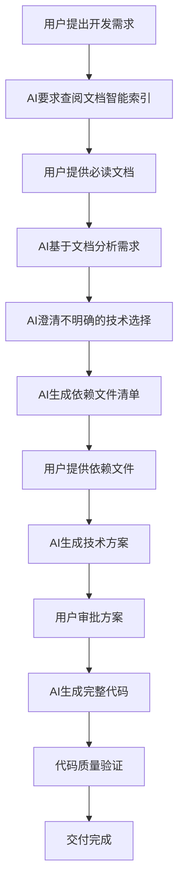
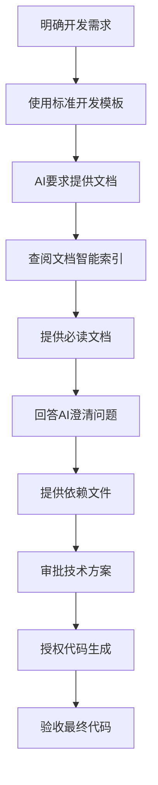

# 私人文档使用指南

- **标题**: AI协作开发私人文档快速使用指南
- **当前版本**: v2.0
- **最后更新**: 2025-09-11
- **负责人**: Kelin

---

## 🚀 快速开始

### 第一次使用
1. **阅读本文档**，了解基本工作流程
2. **查看 [`文档智能索引.md`](文档智能索引.md)**，熟悉文档分类
3. **参考 [`工作流程图.md`](工作流程图.md)**，理解交互流程
4. **使用 [`检查清单.md`](检查清单.md)**，准备开发环境

### 日常开发
1. **明确开发需求**：确定要开发的模块或功能
2. **使用标准模板**：`"我要开发[模块名]，请参考私人文档"`
3. **AI自动引导**：AI会要求您提供特定文档
4. **提供文档**：根据AI要求提供必读文档
5. **跟进流程**：AI基于文档自动完成分析和开发

---

## 🎯 核心工作流程

### AI标准工作流程



### 用户标准工作流程



---

## 🎨 标准交互模板

### 用户发起开发请求

```markdown
我要开发[模块名]，请参考私人文档进行分析和实现。

模块信息：
- 功能描述：[具体功能说明]
- 技术要求：[CPU/GPU、同步/异步、性能指标]
- 接口要求：[输入输出格式、返回值类型]
- 集成要求：[依赖模块、调用关系]
- 验收标准：[功能验证、性能基准]

请按照文档引导工作流程进行。
```

### AI标准响应

```markdown
📋 **开发请求确认**: [重述用户需求]

🔍 **文档引导需求**:
为确保精确遵循项目规范，请根据 `docs_private/00_快速开始/文档智能索引.md`
查找您的问题类型，并提供对应的【必读文档】。

**请提供**:
- [ ] `docs_private/[具体路径]` - [说明用途]
- [ ] `docs_private/[具体路径]` - [说明用途]

⏭️ **下一步**: 您提供文档后，我将基于这些规范进行精确的需求澄清和方案设计。
```

### 用户提供文档

```markdown
📁 **文档提供**:
根据您的要求，我提供以下文档：

**必读文档**:
[附件: 具体文档文件]

**授权执行**: 请基于这些文档开始分析和设计。
```

---

## 快速导航

| 目录                | 功能说明                 | 使用场景             |
| :------------------ | :----------------------- | :------------------- |
| **01_AI交互规范**   | AI沟通的标准化流程和原则 | 🎯 每次与AI协作前必读 |
| **02_编码规范**     | 代码风格和注释标准       | 📝 编写代码时参考     |
| **03_开发指南**     | 系统构建的详细步骤       | 🏗️ 开始新模块开发时   |
| **04_技术栈配置**   | 环境配置和技术选型       | ⚙️ 环境搭建和技术决策 |
| **05_测试策略**     | 测试组织和实施方法       | 🧪 编写测试代码时     |
| **06_自动化模板**   | 代码和文档模板库         | 📋 快速生成标准文件   |
| **07_AI工作流**     | AI代码生成的标准流程     | 🤖 AI自动化开发时     |
| **08_项目特定配置** | 雷达系统专用规范         | 📡 雷达相关功能开发   |
| **09_最佳实践**     | 问题解决和优化指南       | 💡 遇到问题时查阅     |
| **10_元信息**       | 文档管理和术语定义       | 📚 维护文档时参考     |

---

## 立即开始（3步上手）

### 步骤1: 明确开发目标 🎯
```markdown
告诉AI: "我要开发[具体模块名]，请参考私人文档"
示例: "我要开发DataReceiver模块，请参考私人文档"
```

### 步骤2: AI自动分析 🤖
AI会自动：
- ✅ 读取相关规范文件（02_编码规范，08_项目特定配置等）
- ✅ 分析需求并提出澄清问题
- ✅ 列出所需的依赖文件清单

### 步骤3: 协作完成 🚀
您只需：
- ✅ 回答AI的澄清问题
- ✅ 提供AI请求的依赖文件
- ✅ 审批AI的设计方案
- ✅ 下达执行命令

---

## 常用工作流

### 🏗️ 工作流1: 新模块开发
```
用户请求 → AI读取规范 → 需求澄清 → 依赖分析 → 方案设计 → 代码生成
参考文件: 03_开发指南/模块开发流程.md
```

### 🔧 工作流2: 组件实现
```
组件需求 → AI分析接口 → 设计确认 → 实现代码 → 单元测试
参考文件: 03_开发指南/组件实现指南.md
```

### 🧪 工作流3: 测试编写
```
测试需求 → 测试策略 → 测试数据 → 测试代码 → 验证运行
参考文件: 05_测试策略/单元测试规范.md
```

---

## 文件快速索引

### 🔥 最常用文件
| 文件                              | 用途               | 何时使用           |
| :-------------------------------- | :----------------- | :----------------- |
| `07_AI工作流/代码生成流程.md`     | AI代码生成标准流程 | 每次让AI生成代码前 |
| `02_编码规范/代码风格指南.md`     | 代码规范参考       | 代码审查时         |
| `03_开发指南/系统构建顺序.md`     | 开发顺序指导       | 项目初期规划时     |
| `08_项目特定配置/雷达系统约定.md` | 雷达项目专用规范   | 开发雷达功能时     |

### 📋 模板文件
| 模板类型 | 文件位置                                  | 说明             |
| :------- | :---------------------------------------- | :--------------- |
| 接口类   | `06_自动化模板/模块模板/接口类模板.hpp`   | 标准接口类结构   |
| 实现类   | `06_自动化模板/模块模板/实现类模板.cpp`   | 实现类代码框架   |
| 单元测试 | `06_自动化模板/模块模板/单元测试模板.cpp` | 测试代码模板     |
| 设计文档 | `06_自动化模板/文档模板/设计文档模板.md`  | 模块设计文档格式 |

### 🆘 问题解决
| 问题类型     | 参考文件                        |
| :----------- | :------------------------------ |
| AI理解错误   | `01_AI交互规范/意图澄清协议.md` |
| 代码质量问题 | `02_编码规范/代码审查要点.md`   |
| 环境配置问题 | `04_技术栈配置/开发环境配置.md` |
| 性能问题     | `09_最佳实践/性能优化指南.md`   |
| 常见错误     | `09_最佳实践/常见问题解答.md`   |

---

## 问题解决

### ❓ 找不到需要的信息？
1. 检查 `文件快速索引` 表格
2. 查阅 `09_最佳实践/常见问题解答.md`
3. 使用 `10_元信息/术语表.md` 确认术语含义

### 🤖 AI理解错误？
1. 参考 `01_AI交互规范/意图澄清协议.md`
2. 使用 `01_AI交互规范/prompt模板库.md` 中的标准表达
3. 提供更多上下文信息

### 🚫 代码不符合规范？
1. 检查 `02_编码规范/代码审查要点.md`
2. 参考 `06_自动化模板/` 中的标准模板
3. 使用 `02_编码规范/代码风格指南.md` 进行对比

### ⚡ 开发效率低？
1. 阅读 `工作流程图.md` 优化协作流程
2. 使用 `检查清单.md` 避免遗漏
3. 参考 `09_最佳实践/` 中的优化建议

---

## 使用技巧

### 💡 高效协作技巧
- **明确表达**: 使用具体的技术术语，避免模糊描述
- **提供上下文**: 告诉AI当前的开发阶段和相关模块
- **主动澄清**: 不确定时主动询问AI的理解是否正确
- **分步验证**: 大功能分解为小步骤，逐步验证

### 🎯 质量保证技巧
- **模板优先**: 优先使用 `06_自动化模板/` 中的标准模板
- **规范检查**: 每次提交前用 `02_编码规范/` 进行自查
- **测试同步**: 代码编写的同时编写对应的单元测试
- **文档更新**: 接口变更时及时更新相关文档

---

## 快速命令

### 🚀 标准开始命令
```
"我要开发[模块名]，请参考私人文档进行分析和实现"
```

### 🔍 问题诊断命令
```
"请参考私人文档中的错误处理流程，帮我分析这个问题"
```

### 📝 代码审查命令
```
"请根据私人文档中的编码规范，审查这段代码"
```

---

## 变更记录

| 版本 | 日期       | 修改人 | 变更摘要         |
| :--- | :--------- | :----- | :--------------- |
| v1.0 | 2025-09-10 | Kelin  | 创建快速上手指南 |
