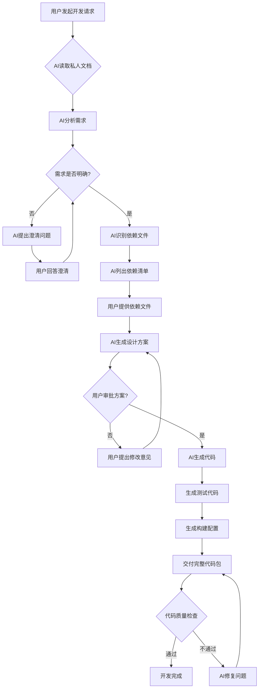
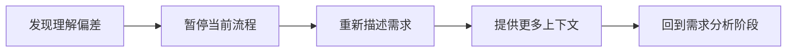
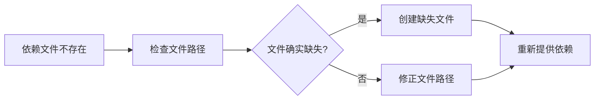
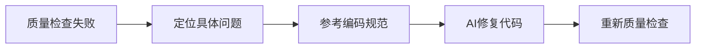

# AI协作工作流可视化

- **标题**: AI协作MVP开发工作流程图
- **当前版本**: v1.0
- **最后更新**: 2025-09-10
- **负责人**: Kelin

---

## 标准工作流程



### 流程阶段说明

| 阶段         | 责任方    | 主要活动                   | 预期输出           |
| :----------- | :-------- | :------------------------- | :----------------- |
| **需求分析** | AI        | 解析用户需求，读取相关文档 | 需求理解确认       |
| **需求澄清** | AI + 用户 | AI提问，用户回答           | 明确的技术要求     |
| **依赖分析** | AI        | 识别所需文件和模块         | 依赖文件清单       |
| **方案设计** | AI        | 生成技术方案和接口设计     | 设计方案文档       |
| **方案审批** | 用户      | 审查方案的合理性           | 审批结果           |
| **代码生成** | AI        | 自动生成完整代码           | 源码 + 测试 + 配置 |
| **质量验证** | AI + 用户 | 代码检查和测试             | 可用的代码模块     |

---

## 决策节点详解

### 🎯 节点1: 需求是否明确?

**判断标准**:
- ✅ 技术栈明确（CPU/GPU处理方式）
- ✅ 性能要求明确（延迟、吞吐量）
- ✅ 接口规范明确（输入输出格式）
- ✅ 依赖关系明确（与其他模块的交互）

**AI澄清问题示例**:
```markdown
- "您提到的数据处理是指同步处理还是异步处理？"
- "期望的处理延迟是多少毫秒？"
- "输入数据的格式是RawDataPacket吗？"
- "需要与哪些现有模块进行交互？"
```

### 🎯 节点2: 用户审批方案?

**审批要点**:
- ✅ 架构设计合理性
- ✅ 接口定义完整性
- ✅ 性能预期可达性
- ✅ 与现有系统兼容性

**常见修改原因**:
- 接口设计不符合项目规范
- 性能方案不满足实时要求
- 缺少错误处理机制
- 依赖关系过于复杂

### 🎯 节点3: 代码质量检查

**检查项目**:
- ✅ 遵循编码规范（命名、注释、格式）
- ✅ 包含完整的单元测试
- ✅ 错误处理机制完备
- ✅ 性能关键路径优化

---

## 异常处理路径

### ⚠️ 异常1: AI理解偏差



**处理策略**:
1. 使用 `01_AI交互规范/意图澄清协议.md` 中的标准表达
2. 提供具体的代码示例或接口定义
3. 引用项目中的类似实现作为参考

### ⚠️ 异常2: 依赖文件缺失



**处理策略**:
1. 检查 `03_开发指南/文件创建顺序.md` 确认依赖关系
2. 使用 `06_自动化模板/` 快速创建缺失文件
3. 调整开发顺序，先完成依赖模块

### ⚠️ 异常3: 代码质量不达标



**处理策略**:
1. 对照 `02_编码规范/代码审查要点.md` 进行详细检查
2. 使用 `06_自动化模板/` 中的标准模板进行对比
3. 必要时重新生成有问题的部分

---

## 并行开发协调

### 🔄 多模块并行开发

```mermaid
gantt
    title 并行开发时间线
    dateFormat  X
    axisFormat %s

    section 基础模块
    DataTypes定义    :done, dt, 0, 1
    Logger实现       :done, log, 0, 2

    section 核心模块
    DataReceiver     :active, dr, 1, 3
    DataProcessor    :active, dp, 1, 4
    SystemScheduler  :sched, 2, 5

    section 测试模块
    单元测试         :test, 3, 6
    集成测试         :integ, 5, 7
```



**协调原则**:
1. **依赖优先**: 先完成被依赖的基础模块
2. **接口锁定**: 并行模块的接口定义必须提前确定
3. **定期同步**: 每日检查接口变更和依赖更新
4. **分离测试**: 每个模块独立进行单元测试

### 🎭 角色分工

| 开发角色       | 主要职责           | 使用的私人文档                     |
| :------------- | :----------------- | :--------------------------------- |
| **架构师**     | 模块划分，接口设计 | `03_开发指南/`, `08_项目特定配置/` |
| **算法工程师** | 核心算法实现       | `02_编码规范/`, `09_最佳实践/`     |
| **系统工程师** | 集成测试，性能优化 | `05_测试策略/`, `04_技术栈配置/`   |
| **AI协作者**   | AI交互，代码生成   | `01_AI交互规范/`, `07_AI工作流/`   |

---

## 效率优化要点

### ⚡ 提升AI理解效率

**技巧1: 标准化表达**
```markdown
✅ 好的表达: "实现IDataProcessor接口，支持异步批处理，批大小为1024"
❌ 差的表达: "做一个数据处理的东西"
```

**技巧2: 提供上下文**
```markdown
✅ 好的上下文: "在雷达数据处理系统中，需要GPU加速的信号处理模块"
❌ 差的上下文: "需要一个处理模块"
```

**技巧3: 使用项目术语**
```markdown
✅ 使用术语: "RawDataPacket", "ProcessedData", "GPUProcessor"
❌ 通用词汇: "数据", "结果", "处理器"
```

### ⚡ 减少往返次数

**策略1: 一次性提供完整信息**
- 开发目标 + 性能要求 + 依赖关系
- 参考现有模块的实现方式
- 明确的验收标准

**策略2: 预准备依赖文件**
- 提前阅读 `03_开发指南/文件创建顺序.md`
- 准备好接口定义文件
- 准备好相关的配置文件

**策略3: 使用检查清单**
- 使用 `检查清单.md` 避免遗漏
- 开发前完成所有准备工作
- 减少中途补充信息的次数

### ⚡ 代码质量保证

**自动化检查**:
- 使用 `06_自动化模板/` 确保代码结构统一
- 参考 `02_编码规范/` 进行自动化格式检查
- 使用 `05_测试策略/` 确保测试覆盖率

**人工审查要点**:
- 接口设计的合理性和完整性
- 错误处理和边界条件考虑
- 性能关键路径的优化
- 与现有系统的集成兼容性

---

## 变更记录

| 版本 | 日期       | 修改人 | 变更摘要             |
| :--- | :--------- | :----- | :------------------- |
| v1.0 | 2025-09-10 | Kelin  | 创建AI协作工作流程图 |
