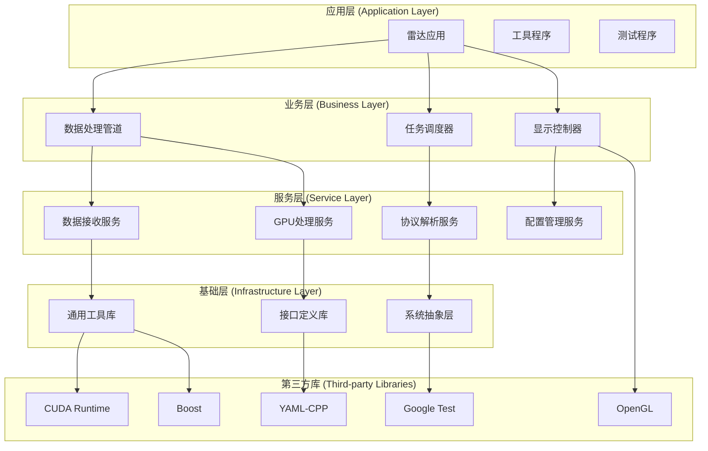

# 依赖管理策略

- **标题**: AI协作开发依赖管理策略指南
- **当前版本**: v1.0
- **最后更新**: 2025-09-10
- **负责人**: Kelin

---

## 依赖管理架构

### 🏗️ 依赖层次设计

#### 分层依赖模型


#### 依赖原则和约束
```markdown
## 核心依赖原则

### 1. 单向依赖原则
- 上层依赖下层，下层不依赖上层
- 同层模块之间通过接口通信
- 禁止循环依赖

### 2. 接口隔离原则
- 模块只依赖需要的接口
- 接口定义与实现分离
- 最小依赖暴露

### 3. 依赖倒置原则
- 高层模块不依赖低层模块具体实现
- 都依赖于抽象接口
- 抽象不依赖细节

### 4. 稳定依赖原则
- 依赖稳定性高的模块
- 避免依赖频繁变化的模块
- 核心模块保持接口稳定
```

---

## 第三方库管理

### 📦 依赖库分类管理

#### 核心运行时依赖
```cmake
# cmake/CoreDependencies.cmake - 核心依赖配置

# CUDA - GPU计算核心依赖
find_package(CUDAToolkit REQUIRED)
if(NOT CUDAToolkit_FOUND)
    message(FATAL_ERROR "CUDA Toolkit is required for GPU processing")
endif()

set(CUDA_LIBRARIES
    CUDA::cudart
    CUDA::cufft
    CUDA::cublas
    CUDA::curand
)

# OpenGL - 图形渲染核心依赖
find_package(OpenGL REQUIRED)
find_package(glfw3 REQUIRED)
find_package(GLEW REQUIRED)

set(GRAPHICS_LIBRARIES
    OpenGL::GL
    glfw
    GLEW::GLEW
)

# 网络库
find_package(Boost REQUIRED COMPONENTS system asio)
set(NETWORK_LIBRARIES
    Boost::system
    Boost::asio
)

# 序列化库
find_package(PkgConfig REQUIRED)
pkg_check_modules(YAML_CPP REQUIRED yaml-cpp)
```

#### 开发和测试依赖
```cmake
# cmake/DevelopmentDependencies.cmake - 开发依赖配置

# 测试框架
find_package(GTest REQUIRED)
find_package(GMock REQUIRED)

set(TEST_LIBRARIES
    GTest::gtest
    GTest::gtest_main
    GMock::gmock
    GMock::gmock_main
)

# 基准测试
find_package(benchmark REQUIRED)
set(BENCHMARK_LIBRARIES
    benchmark::benchmark
)

# 代码覆盖率
if(ENABLE_COVERAGE)
    if(CMAKE_CXX_COMPILER_ID MATCHES "GNU|Clang")
        set(CMAKE_CXX_FLAGS "${CMAKE_CXX_FLAGS} --coverage")
        set(CMAKE_EXE_LINKER_FLAGS "${CMAKE_EXE_LINKER_FLAGS} --coverage")
    endif()
endif()

# 静态分析工具
find_program(CLANG_TIDY clang-tidy)
if(CLANG_TIDY)
    set(CMAKE_CXX_CLANG_TIDY ${CLANG_TIDY})
endif()

# 内存检查工具
find_program(VALGRIND valgrind)
if(VALGRIND)
    set(MEMORYCHECK_COMMAND ${VALGRIND})
    set(MEMORYCHECK_COMMAND_OPTIONS "--leak-check=full --show-reachable=yes")
endif()
```

#### 可选功能依赖
```cmake
# cmake/OptionalDependencies.cmake - 可选依赖配置

# 高级数学库 (可选)
find_package(Eigen3 QUIET)
if(Eigen3_FOUND)
    message(STATUS "Eigen3 found - enabling advanced matrix operations")
    add_compile_definitions(RADAR_HAS_EIGEN3)
    set(MATH_LIBRARIES Eigen3::Eigen)
else()
    message(STATUS "Eigen3 not found - using basic matrix operations")
endif()

# Intel MKL (可选，用于性能优化)
find_package(MKL QUIET)
if(MKL_FOUND)
    message(STATUS "Intel MKL found - enabling optimized BLAS/LAPACK")
    add_compile_definitions(RADAR_HAS_MKL)
    set(MATH_LIBRARIES ${MATH_LIBRARIES} ${MKL_LIBRARIES})
endif()

# 高性能网络库 (可选)
find_package(dpdk QUIET)
if(dpdk_FOUND)
    message(STATUS "DPDK found - enabling high-performance networking")
    add_compile_definitions(RADAR_HAS_DPDK)
    set(NETWORK_LIBRARIES ${NETWORK_LIBRARIES} dpdk::dpdk)
endif()

# 硬件加速库 (可选)
find_package(opencl QUIET)
if(opencl_FOUND)
    message(STATUS "OpenCL found - enabling OpenCL acceleration")
    add_compile_definitions(RADAR_HAS_OPENCL)
    set(COMPUTE_LIBRARIES ${COMPUTE_LIBRARIES} OpenCL::OpenCL)
endif()
```

### 🔒 版本锁定策略

#### 依赖版本矩阵
```yaml
# dependencies.yaml - 依赖版本配置
dependencies:
  core:
    cuda:
      version: ">=11.0,<13.0"
      reason: "支持的CUDA架构范围"
      last_updated: "2025-09-10"

    opengl:
      version: ">=4.5"
      reason: "现代OpenGL特性要求"
      last_updated: "2025-09-10"

    boost:
      version: ">=1.75.0"
      reason: "网络和系统库稳定版本"
      last_updated: "2025-09-10"

    yaml-cpp:
      version: ">=0.7.0"
      reason: "配置文件解析兼容性"
      last_updated: "2025-09-10"

  development:
    gtest:
      version: ">=1.11.0"
      reason: "测试框架现代特性"
      last_updated: "2025-09-10"

    benchmark:
      version: ">=1.6.0"
      reason: "性能基准测试稳定性"
      last_updated: "2025-09-10"

  optional:
    eigen3:
      version: ">=3.4.0"
      reason: "现代C++特性支持"
      last_updated: "2025-09-10"

    mkl:
      version: ">=2021.0"
      reason: "Intel oneAPI兼容性"
      last_updated: "2025-09-10"

# 版本兼容性矩阵
compatibility_matrix:
  platforms:
    linux:
      ubuntu: ["20.04", "22.04"]
      centos: ["8", "9"]

    windows:
      versions: ["10", "11"]
      msvc: ["2019", "2022"]

  compilers:
    gcc: ["9", "10", "11", "12"]
    clang: ["12", "13", "14", "15"]
    msvc: ["19.28", "19.30+"]

  cuda_architectures:
    supported: ["6.0", "6.1", "7.0", "7.5", "8.0", "8.6", "8.9"]
    recommended: ["7.5", "8.0", "8.6"]
```

#### 版本验证脚本
```bash
#!/bin/bash
# scripts/verify_dependencies.sh - 依赖版本验证

echo "=== 验证系统依赖 ==="

# 读取依赖配置
DEPS_CONFIG="dependencies.yaml"

verify_cuda() {
    echo "检查CUDA版本..."
    if command -v nvcc &> /dev/null; then
        CUDA_VERSION=$(nvcc --version | grep -oE 'V[0-9]+\.[0-9]+' | cut -c2-)
        echo "  发现CUDA版本: $CUDA_VERSION"

        # 检查版本范围
        if [[ $(echo "$CUDA_VERSION >= 11.0" | bc) -eq 1 ]] && [[ $(echo "$CUDA_VERSION < 13.0" | bc) -eq 1 ]]; then
            echo "  ✅ CUDA版本符合要求"
        else
            echo "  ❌ CUDA版本不符合要求 (需要 >=11.0,<13.0)"
            return 1
        fi
    else
        echo "  ❌ 未找到CUDA安装"
        return 1
    fi
}

verify_opengl() {
    echo "检查OpenGL版本..."
    # 使用glxinfo检查OpenGL版本
    if command -v glxinfo &> /dev/null; then
        GL_VERSION=$(glxinfo | grep "OpenGL version" | grep -oE '[0-9]+\.[0-9]+')
        echo "  发现OpenGL版本: $GL_VERSION"

        if [[ $(echo "$GL_VERSION >= 4.5" | bc) -eq 1 ]]; then
            echo "  ✅ OpenGL版本符合要求"
        else
            echo "  ❌ OpenGL版本不符合要求 (需要 >=4.5)"
            return 1
        fi
    else
        echo "  ⚠️  无法检查OpenGL版本 (glxinfo未安装)"
    fi
}

verify_boost() {
    echo "检查Boost版本..."
    # 检查pkg-config中的Boost版本
    if pkg-config --exists boost; then
        BOOST_VERSION=$(pkg-config --modversion boost)
        echo "  发现Boost版本: $BOOST_VERSION"

        # 简单的版本检查 (假设版本格式为 x.y.z)
        MAJOR=$(echo $BOOST_VERSION | cut -d. -f1)
        MINOR=$(echo $BOOST_VERSION | cut -d. -f2)

        if [[ $MAJOR -gt 1 ]] || [[ $MAJOR -eq 1 && $MINOR -ge 75 ]]; then
            echo "  ✅ Boost版本符合要求"
        else
            echo "  ❌ Boost版本不符合要求 (需要 >=1.75.0)"
            return 1
        fi
    else
        echo "  ❌ 未找到Boost安装"
        return 1
    fi
}

verify_compiler() {
    echo "检查编译器版本..."

    if [[ "$CXX" == *"g++"* ]] || command -v g++ &> /dev/null; then
        GCC_VERSION=$(g++ --version | head -n1 | grep -oE '[0-9]+\.[0-9]+')
        echo "  发现GCC版本: $GCC_VERSION"

        MAJOR=$(echo $GCC_VERSION | cut -d. -f1)
        if [[ $MAJOR -ge 9 ]]; then
            echo "  ✅ GCC版本符合要求"
        else
            echo "  ❌ GCC版本不符合要求 (需要 >=9)"
            return 1
        fi
    elif [[ "$CXX" == *"clang"* ]] || command -v clang++ &> /dev/null; then
        CLANG_VERSION=$(clang++ --version | head -n1 | grep -oE '[0-9]+\.[0-9]+')
        echo "  发现Clang版本: $CLANG_VERSION"

        MAJOR=$(echo $CLANG_VERSION | cut -d. -f1)
        if [[ $MAJOR -ge 12 ]]; then
            echo "  ✅ Clang版本符合要求"
        else
            echo "  ❌ Clang版本不符合要求 (需要 >=12)"
            return 1
        fi
    else
        echo "  ❌ 未找到支持的C++编译器"
        return 1
    fi
}

# 执行验证
ERRORS=0

verify_cuda || ((ERRORS++))
verify_opengl || ((ERRORS++))
verify_boost || ((ERRORS++))
verify_compiler || ((ERRORS++))

if [[ $ERRORS -eq 0 ]]; then
    echo ""
    echo "✅ 所有依赖验证通过"
    exit 0
else
    echo ""
    echo "❌ 发现 $ERRORS 个依赖问题"
    echo "请参考 docs/DEPENDENCIES.md 解决依赖问题"
    exit 1
fi
```

---

## 模块间依赖管理

### 🔄 模块依赖图

#### 依赖关系定义
```cpp
// include/common/module_registry.h - 模块依赖注册
#pragma once

#include <string>
#include <vector>
#include <unordered_map>
#include <memory>
#include <functional>

namespace radar {

// 模块依赖信息
struct ModuleDependency {
    std::string moduleName;
    std::string version;
    bool optional = false;
    std::string reason;

    ModuleDependency(const std::string& name, const std::string& ver,
                    bool opt = false, const std::string& desc = "")
        : moduleName(name), version(ver), optional(opt), reason(desc) {}
};

// 模块信息
struct ModuleInfo {
    std::string name;
    std::string version;
    std::string description;
    std::vector<ModuleDependency> dependencies;
    std::function<std::shared_ptr<IModule>()> factory;

    ModuleInfo(const std::string& n, const std::string& v, const std::string& d)
        : name(n), version(v), description(d) {}
};

// 模块注册表
class ModuleRegistry {
public:
    static ModuleRegistry& getInstance();

    // 模块注册
    void registerModule(const ModuleInfo& moduleInfo);
    void unregisterModule(const std::string& moduleName);

    // 依赖解析
    std::vector<std::string> resolveDependencies(const std::string& moduleName);
    bool validateDependencies(const std::string& moduleName);
    std::vector<std::string> getCircularDependencies();

    // 模块查询
    bool hasModule(const std::string& moduleName) const;
    ModuleInfo getModuleInfo(const std::string& moduleName) const;
    std::vector<std::string> getAllModules() const;
    std::vector<std::string> getDependents(const std::string& moduleName) const;

    // 模块创建
    std::shared_ptr<IModule> createModule(const std::string& moduleName);

    // 依赖图操作
    void generateDependencyGraph(const std::string& outputPath) const;
    std::vector<std::string> getTopologicalOrder() const;

private:
    ModuleRegistry() = default;

    std::unordered_map<std::string, ModuleInfo> modules_;
    mutable std::shared_mutex registryMutex_;

    bool hasCyclicDependency(const std::string& moduleName,
                           std::unordered_set<std::string>& visiting,
                           std::unordered_set<std::string>& visited) const;

    void topologicalSortUtil(const std::string& moduleName,
                           std::unordered_set<std::string>& visited,
                           std::stack<std::string>& stack) const;
};

// 模块注册宏
#define REGISTER_MODULE(ModuleClass, ModuleName, ModuleVersion, ModuleDescription) \
namespace { \
    struct ModuleClass##Registrar { \
        ModuleClass##Registrar() { \
            ModuleInfo info(ModuleName, ModuleVersion, ModuleDescription); \
            info.factory = []() -> std::shared_ptr<IModule> { \
                return std::make_shared<ModuleClass>(); \
            }; \
            ModuleRegistry::getInstance().registerModule(info); \
        } \
    }; \
    static ModuleClass##Registrar g_##ModuleClass##Registrar; \
}

// 依赖声明宏
#define DECLARE_DEPENDENCY(ModuleName, DependencyName, DependencyVersion, Optional, Reason) \
namespace { \
    struct Dependency##ModuleName##DependencyName { \
        Dependency##ModuleName##DependencyName() { \
            auto& registry = ModuleRegistry::getInstance(); \
            if (registry.hasModule(ModuleName)) { \
                auto info = registry.getModuleInfo(ModuleName); \
                info.dependencies.emplace_back(DependencyName, DependencyVersion, Optional, Reason); \
                registry.registerModule(info); \
            } \
        } \
    }; \
    static Dependency##ModuleName##DependencyName g_dependency##ModuleName##DependencyName; \
}

} // namespace radar
```

#### 依赖解析实现
```cpp
// src/common/module_registry.cpp - 依赖解析实现

#include "common/module_registry.h"
#include <stack>
#include <queue>
#include <fstream>
#include <algorithm>

namespace radar {

std::vector<std::string> ModuleRegistry::resolveDependencies(const std::string& moduleName) {
    std::shared_lock<std::shared_mutex> lock(registryMutex_);

    std::vector<std::string> resolvedOrder;
    std::unordered_set<std::string> visited;
    std::unordered_set<std::string> visiting;

    if (!resolveDependenciesRecursive(moduleName, visited, visiting, resolvedOrder)) {
        throw std::runtime_error("Circular dependency detected for module: " + moduleName);
    }

    return resolvedOrder;
}

bool ModuleRegistry::resolveDependenciesRecursive(
    const std::string& moduleName,
    std::unordered_set<std::string>& visited,
    std::unordered_set<std::string>& visiting,
    std::vector<std::string>& resolvedOrder) {

    if (visiting.find(moduleName) != visiting.end()) {
        return false; // 循环依赖
    }

    if (visited.find(moduleName) != visited.end()) {
        return true; // 已处理
    }

    visiting.insert(moduleName);

    auto it = modules_.find(moduleName);
    if (it != modules_.end()) {
        // 递归处理依赖
        for (const auto& dep : it->second.dependencies) {
            if (!dep.optional || hasModule(dep.moduleName)) {
                if (!resolveDependenciesRecursive(dep.moduleName, visited, visiting, resolvedOrder)) {
                    return false;
                }
            }
        }
    }

    visiting.erase(moduleName);
    visited.insert(moduleName);
    resolvedOrder.push_back(moduleName);

    return true;
}

bool ModuleRegistry::validateDependencies(const std::string& moduleName) {
    std::shared_lock<std::shared_mutex> lock(registryMutex_);

    auto it = modules_.find(moduleName);
    if (it == modules_.end()) {
        return false;
    }

    for (const auto& dep : it->second.dependencies) {
        if (!dep.optional && !hasModule(dep.moduleName)) {
            return false;
        }

        // 版本兼容性检查
        if (hasModule(dep.moduleName)) {
            auto depInfo = getModuleInfo(dep.moduleName);
            if (!isVersionCompatible(depInfo.version, dep.version)) {
                return false;
            }
        }
    }

    return true;
}

void ModuleRegistry::generateDependencyGraph(const std::string& outputPath) const {
    std::shared_lock<std::shared_mutex> lock(registryMutex_);

    std::ofstream file(outputPath);
    file << "digraph DependencyGraph {\n";
    file << "  rankdir=TB;\n";
    file << "  node [shape=box, style=rounded];\n\n";

    // 生成节点
    for (const auto& [name, info] : modules_) {
        file << "  \"" << name << "\" [label=\"" << name << "\\n" << info.version << "\"];\n";
    }

    file << "\n";

    // 生成边
    for (const auto& [name, info] : modules_) {
        for (const auto& dep : info.dependencies) {
            std::string style = dep.optional ? " [style=dashed]" : "";
            file << "  \"" << name << "\" -> \"" << dep.moduleName << "\"" << style << ";\n";
        }
    }

    file << "}\n";
    file.close();
}

} // namespace radar
```

### 🔧 运行时依赖注入

#### 依赖注入容器
```cpp
// include/common/dependency_injection.h - 依赖注入容器
#pragma once

#include <memory>
#include <unordered_map>
#include <typeindex>
#include <functional>
#include <mutex>

namespace radar {

// 生命周期枚举
enum class Lifetime {
    Transient,  // 每次创建新实例
    Singleton,  // 单例模式
    Scoped      // 作用域内单例
};

// 依赖注入容器
class DIContainer {
public:
    // 注册服务
    template<typename TInterface, typename TImplementation>
    void registerService(Lifetime lifetime = Lifetime::Transient);

    template<typename TInterface>
    void registerFactory(std::function<std::shared_ptr<TInterface>()> factory,
                        Lifetime lifetime = Lifetime::Transient);

    template<typename TInterface>
    void registerInstance(std::shared_ptr<TInterface> instance);

    // 解析服务
    template<typename T>
    std::shared_ptr<T> resolve();

    template<typename T>
    bool canResolve() const;

    // 作用域管理
    class Scope {
    public:
        Scope(DIContainer& container);
        ~Scope();

        template<typename T>
        std::shared_ptr<T> resolve();

    private:
        DIContainer& container_;
        std::unordered_map<std::type_index, std::shared_ptr<void>> scopedInstances_;
    };

    std::unique_ptr<Scope> createScope();

    // 容器管理
    void clear();
    std::vector<std::type_index> getRegisteredTypes() const;

private:
    struct ServiceDescriptor {
        std::function<std::shared_ptr<void>()> factory;
        Lifetime lifetime;
        std::shared_ptr<void> instance; // 用于单例
    };

    mutable std::shared_mutex servicesMutex_;
    std::unordered_map<std::type_index, ServiceDescriptor> services_;

    template<typename T>
    std::shared_ptr<T> resolveInternal();
};

// 模板实现
template<typename TInterface, typename TImplementation>
void DIContainer::registerService(Lifetime lifetime) {
    static_assert(std::is_base_of_v<TInterface, TImplementation>,
                  "TImplementation must inherit from TInterface");

    std::unique_lock<std::shared_mutex> lock(servicesMutex_);

    auto factory = []() -> std::shared_ptr<void> {
        return std::static_pointer_cast<void>(std::make_shared<TImplementation>());
    };

    services_[std::type_index(typeid(TInterface))] = {factory, lifetime, nullptr};
}

template<typename T>
std::shared_ptr<T> DIContainer::resolve() {
    return resolveInternal<T>();
}

template<typename T>
std::shared_ptr<T> DIContainer::resolveInternal() {
    std::shared_lock<std::shared_mutex> lock(servicesMutex_);

    auto it = services_.find(std::type_index(typeid(T)));
    if (it == services_.end()) {
        throw std::runtime_error("Service not registered: " + std::string(typeid(T).name()));
    }

    auto& descriptor = it->second;

    switch (descriptor.lifetime) {
        case Lifetime::Transient:
            return std::static_pointer_cast<T>(descriptor.factory());

        case Lifetime::Singleton:
            if (!descriptor.instance) {
                lock.unlock();
                std::unique_lock<std::shared_mutex> writeLock(servicesMutex_);
                if (!descriptor.instance) {
                    descriptor.instance = descriptor.factory();
                }
            }
            return std::static_pointer_cast<T>(descriptor.instance);

        case Lifetime::Scoped:
            // 作用域生命周期由Scope类管理
            return std::static_pointer_cast<T>(descriptor.factory());
    }

    throw std::runtime_error("Unknown lifetime for service: " + std::string(typeid(T).name()));
}

} // namespace radar
```

#### 自动依赖注入配置
```cpp
// src/application/dependency_configuration.cpp - 依赖配置
#include "common/dependency_injection.h"
#include "interfaces/data_receiver_interface.h"
#include "interfaces/gpu_processor_interface.h"
#include "interfaces/display_controller_interface.h"
#include "modules/data_receiver/udp_receiver.h"
#include "modules/gpu_processor/cuda_processor.h"
#include "modules/display_control/opengl_controller.h"

namespace radar {

class DependencyConfiguration {
public:
    static void configureServices(DIContainer& container) {
        // 注册数据接收服务
        container.registerService<IDataReceiver, UDPReceiver>(Lifetime::Singleton);

        // 注册GPU处理服务
        container.registerService<IGPUProcessor, CUDAProcessor>(Lifetime::Singleton);

        // 注册显示控制服务
        container.registerService<IDisplayController, OpenGLController>(Lifetime::Singleton);

        // 注册配置管理服务
        container.registerFactory<IConfigurationManager>([]() {
            return std::shared_ptr<IConfigurationManager>(&ConfigurationManager::getInstance(),
                                                         [](IConfigurationManager*) {});
        }, Lifetime::Singleton);

        // 注册日志服务
        container.registerFactory<ILogger>([]() {
            return LoggerFactory::createLogger("radar");
        }, Lifetime::Singleton);

        // 注册性能监控服务
        container.registerService<IPerformanceMonitor, PerformanceMonitor>(Lifetime::Singleton);

        // 注册数据管道服务
        container.registerFactory<IDataPipeline>([&container]() {
            auto pipeline = std::make_shared<DataPipeline>();

            // 自动注入依赖
            auto receiver = container.resolve<IDataReceiver>();
            auto processor = container.resolve<IGPUProcessor>();
            auto monitor = container.resolve<IPerformanceMonitor>();

            pipeline->setDataReceiver(receiver);
            pipeline->setDataProcessor(processor);
            pipeline->setPerformanceMonitor(monitor);

            return pipeline;
        }, Lifetime::Singleton);
    }

    static void configureTestServices(DIContainer& container) {
        // 注册测试用Mock对象
        container.registerService<IDataReceiver, MockDataReceiver>(Lifetime::Transient);
        container.registerService<IGPUProcessor, MockGPUProcessor>(Lifetime::Transient);
        container.registerService<IDisplayController, MockDisplayController>(Lifetime::Transient);

        // 注册测试数据生成器
        container.registerService<ITestDataGenerator, TestDataGenerator>(Lifetime::Singleton);
    }
};

} // namespace radar
```

---

## 构建系统依赖管理

### 🏗️ CMake依赖管理

#### 自动依赖检测
```cmake
# cmake/AutoDependencyDetection.cmake - 自动依赖检测

function(detect_and_configure_dependencies)
    message(STATUS "开始自动检测依赖...")

    # 检测系统类型
    detect_system_info()

    # 检测核心依赖
    detect_core_dependencies()

    # 检测可选依赖
    detect_optional_dependencies()

    # 生成依赖报告
    generate_dependency_report()

    message(STATUS "依赖检测完成")
endfunction()

function(detect_system_info)
    # 检测操作系统
    if(WIN32)
        set(RADAR_PLATFORM "Windows" PARENT_SCOPE)
    elseif(UNIX AND NOT APPLE)
        set(RADAR_PLATFORM "Linux" PARENT_SCOPE)
    elseif(APPLE)
        set(RADAR_PLATFORM "macOS" PARENT_SCOPE)
    endif()

    # 检测CPU架构
    if(CMAKE_SYSTEM_PROCESSOR MATCHES "x86_64|AMD64")
        set(RADAR_ARCH "x64" PARENT_SCOPE)
    elseif(CMAKE_SYSTEM_PROCESSOR MATCHES "aarch64|arm64")
        set(RADAR_ARCH "arm64" PARENT_SCOPE)
    endif()

    message(STATUS "平台: ${RADAR_PLATFORM}, 架构: ${RADAR_ARCH}")
endfunction()

function(detect_core_dependencies)
    # CUDA检测
    find_package(CUDAToolkit QUIET)
    if(CUDAToolkit_FOUND)
        set(RADAR_HAS_CUDA TRUE PARENT_SCOPE)
        set(RADAR_CUDA_VERSION "${CUDAToolkit_VERSION}" PARENT_SCOPE)
        message(STATUS "检测到CUDA: ${CUDAToolkit_VERSION}")

        # 检测CUDA架构
        include(FindCUDA/select_compute_arch)
        CUDA_DETECT_INSTALLED_GPUS(INSTALLED_GPU_CCS_1)
        string(STRIP "${INSTALLED_GPU_CCS_1}" INSTALLED_GPU_CCS_2)
        string(REPLACE " " ";" INSTALLED_GPU_CCS_3 "${INSTALLED_GPU_CCS_2}")
        string(REPLACE "." "" CUDA_ARCH_LIST "${INSTALLED_GPU_CCS_3}")
        set(RADAR_CUDA_ARCHITECTURES "${CUDA_ARCH_LIST}" PARENT_SCOPE)
        message(STATUS "检测到CUDA架构: ${CUDA_ARCH_LIST}")
    else()
        message(WARNING "未检测到CUDA - GPU功能将被禁用")
        set(RADAR_HAS_CUDA FALSE PARENT_SCOPE)
    endif()

    # OpenGL检测
    find_package(OpenGL QUIET)
    if(OpenGL_FOUND)
        set(RADAR_HAS_OPENGL TRUE PARENT_SCOPE)
        message(STATUS "检测到OpenGL")
    else()
        message(WARNING "未检测到OpenGL - 图形功能将被禁用")
        set(RADAR_HAS_OPENGL FALSE PARENT_SCOPE)
    endif()

    # Boost检测
    find_package(Boost QUIET COMPONENTS system filesystem thread)
    if(Boost_FOUND)
        set(RADAR_HAS_BOOST TRUE PARENT_SCOPE)
        set(RADAR_BOOST_VERSION "${Boost_VERSION}" PARENT_SCOPE)
        message(STATUS "检测到Boost: ${Boost_VERSION}")
    else()
        message(FATAL_ERROR "未找到Boost库 - 这是必需的依赖")
    endif()
endfunction()

function(detect_optional_dependencies)
    # Intel MKL检测
    find_package(MKL QUIET)
    if(MKL_FOUND)
        set(RADAR_HAS_MKL TRUE PARENT_SCOPE)
        message(STATUS "检测到Intel MKL - 启用优化数学库")
    endif()

    # Eigen3检测
    find_package(Eigen3 QUIET)
    if(Eigen3_FOUND)
        set(RADAR_HAS_EIGEN3 TRUE PARENT_SCOPE)
        message(STATUS "检测到Eigen3 - 启用高级矩阵运算")
    endif()

    # OpenMP检测
    find_package(OpenMP QUIET)
    if(OpenMP_FOUND)
        set(RADAR_HAS_OPENMP TRUE PARENT_SCOPE)
        message(STATUS "检测到OpenMP - 启用并行计算")
    endif()
endfunction()

function(generate_dependency_report)
    set(REPORT_FILE "${CMAKE_BINARY_DIR}/dependency_report.txt")

    file(WRITE ${REPORT_FILE} "雷达系统依赖报告\n")
    file(APPEND ${REPORT_FILE} "================\n\n")

    file(APPEND ${REPORT_FILE} "系统信息:\n")
    file(APPEND ${REPORT_FILE} "  平台: ${RADAR_PLATFORM}\n")
    file(APPEND ${REPORT_FILE} "  架构: ${RADAR_ARCH}\n")
    file(APPEND ${REPORT_FILE} "  编译器: ${CMAKE_CXX_COMPILER_ID} ${CMAKE_CXX_COMPILER_VERSION}\n\n")

    file(APPEND ${REPORT_FILE} "核心依赖:\n")
    if(RADAR_HAS_CUDA)
        file(APPEND ${REPORT_FILE} "  ✅ CUDA: ${RADAR_CUDA_VERSION}\n")
        file(APPEND ${REPORT_FILE} "     架构: ${RADAR_CUDA_ARCHITECTURES}\n")
    else()
        file(APPEND ${REPORT_FILE} "  ❌ CUDA: 未找到\n")
    endif()

    if(RADAR_HAS_OPENGL)
        file(APPEND ${REPORT_FILE} "  ✅ OpenGL: 可用\n")
    else()
        file(APPEND ${REPORT_FILE} "  ❌ OpenGL: 未找到\n")
    endif()

    if(RADAR_HAS_BOOST)
        file(APPEND ${REPORT_FILE} "  ✅ Boost: ${RADAR_BOOST_VERSION}\n")
    else()
        file(APPEND ${REPORT_FILE} "  ❌ Boost: 未找到\n")
    endif()

    file(APPEND ${REPORT_FILE} "\n可选依赖:\n")
    if(RADAR_HAS_MKL)
        file(APPEND ${REPORT_FILE} "  ✅ Intel MKL: 可用\n")
    else()
        file(APPEND ${REPORT_FILE} "  ⚪ Intel MKL: 未找到\n")
    endif()

    if(RADAR_HAS_EIGEN3)
        file(APPEND ${REPORT_FILE} "  ✅ Eigen3: 可用\n")
    else()
        file(APPEND ${REPORT_FILE} "  ⚪ Eigen3: 未找到\n")
    endif()

    if(RADAR_HAS_OPENMP)
        file(APPEND ${REPORT_FILE} "  ✅ OpenMP: 可用\n")
    else()
        file(APPEND ${REPORT_FILE} "  ⚪ OpenMP: 未找到\n")
    endif()

    message(STATUS "依赖报告已生成: ${REPORT_FILE}")
endfunction()
```

#### 依赖冲突解决
```cmake
# cmake/ConflictResolution.cmake - 依赖冲突解决

function(resolve_dependency_conflicts)
    message(STATUS "检查依赖冲突...")

    # 解决Boost版本冲突
    resolve_boost_conflicts()

    # 解决CUDA版本冲突
    resolve_cuda_conflicts()

    # 解决编译器冲突
    resolve_compiler_conflicts()

    message(STATUS "依赖冲突检查完成")
endfunction()

function(resolve_boost_conflicts)
    # 检查系统是否有多个Boost版本
    if(Boost_FOUND)
        get_target_property(BOOST_INCLUDE_DIRS Boost::boost INTERFACE_INCLUDE_DIRECTORIES)

        # 检查是否有冲突的Boost版本
        find_path(SYSTEM_BOOST_INCLUDE boost/version.hpp
                 PATHS /usr/include /usr/local/include
                 NO_DEFAULT_PATH)

        if(SYSTEM_BOOST_INCLUDE AND NOT SYSTEM_BOOST_INCLUDE STREQUAL BOOST_INCLUDE_DIRS)
            message(WARNING "检测到多个Boost版本:")
            message(WARNING "  使用版本: ${Boost_VERSION} (${BOOST_INCLUDE_DIRS})")
            message(WARNING "  系统版本: ${SYSTEM_BOOST_INCLUDE}")
            message(WARNING "建议卸载冲突的Boost版本以避免链接错误")
        endif()
    endif()
endfunction()

function(resolve_cuda_conflicts)
    if(RADAR_HAS_CUDA)
        # 检查CUDA版本兼容性
        if(CUDAToolkit_VERSION VERSION_LESS "11.0")
            message(FATAL_ERROR "CUDA版本过低: ${CUDAToolkit_VERSION}, 需要 >= 11.0")
        endif()

        if(CUDAToolkit_VERSION VERSION_GREATER_EQUAL "13.0")
            message(WARNING "CUDA版本较新: ${CUDAToolkit_VERSION}, 可能存在兼容性问题")
        endif()

        # 检查CUDA与编译器兼容性
        if(CMAKE_CXX_COMPILER_ID STREQUAL "GNU")
            if(CMAKE_CXX_COMPILER_VERSION VERSION_GREATER "12.0" AND
               CUDAToolkit_VERSION VERSION_LESS "12.0")
                message(WARNING "GCC版本可能与CUDA不兼容:")
                message(WARNING "  GCC: ${CMAKE_CXX_COMPILER_VERSION}")
                message(WARNING "  CUDA: ${CUDAToolkit_VERSION}")
            endif()
        endif()
    endif()
endfunction()

function(resolve_compiler_conflicts)
    # 检查编译器版本
    if(CMAKE_CXX_COMPILER_ID STREQUAL "GNU")
        if(CMAKE_CXX_COMPILER_VERSION VERSION_LESS "9.0")
            message(FATAL_ERROR "GCC版本过低: ${CMAKE_CXX_COMPILER_VERSION}, 需要 >= 9.0")
        endif()
    elseif(CMAKE_CXX_COMPILER_ID STREQUAL "Clang")
        if(CMAKE_CXX_COMPILER_VERSION VERSION_LESS "12.0")
            message(FATAL_ERROR "Clang版本过低: ${CMAKE_CXX_COMPILER_VERSION}, 需要 >= 12.0")
        endif()
    elseif(CMAKE_CXX_COMPILER_ID STREQUAL "MSVC")
        if(CMAKE_CXX_COMPILER_VERSION VERSION_LESS "19.28")
            message(FATAL_ERROR "MSVC版本过低: ${CMAKE_CXX_COMPILER_VERSION}, 需要 >= 19.28")
        endif()
    endif()

    # 检查C++标准支持
    if(CMAKE_CXX_STANDARD LESS 17)
        message(FATAL_ERROR "需要C++17或更高版本")
    endif()
endfunction()
```

---

## 依赖监控和维护

### 📊 依赖健康监控

#### 依赖监控系统
```cpp
// include/common/dependency_monitor.h - 依赖监控系统
#pragma once

#include <string>
#include <vector>
#include <chrono>
#include <memory>
#include <functional>

namespace radar {

// 依赖状态
enum class DependencyStatus {
    Healthy,        // 正常
    Warning,        // 警告
    Critical,       // 严重
    Unavailable     // 不可用
};

// 依赖健康信息
struct DependencyHealth {
    std::string name;
    DependencyStatus status;
    std::string version;
    std::chrono::milliseconds responseTime;
    double cpuUsage;
    double memoryUsage;
    uint64_t errorCount;
    std::string lastError;
    std::chrono::system_clock::time_point lastCheck;

    bool isHealthy() const { return status == DependencyStatus::Healthy; }
    bool needsAttention() const { return status >= DependencyStatus::Warning; }
};

// 依赖监控接口
class IDependencyMonitor {
public:
    virtual ~IDependencyMonitor() = default;

    // 监控管理
    virtual void startMonitoring() = 0;
    virtual void stopMonitoring() = 0;
    virtual bool isMonitoring() const = 0;

    // 健康检查
    virtual DependencyHealth checkDependency(const std::string& name) = 0;
    virtual std::vector<DependencyHealth> checkAllDependencies() = 0;

    // 监控配置
    virtual void setCheckInterval(std::chrono::seconds interval) = 0;
    virtual void addDependency(const std::string& name,
                              std::function<DependencyHealth()> healthChecker) = 0;
    virtual void removeDependency(const std::string& name) = 0;

    // 事件处理
    using HealthChangeCallback = std::function<void(const DependencyHealth&)>;
    virtual void onHealthChange(HealthChangeCallback callback) = 0;

    // 统计信息
    virtual std::vector<DependencyHealth> getHealthHistory(
        const std::string& name,
        std::chrono::hours duration) = 0;
    virtual double getOverallHealthScore() const = 0;
};

// 依赖监控实现
class DependencyMonitor : public IDependencyMonitor {
public:
    DependencyMonitor();
    virtual ~DependencyMonitor();

    // IDependencyMonitor接口实现
    void startMonitoring() override;
    void stopMonitoring() override;
    bool isMonitoring() const override;

    DependencyHealth checkDependency(const std::string& name) override;
    std::vector<DependencyHealth> checkAllDependencies() override;

    void setCheckInterval(std::chrono::seconds interval) override;
    void addDependency(const std::string& name,
                      std::function<DependencyHealth()> healthChecker) override;
    void removeDependency(const std::string& name) override;

    void onHealthChange(HealthChangeCallback callback) override;

    std::vector<DependencyHealth> getHealthHistory(
        const std::string& name,
        std::chrono::hours duration) override;
    double getOverallHealthScore() const override;

private:
    struct DependencyInfo {
        std::string name;
        std::function<DependencyHealth()> healthChecker;
        std::vector<DependencyHealth> history;
        DependencyHealth lastHealth;
    };

    std::unordered_map<std::string, DependencyInfo> dependencies_;
    std::vector<HealthChangeCallback> callbacks_;
    std::chrono::seconds checkInterval_;

    std::atomic<bool> monitoring_;
    std::thread monitoringThread_;
    mutable std::shared_mutex dependenciesMutex_;

    void monitoringLoop();
    void notifyHealthChange(const DependencyHealth& health);
    void cleanupHistory();
};

} // namespace radar
```

#### 内置依赖检查器
```cpp
// src/common/builtin_dependency_checkers.cpp - 内置依赖检查器
#include "common/dependency_monitor.h"
#include <cuda_runtime.h>
#include <GL/gl.h>
#include <boost/version.hpp>

namespace radar {

class BuiltinDependencyCheckers {
public:
    static void registerAll(DependencyMonitor& monitor) {
        monitor.addDependency("CUDA", checkCUDA);
        monitor.addDependency("OpenGL", checkOpenGL);
        monitor.addDependency("Boost", checkBoost);
        monitor.addDependency("System Memory", checkSystemMemory);
        monitor.addDependency("Disk Space", checkDiskSpace);
    }

private:
    static DependencyHealth checkCUDA() {
        DependencyHealth health;
        health.name = "CUDA";
        health.lastCheck = std::chrono::system_clock::now();

        auto start = std::chrono::high_resolution_clock::now();

        try {
            int deviceCount;
            cudaError_t error = cudaGetDeviceCount(&deviceCount);

            if (error != cudaSuccess) {
                health.status = DependencyStatus::Critical;
                health.lastError = cudaGetErrorString(error);
                return health;
            }

            if (deviceCount == 0) {
                health.status = DependencyStatus::Critical;
                health.lastError = "No CUDA devices found";
                return health;
            }

            // 检查设备属性
            cudaDeviceProp prop;
            cudaGetDeviceProperties(&prop, 0);

            // 检查内存使用
            size_t free, total;
            cudaMemGetInfo(&free, &total);
            health.memoryUsage = (double)(total - free) / total * 100.0;

            // 检查性能
            auto end = std::chrono::high_resolution_clock::now();
            health.responseTime = std::chrono::duration_cast<std::chrono::milliseconds>(end - start);

            health.version = std::to_string(prop.major) + "." + std::to_string(prop.minor);

            if (health.memoryUsage > 90.0) {
                health.status = DependencyStatus::Warning;
                health.lastError = "GPU memory usage high: " + std::to_string(health.memoryUsage) + "%";
            } else {
                health.status = DependencyStatus::Healthy;
            }

        } catch (const std::exception& e) {
            health.status = DependencyStatus::Critical;
            health.lastError = e.what();
        }

        return health;
    }

    static DependencyHealth checkOpenGL() {
        DependencyHealth health;
        health.name = "OpenGL";
        health.lastCheck = std::chrono::system_clock::now();

        auto start = std::chrono::high_resolution_clock::now();

        try {
            // 简单的OpenGL上下文检查
            GLenum error = glGetError();
            if (error != GL_NO_ERROR) {
                health.status = DependencyStatus::Warning;
                health.lastError = "OpenGL error: " + std::to_string(error);
            } else {
                health.status = DependencyStatus::Healthy;
            }

            const GLubyte* version = glGetString(GL_VERSION);
            if (version) {
                health.version = reinterpret_cast<const char*>(version);
            }

            auto end = std::chrono::high_resolution_clock::now();
            health.responseTime = std::chrono::duration_cast<std::chrono::milliseconds>(end - start);

        } catch (const std::exception& e) {
            health.status = DependencyStatus::Critical;
            health.lastError = e.what();
        }

        return health;
    }

    static DependencyHealth checkBoost() {
        DependencyHealth health;
        health.name = "Boost";
        health.version = BOOST_LIB_VERSION;
        health.status = DependencyStatus::Healthy;
        health.lastCheck = std::chrono::system_clock::now();
        health.responseTime = std::chrono::milliseconds(0);

        return health;
    }

    static DependencyHealth checkSystemMemory() {
        DependencyHealth health;
        health.name = "System Memory";
        health.lastCheck = std::chrono::system_clock::now();

        // 获取系统内存信息 (Linux示例)
        std::ifstream meminfo("/proc/meminfo");
        if (meminfo.is_open()) {
            std::string line;
            size_t totalMem = 0, availMem = 0;

            while (std::getline(meminfo, line)) {
                if (line.substr(0, 9) == "MemTotal:") {
                    totalMem = std::stoull(line.substr(10)) * 1024; // KB to bytes
                } else if (line.substr(0, 12) == "MemAvailable:") {
                    availMem = std::stoull(line.substr(13)) * 1024; // KB to bytes
                }
            }

            if (totalMem > 0) {
                health.memoryUsage = (double)(totalMem - availMem) / totalMem * 100.0;

                if (health.memoryUsage > 90.0) {
                    health.status = DependencyStatus::Critical;
                    health.lastError = "System memory critically low";
                } else if (health.memoryUsage > 80.0) {
                    health.status = DependencyStatus::Warning;
                    health.lastError = "System memory usage high";
                } else {
                    health.status = DependencyStatus::Healthy;
                }
            }
        }

        return health;
    }

    static DependencyHealth checkDiskSpace() {
        DependencyHealth health;
        health.name = "Disk Space";
        health.lastCheck = std::chrono::system_clock::now();

        try {
            namespace fs = std::filesystem;
            auto space = fs::space(".");

            double usagePercent = (double)(space.capacity - space.available) / space.capacity * 100.0;

            if (usagePercent > 95.0) {
                health.status = DependencyStatus::Critical;
                health.lastError = "Disk space critically low";
            } else if (usagePercent > 85.0) {
                health.status = DependencyStatus::Warning;
                health.lastError = "Disk space usage high";
            } else {
                health.status = DependencyStatus::Healthy;
            }

        } catch (const std::exception& e) {
            health.status = DependencyStatus::Critical;
            health.lastError = e.what();
        }

        return health;
    }
};

} // namespace radar
```

---

## 变更记录

| 版本 | 日期       | 修改人 | 变更摘要             |
| :--- | :--------- | :----- | :------------------- |
| v1.0 | 2025-09-10 | Kelin  | 创建依赖管理策略指南 |
