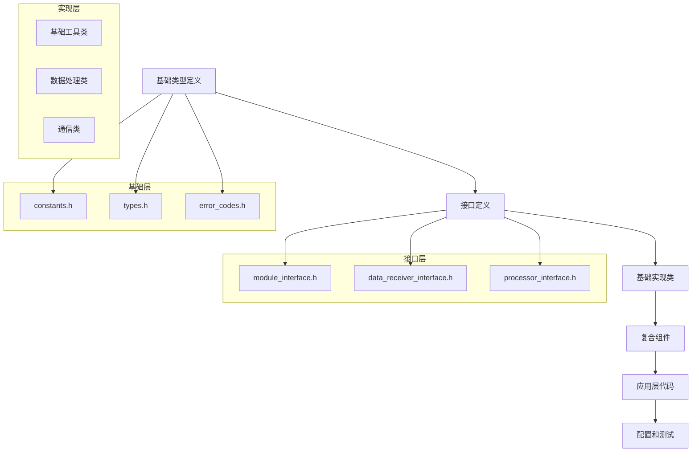

# 文件创建顺序

- **标题**: AI协作开发文件创建顺序指南
- **当前版本**: v1.0
- **最后更新**: 2025-09-10
- **负责人**: Kelin

---

## 文件创建层次结构

### 🏗️ 创建顺序原则

#### 原则1：依赖关系优先


#### 原则2：编译依赖最小化
```markdown
## 编译依赖优化策略

### 前向声明优先
- 头文件中优先使用前向声明
- 减少不必要的#include
- 使用Pimpl模式隐藏实现细节

### 接口与实现分离
- 接口定义独立于实现
- 抽象类不依赖具体实现
- 使用工厂模式创建对象

### 模板特化延迟
- 模板定义与特化分离
- 特化代码放在单独文件
- 避免头文件中的重量级模板
```

---

## 基础设施文件创建顺序

### 📁 阶段1：核心基础文件 (第1天)

#### 1.1 基础类型定义 (2小时)
```cpp
// include/common/types.h - 最先创建
#pragma once

#include <cstdint>
#include <chrono>
#include <memory>
#include <vector>
#include <string>

namespace radar {

// 基础数据类型
using TimeStamp = std::chrono::time_point<std::chrono::high_resolution_clock>;
using DataBuffer = std::vector<uint8_t>;
using FloatBuffer = std::vector<float>;
using ComplexBuffer = std::vector<std::complex<float>>;

// 大小类型
using DataSize = size_t;
using ChannelId = uint32_t;
using SequenceId = uint64_t;

// 配置类型
struct Point3D {
    float x, y, z;

    Point3D() : x(0), y(0), z(0) {}
    Point3D(float x_, float y_, float z_) : x(x_), y(y_), z(z_) {}
};

struct DataRange {
    size_t start;
    size_t length;

    DataRange() : start(0), length(0) {}
    DataRange(size_t s, size_t l) : start(s), length(l) {}

    size_t end() const { return start + length; }
    bool isValid() const { return length > 0; }
};

// 智能指针类型别名
template<typename T>
using UniquePtr = std::unique_ptr<T>;

template<typename T>
using SharedPtr = std::shared_ptr<T>;

template<typename T>
using WeakPtr = std::weak_ptr<T>;

} // namespace radar
```

#### 1.2 错误码定义 (2小时)
```cpp
// include/common/error_codes.h - 第二个创建
#pragma once

#include <string>
#include <system_error>

namespace radar {

// 错误码枚举
enum class ErrorCode : int {
    Success = 0,

    // 通用错误 (1-99)
    UnknownError = 1,
    InvalidArgument = 2,
    OutOfMemory = 3,
    Timeout = 4,
    NotImplemented = 5,

    // 初始化错误 (100-199)
    InitializationFailed = 100,
    ConfigurationError = 101,
    ResourceUnavailable = 102,
    DependencyMissing = 103,

    // 数据处理错误 (200-299)
    InvalidData = 200,
    DataCorrupted = 201,
    ProcessingFailed = 202,
    AlgorithmError = 203,

    // 通信错误 (300-399)
    ConnectionFailed = 300,
    NetworkError = 301,
    ProtocolError = 302,
    TransmissionError = 303,

    // 硬件错误 (400-499)
    HardwareError = 400,
    GPUError = 401,
    StorageError = 402,
    SensorError = 403,

    // 系统错误 (500-599)
    SystemError = 500,
    FileSystemError = 501,
    PermissionDenied = 502,
    ResourceExhausted = 503
};

// 错误码转字符串
std::string toString(ErrorCode code);

// 错误码类别
class ErrorCategory : public std::error_category {
public:
    const char* name() const noexcept override;
    std::string message(int ev) const override;
};

const ErrorCategory& getErrorCategory();

// 便利函数
std::error_code makeErrorCode(ErrorCode code);

} // namespace radar

// 使错误码可以与std::error_code配合使用
namespace std {
template<>
struct is_error_code_enum<radar::ErrorCode> : true_type {};
}
```

#### 1.3 常量定义 (1小时)
```cpp
// include/common/constants.h - 第三个创建
#pragma once

#include <cstddef>
#include <chrono>

namespace radar {
namespace constants {

// 系统常量
constexpr size_t DEFAULT_BUFFER_SIZE = 1024 * 1024; // 1MB
constexpr size_t MAX_BUFFER_SIZE = 100 * 1024 * 1024; // 100MB
constexpr size_t MIN_BUFFER_SIZE = 1024; // 1KB

// 性能常量
constexpr std::chrono::milliseconds DEFAULT_TIMEOUT{1000};
constexpr std::chrono::milliseconds MAX_PROCESSING_TIME{10}; // 10ms实时要求
constexpr size_t DEFAULT_THREAD_COUNT = 4;

// 数据处理常量
constexpr double SAMPLING_RATE = 1000000.0; // 1MHz
constexpr size_t FFT_SIZE = 1024;
constexpr double WINDOW_OVERLAP = 0.5;

// 网络常量
constexpr uint16_t DEFAULT_PORT = 8080;
constexpr size_t MAX_PACKET_SIZE = 65536; // 64KB
constexpr std::chrono::seconds HEARTBEAT_INTERVAL{30};

// 文件路径常量
constexpr const char* DEFAULT_CONFIG_PATH = "configs/system_config.yaml";
constexpr const char* DEFAULT_LOG_PATH = "logs/";
constexpr const char* DEFAULT_DATA_PATH = "data/";

// 算法常量
constexpr double PI = 3.14159265358979323846;
constexpr double TWO_PI = 2.0 * PI;
constexpr float EPSILON = 1e-6f;

} // namespace constants
} // namespace radar
```

### 📁 阶段2：接口定义文件 (第1天下午)

#### 2.1 基础模块接口 (2小时)
```cpp
// include/interfaces/module_interface.h - 模块基础接口
#pragma once

#include "common/types.h"
#include "common/error_codes.h"
#include <string>

namespace radar {

// 模块状态枚举
enum class ModuleState {
    Uninitialized,
    Initializing,
    Ready,
    Running,
    Paused,
    Error,
    Shutdown
};

// 模块配置基类
class ModuleConfiguration {
public:
    virtual ~ModuleConfiguration() = default;
    virtual bool validate() const = 0;
    virtual std::string toString() const = 0;
};

// 模块统计信息
struct ModuleStatistics {
    uint64_t processedCount = 0;
    uint64_t errorCount = 0;
    std::chrono::microseconds totalProcessingTime{0};
    std::chrono::microseconds averageProcessingTime{0};
    TimeStamp lastProcessTime;

    void reset() {
        processedCount = 0;
        errorCount = 0;
        totalProcessingTime = std::chrono::microseconds{0};
        averageProcessingTime = std::chrono::microseconds{0};
        lastProcessTime = TimeStamp{};
    }
};

// 基础模块接口
class IModule {
public:
    virtual ~IModule() = default;

    // 生命周期管理
    virtual ErrorCode initialize(const ModuleConfiguration& config) = 0;
    virtual ErrorCode start() = 0;
    virtual ErrorCode stop() = 0;
    virtual ErrorCode shutdown() = 0;

    // 状态查询
    virtual ModuleState getState() const = 0;
    virtual std::string getModuleName() const = 0;
    virtual std::string getModuleVersion() const = 0;

    // 配置管理
    virtual ErrorCode updateConfiguration(const ModuleConfiguration& config) = 0;
    virtual UniquePtr<ModuleConfiguration> getConfiguration() const = 0;

    // 统计信息
    virtual ModuleStatistics getStatistics() const = 0;
    virtual void resetStatistics() = 0;

    // 健康检查
    virtual bool isHealthy() const = 0;
    virtual std::string getHealthInfo() const = 0;
};

} // namespace radar
```

#### 2.2 数据接收接口 (2小时)
```cpp
// include/interfaces/data_receiver_interface.h - 数据接收接口
#pragma once

#include "module_interface.h"
#include "common/types.h"
#include <functional>

namespace radar {

// 数据包结构
struct DataPacket {
    SequenceId sequenceId;
    TimeStamp timestamp;
    ChannelId channelId;
    DataBuffer data;

    DataPacket() : sequenceId(0), channelId(0) {}

    bool isValid() const {
        return !data.empty() && sequenceId > 0;
    }

    size_t getDataSize() const {
        return data.size();
    }
};

// 接收统计信息
struct ReceptionStatistics {
    uint64_t packetsReceived = 0;
    uint64_t packetsDropped = 0;
    uint64_t bytesReceived = 0;
    uint64_t crcErrors = 0;
    double receptionRate = 0.0; // packets/second

    void reset() {
        packetsReceived = 0;
        packetsDropped = 0;
        bytesReceived = 0;
        crcErrors = 0;
        receptionRate = 0.0;
    }
};

// 数据接收器配置
class DataReceiverConfiguration : public ModuleConfiguration {
public:
    virtual ~DataReceiverConfiguration() = default;

    virtual size_t getBufferSize() const = 0;
    virtual std::chrono::milliseconds getTimeout() const = 0;
    virtual bool isValidationEnabled() const = 0;
};

// 数据回调函数类型
using DataCallback = std::function<void(const DataPacket& packet)>;
using ErrorCallback = std::function<void(ErrorCode error, const std::string& message)>;

// 数据接收器接口
class IDataReceiver : public IModule {
public:
    virtual ~IDataReceiver() = default;

    // 数据接收
    virtual ErrorCode receiveData(DataPacket& packet) = 0;
    virtual ErrorCode receiveDataAsync(DataCallback onData, ErrorCallback onError) = 0;

    // 缓冲区管理
    virtual size_t getAvailableDataSize() const = 0;
    virtual size_t getBufferCapacity() const = 0;
    virtual double getBufferUsageRatio() const = 0;

    // 接收控制
    virtual ErrorCode pauseReception() = 0;
    virtual ErrorCode resumeReception() = 0;
    virtual ErrorCode flushBuffer() = 0;

    // 统计信息
    virtual ReceptionStatistics getReceptionStatistics() const = 0;
    virtual void resetReceptionStatistics() = 0;

    // 连接管理
    virtual bool isConnected() const = 0;
    virtual ErrorCode reconnect() = 0;
};

} // namespace radar
```

### 📁 阶段3：基础实现类 (第2-3天)

#### 3.1 基础模块实现 (半天)
```cpp
// src/common/base_module.h - 基础模块实现基类
#pragma once

#include "interfaces/module_interface.h"
#include <mutex>
#include <atomic>

namespace radar {

class BaseModule : public IModule {
public:
    BaseModule(const std::string& moduleName, const std::string& moduleVersion);
    virtual ~BaseModule() = default;

    // IModule接口实现
    ErrorCode initialize(const ModuleConfiguration& config) override final;
    ErrorCode start() override final;
    ErrorCode stop() override final;
    ErrorCode shutdown() override final;

    ModuleState getState() const override final;
    std::string getModuleName() const override final;
    std::string getModuleVersion() const override final;

    ModuleStatistics getStatistics() const override final;
    void resetStatistics() override final;

    bool isHealthy() const override;
    std::string getHealthInfo() const override;

protected:
    // 子类需要实现的虚函数
    virtual ErrorCode doInitialize(const ModuleConfiguration& config) = 0;
    virtual ErrorCode doStart() = 0;
    virtual ErrorCode doStop() = 0;
    virtual ErrorCode doShutdown() = 0;

    virtual bool checkHealth() const { return true; }
    virtual std::string getHealthDetails() const { return "OK"; }

    // 状态管理辅助函数
    void setState(ModuleState newState);
    void updateStatistics(std::chrono::microseconds processingTime, bool success = true);

    // 配置管理
    void setConfiguration(UniquePtr<ModuleConfiguration> config);
    const ModuleConfiguration* getCurrentConfiguration() const;

private:
    const std::string moduleName_;
    const std::string moduleVersion_;

    mutable std::mutex stateMutex_;
    std::atomic<ModuleState> currentState_;

    mutable std::mutex statisticsMutex_;
    ModuleStatistics statistics_;

    mutable std::mutex configMutex_;
    UniquePtr<ModuleConfiguration> currentConfig_;
};

} // namespace radar
```

#### 3.2 配置管理器 (半天)
```cpp
// src/common/configuration_manager.h - 配置管理器
#pragma once

#include "common/types.h"
#include "common/error_codes.h"
#include <yaml-cpp/yaml.h>
#include <unordered_map>
#include <shared_mutex>

namespace radar {

class ConfigurationManager {
public:
    static ConfigurationManager& getInstance();

    // 配置文件加载
    ErrorCode loadFromFile(const std::string& configFile);
    ErrorCode loadFromString(const std::string& yamlContent);
    ErrorCode saveToFile(const std::string& configFile) const;

    // 配置值访问
    template<typename T>
    T getValue(const std::string& key, const T& defaultValue = T{}) const;

    template<typename T>
    ErrorCode setValue(const std::string& key, const T& value);

    // 配置节访问
    bool hasSection(const std::string& section) const;
    std::vector<std::string> getSectionKeys(const std::string& section) const;

    // 配置验证
    ErrorCode validateConfiguration() const;
    std::vector<std::string> getValidationErrors() const;

    // 配置监听
    using ConfigChangeCallback = std::function<void(const std::string& key, const YAML::Node& oldValue, const YAML::Node& newValue)>;
    void addChangeListener(const std::string& key, ConfigChangeCallback callback);
    void removeChangeListener(const std::string& key);

    // 配置快照
    YAML::Node getSnapshot() const;
    ErrorCode restoreFromSnapshot(const YAML::Node& snapshot);

private:
    ConfigurationManager() = default;

    mutable std::shared_mutex configMutex_;
    YAML::Node rootConfig_;

    std::unordered_map<std::string, std::vector<ConfigChangeCallback>> changeListeners_;
    mutable std::mutex listenersMutex_;

    void notifyListeners(const std::string& key, const YAML::Node& oldValue, const YAML::Node& newValue);
    std::string normalizeKey(const std::string& key) const;
};

// 模板特化实现
template<typename T>
T ConfigurationManager::getValue(const std::string& key, const T& defaultValue) const {
    std::shared_lock<std::shared_mutex> lock(configMutex_);

    try {
        auto normalizedKey = normalizeKey(key);
        auto keys = split(normalizedKey, '.');

        YAML::Node current = rootConfig_;
        for (const auto& k : keys) {
            if (!current[k]) {
                return defaultValue;
            }
            current = current[k];
        }

        return current.as<T>();
    } catch (const std::exception&) {
        return defaultValue;
    }
}

} // namespace radar
```

### 📁 阶段4：复合组件 (第4-5天)

#### 4.1 数据处理管道 (1天)
```cpp
// src/data/data_pipeline.h - 数据处理管道
#pragma once

#include "interfaces/data_receiver_interface.h"
#include "common/base_module.h"
#include "common/thread_pool.h"
#include <queue>
#include <condition_variable>

namespace radar {

// 处理阶段接口
class IProcessingStage {
public:
    virtual ~IProcessingStage() = default;
    virtual ErrorCode process(const DataPacket& input, DataPacket& output) = 0;
    virtual std::string getStageName() const = 0;
};

// 管道配置
class PipelineConfiguration : public ModuleConfiguration {
public:
    size_t bufferSize = 1000;
    size_t threadCount = 4;
    std::chrono::milliseconds timeout{1000};
    bool enableParallelProcessing = true;

    bool validate() const override {
        return bufferSize > 0 && threadCount > 0 && timeout.count() > 0;
    }

    std::string toString() const override {
        return "PipelineConfig{bufferSize=" + std::to_string(bufferSize) +
               ", threadCount=" + std::to_string(threadCount) + "}";
    }
};

// 数据处理管道
class DataPipeline : public BaseModule {
public:
    DataPipeline();
    virtual ~DataPipeline();

    // 管道构建
    ErrorCode addStage(UniquePtr<IProcessingStage> stage);
    ErrorCode removeStage(const std::string& stageName);
    size_t getStageCount() const;

    // 数据处理
    ErrorCode processData(const DataPacket& input, DataPacket& output);
    ErrorCode processDataAsync(const DataPacket& input,
                              std::function<void(const DataPacket&, ErrorCode)> callback);

    // 批处理
    ErrorCode processBatch(const std::vector<DataPacket>& inputs,
                          std::vector<DataPacket>& outputs);

    // 管道状态
    size_t getQueueSize() const;
    double getProcessingRate() const; // packets/second
    std::vector<std::string> getStageNames() const;

protected:
    ErrorCode doInitialize(const ModuleConfiguration& config) override;
    ErrorCode doStart() override;
    ErrorCode doStop() override;
    ErrorCode doShutdown() override;

private:
    std::vector<UniquePtr<IProcessingStage>> stages_;
    mutable std::shared_mutex stagesMutex_;

    UniquePtr<ThreadPool> threadPool_;

    std::queue<std::pair<DataPacket, std::function<void(const DataPacket&, ErrorCode)>>> processingQueue_;
    mutable std::mutex queueMutex_;
    std::condition_variable queueCondition_;

    std::atomic<bool> stopProcessing_{false};
    std::thread processingThread_;

    void processingLoop();
    ErrorCode processInternal(const DataPacket& input, DataPacket& output);
};

} // namespace radar
```

---

## 模块特定文件创建顺序

### 🔧 数据接收模块文件顺序

#### 第1阶段：接口和配置 (半天)
```markdown
1. data_receiver_types.h        - 数据接收相关类型定义
2. data_receiver_config.h       - 数据接收器配置类
3. network_receiver_interface.h - 网络数据接收接口
4. file_receiver_interface.h    - 文件数据接收接口
```

#### 第2阶段：基础实现 (1天)
```markdown
1. base_data_receiver.cpp       - 基础数据接收器实现
2. packet_validator.cpp         - 数据包验证器
3. buffer_manager.cpp          - 缓冲区管理器
4. reception_statistics.cpp    - 接收统计管理
```

#### 第3阶段：具体实现 (1.5天)
```markdown
1. udp_receiver.cpp            - UDP数据接收器
2. tcp_receiver.cpp            - TCP数据接收器
3. file_receiver.cpp           - 文件数据接收器
4. multicast_receiver.cpp      - 组播数据接收器
```

#### 第4阶段：测试和集成 (0.5天)
```markdown
1. data_receiver_tests.cpp     - 单元测试
2. integration_tests.cpp       - 集成测试
3. performance_tests.cpp       - 性能测试
```

### ⚙️ GPU处理模块文件顺序

#### 第1阶段：CUDA基础 (半天)
```markdown
1. cuda_common.h               - CUDA通用定义
2. gpu_memory_manager.h        - GPU内存管理器接口
3. cuda_error_handling.h       - CUDA错误处理
4. gpu_device_info.h          - GPU设备信息
```

#### 第2阶段：核心算法 (1.5天)
```markdown
1. fft_processor.cu           - FFT处理器CUDA实现
2. signal_processor.cu        - 信号处理CUDA内核
3. detection_algorithm.cu     - 目标检测CUDA算法
4. filter_kernels.cu         - 滤波器CUDA内核
```

#### 第3阶段：包装器和接口 (1天)
```markdown
1. gpu_processor_interface.cpp - GPU处理器接口实现
2. cuda_memory_manager.cpp     - CUDA内存管理器
3. gpu_performance_monitor.cpp - GPU性能监控
4. gpu_resource_manager.cpp    - GPU资源管理
```

### 📊 显示控制模块文件顺序

#### 第1阶段：图形基础 (半天)
```markdown
1. graphics_types.h           - 图形相关类型定义
2. display_interface.h        - 显示接口定义
3. render_context.h          - 渲染上下文
4. graphics_primitive.h      - 图形基元
```

#### 第2阶段：渲染实现 (1天)
```markdown
1. opengl_renderer.cpp       - OpenGL渲染器
2. plot_renderer.cpp         - 图表渲染器
3. heatmap_renderer.cpp      - 热力图渲染器
4. 3d_renderer.cpp          - 3D场景渲染器
```

#### 第3阶段：UI组件 (1天)
```markdown
1. control_panel.cpp         - 控制面板
2. status_display.cpp        - 状态显示
3. parameter_editor.cpp      - 参数编辑器
4. data_visualization.cpp    - 数据可视化
```

---

## 测试文件创建顺序

### 🧪 测试文件层次结构

#### 单元测试创建顺序
```markdown
## 基础测试 (第1天)
1. types_test.cpp              - 基础类型测试
2. error_codes_test.cpp        - 错误码测试
3. configuration_test.cpp      - 配置管理测试
4. base_module_test.cpp        - 基础模块测试

## 接口测试 (第2天)
1. module_interface_test.cpp   - 模块接口测试
2. data_receiver_test.cpp      - 数据接收器测试
3. processor_interface_test.cpp - 处理器接口测试
4. pipeline_test.cpp          - 数据管道测试

## 实现测试 (第3-4天)
1. udp_receiver_test.cpp       - UDP接收器测试
2. fft_processor_test.cpp      - FFT处理器测试
3. gpu_manager_test.cpp        - GPU管理器测试
4. display_controller_test.cpp - 显示控制器测试

## 集成测试 (第5天)
1. end_to_end_test.cpp        - 端到端测试
2. performance_test.cpp       - 性能测试
3. stability_test.cpp         - 稳定性测试
4. regression_test.cpp        - 回归测试
```

#### 测试工具和框架
```cpp
// tests/common/test_framework.h - 测试框架
#pragma once

#include <gtest/gtest.h>
#include <gmock/gmock.h>
#include "common/types.h"
#include "common/error_codes.h"

namespace radar {
namespace testing {

// 测试基类
class RadarTestBase : public ::testing::Test {
protected:
    void SetUp() override;
    void TearDown() override;

    // 通用测试工具
    DataPacket createTestPacket(size_t dataSize = 1024);
    std::vector<DataPacket> createTestPacketSequence(size_t count, size_t dataSize = 1024);

    // 性能测试工具
    void measureExecutionTime(std::function<void()> func, const std::string& testName);
    void verifyPerformanceRequirement(std::chrono::microseconds actualTime,
                                    std::chrono::microseconds requiredTime);

    // 内存测试工具
    size_t getCurrentMemoryUsage();
    void verifyNoMemoryLeak(std::function<void()> func);

private:
    size_t initialMemoryUsage_;
};

// Mock对象生成宏
#define MOCK_MODULE_INTERFACE(ClassName) \
class Mock##ClassName : public ClassName { \
public: \
    MOCK_METHOD(ErrorCode, initialize, (const ModuleConfiguration&), (override)); \
    MOCK_METHOD(ErrorCode, start, (), (override)); \
    MOCK_METHOD(ErrorCode, stop, (), (override)); \
    MOCK_METHOD(ErrorCode, shutdown, (), (override)); \
    MOCK_METHOD(ModuleState, getState, (), (const, override)); \
    MOCK_METHOD(std::string, getModuleName, (), (const, override)); \
    MOCK_METHOD(std::string, getModuleVersion, (), (const, override)); \
}

// 测试数据生成器
class TestDataGenerator {
public:
    static std::vector<float> generateSineWave(size_t samples, double frequency, double sampleRate);
    static std::vector<float> generateNoise(size_t samples, double amplitude = 1.0);
    static std::vector<float> generateChirpSignal(size_t samples, double startFreq, double endFreq, double sampleRate);
    static DataPacket generateRadarDataPacket(size_t samples);
};

} // namespace testing
} // namespace radar
```

---

## 文档文件创建顺序

### 📚 文档创建层次

#### API文档创建顺序
```markdown
## 基础API文档 (第1天)
1. README.md                   - 项目概述和快速开始
2. ARCHITECTURE.md             - 系统架构说明
3. BUILDING.md                 - 构建说明
4. CONFIGURATION.md            - 配置说明

## 模块API文档 (第2-3天)
1. data_receiver_api.md        - 数据接收器API
2. gpu_processor_api.md        - GPU处理器API
3. display_controller_api.md   - 显示控制器API
4. protocol_parser_api.md      - 协议解析器API

## 高级文档 (第4天)
1. PERFORMANCE_TUNING.md       - 性能调优指南
2. TROUBLESHOOTING.md          - 故障排除指南
3. EXTENDING.md                - 扩展开发指南
4. DEPLOYMENT.md               - 部署指南
```

#### 文档生成自动化
```bash
#!/bin/bash
# scripts/generate_docs.sh - 文档生成脚本

echo "=== 生成API文档 ==="

# 生成Doxygen文档
doxygen docs/Doxyfile

# 生成UML图
plantuml docs/diagrams/*.puml

# 生成代码覆盖率报告
lcov --capture --directory build --output-file coverage.info
genhtml coverage.info --output-directory docs/coverage

# 生成性能基准报告
./build/performance_tests --benchmark_format=json > docs/benchmark_results.json

# 生成依赖关系图
cmake --graphviz=docs/dependencies.dot .
dot -Tpng docs/dependencies.dot -o docs/dependencies.png

echo "=== 文档生成完成 ==="
echo "API文档: docs/html/index.html"
echo "覆盖率报告: docs/coverage/index.html"
echo "性能报告: docs/benchmark_results.json"
echo "依赖关系图: docs/dependencies.png"
```

---

## CMake构建文件创建顺序

### 🔨 构建系统文件层次

#### CMake文件创建顺序
```cmake
# 根级CMakeLists.txt - 最先创建
cmake_minimum_required(VERSION 3.20)
project(RadarMVPSystem VERSION 1.0.0 LANGUAGES CXX CUDA)

# 设置C++标准
set(CMAKE_CXX_STANDARD 17)
set(CMAKE_CXX_STANDARD_REQUIRED ON)

# 包含自定义CMake模块
list(APPEND CMAKE_MODULE_PATH "${CMAKE_CURRENT_SOURCE_DIR}/cmake")

# 引入配置文件
include(CompilerSettings)
include(PackageConfig)

# 全局设置
set(CMAKE_RUNTIME_OUTPUT_DIRECTORY ${CMAKE_BINARY_DIR}/bin)
set(CMAKE_LIBRARY_OUTPUT_DIRECTORY ${CMAKE_BINARY_DIR}/lib)
set(CMAKE_ARCHIVE_OUTPUT_DIRECTORY ${CMAKE_BINARY_DIR}/lib)

# 添加子目录
add_subdirectory(third_party)
add_subdirectory(src)
add_subdirectory(tests)

# 安装规则
include(GNUInstallDirs)
install(DIRECTORY configs/ DESTINATION ${CMAKE_INSTALL_SYSCONFDIR}/radar)
install(DIRECTORY docs/ DESTINATION ${CMAKE_INSTALL_DOCDIR})
```

#### 模块级CMakeLists.txt创建顺序
```markdown
## 第1层：基础库 (第1天)
1. src/common/CMakeLists.txt       - 通用库构建
2. src/interfaces/CMakeLists.txt   - 接口库构建
3. third_party/CMakeLists.txt      - 第三方库配置

## 第2层：核心模块 (第2天)
1. src/modules/data_receiver/CMakeLists.txt    - 数据接收模块
2. src/modules/gpu_processor/CMakeLists.txt    - GPU处理模块
3. src/modules/protocol_parser/CMakeLists.txt  - 协议解析模块

## 第3层：应用层 (第3天)
1. src/application/CMakeLists.txt  - 应用程序构建
2. src/modules/display_control/CMakeLists.txt - 显示控制模块
3. src/modules/task_scheduler/CMakeLists.txt  - 任务调度模块

## 第4层：测试和工具 (第4天)
1. tests/unit_tests/CMakeLists.txt    - 单元测试构建
2. tests/integration_tests/CMakeLists.txt - 集成测试构建
3. tools/CMakeLists.txt               - 工具程序构建
```

---

## 自动化创建工具

### 🤖 文件生成脚本

#### 模块文件生成器
```bash
#!/bin/bash
# scripts/generate_module.sh - 模块文件生成脚本

MODULE_NAME=$1
MODULE_TYPE=${2:-"processor"}  # processor, receiver, controller

if [ -z "$MODULE_NAME" ]; then
    echo "用法: $0 <模块名> [模块类型]"
    echo "模块类型: processor, receiver, controller"
    exit 1
fi

echo "=== 生成模块: $MODULE_NAME (类型: $MODULE_TYPE) ==="

# 创建目录结构
mkdir -p "src/modules/${MODULE_NAME}"
mkdir -p "include/modules/${MODULE_NAME}"
mkdir -p "tests/unit_tests/${MODULE_NAME}"
mkdir -p "configs/modules/${MODULE_NAME}"

# 生成接口文件
cat > "include/modules/${MODULE_NAME}/${MODULE_NAME}_interface.h" << EOF
#pragma once

#include "interfaces/module_interface.h"

namespace radar {
namespace ${MODULE_NAME} {

class I${MODULE_NAME^} : public IModule {
public:
    virtual ~I${MODULE_NAME^}() = default;

    // TODO: 添加模块特定接口
};

} // namespace ${MODULE_NAME}
} // namespace radar
EOF

# 生成实现文件
cat > "src/modules/${MODULE_NAME}/${MODULE_NAME}.h" << EOF
#pragma once

#include "modules/${MODULE_NAME}/${MODULE_NAME}_interface.h"
#include "common/base_module.h"

namespace radar {
namespace ${MODULE_NAME} {

class ${MODULE_NAME^} : public BaseModule, public I${MODULE_NAME^} {
public:
    ${MODULE_NAME^}();
    virtual ~${MODULE_NAME^}();

protected:
    ErrorCode doInitialize(const ModuleConfiguration& config) override;
    ErrorCode doStart() override;
    ErrorCode doStop() override;
    ErrorCode doShutdown() override;

private:
    // TODO: 添加私有成员
};

} // namespace ${MODULE_NAME}
} // namespace radar
EOF

# 生成CMakeLists.txt
cat > "src/modules/${MODULE_NAME}/CMakeLists.txt" << EOF
# ${MODULE_NAME^} 模块构建配置

add_library(${MODULE_NAME}
    ${MODULE_NAME}.cpp
    ${MODULE_NAME}_config.cpp
)

target_include_directories(${MODULE_NAME}
    PUBLIC
        \${PROJECT_SOURCE_DIR}/include
    PRIVATE
        \${CMAKE_CURRENT_SOURCE_DIR}
)

target_link_libraries(${MODULE_NAME}
    PUBLIC
        radar_common
        radar_interfaces
    PRIVATE
        # TODO: 添加依赖库
)

# 安装规则
install(TARGETS ${MODULE_NAME}
    LIBRARY DESTINATION \${CMAKE_INSTALL_LIBDIR}
    ARCHIVE DESTINATION \${CMAKE_INSTALL_LIBDIR}
)
EOF

# 生成测试文件
cat > "tests/unit_tests/${MODULE_NAME}/${MODULE_NAME}_test.cpp" << EOF
#include <gtest/gtest.h>
#include "modules/${MODULE_NAME}/${MODULE_NAME}.h"
#include "tests/common/test_framework.h"

using namespace radar;
using namespace radar::${MODULE_NAME};
using namespace radar::testing;

class ${MODULE_NAME^}Test : public RadarTestBase {
protected:
    void SetUp() override {
        RadarTestBase::SetUp();
        ${MODULE_NAME}_= std::make_unique<${MODULE_NAME^}>();
    }

    std::unique_ptr<${MODULE_NAME^}> ${MODULE_NAME}_;
};

TEST_F(${MODULE_NAME^}Test, BasicInitialization) {
    // TODO: 添加初始化测试
    EXPECT_EQ(${MODULE_NAME}_->getState(), ModuleState::Uninitialized);
}

TEST_F(${MODULE_NAME^}Test, ConfigurationManagement) {
    // TODO: 添加配置管理测试
}

TEST_F(${MODULE_NAME^}Test, LifecycleManagement) {
    // TODO: 添加生命周期测试
}
EOF

echo "✅ 模块 $MODULE_NAME 文件结构生成完成"
echo "📁 创建的文件:"
echo "  - include/modules/${MODULE_NAME}/${MODULE_NAME}_interface.h"
echo "  - src/modules/${MODULE_NAME}/${MODULE_NAME}.h"
echo "  - src/modules/${MODULE_NAME}/CMakeLists.txt"
echo "  - tests/unit_tests/${MODULE_NAME}/${MODULE_NAME}_test.cpp"
echo ""
echo "📝 下一步:"
echo "  1. 完善接口定义"
echo "  2. 实现核心功能"
echo "  3. 编写配置类"
echo "  4. 添加测试用例"
```

---

## 变更记录

| 版本 | 日期       | 修改人 | 变更摘要             |
| :--- | :--------- | :----- | :------------------- |
| v1.0 | 2025-09-10 | Kelin  | 创建文件创建顺序指南 |
