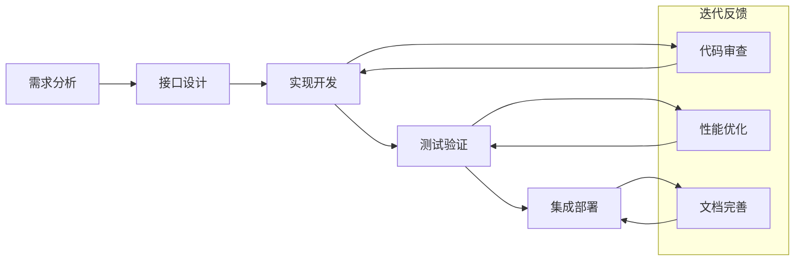

# 模块开发流程

- **标题**: AI协作开发模块开发流程指南
- **当前版本**: v1.0
- **最后更新**: 2025-09-10
- **负责人**: Kelin

---

## 标准开发生命周期

### 📋 模块开发五阶段流程



### 🎯 阶段1：需求分析 (Requirements Analysis)

#### 目标和输出
- **目标**: 明确模块功能需求、性能要求和接口规范
- **输出**: 需求分析文档、接口规格说明、验收标准

#### 详细流程
```markdown
## 1.1 需求收集 (0.5天)
### AI协作方式
用户: "我要开发[模块名]模块，功能是[具体描述]"
AI自动执行:
- 读取相关的项目文档和架构规范
- 分析模块在整体系统中的角色
- 识别相关的依赖模块和接口

### 输出文档
- 功能需求清单
- 非功能性需求 (性能、可靠性、可扩展性)
- 约束条件和限制
- 依赖关系图

## 1.2 需求澄清 (0.5天)
### AI主动询问机制
AI基于文档分析自动生成澄清问题:
- "该模块需要支持的最大数据量是多少？"
- "预期的响应时间要求是什么？"
- "需要支持哪些数据源类型？"
- "是否需要考虑GPU加速？"

### 用户反馈处理
用户提供具体答案 → AI更新需求文档 → 生成最终需求规格

## 1.3 需求确认 (0.5天)
### 需求文档审查
- 需求完整性检查
- 需求一致性验证
- 技术可行性评估
- 风险点识别

### 验收标准制定
- 功能验收标准
- 性能验收标准
- 质量验收标准
- 集成验收标准
```

#### 需求分析模板
```markdown
# 模块需求分析文档

## 模块基本信息
- **模块名称**: [具体名称]
- **功能描述**: [一句话功能描述]
- **责任人**: [开发者]
- **优先级**: [高/中/低]

## 功能需求
### 核心功能
1. [功能1描述]
   - 输入: [输入数据格式]
   - 处理: [处理逻辑]
   - 输出: [输出格式]

### 扩展功能
1. [可选功能描述]

## 非功能性需求
- **性能要求**: 处理延迟 < [X]ms, 吞吐量 > [Y] ops/s
- **可靠性要求**: 可用性 > [Z]%, 错误率 < [W]%
- **扩展性要求**: 支持 [并发数/数据量] 扩展
- **兼容性要求**: 支持 [操作系统/硬件平台]

## 接口需求
- **输入接口**: [接口类型和规格]
- **输出接口**: [接口类型和规格]
- **配置接口**: [配置参数和方式]
- **监控接口**: [监控指标和方式]

## 依赖分析
- **上游依赖**: [依赖的模块/服务]
- **下游依赖**: [使用该模块的组件]
- **外部依赖**: [第三方库/服务]
- **硬件依赖**: [特殊硬件要求]

## 验收标准
- [ ] 功能完整性验证
- [ ] 性能基准测试通过
- [ ] 接口兼容性验证
- [ ] 异常处理测试通过
```

---

### 🏗️ 阶段2：接口设计 (Interface Design)

#### 目标和输出
- **目标**: 设计稳定、清晰、可扩展的模块接口
- **输出**: 接口定义文档、UML类图、API规格说明

#### 详细流程
```markdown
## 2.1 接口架构设计 (1天)
### 抽象接口定义
基于需求分析结果，AI自动生成接口框架:

```cpp
// AI生成的接口模板
class IDataProcessor {
public:
    virtual ~IDataProcessor() = default;

    // 生命周期管理
    virtual bool initialize(const Configuration& config) = 0;
    virtual void cleanup() = 0;

    // 核心功能接口
    virtual ProcessingResult process(const InputData& input) = 0;
    virtual ProcessorStatus getStatus() const = 0;

    // 配置和监控
    virtual bool updateConfiguration(const Configuration& config) = 0;
    virtual PerformanceMetrics getMetrics() const = 0;
};
```

### 接口设计原则验证
AI自动检查接口设计是否符合项目规范:
- 单一职责原则
- 接口隔离原则
- 依赖倒置原则
- 开闭原则

## 2.2 数据结构设计 (1天)
### 输入输出数据结构
```cpp
// 输入数据结构设计
struct ProcessingInput {
    uint64_t timestamp;
    uint32_t sequenceId;
    std::vector<float> data;
    InputMetadata metadata;

    bool isValid() const;
    size_t getDataSize() const;
};

// 输出数据结构设计
struct ProcessingResult {
    bool success;
    ErrorCode errorCode;
    std::vector<DetectedObject> results;
    ProcessingStatistics stats;

    std::string getErrorMessage() const;
    bool hasResults() const;
};
```

### 配置数据结构
```cpp
struct ProcessorConfiguration {
    // 基础参数
    double samplingRate;
    size_t bufferSize;
    ProcessingMode mode;

    // 算法参数
    AlgorithmParameters algorithmParams;

    // 性能参数
    PerformanceSettings performanceSettings;

    bool validate() const;
    void setDefaults();
};
```

## 2.3 接口文档生成 (0.5天)
### 自动文档生成
AI基于接口定义自动生成Doxygen格式文档:
- 接口说明
- 方法详细描述
- 参数说明
- 返回值说明
- 使用示例
- 错误码说明
```

#### 接口设计验证清单
```markdown
## 接口设计质量检查

### 完整性检查
- [ ] 所有需求功能都有对应接口
- [ ] 接口覆盖完整的生命周期
- [ ] 错误处理接口完备
- [ ] 配置和监控接口齐全

### 一致性检查
- [ ] 命名规范符合项目标准
- [ ] 参数类型使用一致
- [ ] 错误处理方式统一
- [ ] 接口风格保持一致

### 可用性检查
- [ ] 接口易于理解和使用
- [ ] 参数设计合理
- [ ] 默认值设置恰当
- [ ] 文档描述清晰

### 扩展性检查
- [ ] 接口设计考虑未来扩展
- [ ] 版本兼容性策略明确
- [ ] 配置参数可扩展
- [ ] 监控指标可定制
```

---

### 💻 阶段3：实现开发 (Implementation)

#### 目标和输出
- **目标**: 基于接口设计实现高质量的模块代码
- **输出**: 实现代码、单元测试、实现文档

#### 详细流程
```markdown
## 3.1 代码框架生成 (0.5天)
### AI自动生成实现骨架
基于接口定义，AI自动生成实现类框架:

```cpp
// 自动生成的实现类框架
class DataProcessor : public IDataProcessor {
private:
    Configuration config_;
    ProcessorState state_;
    std::unique_ptr<ProcessingEngine> engine_;
    mutable std::mutex stateMutex_;

public:
    DataProcessor();
    virtual ~DataProcessor();

    // IDataProcessor 接口实现
    bool initialize(const Configuration& config) override {
        // TODO: 实现初始化逻辑
        std::lock_guard<std::mutex> lock(stateMutex_);
        config_ = config;
        state_ = ProcessorState::Initializing;

        // 创建处理引擎
        engine_ = createProcessingEngine(config);
        if (!engine_ || !engine_->initialize()) {
            state_ = ProcessorState::Error;
            return false;
        }

        state_ = ProcessorState::Ready;
        return true;
    }

    void cleanup() override {
        // TODO: 实现清理逻辑
    }

    ProcessingResult process(const InputData& input) override {
        // TODO: 实现核心处理逻辑
        return ProcessingResult{};
    }

private:
    std::unique_ptr<ProcessingEngine> createProcessingEngine(
        const Configuration& config);
    bool validateInput(const InputData& input) const;
    void updateMetrics(const ProcessingResult& result);
};
```

## 3.2 核心逻辑实现 (2-3天)
### 实现策略
- **增量实现**: 先实现基础功能，再添加高级特性
- **测试驱动**: 边实现边测试，确保代码质量
- **性能优化**: 在正确性基础上进行性能优化

### 实现重点
1. **核心算法实现**
   - 确保算法正确性
   - 考虑边界条件处理
   - 优化计算复杂度

2. **错误处理实现**
   - 输入验证
   - 异常捕获和处理
   - 错误状态恢复

3. **资源管理实现**
   - 内存管理
   - 文件句柄管理
   - 线程资源管理

## 3.3 单元测试编写 (1天)
### 测试用例设计
AI自动生成测试用例框架:

```cpp
class DataProcessorTest : public ::testing::Test {
protected:
    void SetUp() override {
        processor_ = std::make_unique<DataProcessor>();
        config_ = createTestConfiguration();
    }

    void TearDown() override {
        if (processor_) {
            processor_->cleanup();
        }
    }

    std::unique_ptr<DataProcessor> processor_;
    Configuration config_;
};

TEST_F(DataProcessorTest, InitializeWithValidConfig) {
    EXPECT_TRUE(processor_->initialize(config_));
    EXPECT_EQ(processor_->getStatus(), ProcessorState::Ready);
}

TEST_F(DataProcessorTest, ProcessValidInput) {
    processor_->initialize(config_);

    auto input = createTestInput();
    auto result = processor_->process(input);

    EXPECT_TRUE(result.success);
    EXPECT_EQ(result.errorCode, ErrorCode::None);
}

TEST_F(DataProcessorTest, HandleInvalidInput) {
    processor_->initialize(config_);

    auto invalidInput = createInvalidInput();
    auto result = processor_->process(invalidInput);

    EXPECT_FALSE(result.success);
    EXPECT_EQ(result.errorCode, ErrorCode::InvalidInput);
}
```
```

#### 实现质量控制
```markdown
## 代码质量检查点

### 编码规范检查
- [ ] 命名符合项目标准
- [ ] 代码风格一致
- [ ] 注释完整准确
- [ ] 文件组织合理

### 功能正确性检查
- [ ] 核心功能实现正确
- [ ] 边界条件处理完善
- [ ] 错误情况处理合理
- [ ] 资源管理安全

### 性能质量检查
- [ ] 算法复杂度合理
- [ ] 内存使用效率高
- [ ] 无明显性能瓶颈
- [ ] 资源泄漏检查通过

### 可维护性检查
- [ ] 代码结构清晰
- [ ] 模块职责单一
- [ ] 依赖关系合理
- [ ] 扩展性良好
```

---

### 🧪 阶段4：测试验证 (Testing & Validation)

#### 目标和输出
- **目标**: 全面验证模块功能、性能和可靠性
- **输出**: 测试报告、性能基准、问题修复记录

#### 详细流程
```markdown
## 4.1 单元测试执行 (1天)
### 测试覆盖率验证
- 代码覆盖率 > 90%
- 分支覆盖率 > 85%
- 函数覆盖率 = 100%

### 测试用例执行
```bash
# 单元测试执行脚本
#!/bin/bash
echo "=== 执行单元测试 ==="

# 编译测试
mkdir -p build/test && cd build/test
cmake ../../tests -DCMAKE_BUILD_TYPE=Debug
make -j$(nproc)

# 运行测试并生成覆盖率报告
./module_tests --gtest_output=xml:test_results.xml
gcov *.gcno
lcov --capture --directory . --output-file coverage.info
genhtml coverage.info --output-directory coverage_report

# 检查覆盖率
COVERAGE=$(lcov --summary coverage.info | grep lines | cut -d' ' -f4 | cut -d'%' -f1)
if [ $COVERAGE -lt 90 ]; then
    echo "❌ 代码覆盖率不足: $COVERAGE%"
    exit 1
else
    echo "✅ 代码覆盖率达标: $COVERAGE%"
fi
```

## 4.2 集成测试执行 (1天)
### 集成测试场景
1. **正常流程测试**
   - 标准输入处理
   - 正常输出验证
   - 性能指标检查

2. **异常流程测试**
   - 异常输入处理
   - 错误恢复验证
   - 资源清理检查

3. **压力测试**
   - 大数据量处理
   - 长时间运行测试
   - 并发处理测试

### 集成测试代码示例
```cpp
class ModuleIntegrationTest : public ::testing::Test {
protected:
    void SetUp() override {
        // 创建完整的测试环境
        system_ = createTestSystem();
        ASSERT_TRUE(system_->initialize());
    }

    std::unique_ptr<TestSystem> system_;
};

TEST_F(ModuleIntegrationTest, EndToEndProcessing) {
    // 准备测试数据
    auto testData = loadTestDataSet("standard_test_data.bin");

    // 执行端到端处理
    auto startTime = std::chrono::high_resolution_clock::now();
    auto results = system_->processDataSet(testData);
    auto endTime = std::chrono::high_resolution_clock::now();

    // 验证结果
    EXPECT_TRUE(results.success);
    EXPECT_GT(results.processedCount, 0);

    // 验证性能
    auto processingTime = std::chrono::duration_cast<std::chrono::milliseconds>(
        endTime - startTime);
    EXPECT_LT(processingTime.count(), MAX_PROCESSING_TIME_MS);
}
```

## 4.3 性能测试执行 (1天)
### 性能基准测试
```cpp
class PerformanceBenchmarkTest {
public:
    void runLatencyBenchmark() {
        DataProcessor processor;
        processor.initialize(getOptimalConfig());

        std::vector<double> latencies;

        for (int i = 0; i < 10000; ++i) {
            auto input = generateRandomInput();

            auto start = std::chrono::high_resolution_clock::now();
            auto result = processor.process(input);
            auto end = std::chrono::high_resolution_clock::now();

            auto latency = std::chrono::duration_cast<std::chrono::microseconds>(
                end - start).count();
            latencies.push_back(latency);
        }

        // 统计分析
        auto avgLatency = calculateAverage(latencies);
        auto p95Latency = calculatePercentile(latencies, 95);
        auto p99Latency = calculatePercentile(latencies, 99);

        // 性能验证
        EXPECT_LT(avgLatency, TARGET_AVG_LATENCY_US);
        EXPECT_LT(p95Latency, TARGET_P95_LATENCY_US);
        EXPECT_LT(p99Latency, TARGET_P99_LATENCY_US);
    }

    void runThroughputBenchmark() {
        // 吞吐量测试实现
    }

    void runMemoryUsageBenchmark() {
        // 内存使用测试实现
    }
};
```
```

#### 测试验证标准
```markdown
## 测试通过标准

### 功能测试标准
- [ ] 所有单元测试通过 (100%)
- [ ] 集成测试通过率 > 95%
- [ ] 端到端测试场景全覆盖
- [ ] 异常处理测试全部通过

### 性能测试标准
- [ ] 平均延迟 < 目标值
- [ ] P95延迟 < 1.5倍目标值
- [ ] P99延迟 < 2倍目标值
- [ ] 吞吐量 > 目标值的90%

### 质量测试标准
- [ ] 代码覆盖率 > 90%
- [ ] 内存泄漏检查通过
- [ ] 静态代码分析无严重问题
- [ ] 并发安全性验证通过

### 可靠性测试标准
- [ ] 7x24小时稳定性测试通过
- [ ] 故障注入测试通过
- [ ] 资源耗尽恢复测试通过
- [ ] 配置错误处理测试通过
```

---

### 🔗 阶段5：集成部署 (Integration & Deployment)

#### 目标和输出
- **目标**: 将模块集成到整体系统中，确保无缝协作
- **输出**: 集成配置、部署文档、运维手册

#### 详细流程
```markdown
## 5.1 系统集成 (1天)
### 集成配置
```yaml
# 模块集成配置示例
module_integration:
  data_processor:
    enabled: true
    config_file: "configs/data_processor.yaml"
    dependencies:
      - data_receiver
      - memory_manager
    interfaces:
      input: "data_receiver.output"
      output: "display_controller.input"
    monitoring:
      metrics_endpoint: "/metrics/data_processor"
      health_check: "/health/data_processor"
```

### 集成验证
```cpp
class SystemIntegrationValidator {
public:
    bool validateModuleIntegration() {
        // 1. 检查依赖模块
        if (!checkDependencies()) {
            return false;
        }

        // 2. 验证接口连接
        if (!validateInterfaces()) {
            return false;
        }

        // 3. 测试数据流
        if (!testDataFlow()) {
            return false;
        }

        // 4. 验证配置加载
        if (!validateConfiguration()) {
            return false;
        }

        return true;
    }

private:
    bool checkDependencies();
    bool validateInterfaces();
    bool testDataFlow();
    bool validateConfiguration();
};
```

## 5.2 部署准备 (0.5天)
### 构建系统更新
```cmake
# CMakeLists.txt 更新
add_subdirectory(src/modules/data_processor)

# 添加模块到主程序
target_link_libraries(radar_application
    data_processor
    ${DATA_PROCESSOR_DEPENDENCIES}
)

# 安装规则
install(TARGETS data_processor
    LIBRARY DESTINATION lib
    ARCHIVE DESTINATION lib
    RUNTIME DESTINATION bin
)

install(FILES
    configs/data_processor.yaml
    DESTINATION etc/radar
)
```

### 配置文件准备
```yaml
# data_processor.yaml
data_processor:
  # 基础配置
  enabled: true
  log_level: "info"

  # 性能配置
  thread_count: 4
  buffer_size: 1048576
  batch_size: 100

  # 算法配置
  algorithm:
    type: "fft_based"
    parameters:
      window_size: 1024
      overlap_ratio: 0.5

  # 监控配置
  monitoring:
    enable_metrics: true
    metrics_interval: 1000
    enable_profiling: false
```

## 5.3 文档和培训 (0.5天)
### 用户文档生成
AI自动生成用户文档:
- API使用说明
- 配置参数说明
- 故障排除指南
- 性能调优建议

### 运维手册
- 部署步骤
- 监控指标
- 告警规则
- 维护程序
```

---

## 模块类型分类流程

### 🏗️ 基础工具模块 (Infrastructure Modules)

#### 特点和要求
- **高可靠性**: 作为基础设施，要求极高的稳定性
- **高性能**: 被频繁调用，需要优化性能
- **通用性**: 设计要考虑多种使用场景
- **向后兼容**: 接口变更要保持兼容性

#### 开发流程调整
```markdown
## 基础工具模块特殊流程

### 需求分析阶段 (+0.5天)
- **通用性分析**: 评估模块在不同场景下的适用性
- **性能要求分析**: 确定性能关键指标和优化目标
- **兼容性分析**: 考虑与现有系统的兼容性

### 接口设计阶段 (+1天)
- **稳定性设计**: 接口设计要考虑长期稳定性
- **扩展性设计**: 预留扩展接口和配置参数
- **版本控制设计**: 制定接口版本管理策略

### 实现开发阶段 (+1天)
- **性能优化**: 重点进行性能优化和基准测试
- **错误处理**: 加强错误处理和异常安全
- **文档编写**: 详细的API文档和使用示例

### 测试验证阶段 (+1天)
- **压力测试**: 高负载和长时间运行测试
- **兼容性测试**: 与不同版本和配置的兼容性
- **回归测试**: 确保修改不破坏现有功能
```

#### 示例：内存管理器模块
```cpp
// 基础工具模块示例：内存管理器
class MemoryManager {
public:
    // 稳定的公共接口
    static MemoryManager& getInstance();

    // 基础内存分配接口
    void* allocate(size_t size, size_t alignment = 0);
    void deallocate(void* ptr);

    // 高级内存管理接口
    template<typename T>
    T* allocateTyped(size_t count = 1);

    template<typename T>
    void deallocateTyped(T* ptr, size_t count = 1);

    // 性能监控接口
    MemoryStatistics getStatistics() const;
    void resetStatistics();

    // 配置接口 (扩展性考虑)
    void configure(const MemoryConfig& config);
    MemoryConfig getConfiguration() const;

private:
    // 内部实现细节
    class Impl;
    std::unique_ptr<Impl> pImpl_;
};
```

### 🔄 数据处理模块 (Data Processing Modules)

#### 特点和要求
- **算法正确性**: 核心算法实现必须正确
- **处理性能**: 满足实时性要求
- **可配置性**: 支持不同算法参数配置
- **可监控性**: 提供详细的处理统计信息

#### 开发流程调整
```markdown
## 数据处理模块特殊流程

### 需求分析阶段 (+1天)
- **算法需求分析**: 详细分析算法要求和约束
- **性能需求分析**: 确定处理延迟和吞吐量要求
- **精度需求分析**: 确定计算精度和数值稳定性要求

### 接口设计阶段 (+0.5天)
- **数据流设计**: 设计清晰的数据输入输出接口
- **配置接口设计**: 设计灵活的算法参数配置接口
- **监控接口设计**: 设计处理统计和性能监控接口

### 实现开发阶段 (+2天)
- **算法实现**: 重点实现核心算法逻辑
- **性能优化**: GPU加速、SIMD优化等
- **数值优化**: 确保数值计算的稳定性和精度

### 测试验证阶段 (+1.5天)
- **算法正确性测试**: 使用标准数据集验证算法
- **性能基准测试**: 测试处理延迟和吞吐量
- **精度验证测试**: 验证数值计算精度
```

#### 示例：FFT处理器模块
```cpp
// 数据处理模块示例：FFT处理器
class FFTProcessor : public IDataProcessor {
public:
    // 核心处理接口
    ProcessingResult process(const SignalData& input) override;

    // 配置接口
    void configure(const FFTConfig& config);
    FFTConfig getConfiguration() const;

    // 算法参数接口
    void setWindowFunction(WindowType type);
    void setFFTSize(size_t size);
    void setOverlapRatio(double ratio);

    // 监控接口
    ProcessingStatistics getStatistics() const;
    PerformanceMetrics getPerformanceMetrics() const;

    // GPU加速接口
    void enableGPUAcceleration(bool enable);
    bool isGPUAccelerationEnabled() const;

private:
    // 算法实现
    std::vector<std::complex<float>> computeFFT(
        const std::vector<float>& input);
    std::vector<float> applyWindow(
        const std::vector<float>& input);

    // GPU实现
    void computeFFTGPU(const float* input,
                       std::complex<float>* output,
                       size_t size);

    FFTConfig config_;
    std::unique_ptr<GPUFFTEngine> gpuEngine_;
    ProcessingStatistics stats_;
};
```

### 🔌 接口模块 (Interface Modules)

#### 特点和要求
- **协议兼容性**: 严格遵循外部协议规范
- **错误处理**: 健壮的错误处理和恢复机制
- **连接管理**: 可靠的连接建立和维护
- **数据转换**: 准确的数据格式转换

#### 开发流程调整
```markdown
## 接口模块特殊流程

### 需求分析阶段 (+1天)
- **协议分析**: 详细分析外部协议规范
- **兼容性分析**: 分析与不同版本的兼容性
- **错误场景分析**: 分析各种异常情况和处理策略

### 接口设计阶段 (+1天)
- **协议抽象设计**: 设计协议无关的抽象接口
- **错误处理设计**: 设计完整的错误处理机制
- **连接管理设计**: 设计连接池和重连机制

### 实现开发阶段 (+2天)
- **协议实现**: 严格按照协议规范实现
- **错误处理实现**: 实现健壮的错误处理逻辑
- **连接管理实现**: 实现可靠的连接管理

### 测试验证阶段 (+2天)
- **协议兼容性测试**: 与不同版本设备测试
- **异常情况测试**: 测试各种网络异常情况
- **长时间连接测试**: 测试长时间连接稳定性
```

#### 示例：网络接口模块
```cpp
// 接口模块示例：网络数据接收器
class NetworkDataReceiver : public IDataReceiver {
public:
    // 连接管理接口
    bool connect(const NetworkConfig& config) override;
    void disconnect() override;
    bool isConnected() const override;

    // 数据接收接口
    ReceiveResult receive(DataPacket& packet) override;
    size_t getAvailableDataSize() const override;

    // 错误处理接口
    ErrorCode getLastError() const override;
    std::string getErrorMessage() const override;
    void clearError() override;

    // 连接状态监控
    ConnectionStatistics getConnectionStats() const;
    void resetConnectionStats();

    // 重连机制
    void enableAutoReconnect(bool enable);
    void setReconnectInterval(std::chrono::seconds interval);

private:
    // 协议处理
    bool parseProtocolHeader(const uint8_t* data,
                           ProtocolHeader& header);
    bool validatePacket(const DataPacket& packet);

    // 连接管理
    bool establishConnection();
    void handleConnectionLoss();
    void attemptReconnection();

    // 错误处理
    void handleProtocolError(ProtocolError error);
    void handleNetworkError(NetworkError error);

    NetworkConfig config_;
    std::unique_ptr<SocketConnection> connection_;
    std::unique_ptr<ConnectionPool> connectionPool_;
    ErrorCode lastError_;
    ConnectionStatistics stats_;
};
```

---

## 开发里程碑定义

### 📅 里程碑时间规划

#### 基础工具模块里程碑
```markdown
## M1: 需求和设计完成 (Day 2)
- [x] 需求分析文档完成
- [x] 接口设计文档完成
- [x] API规格说明完成
- [x] 设计审查通过

验收标准:
- 需求覆盖率 100%
- 接口设计一致性检查通过
- 技术可行性确认
- 风险评估完成

## M2: 核心实现完成 (Day 5)
- [x] 核心功能实现完成
- [x] 单元测试编写完成
- [x] 代码审查通过
- [x] 基础文档编写完成

验收标准:
- 功能实现完整性 100%
- 单元测试覆盖率 > 90%
- 代码质量评分 > 85%
- 性能初步验证通过

## M3: 测试和集成完成 (Day 7)
- [x] 集成测试完成
- [x] 性能测试完成
- [x] 文档完善完成
- [x] 部署配置完成

验收标准:
- 集成测试通过率 100%
- 性能指标达标
- 文档完整性 > 95%
- 部署验证成功
```

#### 数据处理模块里程碑
```markdown
## M1: 算法设计完成 (Day 2.5)
- [x] 算法需求分析完成
- [x] 算法原型设计完成
- [x] 性能预期评估完成
- [x] 接口设计完成

验收标准:
- 算法正确性理论验证
- 性能预期达到要求
- 接口设计合理性确认
- 实现可行性确认

## M2: 核心算法实现完成 (Day 6)
- [x] 算法核心逻辑实现
- [x] 基础优化完成
- [x] 单元测试完成
- [x] 算法正确性验证

验收标准:
- 算法功能正确性 100%
- 基础性能指标达标
- 测试覆盖率 > 85%
- 数值精度验证通过

## M3: 优化和集成完成 (Day 8.5)
- [x] 性能优化完成
- [x] GPU加速实现
- [x] 集成测试完成
- [x] 性能基准验证

验收标准:
- 性能优化目标达成
- GPU加速效果验证
- 集成功能正常
- 端到端性能达标
```

#### 接口模块里程碑
```markdown
## M1: 协议分析完成 (Day 2.5)
- [x] 外部协议规范分析
- [x] 兼容性需求分析
- [x] 接口设计完成
- [x] 错误处理策略设计

验收标准:
- 协议规范理解正确
- 兼容性需求明确
- 接口设计完整
- 错误处理策略合理

## M2: 协议实现完成 (Day 6.5)
- [x] 协议解析实现
- [x] 数据转换实现
- [x] 基础错误处理实现
- [x] 单元测试完成

验收标准:
- 协议解析正确性 100%
- 数据转换准确性验证
- 错误处理覆盖完整
- 单元测试通过率 100%

## M3: 集成和稳定性验证 (Day 9.5)
- [x] 外部设备集成测试
- [x] 长时间稳定性测试
- [x] 异常情况测试
- [x] 性能验证完成

验收标准:
- 外部集成成功率 100%
- 长时间运行稳定
- 异常恢复能力验证
- 性能要求达标
```

---

## 质量门禁要求

### 🚪 门禁级别定义

#### Level 1: 基础质量门禁 (所有模块必须通过)
```markdown
## 代码质量要求
- [ ] 编译无错误和警告
- [ ] 代码风格符合项目规范
- [ ] 静态代码分析无严重问题
- [ ] 代码覆盖率 > 80%

## 功能质量要求
- [ ] 单元测试通过率 100%
- [ ] 核心功能验证通过
- [ ] 接口兼容性检查通过
- [ ] 基础性能要求满足

## 文档质量要求
- [ ] API文档完整
- [ ] 接口说明清晰
- [ ] 使用示例提供
- [ ] 错误码文档完整

## 安全质量要求
- [ ] 输入验证完整
- [ ] 内存安全检查通过
- [ ] 权限控制合理
- [ ] 敏感信息保护
```

#### Level 2: 高级质量门禁 (核心模块要求)
```markdown
## 性能质量要求
- [ ] 性能基准测试通过
- [ ] 内存使用效率达标
- [ ] CPU使用率合理
- [ ] 响应时间满足要求

## 可靠性要求
- [ ] 异常处理完整
- [ ] 错误恢复机制有效
- [ ] 资源泄漏检查通过
- [ ] 并发安全性验证

## 可维护性要求
- [ ] 代码结构清晰
- [ ] 模块职责单一
- [ ] 依赖关系合理
- [ ] 扩展性良好

## 可观测性要求
- [ ] 日志记录完整
- [ ] 监控指标丰富
- [ ] 错误信息详细
- [ ] 调试支持充分
```

#### Level 3: 卓越质量门禁 (关键模块要求)
```markdown
## 极致性能要求
- [ ] 性能达到理论最优的80%
- [ ] 资源使用率优化
- [ ] 算法复杂度最优
- [ ] 缓存命中率高

## 极致可靠性要求
- [ ] 故障恢复时间 < 1秒
- [ ] 数据一致性保证
- [ ] 服务可用性 > 99.9%
- [ ] 错误处理零死角

## 极致可维护性要求
- [ ] 代码自文档化
- [ ] 设计模式应用恰当
- [ ] 重构友好设计
- [ ] 技术债务控制

## 极致用户体验要求
- [ ] 接口易用性优秀
- [ ] 错误信息用户友好
- [ ] 性能体验流畅
- [ ] 配置简单直观
```

### 🔍 质量检查自动化

#### 门禁检查脚本
```bash
#!/bin/bash
# 质量门禁自动检查脚本

MODULE_NAME=$1
QUALITY_LEVEL=${2:-1}  # 默认Level 1

echo "=== 开始质量门禁检查: $MODULE_NAME (Level $QUALITY_LEVEL) ==="

# Level 1 检查
echo "--- Level 1: 基础质量检查 ---"

# 编译检查
echo "检查编译..."
if ! make -j$(nproc) 2>&1 | tee compile.log; then
    echo "❌ 编译失败"
    exit 1
fi

if grep -q "warning:" compile.log; then
    echo "❌ 存在编译警告"
    exit 1
fi
echo "✅ 编译检查通过"

# 单元测试检查
echo "检查单元测试..."
if ! ./run_unit_tests.sh $MODULE_NAME; then
    echo "❌ 单元测试失败"
    exit 1
fi
echo "✅ 单元测试通过"

# 代码覆盖率检查
echo "检查代码覆盖率..."
COVERAGE=$(get_coverage_rate.sh $MODULE_NAME)
if [ $COVERAGE -lt 80 ]; then
    echo "❌ 代码覆盖率不足: $COVERAGE%"
    exit 1
fi
echo "✅ 代码覆盖率达标: $COVERAGE%"

# 静态代码分析
echo "静态代码分析..."
if ! run_static_analysis.sh $MODULE_NAME; then
    echo "❌ 静态代码分析发现问题"
    exit 1
fi
echo "✅ 静态代码分析通过"

# Level 2 检查
if [ $QUALITY_LEVEL -ge 2 ]; then
    echo "--- Level 2: 高级质量检查 ---"

    # 性能测试
    echo "性能基准测试..."
    if ! run_performance_tests.sh $MODULE_NAME; then
        echo "❌ 性能测试失败"
        exit 1
    fi
    echo "✅ 性能测试通过"

    # 内存泄漏检查
    echo "内存泄漏检查..."
    if ! run_memory_leak_check.sh $MODULE_NAME; then
        echo "❌ 检测到内存泄漏"
        exit 1
    fi
    echo "✅ 内存泄漏检查通过"

    # 并发安全检查
    echo "并发安全检查..."
    if ! run_concurrency_tests.sh $MODULE_NAME; then
        echo "❌ 并发安全检查失败"
        exit 1
    fi
    echo "✅ 并发安全检查通过"
fi

# Level 3 检查
if [ $QUALITY_LEVEL -ge 3 ]; then
    echo "--- Level 3: 卓越质量检查 ---"

    # 极致性能测试
    echo "极致性能测试..."
    if ! run_ultimate_performance_tests.sh $MODULE_NAME; then
        echo "❌ 极致性能测试失败"
        exit 1
    fi
    echo "✅ 极致性能测试通过"

    # 长时间稳定性测试
    echo "长时间稳定性测试..."
    if ! run_stability_tests.sh $MODULE_NAME; then
        echo "❌ 稳定性测试失败"
        exit 1
    fi
    echo "✅ 稳定性测试通过"
fi

echo "=== 质量门禁检查完成: $MODULE_NAME ✅ ==="
```

---

## 集成准备工作

### 🔧 集成前准备清单

#### 技术准备
```markdown
## 构建系统集成
- [ ] CMakeLists.txt 更新完成
- [ ] 依赖关系配置正确
- [ ] 编译目标定义清晰
- [ ] 安装规则配置完整

## 配置文件准备
- [ ] 模块配置文件编写
- [ ] 默认配置值设置
- [ ] 配置验证逻辑实现
- [ ] 配置文档编写完成

## 接口适配准备
- [ ] 接口版本兼容性检查
- [ ] 数据格式转换实现
- [ ] 协议适配层实现
- [ ] 错误码映射定义

## 监控集成准备
- [ ] 监控指标定义
- [ ] 日志格式统一
- [ ] 告警规则配置
- [ ] 健康检查实现
```

#### 集成测试准备
```markdown
## 测试环境准备
- [ ] 集成测试环境搭建
- [ ] 测试数据准备
- [ ] 测试工具配置
- [ ] 测试脚本编写

## 测试用例准备
- [ ] 正常流程测试用例
- [ ] 异常流程测试用例
- [ ] 性能测试用例
- [ ] 兼容性测试用例

## 验证标准准备
- [ ] 功能验收标准
- [ ] 性能验收标准
- [ ] 质量验收标准
- [ ] 集成验收标准
```

### 🚀 集成执行流程

#### 阶段1：本地集成验证
```bash
#!/bin/bash
# 本地集成验证脚本

echo "=== 开始本地集成验证 ==="

# 1. 构建完整系统
echo "构建完整系统..."
mkdir -p build/integration && cd build/integration
cmake ../../ -DCMAKE_BUILD_TYPE=Release
make -j$(nproc)

if [ $? -ne 0 ]; then
    echo "❌ 系统构建失败"
    exit 1
fi
echo "✅ 系统构建成功"

# 2. 启动系统
echo "启动系统..."
./radar_application --config=../../configs/integration_test.yaml &
APP_PID=$!

# 等待系统启动
sleep 5

# 3. 健康检查
echo "健康检查..."
if ! curl -f http://localhost:8080/health; then
    echo "❌ 系统健康检查失败"
    kill $APP_PID
    exit 1
fi
echo "✅ 系统健康检查通过"

# 4. 基础功能测试
echo "基础功能测试..."
if ! ./integration_tests --basic; then
    echo "❌ 基础功能测试失败"
    kill $APP_PID
    exit 1
fi
echo "✅ 基础功能测试通过"

# 5. 性能测试
echo "性能测试..."
if ! ./integration_tests --performance; then
    echo "❌ 性能测试失败"
    kill $APP_PID
    exit 1
fi
echo "✅ 性能测试通过"

# 清理
kill $APP_PID
echo "=== 本地集成验证完成 ✅ ==="
```

#### 阶段2：持续集成验证
```yaml
# CI/CD 集成验证配置
name: Module Integration Test

on:
  pull_request:
    paths:
      - 'src/modules/**'
      - 'include/**'
      - 'configs/**'

jobs:
  integration_test:
    runs-on: ubuntu-latest

    steps:
    - name: Checkout code
      uses: actions/checkout@v3

    - name: Setup build environment
      run: |
        sudo apt-get update
        sudo apt-get install -y cmake build-essential

    - name: Build system
      run: |
        mkdir build && cd build
        cmake .. -DCMAKE_BUILD_TYPE=Release
        make -j$(nproc)

    - name: Run integration tests
      run: |
        cd build
        ctest --output-on-failure --parallel 4

    - name: Performance benchmarks
      run: |
        cd build
        ./performance_tests --json-output=performance_results.json

    - name: Upload results
      uses: actions/upload-artifact@v3
      with:
        name: integration-test-results
        path: |
          build/test_results.xml
          build/performance_results.json
```

#### 阶段3：生产环境集成
```markdown
## 生产环境集成步骤

### 1. 预生产验证 (1天)
- 在预生产环境部署新模块
- 执行完整的集成测试套件
- 进行性能和稳定性验证
- 确认监控和告警正常

### 2. 灰度发布 (2天)
- 部分流量切换到新模块
- 监控关键指标和错误率
- 收集性能数据和用户反馈
- 渐进式增加流量比例

### 3. 全量发布 (1天)
- 100%流量切换到新模块
- 密切监控系统状态
- 准备快速回滚方案
- 收集完整的运行数据

### 4. 发布后验证 (1天)
- 验证所有功能正常
- 确认性能指标达标
- 检查错误日志和告警
- 更新监控和文档
```

---

## 变更记录

| 版本 | 日期       | 修改人 | 变更摘要             |
| :--- | :--------- | :----- | :------------------- |
| v1.0 | 2025-09-10 | Kelin  | 创建模块开发流程指南 |
