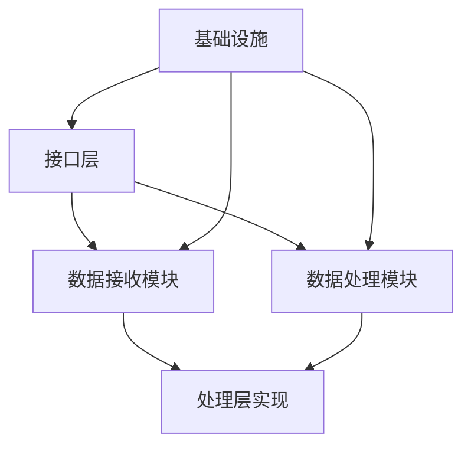
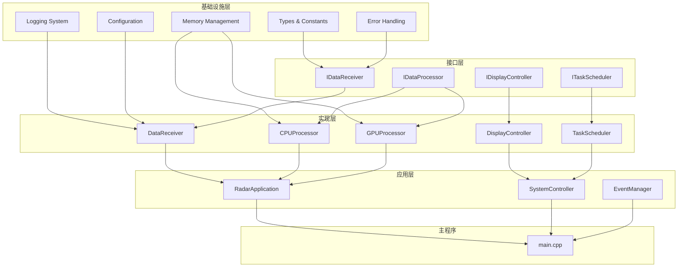

# 系统构建顺序

- **标题**: AI协作开发系统构建顺序指南
- **当前版本**: v1.0
- **最后更新**: 2025-09-10
- **负责人**: Kelin

---

## 构建阶段划分

### 🔧 第一阶段：基础设施构建 (Foundation Phase)

#### 目标
建立项目的基础骨架和核心基础设施，为后续开发提供稳定的技术基座。

#### 构建内容
```markdown
## 1.1 项目结构初始化 (Week 1)
- 创建主CMakeLists.txt和构建系统
- 建立目录结构和基础文件组织
- 配置开发环境和工具链
- 建立版本控制和基础CI流程

验证标准：
✅ 项目能成功编译空框架
✅ 所有开发工具正常工作
✅ 基础构建流程验证通过

## 1.2 核心类型系统 (Week 2)
- common/Types.h - 基础数据类型定义
- common/Constants.h - 系统常量定义
- common/ErrorCodes.h - 错误码体系
- common/MemoryManager.h - 内存管理基础

验证标准：
✅ 所有基础类型编译通过
✅ 内存管理接口功能验证
✅ 错误码体系完整性检查

## 1.3 日志和配置系统 (Week 2)
- application/Logger.h - 日志系统接口
- application/ConfigManager.h - 配置管理
- configs/ 目录下的基础配置文件
- 基础的单元测试框架

验证标准：
✅ 日志系统正常输出
✅ 配置文件加载成功
✅ 单元测试框架运行正常
```

#### 并行开发可能性
- 类型系统和日志系统可以并行开发
- 配置系统依赖类型系统，需要串行开发
- 测试框架可以与其他组件并行准备

---

### ⚙️ 第二阶段：核心模块构建 (Core Phase)

#### 目标
实现系统的核心业务逻辑模块，建立主要的数据处理能力。

#### 构建内容
```markdown
## 2.1 接口层建设 (Week 3)
- interfaces/IDataReceiver.h - 数据接收接口
- interfaces/IDataProcessor.h - 数据处理接口
- interfaces/IDisplayController.h - 显示控制接口
- interfaces/ITaskScheduler.h - 任务调度接口

验证标准：
✅ 所有接口定义完整且一致
✅ 接口文档生成正确
✅ 接口编译检查通过

## 2.2 数据层实现 (Week 4-5)
### 2.2.1 数据接收模块
- src/modules/data_receiver/DataReceiver.h/.cpp
- src/modules/data_receiver/NetworkReceiver.h/.cpp
- src/modules/data_receiver/SerialReceiver.h/.cpp
- 对应的单元测试和配置文件

### 2.2.2 数据结构定义
- data/PacketTypes.h - 数据包类型定义
- data/ProcessingTypes.h - 处理结果类型
- data/ConfigurationTypes.h - 配置数据类型

验证标准：
✅ 数据接收功能验证通过
✅ 各种数据源适配正常
✅ 数据结构完整性检查通过

## 2.3 处理层实现 (Week 6-7)
### 2.3.1 CPU处理器
- src/modules/cpu_processor/CPUProcessor.h/.cpp
- src/modules/cpu_processor/SignalProcessor.h/.cpp
- 基础算法实现和优化

### 2.3.2 GPU处理器基础
- src/modules/gpu_processor/GPUProcessor.h/.cpp
- src/modules/gpu_processor/CUDAKernels.cu
- GPU内存管理和基础并行算法

验证标准：
✅ CPU处理器功能完整
✅ GPU处理器基础功能可用
✅ 处理性能达到基本要求
```

#### 模块依赖关系


---

### 🔗 第三阶段：集成和优化 (Integration Phase)

#### 目标
将各个模块集成为完整系统，进行性能优化和稳定性提升。

#### 构建内容
```markdown
## 3.1 应用层集成 (Week 8)
- src/application/RadarApplication.h/.cpp
- src/application/SystemController.h/.cpp
- src/application/EventManager.h/.cpp
- 主程序入口和系统初始化

验证标准：
✅ 系统能够完整启动
✅ 各模块集成无错误
✅ 基础数据流通道畅通

## 3.2 任务调度系统 (Week 9)
- src/modules/task_scheduler/TaskScheduler.h/.cpp
- src/modules/task_scheduler/ThreadPool.h/.cpp
- src/modules/task_scheduler/PriorityQueue.h/.cpp
- 任务调度和资源管理

验证标准：
✅ 任务调度机制正常
✅ 线程池管理稳定
✅ 资源分配合理

## 3.3 显示和输出 (Week 10)
- src/modules/display_control/DisplayController.h/.cpp
- src/modules/display_control/DataVisualizer.h/.cpp
- 数据输出和可视化功能

验证标准：
✅ 数据显示功能正常
✅ 可视化效果符合要求
✅ 输出性能满足实时性需求

## 3.4 系统优化和性能调优 (Week 11-12)
- 性能瓶颈分析和优化
- 内存使用优化
- GPU计算优化
- 系统稳定性加强

验证标准：
✅ 性能指标达到设计要求
✅ 系统稳定性测试通过
✅ 资源使用效率优化完成
```

---

## 阶段里程碑定义

### 📊 第一阶段里程碑 (Foundation Milestone)

#### 交付物清单
```markdown
## 必须交付物
- [x] 完整的项目构建系统
- [x] 基础类型定义和常量系统
- [x] 日志系统和配置管理
- [x] 单元测试框架
- [x] 开发环境配置文档

## 验收标准
- 构建成功率: 100%
- 基础功能覆盖率: 90%+
- 文档完整性: 85%+
- 代码风格一致性: 95%+

## 质量指标
- 编译警告: 0个
- 单元测试通过率: 100%
- 内存泄漏: 0个
- 代码覆盖率: 70%+
```

#### 里程碑验收流程
```markdown
1. **技术验收** (2天)
   - 代码审查和质量检查
   - 功能测试和性能测试
   - 文档完整性检查

2. **集成验收** (1天)
   - 端到端构建验证
   - 开发环境兼容性测试
   - 团队开发流程验证

3. **决策点** (0.5天)
   - 里程碑完成度评估
   - 下阶段准备情况确认
   - 进度调整和资源分配
```

### 📈 第二阶段里程碑 (Core Milestone)

#### 交付物清单
```markdown
## 必须交付物
- [x] 完整的接口定义体系
- [x] 数据接收模块实现
- [x] 数据处理模块实现
- [x] 基础GPU计算能力
- [x] 模块间集成测试

## 验收标准
- 功能完整性: 95%+
- 性能基准达成: 80%+
- 接口稳定性: 100%
- 模块集成成功率: 95%+

## 质量指标
- 单元测试覆盖率: 85%+
- 集成测试通过率: 90%+
- 性能测试达标率: 80%+
- 代码质量评分: 85%+
```

### 🎯 第三阶段里程碑 (Integration Milestone)

#### 交付物清单
```markdown
## 必须交付物
- [x] 完整的MVP系统
- [x] 性能优化报告
- [x] 系统稳定性测试报告
- [x] 用户使用文档
- [x] 部署和维护指南

## 验收标准
- 系统功能完整性: 100%
- 性能指标达成: 95%+
- 稳定性测试通过: 100%
- 文档完整性: 95%+

## 质量指标
- 端到端测试通过率: 100%
- 性能回归测试: 0个失败
- 内存和资源泄漏: 0个
- 用户验收测试: 95%+满意度
```

---

## 模块依赖关系图

### 🔗 系统依赖拓扑



### 📋 并行构建分析

#### 可并行构建的模块组
```markdown
## 组1：基础设施组件 (并行度: 3)
- Types & Constants ← 独立开发
- Error Handling ← 独立开发
- Logging System ← 独立开发

## 组2：接口定义组 (并行度: 4)
- IDataReceiver ← 依赖组1
- IDataProcessor ← 依赖组1
- IDisplayController ← 依赖组1
- ITaskScheduler ← 依赖组1

## 组3：核心实现组 (并行度: 2)
- DataReceiver + CPUProcessor ← 依赖组2
- GPUProcessor ← 依赖组2 (独立GPU开发)

## 组4：集成组件组 (并行度: 1)
- 所有应用层组件 ← 依赖组3
```

#### 关键路径分析
```markdown
## 关键路径 (Critical Path): 12周
Types → IDataProcessor → GPUProcessor → RadarApplication → main.cpp

## 次关键路径: 11周
Logging → IDataReceiver → DataReceiver → SystemController → main.cpp

## 优化建议
1. GPU处理器开发可提前启动原型验证
2. 接口定义阶段可适当并行设计
3. 测试框架建设应与开发并行进行
```

---

## 验证检查点

### ✅ 第一阶段检查点

#### 检查点1.1：构建系统验证 (Week 1 End)
```bash
## 验证脚本
#!/bin/bash
echo "=== 构建系统验证 ==="

# 检查CMake配置
mkdir -p build && cd build
cmake .. -DCMAKE_BUILD_TYPE=Debug
if [ $? -eq 0 ]; then
    echo "✅ CMake配置成功"
else
    echo "❌ CMake配置失败"
    exit 1
fi

# 检查编译
make -j$(nproc)
if [ $? -eq 0 ]; then
    echo "✅ 编译成功"
else
    echo "❌ 编译失败"
    exit 1
fi

# 检查基础测试
ctest --output-on-failure
if [ $? -eq 0 ]; then
    echo "✅ 基础测试通过"
else
    echo "❌ 基础测试失败"
    exit 1
fi

echo "=== 构建系统验证完成 ==="
```

#### 检查点1.2：基础组件验证 (Week 2 End)
```cpp
// 基础组件验证测试
#include "common/Types.h"
#include "common/ErrorCodes.h"
#include "application/Logger.h"
#include "application/ConfigManager.h"

class FoundationValidationTest {
public:
    bool validateTypesSystem() {
        // 验证基础类型定义
        DataPacket packet;
        ProcessingResult result;
        SystemConfiguration config;

        return packet.isValid() &&
               result.getErrorCode() == ErrorCode::Success &&
               config.isComplete();
    }

    bool validateLoggingSystem() {
        auto logger = Logger::getInstance();
        logger->info("基础日志测试");
        logger->warning("警告测试");
        logger->error("错误测试");

        return logger->getLogLevel() != LogLevel::Invalid;
    }

    bool validateConfigurationSystem() {
        ConfigManager manager;
        auto config = manager.loadConfiguration("test_config.yaml");

        return config && config->isValid();
    }

    bool runAllValidations() {
        return validateTypesSystem() &&
               validateLoggingSystem() &&
               validateConfigurationSystem();
    }
};
```

### ✅ 第二阶段检查点

#### 检查点2.1：接口完整性验证 (Week 3 End)
```cpp
// 接口完整性验证
class InterfaceValidationTest {
public:
    bool validateDataReceiverInterface() {
        // 检查IDataReceiver接口完整性
        static_assert(std::is_abstract_v<IDataReceiver>);
        static_assert(std::has_virtual_destructor_v<IDataReceiver>);

        // 检查必要方法存在
        auto methods = {
            &IDataReceiver::initialize,
            &IDataReceiver::receive,
            &IDataReceiver::getStatus,
            &IDataReceiver::cleanup
        };

        return !methods.empty(); // 简化检查
    }

    bool validateDataProcessorInterface() {
        static_assert(std::is_abstract_v<IDataProcessor>);

        // 检查处理接口方法
        return true; // 实际检查接口方法签名
    }

    bool validateAllInterfaces() {
        return validateDataReceiverInterface() &&
               validateDataProcessorInterface() &&
               validateDisplayControllerInterface() &&
               validateTaskSchedulerInterface();
    }
};
```

#### 检查点2.2：核心模块功能验证 (Week 5 End)
```cpp
// 核心模块功能验证
class CoreModuleValidationTest {
public:
    bool validateDataReceiver() {
        auto receiver = std::make_unique<NetworkDataReceiver>();

        // 初始化测试
        if (!receiver->initialize(getTestConfig())) {
            return false;
        }

        // 数据接收测试
        DataPacket packet;
        auto status = receiver->receive(packet);

        // 清理测试
        receiver->cleanup();

        return status == ReceiveStatus::Success;
    }

    bool validateDataProcessor() {
        auto processor = std::make_unique<CPUDataProcessor>();

        if (!processor->initialize()) {
            return false;
        }

        // 处理测试数据
        auto testData = generateTestData();
        ProcessingResult result;
        auto status = processor->process(testData, result);

        processor->cleanup();

        return status == ProcessingStatus::Success &&
               result.isValid();
    }

    bool validateGPUProcessor() {
        if (!CUDADevice::isAvailable()) {
            return true; // GPU不可用时跳过
        }

        auto gpuProcessor = std::make_unique<GPUDataProcessor>();

        // GPU初始化测试
        if (!gpuProcessor->initialize()) {
            return false;
        }

        // 基础GPU计算测试
        auto result = gpuProcessor->testBasicComputation();

        gpuProcessor->cleanup();

        return result.success;
    }
};
```

### ✅ 第三阶段检查点

#### 检查点3.1：系统集成验证 (Week 8 End)
```cpp
// 系统集成验证
class SystemIntegrationTest {
public:
    bool validateEndToEndDataFlow() {
        // 创建完整系统
        RadarApplication app;

        if (!app.initialize()) {
            return false;
        }

        // 模拟数据流
        auto testData = generateRadarTestData();

        // 端到端处理
        auto result = app.processData(testData);

        app.shutdown();

        return result.success && result.hasValidTargets();
    }

    bool validateSystemPerformance() {
        PerformanceProfiler profiler;
        RadarApplication app;

        app.initialize();

        // 性能测试
        profiler.startTiming("end_to_end_processing");

        for (int i = 0; i < 1000; ++i) {
            auto testData = generateTestData();
            app.processData(testData);
        }

        auto processingTime = profiler.endTiming("end_to_end_processing");
        app.shutdown();

        // 验证性能指标
        double avgTimePerPacket = processingTime / 1000.0;
        return avgTimePerPacket < TARGET_PROCESSING_TIME_MS;
    }
};
```

---

## 问题回退策略

### 🚨 回退触发条件

#### 自动回退触发
```markdown
## 编译失败回退
- 连续编译失败超过4小时
- 单元测试通过率低于70%
- 内存泄漏检测发现严重问题
- 性能测试不达标超过50%

## 集成失败回退
- 模块集成失败率超过30%
- 端到端测试完全失败
- 系统启动失败
- 关键功能缺失

## 质量问题回退
- 代码审查发现架构问题
- 安全漏洞检测报告
- 文档完整性低于60%
- 可维护性评分过低
```

#### 手动回退决策
```markdown
## 决策流程
1. **问题评估** (2小时内)
   - 技术负责人分析问题严重程度
   - 评估修复成本和时间
   - 确定是否影响关键路径

2. **回退决定** (1小时内)
   - 如果修复时间 > 2天，考虑回退
   - 如果影响多个模块，优先回退
   - 如果接近里程碑deadline，果断回退

3. **回退执行** (0.5天内)
   - 回退到最近稳定版本
   - 重新评估开发计划
   - 调整后续里程碑时间
```

### 🔄 回退操作流程

#### 代码回退流程
```bash
#!/bin/bash
# 代码回退脚本

echo "=== 开始回退操作 ==="

# 1. 备份当前状态
git branch backup/failed-attempt-$(date +%Y%m%d-%H%M%S)
git add . && git commit -m "Backup before rollback"

# 2. 找到最后稳定点
LAST_STABLE=$(git tag -l "stable-*" | sort -V | tail -1)
echo "回退到稳定版本: $LAST_STABLE"

# 3. 执行回退
git checkout -b rollback/$LAST_STABLE $LAST_STABLE

# 4. 验证回退结果
echo "=== 验证回退结果 ==="
mkdir -p build && cd build
cmake .. && make -j$(nproc)

if [ $? -eq 0 ]; then
    echo "✅ 回退成功，系统可正常编译"
    ctest --output-on-failure
    if [ $? -eq 0 ]; then
        echo "✅ 回退成功，测试全部通过"
    else
        echo "⚠️ 部分测试失败，需要检查"
    fi
else
    echo "❌ 回退失败，需要手动处理"
fi

echo "=== 回退操作完成 ==="
```

#### 里程碑调整流程
```markdown
## 里程碑重新规划

### 第一阶段回退 (Foundation阶段问题)
- **回退范围**: 回退到项目初始状态
- **影响评估**: 全项目延期1-2周
- **调整策略**:
  - 重新评估技术选型
  - 加强基础设施设计
  - 增加技术预研时间

### 第二阶段回退 (Core阶段问题)
- **回退范围**: 回退到第一阶段完成状态
- **影响评估**: 核心开发延期2-3周
- **调整策略**:
  - 重新设计接口架构
  - 分阶段实现核心功能
  - 优先保证关键路径

### 第三阶段回退 (Integration阶段问题)
- **回退范围**: 回退到第二阶段完成状态
- **影响评估**: 集成工作延期1-2周
- **调整策略**:
  - 简化集成复杂度
  - 分步骤验证集成
  - 降低部分性能要求
```

### 📋 回退后重启策略

#### 问题分析和改进
```markdown
## 回退后分析流程

### 1. 根因分析 (Root Cause Analysis)
- **技术问题**: 架构设计、技术选型、实现方案
- **过程问题**: 开发流程、质量控制、沟通协调
- **资源问题**: 人员技能、时间估算、工具支持

### 2. 改进措施制定
- **技术改进**: 技术方案调整、架构重新设计
- **过程改进**: 开发流程优化、质量标准提升
- **团队改进**: 技能培训、角色调整、工具升级

### 3. 重启计划制定
- **时间调整**: 重新评估各阶段时间
- **资源调整**: 人员重新分配、外部支持
- **风险控制**: 增加检查点、强化验证
```

#### 重启验证机制
```markdown
## 重启前验证清单

### 技术验证
- [ ] 新方案的技术可行性验证
- [ ] 关键技术难点的原型验证
- [ ] 性能指标的预期评估
- [ ] 第三方依赖的兼容性检查

### 过程验证
- [ ] 开发流程的完整性检查
- [ ] 质量控制机制的有效性
- [ ] 团队协作方式的确认
- [ ] 沟通渠道的畅通性

### 资源验证
- [ ] 团队技能匹配度评估
- [ ] 开发工具的就绪状态
- [ ] 时间安排的合理性
- [ ] 应急预案的准备情况
```

---

## 变更记录

| 版本 | 日期       | 修改人 | 变更摘要             |
| :--- | :--------- | :----- | :------------------- |
| v1.0 | 2025-09-10 | Kelin  | 创建系统构建顺序指南 |
