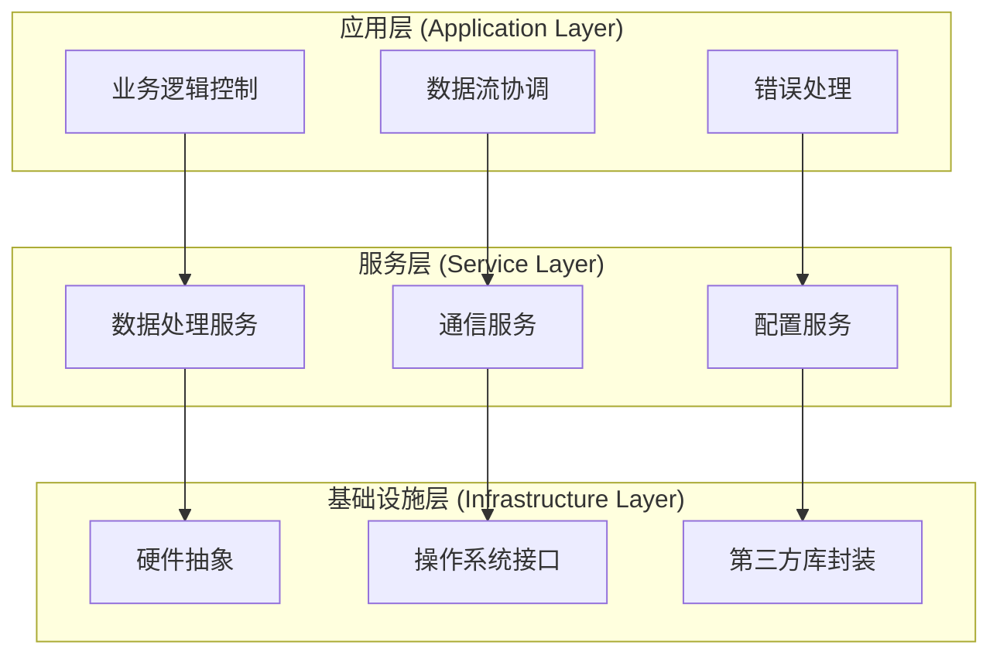

# 组件实现指南

- **标题**: AI协作开发组件实现技术指南
- **当前版本**: v1.0
- **最后更新**: 2025-09-10
- **负责人**: Kelin

---

## 实现架构模式

### 🏗️ 分层架构实现

#### 三层架构设计


#### 分层实现规范
```cpp
// 应用层示例：业务逻辑控制器
class RadarController {
public:
    RadarController(
        std::shared_ptr<IDataProcessingService> dataService,
        std::shared_ptr<ICommunicationService> commService,
        std::shared_ptr<IConfigurationService> configService
    ) : dataService_(dataService),
        commService_(commService),
        configService_(configService) {}

    // 应用层主要负责业务流程控制
    ProcessingResult processRadarData(const RadarInput& input) {
        // 1. 验证输入
        if (!validateInput(input)) {
            return ProcessingResult::createError("Invalid input");
        }

        // 2. 委托给服务层处理
        auto processedData = dataService_->processData(input.data);
        if (!processedData.success) {
            return ProcessingResult::createError(processedData.errorMessage);
        }

        // 3. 结果分发
        auto sendResult = commService_->sendResults(processedData.results);

        return ProcessingResult::createSuccess(processedData.results);
    }

private:
    std::shared_ptr<IDataProcessingService> dataService_;
    std::shared_ptr<ICommunicationService> commService_;
    std::shared_ptr<IConfigurationService> configService_;

    bool validateInput(const RadarInput& input);
};

// 服务层示例：数据处理服务
class DataProcessingService : public IDataProcessingService {
public:
    DataProcessingService(
        std::shared_ptr<IFFTProcessor> fftProcessor,
        std::shared_ptr<IDetectionAlgorithm> detector
    ) : fftProcessor_(fftProcessor), detector_(detector) {}

    // 服务层负责具体的业务功能实现
    ProcessingResult processData(const RawData& data) override {
        try {
            // 1. 预处理
            auto preprocessed = preprocessData(data);

            // 2. FFT变换
            auto spectrum = fftProcessor_->transform(preprocessed);

            // 3. 目标检测
            auto detections = detector_->detect(spectrum);

            return ProcessingResult::createSuccess(detections);
        } catch (const std::exception& e) {
            return ProcessingResult::createError(e.what());
        }
    }

private:
    std::shared_ptr<IFFTProcessor> fftProcessor_;
    std::shared_ptr<IDetectionAlgorithm> detector_;

    PreprocessedData preprocessData(const RawData& data);
};

// 基础设施层示例：硬件抽象
class GPUAccelerator : public IComputeAccelerator {
public:
    // 基础设施层负责硬件和系统资源的抽象
    bool initialize() override {
        // CUDA 初始化
        if (cudaSetDevice(0) != cudaSuccess) {
            return false;
        }

        // 分配GPU内存
        if (!allocateGPUMemory()) {
            return false;
        }

        return true;
    }

    ComputeResult compute(const ComputeTask& task) override {
        // GPU计算实现
        return executeOnGPU(task);
    }

private:
    void* gpuMemoryPool_;
    cudaStream_t computeStream_;

    bool allocateGPUMemory();
    ComputeResult executeOnGPU(const ComputeTask& task);
};
```

---

### 🔌 依赖注入模式

#### 依赖注入容器实现
```cpp
// 简单的依赖注入容器
class DIContainer {
public:
    template<typename T>
    void registerSingleton(std::function<std::shared_ptr<T>()> factory) {
        auto key = std::type_index(typeid(T));
        singletons_[key] = [factory]() -> std::shared_ptr<void> {
            return factory();
        };
    }

    template<typename T>
    void registerTransient(std::function<std::shared_ptr<T>()> factory) {
        auto key = std::type_index(typeid(T));
        transients_[key] = [factory]() -> std::shared_ptr<void> {
            return factory();
        };
    }

    template<typename T>
    std::shared_ptr<T> resolve() {
        auto key = std::type_index(typeid(T));

        // 首先检查单例
        auto singletonIt = singletons_.find(key);
        if (singletonIt != singletons_.end()) {
            auto instanceIt = singletonInstances_.find(key);
            if (instanceIt == singletonInstances_.end()) {
                auto instance = singletonIt->second();
                singletonInstances_[key] = instance;
                return std::static_pointer_cast<T>(instance);
            }
            return std::static_pointer_cast<T>(instanceIt->second);
        }

        // 检查瞬态对象
        auto transientIt = transients_.find(key);
        if (transientIt != transients_.end()) {
            auto instance = transientIt->second();
            return std::static_pointer_cast<T>(instance);
        }

        throw std::runtime_error("Type not registered: " +
                                std::string(typeid(T).name()));
    }

private:
    std::unordered_map<std::type_index,
                       std::function<std::shared_ptr<void>()>> singletons_;
    std::unordered_map<std::type_index,
                       std::function<std::shared_ptr<void>()>> transients_;
    std::unordered_map<std::type_index, std::shared_ptr<void>> singletonInstances_;
};

// 依赖注入配置
class ServiceConfiguration {
public:
    static void configureServices(DIContainer& container) {
        // 注册基础设施层服务
        container.registerSingleton<IComputeAccelerator>([]() {
            return std::make_shared<GPUAccelerator>();
        });

        container.registerSingleton<IFileSystem>([]() {
            return std::make_shared<FileSystemImpl>();
        });

        // 注册服务层服务
        container.registerSingleton<IDataProcessingService>([&container]() {
            auto fftProcessor = container.resolve<IFFTProcessor>();
            auto detector = container.resolve<IDetectionAlgorithm>();
            return std::make_shared<DataProcessingService>(fftProcessor, detector);
        });

        // 注册应用层服务
        container.registerTransient<RadarController>([&container]() {
            auto dataService = container.resolve<IDataProcessingService>();
            auto commService = container.resolve<ICommunicationService>();
            auto configService = container.resolve<IConfigurationService>();
            return std::make_shared<RadarController>(
                dataService, commService, configService);
        });
    }
};
```

---

## 关键技术实现

### ⚡ 高性能计算实现

#### SIMD优化实现
```cpp
// SIMD优化的数据处理
class SIMDDataProcessor {
public:
    // AVX2优化的向量运算
    std::vector<float> vectorAdd(
        const std::vector<float>& a,
        const std::vector<float>& b) {

        if (a.size() != b.size()) {
            throw std::invalid_argument("Vector size mismatch");
        }

        std::vector<float> result(a.size());

        // AVX2向量化处理
        const size_t vectorSize = 8; // AVX2 可以处理8个float
        const size_t vectorizedEnd = (a.size() / vectorSize) * vectorSize;

        for (size_t i = 0; i < vectorizedEnd; i += vectorSize) {
            __m256 va = _mm256_load_ps(&a[i]);
            __m256 vb = _mm256_load_ps(&b[i]);
            __m256 vresult = _mm256_add_ps(va, vb);
            _mm256_store_ps(&result[i], vresult);
        }

        // 处理剩余元素
        for (size_t i = vectorizedEnd; i < a.size(); ++i) {
            result[i] = a[i] + b[i];
        }

        return result;
    }

    // SIMD优化的FFT预处理
    std::vector<std::complex<float>> applyWindow(
        const std::vector<float>& input,
        const std::vector<float>& window) {

        std::vector<std::complex<float>> result(input.size());

        const size_t vectorSize = 8;
        const size_t vectorizedEnd = (input.size() / vectorSize) * vectorSize;

        for (size_t i = 0; i < vectorizedEnd; i += vectorSize) {
            __m256 vinput = _mm256_load_ps(&input[i]);
            __m256 vwindow = _mm256_load_ps(&window[i]);
            __m256 vmultiplied = _mm256_mul_ps(vinput, vwindow);

            // 转换为复数（实部为加窗结果，虚部为0）
            float temp[8];
            _mm256_store_ps(temp, vmultiplied);

            for (int j = 0; j < 8; ++j) {
                result[i + j] = std::complex<float>(temp[j], 0.0f);
            }
        }

        // 处理剩余元素
        for (size_t i = vectorizedEnd; i < input.size(); ++i) {
            result[i] = std::complex<float>(input[i] * window[i], 0.0f);
        }

        return result;
    }
};
```

#### GPU加速实现
```cpp
// CUDA加速的FFT处理器
class CUDAFFTProcessor : public IFFTProcessor {
public:
    CUDAFFTProcessor() {
        // 初始化CUDA和cuFFT
        if (cudaSetDevice(0) != cudaSuccess) {
            throw std::runtime_error("Failed to set CUDA device");
        }

        if (cufftCreate(&fftPlan_) != CUFFT_SUCCESS) {
            throw std::runtime_error("Failed to create cuFFT plan");
        }
    }

    ~CUDAFFTProcessor() {
        cleanup();
    }

    FFTResult transform(const std::vector<std::complex<float>>& input) override {
        try {
            // 准备GPU内存
            prepareGPUMemory(input.size());

            // 拷贝数据到GPU
            cudaMemcpy(d_input_, input.data(),
                      input.size() * sizeof(cufftComplex),
                      cudaMemcpyHostToDevice);

            // 执行FFT
            if (cufftExecC2C(fftPlan_, d_input_, d_output_,
                           CUFFT_FORWARD) != CUFFT_SUCCESS) {
                return FFTResult::createError("FFT execution failed");
            }

            // 拷贝结果回CPU
            std::vector<std::complex<float>> output(input.size());
            cudaMemcpy(output.data(), d_output_,
                      output.size() * sizeof(cufftComplex),
                      cudaMemcpyDeviceToHost);

            return FFTResult::createSuccess(output);

        } catch (const std::exception& e) {
            return FFTResult::createError(e.what());
        }
    }

private:
    cufftHandle fftPlan_;
    cufftComplex* d_input_ = nullptr;
    cufftComplex* d_output_ = nullptr;
    size_t allocatedSize_ = 0;

    void prepareGPUMemory(size_t size) {
        if (size > allocatedSize_) {
            // 释放旧内存
            if (d_input_) cudaFree(d_input_);
            if (d_output_) cudaFree(d_output_);

            // 分配新内存
            cudaMalloc(&d_input_, size * sizeof(cufftComplex));
            cudaMalloc(&d_output_, size * sizeof(cufftComplex));

            // 重新创建FFT计划
            cufftDestroy(fftPlan_);
            cufftPlan1d(&fftPlan_, size, CUFFT_C2C, 1);

            allocatedSize_ = size;
        }
    }

    void cleanup() {
        if (d_input_) {
            cudaFree(d_input_);
            d_input_ = nullptr;
        }
        if (d_output_) {
            cudaFree(d_output_);
            d_output_ = nullptr;
        }
        if (fftPlan_) {
            cufftDestroy(fftPlan_);
            fftPlan_ = 0;
        }
    }
};
```

---

### 🔒 线程安全实现

#### 无锁数据结构
```cpp
// 无锁环形缓冲区
template<typename T, size_t Size>
class LockFreeRingBuffer {
private:
    static_assert(Size > 0 && (Size & (Size - 1)) == 0,
                  "Size must be power of 2");

    struct alignas(64) Element {  // 缓存行对齐
        std::atomic<bool> valid{false};
        T data;
    };

    Element buffer_[Size];
    alignas(64) std::atomic<size_t> writeIndex_{0};
    alignas(64) std::atomic<size_t> readIndex_{0};

public:
    bool push(const T& item) {
        const size_t currentWrite = writeIndex_.load(std::memory_order_relaxed);
        const size_t nextWrite = (currentWrite + 1) & (Size - 1);

        // 检查是否满
        if (nextWrite == readIndex_.load(std::memory_order_acquire)) {
            return false; // 缓冲区满
        }

        // 写入数据
        buffer_[currentWrite].data = item;
        buffer_[currentWrite].valid.store(true, std::memory_order_release);

        // 更新写入索引
        writeIndex_.store(nextWrite, std::memory_order_release);
        return true;
    }

    bool pop(T& item) {
        const size_t currentRead = readIndex_.load(std::memory_order_relaxed);

        // 检查是否为空
        if (!buffer_[currentRead].valid.load(std::memory_order_acquire)) {
            return false; // 缓冲区空
        }

        // 读取数据
        item = buffer_[currentRead].data;
        buffer_[currentRead].valid.store(false, std::memory_order_release);

        // 更新读取索引
        readIndex_.store((currentRead + 1) & (Size - 1),
                        std::memory_order_release);
        return true;
    }

    size_t size() const {
        const size_t write = writeIndex_.load(std::memory_order_acquire);
        const size_t read = readIndex_.load(std::memory_order_acquire);
        return (write - read) & (Size - 1);
    }

    bool empty() const {
        const size_t read = readIndex_.load(std::memory_order_acquire);
        return !buffer_[read].valid.load(std::memory_order_acquire);
    }
};
```

#### 读写锁优化
```cpp
// 高性能读写锁实现
class OptimizedRWLock {
public:
    class ReadLock {
    public:
        ReadLock(OptimizedRWLock& lock) : lock_(lock) {
            lock_.lockRead();
        }

        ~ReadLock() {
            lock_.unlockRead();
        }

    private:
        OptimizedRWLock& lock_;
    };

    class WriteLock {
    public:
        WriteLock(OptimizedRWLock& lock) : lock_(lock) {
            lock_.lockWrite();
        }

        ~WriteLock() {
            lock_.unlockWrite();
        }

    private:
        OptimizedRWLock& lock_;
    };

    void lockRead() {
        // 使用共享锁进行读操作
        sharedMutex_.lock_shared();
    }

    void unlockRead() {
        sharedMutex_.unlock_shared();
    }

    void lockWrite() {
        // 使用排他锁进行写操作
        sharedMutex_.lock();
    }

    void unlockWrite() {
        sharedMutex_.unlock();
    }

private:
    std::shared_mutex sharedMutex_;
};

// 使用示例：线程安全的配置管理器
class ThreadSafeConfigManager {
public:
    void updateConfig(const std::string& key, const ConfigValue& value) {
        OptimizedRWLock::WriteLock lock(rwLock_);
        config_[key] = value;
        ++version_;
    }

    std::optional<ConfigValue> getConfig(const std::string& key) const {
        OptimizedRWLock::ReadLock lock(rwLock_);
        auto it = config_.find(key);
        if (it != config_.end()) {
            return it->second;
        }
        return std::nullopt;
    }

    uint64_t getVersion() const {
        OptimizedRWLock::ReadLock lock(rwLock_);
        return version_;
    }

private:
    mutable OptimizedRWLock rwLock_;
    std::unordered_map<std::string, ConfigValue> config_;
    uint64_t version_ = 0;
};
```

---

### 📊 内存管理实现

#### 对象池模式
```cpp
// 高性能对象池
template<typename T, size_t PoolSize = 1000>
class ObjectPool {
public:
    ObjectPool() {
        // 预分配所有对象
        pool_.reserve(PoolSize);
        for (size_t i = 0; i < PoolSize; ++i) {
            pool_.push_back(std::make_unique<T>());
            available_.push(pool_.back().get());
        }
    }

    // 获取对象
    std::unique_ptr<T, std::function<void(T*)>> acquire() {
        std::lock_guard<std::mutex> lock(mutex_);

        if (available_.empty()) {
            // 池已满，创建新对象
            return std::unique_ptr<T, std::function<void(T*)>>(
                new T(), [this](T* obj) { this->release(obj); });
        }

        T* obj = available_.front();
        available_.pop();

        // 重置对象状态
        if constexpr (std::is_base_of_v<Resettable, T>) {
            obj->reset();
        }

        return std::unique_ptr<T, std::function<void(T*)>>(
            obj, [this](T* obj) { this->release(obj); });
    }

    // 获取池统计信息
    PoolStatistics getStatistics() const {
        std::lock_guard<std::mutex> lock(mutex_);
        return PoolStatistics{
            .totalObjects = pool_.size(),
            .availableObjects = available_.size(),
            .activeObjects = pool_.size() - available_.size()
        };
    }

private:
    void release(T* obj) {
        std::lock_guard<std::mutex> lock(mutex_);

        // 检查对象是否属于池
        auto it = std::find_if(pool_.begin(), pool_.end(),
                              [obj](const auto& ptr) { return ptr.get() == obj; });

        if (it != pool_.end()) {
            // 对象属于池，归还到可用队列
            available_.push(obj);
        } else {
            // 对象不属于池，直接删除
            delete obj;
        }
    }

    std::vector<std::unique_ptr<T>> pool_;
    std::queue<T*> available_;
    mutable std::mutex mutex_;

    struct PoolStatistics {
        size_t totalObjects;
        size_t availableObjects;
        size_t activeObjects;
    };
};

// 可重置接口
class Resettable {
public:
    virtual ~Resettable() = default;
    virtual void reset() = 0;
};

// 示例：数据包对象池
class DataPacket : public Resettable {
public:
    void setData(const std::vector<uint8_t>& data) {
        data_ = data;
        timestamp_ = std::chrono::high_resolution_clock::now();
    }

    const std::vector<uint8_t>& getData() const { return data_; }

    void reset() override {
        data_.clear();
        timestamp_ = {};
        processed_ = false;
    }

private:
    std::vector<uint8_t> data_;
    std::chrono::time_point<std::chrono::high_resolution_clock> timestamp_;
    bool processed_ = false;
};

// 使用对象池的数据处理器
class PooledDataProcessor {
public:
    PooledDataProcessor() : packetPool_(std::make_unique<ObjectPool<DataPacket>>()) {}

    void processIncomingData(const std::vector<uint8_t>& rawData) {
        // 从池中获取数据包对象
        auto packet = packetPool_->acquire();
        packet->setData(rawData);

        // 处理数据包
        processPacket(*packet);

        // 对象自动归还到池中（RAII）
    }

private:
    std::unique_ptr<ObjectPool<DataPacket>> packetPool_;

    void processPacket(const DataPacket& packet) {
        // 数据包处理逻辑
    }
};
```

#### 内存池分配器
```cpp
// 固定大小内存池分配器
template<size_t BlockSize, size_t PoolSize = 1000>
class FixedSizeAllocator {
public:
    FixedSizeAllocator() {
        // 分配大块内存
        pool_ = static_cast<uint8_t*>(std::aligned_alloc(64, BlockSize * PoolSize));
        if (!pool_) {
            throw std::bad_alloc();
        }

        // 初始化空闲列表
        for (size_t i = 0; i < PoolSize; ++i) {
            freeBlocks_.push(pool_ + i * BlockSize);
        }
    }

    ~FixedSizeAllocator() {
        if (pool_) {
            std::free(pool_);
        }
    }

    void* allocate() {
        std::lock_guard<std::mutex> lock(mutex_);

        if (freeBlocks_.empty()) {
            return nullptr; // 池已满
        }

        void* block = freeBlocks_.front();
        freeBlocks_.pop();
        ++allocatedCount_;

        return block;
    }

    void deallocate(void* ptr) {
        if (!ptr) return;

        std::lock_guard<std::mutex> lock(mutex_);

        // 验证指针是否属于这个池
        uintptr_t poolStart = reinterpret_cast<uintptr_t>(pool_);
        uintptr_t poolEnd = poolStart + BlockSize * PoolSize;
        uintptr_t ptrAddr = reinterpret_cast<uintptr_t>(ptr);

        if (ptrAddr >= poolStart && ptrAddr < poolEnd) {
            freeBlocks_.push(static_cast<uint8_t*>(ptr));
            --allocatedCount_;
        }
    }

    AllocatorStatistics getStatistics() const {
        std::lock_guard<std::mutex> lock(mutex_);
        return AllocatorStatistics{
            .blockSize = BlockSize,
            .totalBlocks = PoolSize,
            .allocatedBlocks = allocatedCount_,
            .freeBlocks = PoolSize - allocatedCount_
        };
    }

private:
    uint8_t* pool_ = nullptr;
    std::queue<uint8_t*> freeBlocks_;
    mutable std::mutex mutex_;
    size_t allocatedCount_ = 0;

    struct AllocatorStatistics {
        size_t blockSize;
        size_t totalBlocks;
        size_t allocatedBlocks;
        size_t freeBlocks;
    };
};

// 自定义STL分配器适配器
template<typename T, size_t BlockSize = sizeof(T)>
class PoolAllocator {
public:
    using value_type = T;

    PoolAllocator() = default;

    template<typename U>
    PoolAllocator(const PoolAllocator<U, BlockSize>&) {}

    T* allocate(size_t n) {
        if (n != 1) {
            throw std::bad_alloc(); // 只支持单个对象分配
        }

        static thread_local FixedSizeAllocator<BlockSize> allocator;
        return static_cast<T*>(allocator.allocate());
    }

    void deallocate(T* ptr, size_t n) {
        if (n != 1 || !ptr) return;

        static thread_local FixedSizeAllocator<BlockSize> allocator;
        allocator.deallocate(ptr);
    }

    template<typename U>
    bool operator==(const PoolAllocator<U, BlockSize>&) const {
        return true;
    }

    template<typename U>
    bool operator!=(const PoolAllocator<U, BlockSize>&) const {
        return false;
    }
};

// 使用自定义分配器的容器
using PoolVector = std::vector<DataPoint, PoolAllocator<DataPoint>>;
using PoolList = std::list<ProcessingTask, PoolAllocator<ProcessingTask>>;
```

---

## 错误处理和异常安全

### 🛡️ 异常安全等级

#### RAII资源管理
```cpp
// RAII资源管理器
template<typename Resource, typename Deleter>
class ResourceGuard {
public:
    ResourceGuard(Resource resource, Deleter deleter)
        : resource_(resource), deleter_(deleter), released_(false) {}

    ~ResourceGuard() {
        if (!released_) {
            deleter_(resource_);
        }
    }

    // 移动构造
    ResourceGuard(ResourceGuard&& other) noexcept
        : resource_(other.resource_), deleter_(std::move(other.deleter_)),
          released_(other.released_) {
        other.released_ = true;
    }

    // 禁用拷贝
    ResourceGuard(const ResourceGuard&) = delete;
    ResourceGuard& operator=(const ResourceGuard&) = delete;
    ResourceGuard& operator=(ResourceGuard&&) = delete;

    Resource get() const { return resource_; }

    void release() { released_ = true; }

private:
    Resource resource_;
    Deleter deleter_;
    bool released_;
};

// 便利函数
template<typename Resource, typename Deleter>
auto makeResourceGuard(Resource resource, Deleter deleter) {
    return ResourceGuard<Resource, Deleter>(resource, deleter);
}

// 使用示例：文件资源管理
class FileProcessor {
public:
    ProcessingResult processFile(const std::string& filename) {
        // RAII管理文件资源
        FILE* file = fopen(filename.c_str(), "rb");
        if (!file) {
            return ProcessingResult::createError("Failed to open file");
        }

        auto fileGuard = makeResourceGuard(file, [](FILE* f) { fclose(f); });

        try {
            // 文件处理逻辑
            auto data = readFileData(file);
            auto result = processData(data);

            return ProcessingResult::createSuccess(result);
        } catch (const std::exception& e) {
            return ProcessingResult::createError(e.what());
        }
        // 文件自动关闭（RAII）
    }

private:
    std::vector<uint8_t> readFileData(FILE* file);
    ProcessedData processData(const std::vector<uint8_t>& data);
};
```

#### 错误码和异常混合处理
```cpp
// 错误结果模板
template<typename T, typename E = ErrorCode>
class Result {
public:
    // 成功构造
    static Result success(T value) {
        return Result(std::move(value));
    }

    // 错误构造
    static Result error(E errorCode, std::string message = "") {
        return Result(errorCode, std::move(message));
    }

    // 检查是否成功
    bool isSuccess() const { return hasValue_; }
    bool isError() const { return !hasValue_; }

    // 获取值（成功时）
    const T& value() const {
        if (!hasValue_) {
            throw std::logic_error("Attempting to get value from error result");
        }
        return value_;
    }

    T& value() {
        if (!hasValue_) {
            throw std::logic_error("Attempting to get value from error result");
        }
        return value_;
    }

    // 获取错误信息（错误时）
    E errorCode() const {
        if (hasValue_) {
            throw std::logic_error("Attempting to get error from success result");
        }
        return errorCode_;
    }

    const std::string& errorMessage() const {
        if (hasValue_) {
            throw std::logic_error("Attempting to get error message from success result");
        }
        return errorMessage_;
    }

    // 操作符重载
    explicit operator bool() const { return hasValue_; }

    // 链式操作
    template<typename F>
    auto map(F&& func) -> Result<decltype(func(value())), E> {
        if (isSuccess()) {
            try {
                return Result<decltype(func(value())), E>::success(func(value()));
            } catch (const std::exception& e) {
                return Result<decltype(func(value())), E>::error(
                    static_cast<E>(ErrorCode::ProcessingError), e.what());
            }
        } else {
            return Result<decltype(func(value())), E>::error(errorCode_, errorMessage_);
        }
    }

    template<typename F>
    auto flatMap(F&& func) -> decltype(func(value())) {
        if (isSuccess()) {
            return func(value());
        } else {
            using ReturnType = decltype(func(value()));
            return ReturnType::error(errorCode_, errorMessage_);
        }
    }

private:
    // 成功构造函数
    Result(T value) : hasValue_(true), value_(std::move(value)) {}

    // 错误构造函数
    Result(E errorCode, std::string message)
        : hasValue_(false), errorCode_(errorCode), errorMessage_(std::move(message)) {}

    bool hasValue_;
    union {
        T value_;
        E errorCode_;
    };
    std::string errorMessage_;
};

// 使用示例：链式错误处理
class DataPipeline {
public:
    Result<ProcessedData> processData(const RawData& input) {
        return validateInput(input)
            .flatMap([this](const RawData& data) { return preprocessData(data); })
            .flatMap([this](const PreprocessedData& data) { return transformData(data); })
            .flatMap([this](const TransformedData& data) { return postprocessData(data); });
    }

private:
    Result<RawData> validateInput(const RawData& input) {
        if (input.empty()) {
            return Result<RawData>::error(ErrorCode::InvalidInput, "Input data is empty");
        }
        if (input.size() > MAX_INPUT_SIZE) {
            return Result<RawData>::error(ErrorCode::InvalidInput, "Input data too large");
        }
        return Result<RawData>::success(input);
    }

    Result<PreprocessedData> preprocessData(const RawData& input);
    Result<TransformedData> transformData(const PreprocessedData& input);
    Result<ProcessedData> postprocessData(const TransformedData& input);
};
```

---

## 性能优化技术

### 🚀 缓存优化

#### 缓存友好的数据结构
```cpp
// 结构体数组 vs 数组结构体
// 缓存不友好的设计
struct ParticleAoS {
    float x, y, z;    // 位置
    float vx, vy, vz; // 速度
    float mass;       // 质量
    uint32_t id;      // ID
};

// 缓存友好的设计（SoA - Structure of Arrays）
class ParticleSoA {
public:
    void resize(size_t count) {
        positions_x_.resize(count);
        positions_y_.resize(count);
        positions_z_.resize(count);
        velocities_x_.resize(count);
        velocities_y_.resize(count);
        velocities_z_.resize(count);
        masses_.resize(count);
        ids_.resize(count);
    }

    void updatePositions(float deltaTime) {
        // 向量化友好的内存访问模式
        const size_t count = positions_x_.size();

        #pragma omp simd
        for (size_t i = 0; i < count; ++i) {
            positions_x_[i] += velocities_x_[i] * deltaTime;
            positions_y_[i] += velocities_y_[i] * deltaTime;
            positions_z_[i] += velocities_z_[i] * deltaTime;
        }
    }

    // 提供便利的访问接口
    struct ParticleRef {
        float& x, y, z;
        float& vx, vy, vz;
        float& mass;
        uint32_t& id;
    };

    ParticleRef operator[](size_t index) {
        return ParticleRef{
            positions_x_[index], positions_y_[index], positions_z_[index],
            velocities_x_[index], velocities_y_[index], velocities_z_[index],
            masses_[index], ids_[index]
        };
    }

private:
    std::vector<float> positions_x_, positions_y_, positions_z_;
    std::vector<float> velocities_x_, velocities_y_, velocities_z_;
    std::vector<float> masses_;
    std::vector<uint32_t> ids_;
};
```

#### 智能缓存机制
```cpp
// LRU缓存实现
template<typename Key, typename Value, size_t MaxSize = 1000>
class LRUCache {
public:
    using KeyValuePair = std::pair<Key, Value>;
    using ListIterator = typename std::list<KeyValuePair>::iterator;

    std::optional<Value> get(const Key& key) {
        auto it = cacheMap_.find(key);
        if (it == cacheMap_.end()) {
            return std::nullopt; // 缓存未命中
        }

        // 移动到链表头部（最近使用）
        cacheList_.splice(cacheList_.begin(), cacheList_, it->second);
        return it->second->second;
    }

    void put(const Key& key, const Value& value) {
        auto it = cacheMap_.find(key);

        if (it != cacheMap_.end()) {
            // 更新现有项
            it->second->second = value;
            cacheList_.splice(cacheList_.begin(), cacheList_, it->second);
        } else {
            // 添加新项
            if (cacheList_.size() >= MaxSize) {
                // 删除最久未使用的项
                auto last = cacheList_.end();
                --last;
                cacheMap_.erase(last->first);
                cacheList_.pop_back();
            }

            cacheList_.emplace_front(key, value);
            cacheMap_[key] = cacheList_.begin();
        }
    }

    void clear() {
        cacheMap_.clear();
        cacheList_.clear();
    }

    CacheStatistics getStatistics() const {
        return CacheStatistics{
            .size = cacheList_.size(),
            .maxSize = MaxSize,
            .hitCount = hitCount_,
            .missCount = missCount_,
            .hitRate = static_cast<double>(hitCount_) / (hitCount_ + missCount_)
        };
    }

private:
    std::list<KeyValuePair> cacheList_;
    std::unordered_map<Key, ListIterator> cacheMap_;
    mutable size_t hitCount_ = 0;
    mutable size_t missCount_ = 0;

    struct CacheStatistics {
        size_t size;
        size_t maxSize;
        size_t hitCount;
        size_t missCount;
        double hitRate;
    };
};

// 分层缓存系统
template<typename Key, typename Value>
class HierarchicalCache {
public:
    HierarchicalCache(size_t l1Size = 100, size_t l2Size = 1000, size_t l3Size = 10000)
        : l1Cache_(l1Size), l2Cache_(l2Size), l3Cache_(l3Size) {}

    std::optional<Value> get(const Key& key) {
        // L1缓存查找
        auto result = l1Cache_.get(key);
        if (result) {
            return result;
        }

        // L2缓存查找
        result = l2Cache_.get(key);
        if (result) {
            l1Cache_.put(key, *result); // 提升到L1
            return result;
        }

        // L3缓存查找
        result = l3Cache_.get(key);
        if (result) {
            l2Cache_.put(key, *result); // 提升到L2
            l1Cache_.put(key, *result); // 提升到L1
            return result;
        }

        return std::nullopt; // 缓存未命中
    }

    void put(const Key& key, const Value& value) {
        l1Cache_.put(key, value);
        // 可选：同时放入L2和L3缓存
    }

private:
    LRUCache<Key, Value> l1Cache_, l2Cache_, l3Cache_;
};
```

---

## 变更记录

| 版本 | 日期       | 修改人 | 变更摘要             |
| :--- | :--------- | :----- | :------------------- |
| v1.0 | 2025-09-10 | Kelin  | 创建组件实现技术指南 |
