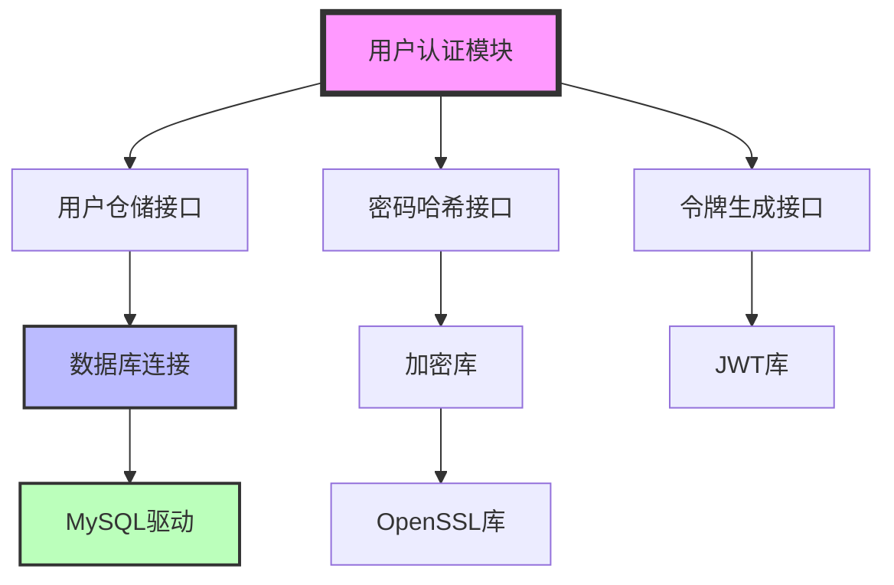

# AI依赖识别规则

- **标题**: AI智能依赖识别与管理决策规则
- **当前版本**: v1.0
- **最后更新**: 2025-09-11
- **负责人**: Kelin

---

## 概述

本文档定义AI如何智能地识别、分析和管理项目依赖的规则体系。重点在于AI如何主动发现依赖关系，评估依赖风险，并制定依赖管理策略，确保项目的稳定性和可维护性。

---

## 🔍 依赖识别的核心思维

### 依赖发现的智能策略

AI必须具备主动识别依赖的能力，而不是被动等待用户提供。

**AI的依赖扫描思维**:
```
代码分析 → 接口追踪 → 数据流分析 → 配置检查 → 运行时依赖
```

**具体识别过程**:
```
用户说："实现一个用户认证模块"
↓
AI的依赖识别链：

1. 直接代码依赖
   - #include <string>     → 标准库依赖
   - #include "user.h"     → 用户数据结构依赖
   - #include "database.h" → 数据访问层依赖

2. 接口依赖分析
   - IUserRepository      → 需要用户存储接口
   - IPasswordHasher      → 需要密码加密接口
   - ITokenGenerator      → 需要令牌生成接口

3. 数据依赖分析
   - users表              → 数据库表结构依赖
   - user_sessions表      → 会话存储依赖
   - 配置文件中的密钥     → 配置依赖

4. 运行时依赖
   - Redis缓存服务       → 会话存储运行时依赖
   - 邮件服务            → 密码重置功能依赖
   - 日志系统            → 审计日志依赖
```

### 依赖分类与优先级

AI必须能够智能地对依赖进行分类和优先级排序。

**依赖分类体系**:
```
按依赖类型分类：
├── 编译时依赖 (Compile-time)
│   ├── 头文件依赖
│   ├── 静态库依赖
│   └── 模板定义依赖
├── 链接时依赖 (Link-time)
│   ├── 动态库依赖
│   ├── 系统库依赖
│   └── 第三方库依赖
├── 运行时依赖 (Runtime)
│   ├── 配置文件依赖
│   ├── 外部服务依赖
│   └── 数据存储依赖
└── 逻辑依赖 (Logical)
    ├── 接口契约依赖
    ├── 数据格式依赖
    └── 业务流程依赖

按重要性分类：
├── 核心依赖 (Critical)
│   └── 模块无法运行的必要依赖
├── 重要依赖 (Important)
│   └── 影响主要功能的依赖
├── 一般依赖 (Normal)
│   └── 影响辅助功能的依赖
└── 可选依赖 (Optional)
    └── 功能增强性质的依赖
```

**优先级评估算法**:
```
依赖优先级 = 重要性权重 × 稳定性权重 × 获取难度权重

权重计算：
- 重要性权重：核心(1.0) > 重要(0.8) > 一般(0.6) > 可选(0.4)
- 稳定性权重：已存在(1.0) > 开发中(0.7) > 计划中(0.4) > 不确定(0.2)
- 获取难度：易获取(1.0) > 需开发(0.8) > 需购买(0.6) > 难获取(0.3)

AI的优先级排序示例：
1. user.h (1.0×1.0×1.0=1.0) - 核心依赖，已存在，易获取
2. IUserRepository (1.0×0.7×0.8=0.56) - 核心依赖，开发中，需开发
3. Redis缓存 (0.8×1.0×0.6=0.48) - 重要依赖，已存在，需购买
4. 邮件服务 (0.6×0.4×0.8=0.19) - 一般依赖，计划中，需开发
```

---

## 📋 依赖请求的智能化

### 主动依赖请求策略

AI必须能够智能地向用户请求必要的依赖信息。

**请求策略框架**:
```
依赖识别 → 风险评估 → 请求优先级 → 生成请求清单 → 发起请求
```

**智能请求示例**:
```
AI检测到需要开发"数据处理模块"，自动生成依赖请求：

"为了确保数据处理模块能够正确集成，我需要以下文件和信息：

🔴 高优先级 (阻塞开发)：
1. 数据结构定义文件
   - 位置：`include/common/data_types.h`
   - 用途：了解输入数据格式（RawDataPacket等）
   - 获取方式：请提供文件内容

2. 现有数据接收接口
   - 位置：`include/interfaces/data_receiver_interface.h`
   - 用途：了解上游数据来源接口
   - 获取方式：请提供接口定义

🟡 中优先级 (影响设计)：
3. 系统配置文件示例
   - 位置：`configs/system_config.yaml`
   - 用途：了解配置参数和格式约定
   - 获取方式：请提供配置文件模板

🟢 低优先级 (优化参考)：
4. 类似模块的实现参考
   - 位置：`src/modules/*/`中的类似实现
   - 用途：了解项目的编码风格和模式
   - 获取方式：可选，有助于保持一致性

请按优先级顺序提供，我会根据您提供的信息逐步完善设计方案。"
```

### 依赖验证机制

AI收到依赖文件后，必须进行智能验证。

**验证检查框架**:
```
格式验证 → 版本兼容性 → 接口完整性 → 语义一致性 → 依赖闭环检查
```

**验证实例**:
```cpp
// AI收到头文件后的验证思维过程

// 1. 格式验证
检查：是否为有效的C++头文件？
result: ✅ 语法正确，包含防护宏

// 2. 版本兼容性验证
检查：是否使用了项目支持的C++特性？
analysis: 使用了std::shared_ptr (C++11)，项目要求C++17 ✅

// 3. 接口完整性验证
检查：关键接口是否完整定义？
interface DataReceiver {
    virtual bool start() = 0;        ✅ 启动接口
    virtual void stop() = 0;         ✅ 停止接口
    virtual Data receive() = 0;      ✅ 数据接收接口
    // 缺少错误处理接口？            ⚠️ 可能的遗漏
};

// 4. 语义一致性验证
检查：命名约定是否符合项目规范？
analysis:
- 类名使用帕斯卡命名 ✅
- 方法名使用驼峰命名 ✅
- 返回值语义明确 ✅

// 5. 依赖闭环检查
检查：是否引入了循环依赖？
dependency_graph: DataReceiver → Data → no back reference ✅
```

---

## ⚡ 依赖冲突检测与解决

### 智能冲突检测

AI必须能够自动检测各种类型的依赖冲突。

**冲突检测模型**:
```
版本冲突检测：
- 同一库的不同版本要求
- API兼容性破坏
- ABI兼容性问题

接口冲突检测：
- 相同接口名的不同定义
- 参数类型不匹配
- 返回值语义冲突

数据冲突检测：
- 数据结构定义差异
- 字段类型不兼容
- 约束条件冲突
```

**冲突检测实例**:
```
AI检测到的依赖冲突：

⚠️ 版本冲突：
模块A要求 OpenCV 4.5.x
模块B要求 OpenCV 4.2.x
影响：编译链接错误

⚠️ 接口冲突：
文件1: void processData(const DataPacket& data);
文件2: bool processData(DataPacket* data);
影响：函数签名重定义错误

⚠️ 数据冲突：
结构A: struct User { int id; string name; };
结构B: struct User { string id; string name; int age; };
影响：数据结构不兼容
```

### 冲突解决策略

AI必须提供智能化的冲突解决方案。

**解决策略矩阵**:
```
冲突类型 × 解决策略：

版本冲突：
├── 版本统一：升级到兼容的统一版本
├── 版本隔离：使用命名空间或模块边界隔离
├── 适配器模式：创建版本适配层
└── 依赖替换：选择兼容的替代库

接口冲突：
├── 接口重命名：修改其中一个接口名称
├── 命名空间：使用namespace避免名称冲突
├── 接口适配：创建统一的适配接口
└── 模块分离：将冲突接口分离到不同模块

数据冲突：
├── 数据转换：创建数据转换函数
├── 版本化：为数据结构添加版本标识
├── 联合类型：使用union或variant处理
└── 重新设计：统一数据结构定义
```

**解决方案决策示例**:
```markdown
冲突：两个模块定义了不同的User结构

AI的解决方案分析：

方案1：数据转换 (推荐)

// 创建转换函数
UserV1 convertToV1(const UserV2& userV2) {
    return UserV1{std::stoi(userV2.id), userV2.name};
}

UserV2 convertToV2(const UserV1& userV1) {
    return UserV2{std::to_string(userV1.id), userV1.name, 0};
}

优点：最小侵入，向后兼容
缺点：运行时开销，维护复杂

方案2：统一重构 (长期优)

// 设计新的统一结构
struct UserUnified {
    std::string id;        // 支持字符串ID
    std::string name;
    std::optional<int> age; // 可选年龄字段
    int version;           // 版本标识
};

优点：设计清晰，长期维护简单
缺点：需要修改所有使用点

AI推荐：考虑到项目稳定性，建议采用方案1进行渐进式迁移，
待条件成熟时再考虑方案2的统一重构。
```

---

## 📊 依赖管理自动化

### 依赖图构建

AI必须能够自动构建和维护项目的依赖关系图。

**依赖图生成算法**:
```
1. 静态分析阶段
   - 扫描#include指令
   - 分析接口继承关系
   - 检测函数调用关系

2. 动态分析阶段
   - 运行时加载的库
   - 配置驱动的依赖
   - 条件性依赖

3. 图构建阶段
   - 节点：模块、文件、接口
   - 边：依赖关系、依赖类型
   - 属性：依赖强度、稳定性
```

**依赖图可视化**:


### 依赖变更影响分析

AI必须能够预测依赖变更的影响范围。

**影响分析算法**:
```
变更点识别 → 依赖链追踪 → 影响范围计算 → 风险等级评估
```

**影响分析示例**:
```
变更：升级OpenSSL库从1.1.1到3.0.0

AI的影响分析：

直接影响模块：
- PasswordHasher（使用OpenSSL加密函数）
- CertificateValidator（使用OpenSSL证书验证）
- NetworkSecurity（使用OpenSSL TLS功能）

间接影响模块：
- UserAuthentication（依赖PasswordHasher）
- APIGateway（依赖CertificateValidator）
- DataTransmission（依赖NetworkSecurity）

风险评估：
- API兼容性：⚠️ 高风险（OpenSSL 3.0有破坏性变更）
- 性能影响：✅ 低风险（性能通常有改善）
- 安全增强：✅ 正面影响（修复了已知漏洞）

建议措施：
1. 创建兼容性适配层
2. 逐步迁移，从叶子模块开始
3. 增加单元测试覆盖
4. 准备回滚方案
```

### 依赖优化建议

AI应该能够主动提供依赖优化建议。

**优化策略**:
```
依赖简化：
- 移除未使用的依赖
- 合并功能重复的依赖
- 替换重量级依赖

依赖隔离：
- 接口与实现分离
- 使用依赖注入
- 模块边界清晰化

依赖稳定化：
- 版本锁定策略
- 依赖降级方案
- 冗余依赖设计
```

**优化建议示例**:
```markdown
AI的依赖优化分析：

🔍 发现的问题：
1. 模块A和B都直接依赖MySQL，造成耦合
2. 使用了3个不同的JSON库（rapidjson, nlohmann, jsoncpp）
3. 测试代码和生产代码共享依赖，增加了部署复杂度

💡 优化建议：

问题1解决：依赖注入模式

// 当前设计
class UserService {
    MySQLConnection db; // 直接依赖
};

// 优化后设计
class UserService {
    std::shared_ptr<IUserRepository> repo; // 依赖抽象
public:
    UserService(std::shared_ptr<IUserRepository> r) : repo(r) {}
};


问题2解决：标准化JSON库
- 统一使用nlohmann/json（性能好，API现代）
- 创建迁移计划，逐步替换其他JSON库
- 提供统一的JSON工具类封装

问题3解决：依赖分层
- 生产依赖：核心功能必需
- 开发依赖：编译构建工具
- 测试依赖：测试框架和Mock库
- 文档依赖：文档生成工具
```

---

## 变更记录

| 版本 | 日期       | 修改人 | 变更摘要                             |
| :--- | :--------- | :----- | :----------------------------------- |
| v1.0 | 2025-09-11 | Kelin  | 创建AI智能依赖识别与管理决策规则文档 |
